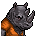
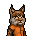

# 《花花世界》（全新）

|品級|分類|體積|最大堆疊|價值|違禁值|
|:--:|:--:|:--:|:--:|:--:|:--:|
|中級|道具、雜誌|一格|1|80|0|

心態+10。\
使用限制：適合在床上閱讀

> 成年動物才能看的雜誌，雖然在錄影帶的衝擊下，銷量逐年下滑，但在監獄裡，它仍是最搶手的“精神食糧”。

## 送禮

|圖片|姓名|好感|回應|
|:--:|--|:--:|--|
||[長頸鹿．吉米](長頸鹿．吉米.md)|16|哦\~謝謝你的禮物。|
||[羊駝．迪亞哥](羊駝．迪亞哥.md)|16|嘿嘿嘿\~你瞧瞧這些大腿…|
||[斑鬣狗．文森特](斑鬣狗．文森特.md)|16|喲喲喲\~！伙計你可真夠哥們！|
||[疣豬．哈庫拉](疣豬．哈庫拉.md)|16|嘿\~伙計\~這可是好東西！|
||[考拉．凱文](考拉．凱文.md)|16|嘿\~伙計！你真要把這種“好東西”給我嗎？|
||[水牛．比爾](水牛．比爾.md)|12|總算能有點樂子了\~|
||[駱駝．托尼](駱駝．托尼.md)|12|嘿\~這可是緊俏商品\~|
||[驢子．山姆](驢子．山姆.md)|12|嘿\~我想妮可應該不會介意我“放鬆一下”的…|
||[馴鹿．魯道夫](馴鹿．魯道夫.md)|12|嘿\~這件禮物足以換走我一張簽名照。|
||[袋鼠．喬瑟夫](袋鼠．喬瑟夫.md)|12|伙計，這正是我需要的。|
||[雄獅．阿歷克斯](雄獅．阿歷克斯.md)|12|全新的一本嗎？哼\~這還算不錯。|
||[斑馬．富蘭克林](斑馬．富蘭克林.md)|12|……有時候放鬆一下也很必要。|
||[山魈．拉斐爾](山魈．拉斐爾.md)|12|不錯的禮物，這是我要的。|
||[水豚．伯納德](水豚．伯納德.md)|12|我緊繃的神經是得松一松了…|
||[食蟻獸．費爾南多](食蟻獸．費爾南多.md)|12|呃…這或許能幫我舒緩一下緊繃的情緒。|
||[穿山甲．林](穿山甲．林.md)|12|謝了\~我正愁沒東西消磨時間呢。|
||[蜜獾．麥克斯](蜜獾．麥克斯.md)|12|呵\~這還有點禮物的樣子。|
||[灰貓．班姆](灰貓．班姆.md)|12|呃…其實恢復靈力還有一種方法…|
||[浣熊．面條](浣熊．面條.md)|12|這是件不錯的禮物，你的觀察力還不賴。|
||[負鼠．埃迪](負鼠．埃迪.md)|12|哎\~為什麼看上我的不是這書裡的姑娘呢？|
||[鴨嘴獸．泰瑞](鴨嘴獸．泰瑞.md)|12|偶爾看看這個也是個不錯的選擇。|
||[兔子．懷特](兔子．懷特.md)|12|你相信嗎？我有不少的魔術靈感來源於…這類雜誌。|
||[樹蛙．格雷](樹蛙．格雷.md)|12|你知道嗎？單數期的雜誌裡會有一個叫做“兩棲花園”的欄目…|
||[狐貍．托馬斯](狐貍．托馬斯.md)|8|這是給我的嗎？…謝了。|
||[大象．金波](大象．金波.md)|8|算你識相，小子。|
||[犀牛．伊萬](犀牛．伊萬.md)|8|嗯\~這東西或許能幫助我鍛煉。|
||[北極熊．弗拉基米爾](北極熊．弗拉基米爾.md)|8|巨魔“冰山”不會拒絕貢品\~|
||[黑熊．亨利](黑熊．亨利.md)|8|給我的嗎？這要是吃的就好了…|
||[鱷魚．克蘭奇](鱷魚．克蘭奇.md)|8|你想用這個來討好我嗎？|
||[猩猩．凱撒](猩猩．凱撒.md)|8|嗯\~一件禮物嗎？|
||[黑豹．鮑勃](黑豹．鮑勃.md)|8|給我禮物嗎？…好吧。|
||[樹懶．蒂姆](樹懶．蒂姆.md)|8|（打哈欠）…謝謝你的禮物\~|
||[海獺．菲爾](海獺．菲爾.md)|8|禮物\~我就知道今天會有好事。|
||[狐獴．泰迪](狐獴．泰迪.md)|8|嘿！禮物\~這是一件禮物！哦\~我想它就是咱們友誼的象徵對嗎？|
||[環尾狐猴．羅伯特](環尾狐猴．羅伯特.md)|8|嘿\~謝謝你禮物。|
||[河馬．弗蘭克](河馬．弗蘭克.md)|-8|我早過了喜歡這種東西的年紀了…|
||[海象．溫斯頓](海象．溫斯頓.md)|-8|我早過了喜歡這種東西的年紀了…|
||[老虎．約翰](老虎．約翰.md)|-8|我不需要這個，別來煩我了。|
||[熊貓．老李](熊貓．老李.md)|-8|也罷，也罷……|
||[山羊．威爾伯](山羊．威爾伯.md)|-8|噓……|
||[貘．米格爾](貘．米格爾.md)|-8|低級的欲望…真理的絆腳石。|
||[鹿豚．理查德](鹿豚．理查德.md)|-8|你送錯人了，小子…我早過了對這個起勁的年紀了。|
||[猞猁．克里斯](猞猁．克里斯.md)|-8|這種雜誌太過初級了，我可提不起半點興趣…|
||[鬣蜥．皮克曼](鬣蜥．皮克曼.md)|-8|嘶\~我對這個不感興趣。|
||[臭鼬．沃爾特](臭鼬．沃爾特.md)|-8|抱歉，我對這個不太感興趣…|
||[賽馬．雷伊](賽馬．雷伊.md)|-80|哦！庸俗\~我對這個可沒興趣。|
||[象龜．威廉姆](象龜．威廉姆.md)|-80|色欲…！是萬惡之源…！|

