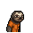
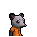

# 空的牙膏管

|品級|分類|體積|最大堆疊|價值|違禁值|
|:--:|:--:|:--:|:--:|:--:|:--:|
|初級|材料|半格|9|10|0|

> 用完的牙膏管，或許能用來裝點別的…

## 送禮

|圖片|姓名|好感|回應|
|:--:|--|:--:|--|
||[狐貍．托馬斯](狐貍．托馬斯.md)|2|這是給我的嗎？…謝了。|
||[斑馬．富蘭克林](斑馬．富蘭克林.md)|2|這或許有用\~呃\~也可能沒用…|
||[黑豹．鮑勃](黑豹．鮑勃.md)|2|給我禮物嗎？…好吧。|
||[臭鼬．沃爾特](臭鼬．沃爾特.md)|2|謝謝你的禮物，我想我會用到它的。|
||[老虎．約翰](老虎．約翰.md)|-2|我不需要這個，別來煩我了。|
||[山羊．威爾伯](山羊．威爾伯.md)|-2|噓……|
||[鬣蜥．皮克曼](鬣蜥．皮克曼.md)|-2|嘶\~我對這個不感興趣。|
||[象龜．威廉姆](象龜．威廉姆.md)|-2|嗯…？你這是…什麼意思？|
||[樹懶．蒂姆](樹懶．蒂姆.md)|-2|…我想我用不著這個。|
||[海獺．菲爾](海獺．菲爾.md)|-2|我很好奇，你是怎麼想到把這個當做“禮物”的。|
||[狐獴．泰迪](狐獴．泰迪.md)|-2|雖然我不該挑剔你的禮物…但是為了咱們友誼的質量，我還是想說上幾句。|
||[環尾狐猴．羅伯特](環尾狐猴．羅伯特.md)|-2|呃…這是你們家鄉的某種習俗嗎？|
||[樹蛙．格雷](樹蛙．格雷.md)|-2|我或許會需要這個…但不是現在。|
||[大象．金波](大象．金波.md)|-20|小子\~你以後最好想清楚再給我東西\~我不喜歡垃圾！|
||[長頸鹿．吉米](長頸鹿．吉米.md)|-20|別這樣\~會讓別人誤會的…|
||[河馬．弗蘭克](河馬．弗蘭克.md)|-20|小子，這種垃圾你最好自己留著！|
||[犀牛．伊萬](犀牛．伊萬.md)|-20|喂！別把你的垃圾塞給我！|
||[水牛．比爾](水牛．比爾.md)|-20|別給我這些垃圾！你是想惹毛我嗎？！|
||[駱駝．托尼](駱駝．托尼.md)|-20|我身上可沒地方裝這種破爛…|
||[北極熊．弗拉基米爾](北極熊．弗拉基米爾.md)|-20|“冰山”討厭垃圾。|
||[黑熊．亨利](黑熊．亨利.md)|-20|喂！我可不想要你的垃圾！|
||[海象．溫斯頓](海象．溫斯頓.md)|-20|你沒看見這已經空了嗎？真是夠無聊的…|
||[驢子．山姆](驢子．山姆.md)|-20|我可不是你的垃圾桶…|
||[馴鹿．魯道夫](馴鹿．魯道夫.md)|-20|你為什麼要把這種垃圾給我？你是在暗示什麼嗎？|
||[袋鼠．喬瑟夫](袋鼠．喬瑟夫.md)|-20|你覺得我會喜歡這件…垃圾嗎？|
||[羊駝．迪亞哥](羊駝．迪亞哥.md)|-20|你當我是傻子嗎？不\~你才是傻子！|
||[鱷魚．克蘭奇](鱷魚．克蘭奇.md)|-20|給我這個幹嘛？你是在耍我嗎？！|
||[雄獅．阿歷克斯](雄獅．阿歷克斯.md)|-20|喂！你腦子裡到底在想什麼？|
||[熊貓．老李](熊貓．老李.md)|-20|此乃何意…？！|
||[賽馬．雷伊](賽馬．雷伊.md)|-20|哦\~我討厭這種臟兮兮的東西\~|
||[猩猩．凱撒](猩猩．凱撒.md)|-20|錯誤的選擇…大錯特錯。|
||[貘．米格爾](貘．米格爾.md)|-20|（小聲）垃圾…來自素材002號。|
||[斑鬣狗．文森特](斑鬣狗．文森特.md)|-20|喂喂喂！別把垃圾塞給我！|
||[鹿豚．理查德](鹿豚．理查德.md)|-20|喂\~小子，別給我這些垃圾。|
||[疣豬．哈庫拉](疣豬．哈庫拉.md)|-20|…給我這些垃圾幹嘛？|
||[山魈．拉斐爾](山魈．拉斐爾.md)|-20|呵\~毫無價值的東西…|
||[猞猁．克里斯](猞猁．克里斯.md)|-20|如此敷衍我…可是要扣分的。|
||[水豚．伯納德](水豚．伯納德.md)|-20|以後這種垃圾你還是自己留著好了。|
||[考拉．凱文](考拉．凱文.md)|-20|喂！你當我是收破爛的嗎？|
||[食蟻獸．費爾南多](食蟻獸．費爾南多.md)|-20|這是什麼？無聊的惡作劇嗎？|
||[穿山甲．林](穿山甲．林.md)|-20|我可沒地方放這些垃圾！|
||[蜜獾．麥克斯](蜜獾．麥克斯.md)|-20|喂\~我警告你，別再給我這些破爛了！|
||[灰貓．班姆](灰貓．班姆.md)|-20|喂\~能不能別把時間浪費在這種垃圾上了？|
||[浣熊．面條](浣熊．面條.md)|-20|…你是在賭送我垃圾會不會惹惱我嗎？|
||[負鼠．埃迪](負鼠．埃迪.md)|-20|別把你的垃圾塞給我，我已經夠煩的了。|
||[鴨嘴獸．泰瑞](鴨嘴獸．泰瑞.md)|-20|垃圾的價值減去倉儲成本，最後的收益將是…負值！|
||[兔子．懷特](兔子．懷特.md)|-20|沒誰會對一支空的牙膏管感興趣！|

