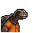
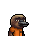

# 胡亂的塗鴉

|品級|分類|體積|最大堆疊|價值|違禁值|
|:--:|:--:|:--:|:--:|:--:|:--:|
|初級|工藝品|一格|3|20|0|

> 喜歡這幅畫的家伙，不是瘋子就是天才。

## 送禮

|圖片|姓名|好感|回應|
|:--:|--|:--:|--|
||[鬣蜥．皮克曼](鬣蜥．皮克曼.md)|8|嘶\~混沌！無序！真正的藝術品\~|
||[羊駝．迪亞哥](羊駝．迪亞哥.md)|6|我見過！我在夢裡見過這個！|
||[海獺．菲爾](海獺．菲爾.md)|6|我好像從裡面看到了某些…數字。|
||[狐貍．托馬斯](狐貍．托馬斯.md)|4|這是給我的嗎？…謝了。|
||[犀牛．伊萬](犀牛．伊萬.md)|4|嗯\~這東西或許能幫助我鍛煉。|
||[黑熊．亨利](黑熊．亨利.md)|4|給我的嗎？這要是吃的就好了…|
||[驢子．山姆](驢子．山姆.md)|4|這是禮物嗎？…那就謝了\~伙計。|
||[馴鹿．魯道夫](馴鹿．魯道夫.md)|4|謝謝你的禮物\~|
||[袋鼠．喬瑟夫](袋鼠．喬瑟夫.md)|4|你太客氣了伙計\~|
||[賽馬．雷伊](賽馬．雷伊.md)|4|嘿\~我就知道你對我有意思\~|
||[狐獴．泰迪](狐獴．泰迪.md)|4|嘿！禮物\~這是一件禮物！哦\~我想它就是咱們友誼的象徵對嗎？|
||[樹蛙．格雷](樹蛙．格雷.md)|4|謝謝你的禮物，伙計…|
||[長頸鹿．吉米](長頸鹿．吉米.md)|-4|嘿\~我的確需要補充維生素了。|
||[駱駝．托尼](駱駝．托尼.md)|-4|呃\~這東西可不值錢…|
||[海象．溫斯頓](海象．溫斯頓.md)|-4|哎……沒東西送就別送\~|
||[老虎．約翰](老虎．約翰.md)|-4|我不需要這個，別來煩我了。|
||[山羊．威爾伯](山羊．威爾伯.md)|-4|噓……|
||[貘．米格爾](貘．米格爾.md)|-4|（小聲）毫無價值的研究材料…來自素材002號。|
||[黑豹．鮑勃](黑豹．鮑勃.md)|-4|這東西對我來說可沒用。|
||[斑鬣狗．文森特](斑鬣狗．文森特.md)|-4|嘖\~我要這破爛干什麼？！|
||[疣豬．哈庫拉](疣豬．哈庫拉.md)|-4|（打哈欠）無聊的東西…|
||[水豚．伯納德](水豚．伯納德.md)|-4|抱歉\~我對藝術可沒多少鑒賞能力。|
||[象龜．威廉姆](象龜．威廉姆.md)|-4|呃\~我好像沒看懂…這畫的含義…|
||[樹懶．蒂姆](樹懶．蒂姆.md)|-4|抱歉\~以我對畫的鑒賞能力…這幅毫無價值。|
||[考拉．凱文](考拉．凱文.md)|-4|這東西即沒屁用，也不值錢…|
||[食蟻獸．費爾南多](食蟻獸．費爾南多.md)|-4|我想畫出這畫的家伙…不是傻子就是瘋子。|
||[臭鼬．沃爾特](臭鼬．沃爾特.md)|-4|這畫實在是太過抽象了…|
||[浣熊．面條](浣熊．面條.md)|-4|如果這就是你的底牌的話，那可太糟糕了…|
||[環尾狐猴．羅伯特](環尾狐猴．羅伯特.md)|-4|我得承認，以我現在的鑒賞能力…暫時體會不到其中的美感。|
||[鴨嘴獸．泰瑞](鴨嘴獸．泰瑞.md)|-4|我可不喜歡無序的圖案，這會讓我焦慮…|
||[兔子．懷特](兔子．懷特.md)|-4|我的魔術裡可用不上這個…|
||[大象．金波](大象．金波.md)|-40|這是什麼…？你在耍我嗎？|
||[河馬．弗蘭克](河馬．弗蘭克.md)|-40|小子，這種垃圾你最好自己留著！|
||[水牛．比爾](水牛．比爾.md)|-40|別給我這些垃圾！你是想惹毛我嗎？！|
||[北極熊．弗拉基米爾](北極熊．弗拉基米爾.md)|-40|“冰山”討厭垃圾。|
||[鱷魚．克蘭奇](鱷魚．克蘭奇.md)|-40|給我這個幹嘛？你是在耍我嗎？！|
||[雄獅．阿歷克斯](雄獅．阿歷克斯.md)|-40|喂！你腦子裡到底在想什麼？|
||[熊貓．老李](熊貓．老李.md)|-40|此乃何意…？！|
||[斑馬．富蘭克林](斑馬．富蘭克林.md)|-40|為什麼給我這個？你的腦袋短路了嗎？！|
||[猩猩．凱撒](猩猩．凱撒.md)|-40|錯誤的選擇…大錯特錯。|
||[鹿豚．理查德](鹿豚．理查德.md)|-40|喂\~小子，別給我這些垃圾。|
||[山魈．拉斐爾](山魈．拉斐爾.md)|-40|呵\~毫無價值的東西…|
||[猞猁．克里斯](猞猁．克里斯.md)|-40|如此敷衍我…可是要扣分的。|
||[穿山甲．林](穿山甲．林.md)|-40|我可沒地方放這些垃圾！|
||[蜜獾．麥克斯](蜜獾．麥克斯.md)|-40|喂\~我警告你，別再給我這些破爛了！|
||[灰貓．班姆](灰貓．班姆.md)|-40|喂\~能不能別把時間浪費在這種垃圾上了？|
||[負鼠．埃迪](負鼠．埃迪.md)|-40|別把你的垃圾塞給我，我已經夠煩的了。|

