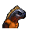

# 圓珠筆

|品級|分類|體積|最大堆疊|價值|違禁值|
|:--:|:--:|:--:|:--:|:--:|:--:|
|高級|寫作工具、武器|一格|1|100|0|

可以用它進行寫作。寫作時，點數+4。\
裝備後：戰鬥時，點數+2。\
最大耐久度：8\
使用時消耗耐久：1\
戰鬥時消耗耐久：2

> 轉筆才是它的主要用途，寫字只是附贈功能罷了。

## 送禮

|圖片|姓名|好感|回應|
|:--:|--|:--:|--|
||[狐貍．托馬斯](狐貍．托馬斯.md)|16|嘿\~這真是個驚喜！|
||[樹懶．蒂姆](樹懶．蒂姆.md)|16|謝謝\~這能加快我的計算速度。|
||[駱駝．托尼](駱駝．托尼.md)|12|嘿\~這看上去應該能賣個好價錢。|
||[馴鹿．魯道夫](馴鹿．魯道夫.md)|12|嘿\~你就這麼想要我的簽名嗎？|
||[猩猩．凱撒](猩猩．凱撒.md)|12|你知道我要什麼，這很值得誇獎。|
||[貘．米格爾](貘．米格爾.md)|12|你知道我需要什麼？看來你對心理學也有所研究…素材002號。|
||[山魈．拉斐爾](山魈．拉斐爾.md)|12|不錯的禮物，這是我要的。|
||[水豚．伯納德](水豚．伯納德.md)|12|我或許能靠寫點東西來消磨時間…謝了。|
||[鴨嘴獸．泰瑞](鴨嘴獸．泰瑞.md)|12|記憶會欺騙你，但寫下的數據不會。|
||[樹蛙．格雷](樹蛙．格雷.md)|12|（兩棲語）呱……呱\~呱。|
||[長頸鹿．吉米](長頸鹿．吉米.md)|8|這和我的氣質完全不符…|
||[河馬．弗蘭克](河馬．弗蘭克.md)|8|呵呵呵\~這個還算不錯\~|
||[犀牛．伊萬](犀牛．伊萬.md)|8|嗯\~這東西或許能幫助我鍛煉。|
||[海象．溫斯頓](海象．溫斯頓.md)|8|既然你拿出來了，那我就收下好了…|
||[驢子．山姆](驢子．山姆.md)|8|這是禮物嗎？…那就謝了\~伙計。|
||[袋鼠．喬瑟夫](袋鼠．喬瑟夫.md)|8|你太客氣了伙計\~|
||[羊駝．迪亞哥](羊駝．迪亞哥.md)|8|要玩筆尖轉到誰，誰就是蠢蛋的遊戲嗎？|
||[鱷魚．克蘭奇](鱷魚．克蘭奇.md)|8|這東西說不定能有\~別的用處。|
||[雄獅．阿歷克斯](雄獅．阿歷克斯.md)|8|哼\~這就是你的禮物嗎\~菜鳥？|
||[熊貓．老李](熊貓．老李.md)|8|嚯嚯\~禮輕情意重\~|
||[斑馬．富蘭克林](斑馬．富蘭克林.md)|8|這或許有用\~呃\~也可能沒用…|
||[賽馬．雷伊](賽馬．雷伊.md)|8|嘿\~我就知道你對我有意思\~|
||[黑豹．鮑勃](黑豹．鮑勃.md)|8|給我禮物嗎？…好吧。|
||[鹿豚．理查德](鹿豚．理查德.md)|8|這是給我的嗎，小子？|
||[猞猁．克里斯](猞猁．克里斯.md)|8|很高興你能送我禮物\~|
||[鬣蜥．皮克曼](鬣蜥．皮克曼.md)|8|嘶\~有趣的禮物\~|
||[象龜．威廉姆](象龜．威廉姆.md)|8|謝謝你…年輕人…|
||[考拉．凱文](考拉．凱文.md)|8|謝了\~這應該能值點錢…|
||[食蟻獸．費爾南多](食蟻獸．費爾南多.md)|8|咱們囚犯之間就該互相幫助\~不是嗎？|
||[穿山甲．林](穿山甲．林.md)|8|但願你送我禮物不是另有所圖。|
||[海獺．菲爾](海獺．菲爾.md)|8|禮物\~我就知道今天會有好事。|
||[臭鼬．沃爾特](臭鼬．沃爾特.md)|8|謝謝你的禮物，我想我會用到它的。|
||[灰貓．班姆](灰貓．班姆.md)|8|物品上也會殘留稀薄的靈力。|
||[狐獴．泰迪](狐獴．泰迪.md)|8|嘿！禮物\~這是一件禮物！哦\~我想它就是咱們友誼的象徵對嗎？|
||[浣熊．面條](浣熊．面條.md)|8|這件禮物就是今天的“賭注”嗎？|
||[環尾狐猴．羅伯特](環尾狐猴．羅伯特.md)|8|嘿\~謝謝你禮物。|
||[負鼠．埃迪](負鼠．埃迪.md)|8|謝了，伙計…|
||[兔子．懷特](兔子．懷特.md)|8|這真是個不大不小的驚喜。|
||[大象．金波](大象．金波.md)|-8|我可用不著這東西，以後拿點有用的過來。|
||[水牛．比爾](水牛．比爾.md)|-8|哼\~我可用不著這破玩意兒。|
||[北極熊．弗拉基米爾](北極熊．弗拉基米爾.md)|-8|我想我不需要這個…|
||[老虎．約翰](老虎．約翰.md)|-8|我不需要這個，別來煩我了。|
||[山羊．威爾伯](山羊．威爾伯.md)|-8|噓……|
||[疣豬．哈庫拉](疣豬．哈庫拉.md)|-8|（打哈欠）無聊的東西…|
||[蜜獾．麥克斯](蜜獾．麥克斯.md)|-8|就這…？這也能叫禮物？|
||[黑熊．亨利](黑熊．亨利.md)|-80|我討厭寫字，寫字會讓我頭疼！|
||[斑鬣狗．文森特](斑鬣狗．文森特.md)|-80|喂\~我看著像是需要這個的書呆子嗎？！|

