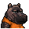
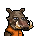
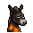

# 長螺絲

|品級|分類|體積|最大堆疊|價值|違禁值|
|:--:|:--:|:--:|:--:|:--:|:--:|
|中級|武器、材料|一格|1|40|2|

裝備後：戰鬥時，點數+1。

> 一根“扎心老鐵”。

## 送禮

|圖片|姓名|好感|回應|
|:--:|--|:--:|--|
||[斑馬．富蘭克林](斑馬．富蘭克林.md)|12|嘿\~我的新發明正需要這些元件！|
||[狐貍．托馬斯](狐貍．托馬斯.md)|9|嘿\~我想我正需要這個。|
||[山羊．威爾伯](山羊．威爾伯.md)|9|囚禁之樁，重生之地…|
||[黑豹．鮑勃](黑豹．鮑勃.md)|9|嗯…這對我或許有些用處。|
||[鹿豚．理查德](鹿豚．理查德.md)|9|這東西沒準有點用，我收下了。|
||[河馬．弗蘭克](河馬．弗蘭克.md)|6|呵呵呵\~這個還算不錯\~|
||[犀牛．伊萬](犀牛．伊萬.md)|6|嗯\~這東西或許能幫助我鍛煉。|
||[水牛．比爾](水牛．比爾.md)|6|喂\~我可沒有回禮給你。|
||[黑熊．亨利](黑熊．亨利.md)|6|給我的嗎？這要是吃的就好了…|
||[海象．溫斯頓](海象．溫斯頓.md)|6|既然你拿出來了，那我就收下好了…|
||[羊駝．迪亞哥](羊駝．迪亞哥.md)|6|嘿嘿\~又有好東西了…|
||[鱷魚．克蘭奇](鱷魚．克蘭奇.md)|6|你想用這個來討好我嗎？|
||[雄獅．阿歷克斯](雄獅．阿歷克斯.md)|6|哼\~這就是你的禮物嗎\~菜鳥？|
||[猩猩．凱撒](猩猩．凱撒.md)|6|嗯\~一件禮物嗎？|
||[貘．米格爾](貘．米格爾.md)|6|（小聲）來自素材的禮物，有研究的價值…|
||[斑鬣狗．文森特](斑鬣狗．文森特.md)|6|嘿\~我剛才就預感會有好事發生！|
||[疣豬．哈庫拉](疣豬．哈庫拉.md)|6|嘿\~嘿\~這是給我的嗎？|
||[猞猁．克里斯](猞猁．克里斯.md)|6|很高興你能送我禮物\~|
||[鬣蜥．皮克曼](鬣蜥．皮克曼.md)|6|嘶\~有趣的禮物\~|
||[食蟻獸．費爾南多](食蟻獸．費爾南多.md)|6|咱們囚犯之間就該互相幫助\~不是嗎？|
||[穿山甲．林](穿山甲．林.md)|6|但願你送我禮物不是另有所圖。|
||[海獺．菲爾](海獺．菲爾.md)|6|禮物\~我就知道今天會有好事。|
||[蜜獾．麥克斯](蜜獾．麥克斯.md)|6|喂\~你打算用這個跟我套近乎嗎？|
||[灰貓．班姆](灰貓．班姆.md)|6|物品上也會殘留稀薄的靈力。|
||[浣熊．面條](浣熊．面條.md)|6|這件禮物就是今天的“賭注”嗎？|
||[負鼠．埃迪](負鼠．埃迪.md)|6|謝了，伙計…|
||[兔子．懷特](兔子．懷特.md)|6|這真是個不大不小的驚喜。|
||[大象．金波](大象．金波.md)|-6|喂\~你覺得以我的實力，會需要這個嗎？|
||[長頸鹿．吉米](長頸鹿．吉米.md)|-6|哈\~這下總算有點黑客的樣子了。|
||[駱駝．托尼](駱駝．托尼.md)|-6|呃\~這東西可不值錢…|
||[北極熊．弗拉基米爾](北極熊．弗拉基米爾.md)|-6|摔跤手可不需要武器。|
||[驢子．山姆](驢子．山姆.md)|-6|喂\~這玩意兒看起來可不像什麼“好東西”。|
||[袋鼠．喬瑟夫](袋鼠．喬瑟夫.md)|-6|\~我有拳頭就足夠了。|
||[熊貓．老李](熊貓．老李.md)|-6|也罷，也罷……|
||[山魈．拉斐爾](山魈．拉斐爾.md)|-6|這東西對我來說\~價值約等於零。|
||[水豚．伯納德](水豚．伯納德.md)|-6|用暴力解決暴力，只會帶來新的暴力。|
||[樹懶．蒂姆](樹懶．蒂姆.md)|-6|用這個解決麻煩，只能帶來更多麻煩。|
||[考拉．凱文](考拉．凱文.md)|-6|吶\~我可不想因為這個被關禁閉。|
||[臭鼬．沃爾特](臭鼬．沃爾特.md)|-6|私藏這種違禁品可不是個好主意。|
||[狐獴．泰迪](狐獴．泰迪.md)|-6|哦\~這東西會給我帶來麻煩的！我得少惹事情，不然他們會把我送回病區囚室的。你也不想失去我這個朋友，對吧？|
||[環尾狐猴．羅伯特](環尾狐猴．羅伯特.md)|-6|這會害我關禁閉的，我在禁閉室裡可沒法開發遊戲。|
||[鴨嘴獸．泰瑞](鴨嘴獸．泰瑞.md)|-6|這個如果被獄警發現，那可就要爆倉了…|
||[樹蛙．格雷](樹蛙．格雷.md)|-6|我可不需要什麼防身武器…|
||[馴鹿．魯道夫](馴鹿．魯道夫.md)|-60|聽好了，超級英雄可不會用這種危險的武器。|
||[老虎．約翰](老虎．約翰.md)|-60|……走開。|
||[賽馬．雷伊](賽馬．雷伊.md)|-60|哦\~該死的暴力\~它只會帶來災難\~|
||[象龜．威廉姆](象龜．威廉姆.md)|-60|年輕人…暴力…終將招致惡果…|

