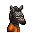
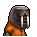

# 運動鞋

|品級|分類|體積|最大堆疊|價值|違禁值|
|:--:|:--:|:--:|:--:|:--:|:--:|
|高級|服飾、鞋|一格|1|200|0|

裝備後：敏捷+2。

> 球場上有句俗話：穿的越貴，跳的越高！

## 送禮

|圖片|姓名|好感|回應|
|:--:|--|:--:|--|
||[北極熊．弗拉基米爾](北極熊．弗拉基米爾.md)|24|唔\~有了這個，我的“冰山一腳”將更加致命！|
||[馴鹿．魯道夫](馴鹿．魯道夫.md)|24|嘿\~想見識一下“彗星客”的最高時速嗎？|
||[袋鼠．喬瑟夫](袋鼠．喬瑟夫.md)|24|哈\~想見識一下我的蝴蝶步嗎？|
||[雄獅．阿歷克斯](雄獅．阿歷克斯.md)|24|呵\~這件禮物還像點樣子。|
||[大象．金波](大象．金波.md)|18|小子\~你的禮物還算上道。|
||[犀牛．伊萬](犀牛．伊萬.md)|18|嗯\~這東西或許能幫助我鍛煉。|
||[黑熊．亨利](黑熊．亨利.md)|18|你的鞋多大，我的腳就多大。|
||[黑豹．鮑勃](黑豹．鮑勃.md)|18|嗯…這對我或許有些用處。|
||[斑鬣狗．文森特](斑鬣狗．文森特.md)|18|喲喲\~伙計，我喜歡這個！|
||[猞猁．克里斯](猞猁．克里斯.md)|18|這是我想要的，咱倆果然\~合得來。|
||[考拉．凱文](考拉．凱文.md)|18|嘿\~伙計，你可太夠意思了！|
||[穿山甲．林](穿山甲．林.md)|18|但願這鞋能讓我跑快點吧…|
||[蜜獾．麥克斯](蜜獾．麥克斯.md)|18|呵\~這還有點禮物的樣子。|
||[環尾狐猴．羅伯特](環尾狐猴．羅伯特.md)|18|哈！一件新裝備！|
||[負鼠．埃迪](負鼠．埃迪.md)|18|哎\~這能讓我在關鍵的時候跑快點嗎？|
||[狐貍．托馬斯](狐貍．托馬斯.md)|12|這是給我的嗎？…謝了。|
||[河馬．弗蘭克](河馬．弗蘭克.md)|12|呵呵呵\~這個還算不錯\~|
||[水牛．比爾](水牛．比爾.md)|12|喂\~我可沒有回禮給你。|
||[駱駝．托尼](駱駝．托尼.md)|12|謝謝你的禮物，我的朋友\~|
||[驢子．山姆](驢子．山姆.md)|12|這是禮物嗎？…那就謝了\~伙計。|
||[羊駝．迪亞哥](羊駝．迪亞哥.md)|12|嘿嘿\~又有好東西了…|
||[鱷魚．克蘭奇](鱷魚．克蘭奇.md)|12|你想用這個來討好我嗎？|
||[老虎．約翰](老虎．約翰.md)|12|多此一舉……|
||[斑馬．富蘭克林](斑馬．富蘭克林.md)|12|這或許有用\~呃\~也可能沒用…|
||[賽馬．雷伊](賽馬．雷伊.md)|12|嘿\~我就知道你對我有意思\~|
||[猩猩．凱撒](猩猩．凱撒.md)|12|嗯\~一件禮物嗎？|
||[鹿豚．理查德](鹿豚．理查德.md)|12|這是給我的嗎，小子？|
||[疣豬．哈庫拉](疣豬．哈庫拉.md)|12|嘿\~嘿\~這是給我的嗎？|
||[山魈．拉斐爾](山魈．拉斐爾.md)|12|禮物嗎？換成錢的話，價格應該是…（小聲嘀咕）|
||[鬣蜥．皮克曼](鬣蜥．皮克曼.md)|12|嘶\~有趣的禮物\~|
||[水豚．伯納德](水豚．伯納德.md)|12|這只是件單純的禮物嗎？|
||[食蟻獸．費爾南多](食蟻獸．費爾南多.md)|12|咱們囚犯之間就該互相幫助\~不是嗎？|
||[海獺．菲爾](海獺．菲爾.md)|12|禮物\~我就知道今天會有好事。|
||[臭鼬．沃爾特](臭鼬．沃爾特.md)|12|謝謝你的禮物，我想我會用到它的。|
||[灰貓．班姆](灰貓．班姆.md)|12|物品上也會殘留稀薄的靈力。|
||[狐獴．泰迪](狐獴．泰迪.md)|12|嘿！禮物\~這是一件禮物！哦\~我想它就是咱們友誼的象徵對嗎？|
||[浣熊．面條](浣熊．面條.md)|12|這件禮物就是今天的“賭注”嗎？|
||[鴨嘴獸．泰瑞](鴨嘴獸．泰瑞.md)|12|這筆投資包你穩賺不賠。|
||[兔子．懷特](兔子．懷特.md)|12|這真是個不大不小的驚喜。|
||[樹蛙．格雷](樹蛙．格雷.md)|12|謝謝你的禮物，伙計…|
||[長頸鹿．吉米](長頸鹿．吉米.md)|-12|我說了\~我不喜歡運動…|
||[海象．溫斯頓](海象．溫斯頓.md)|-12|我可不想穿這個…它會把我的鰭腳磨破的。|
||[熊貓．老李](熊貓．老李.md)|-12|也罷，也罷……|
||[山羊．威爾伯](山羊．威爾伯.md)|-12|噓……|
||[貘．米格爾](貘．米格爾.md)|-12|偽造的軀體…靈魂的枷鎖。|
||[象龜．威廉姆](象龜．威廉姆.md)|-12|咳咳\~我這副老骨頭…可不適合…這個…|
||[樹懶．蒂姆](樹懶．蒂姆.md)|-12|呃\~我可沒什麼運動細胞…|

