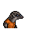

# 湯匙

|品級|分類|體積|最大堆疊|價值|違禁值|
|:--:|:--:|:--:|:--:|:--:|:--:|
|初級|挖掘工具|一格|1|30|0|

可以用它進行挖掘。挖掘時，點數+2。

> 阿布拉，卡達布拉，阿拉卡贊！

## 送禮

|圖片|姓名|好感|回應|
|:--:|--|:--:|--|
||[兔子．懷特](兔子．懷特.md)|8|每個魔術師對湯匙都有一種特殊的感情…|
||[狐貍．托馬斯](狐貍．托馬斯.md)|6|嘿\~我想我正需要這個。|
||[黑熊．亨利](黑熊．亨利.md)|6|你聽過“常換勺子，吃飯更香”這句話嗎？|
||[灰貓．班姆](灰貓．班姆.md)|6|為什麼湯匙對靈力的反應異常強烈，這在超能學界還沒有定論。|
||[長頸鹿．吉米](長頸鹿．吉米.md)|4|敲代碼的時候怎能沒有“快樂水”呢？|
||[河馬．弗蘭克](河馬．弗蘭克.md)|4|呵呵呵\~這個還算不錯\~|
||[犀牛．伊萬](犀牛．伊萬.md)|4|嗯\~這東西或許能幫助我鍛煉。|
||[水牛．比爾](水牛．比爾.md)|4|喂\~我可沒有回禮給你。|
||[北極熊．弗拉基米爾](北極熊．弗拉基米爾.md)|4|巨魔“冰山”不會拒絕貢品\~|
||[海象．溫斯頓](海象．溫斯頓.md)|4|既然你拿出來了，那我就收下好了…|
||[驢子．山姆](驢子．山姆.md)|4|這是禮物嗎？…那就謝了\~伙計。|
||[馴鹿．魯道夫](馴鹿．魯道夫.md)|4|謝謝你的禮物\~|
||[袋鼠．喬瑟夫](袋鼠．喬瑟夫.md)|4|你太客氣了伙計\~|
||[羊駝．迪亞哥](羊駝．迪亞哥.md)|4|嘿嘿\~又有好東西了…|
||[鱷魚．克蘭奇](鱷魚．克蘭奇.md)|4|這東西說不定能有\~別的用處。|
||[熊貓．老李](熊貓．老李.md)|4|嚯嚯\~禮輕情意重\~|
||[斑馬．富蘭克林](斑馬．富蘭克林.md)|4|這或許有用\~呃\~也可能沒用…|
||[賽馬．雷伊](賽馬．雷伊.md)|4|嘿\~我就知道你對我有意思\~|
||[貘．米格爾](貘．米格爾.md)|4|（小聲）來自素材的禮物，有研究的價值…|
||[黑豹．鮑勃](黑豹．鮑勃.md)|4|給我禮物嗎？…好吧。|
||[斑鬣狗．文森特](斑鬣狗．文森特.md)|4|嘿\~我剛才就預感會有好事發生！|
||[鹿豚．理查德](鹿豚．理查德.md)|4|這是給我的嗎，小子？|
||[疣豬．哈庫拉](疣豬．哈庫拉.md)|4|嘿\~嘿\~這是給我的嗎？|
||[猞猁．克里斯](猞猁．克里斯.md)|4|很高興你能送我禮物\~|
||[鬣蜥．皮克曼](鬣蜥．皮克曼.md)|4|嘶\~有趣的禮物\~|
||[水豚．伯納德](水豚．伯納德.md)|4|這只是件單純的禮物嗎？|
||[象龜．威廉姆](象龜．威廉姆.md)|4|謝謝你…年輕人…|
||[樹懶．蒂姆](樹懶．蒂姆.md)|4|（打哈欠）…謝謝你的禮物\~|
||[考拉．凱文](考拉．凱文.md)|4|謝了\~這應該能值點錢…|
||[食蟻獸．費爾南多](食蟻獸．費爾南多.md)|4|咱們囚犯之間就該互相幫助\~不是嗎？|
||[穿山甲．林](穿山甲．林.md)|4|但願你送我禮物不是另有所圖。|
||[海獺．菲爾](海獺．菲爾.md)|4|禮物\~我就知道今天會有好事。|
||[臭鼬．沃爾特](臭鼬．沃爾特.md)|4|謝謝你的禮物，我想我會用到它的。|
||[狐獴．泰迪](狐獴．泰迪.md)|4|嘿！禮物\~這是一件禮物！哦\~我想它就是咱們友誼的象徵對嗎？|
||[浣熊．面條](浣熊．面條.md)|4|這件禮物就是今天的“賭注”嗎？|
||[環尾狐猴．羅伯特](環尾狐猴．羅伯特.md)|4|嘿\~謝謝你禮物。|
||[負鼠．埃迪](負鼠．埃迪.md)|4|謝了，伙計…|
||[鴨嘴獸．泰瑞](鴨嘴獸．泰瑞.md)|4|這筆投資包你穩賺不賠。|
||[樹蛙．格雷](樹蛙．格雷.md)|4|謝謝你的禮物，伙計…|
||[大象．金波](大象．金波.md)|-4|你覺得我會喜歡…一根勺子嗎？這他媽又不是根金勺子！|
||[駱駝．托尼](駱駝．托尼.md)|-4|呃\~這東西可不值錢…|
||[雄獅．阿歷克斯](雄獅．阿歷克斯.md)|-4|喂\~這種破爛以後別再拿來了！|
||[老虎．約翰](老虎．約翰.md)|-4|我不需要這個，別來煩我了。|
||[猩猩．凱撒](猩猩．凱撒.md)|-4|你浪費了一件物品，而我損失了寶貴的時間。|
||[山羊．威爾伯](山羊．威爾伯.md)|-4|噓……|
||[山魈．拉斐爾](山魈．拉斐爾.md)|-4|這東西對我來說\~價值約等於零。|
||[蜜獾．麥克斯](蜜獾．麥克斯.md)|-4|就這…？這也能叫禮物？|

