# 碎玻璃

|品級|分類|體積|最大堆疊|價值|違禁值|
|:--:|:--:|:--:|:--:|:--:|:--:|
|初級|武器、材料、利刃|一格|1|10|2|

裝備後：戰鬥時，點數+{p2}。\
最大耐久度：1\
戰鬥時消耗耐久：1

> 完整的窗戶都是相同的，碎裂的玻璃各有各的缺口。

## 送禮

|圖片|姓名|好感|回應|
|:--:|--|:--:|--|
|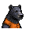|[黑熊．亨利](黑熊．亨利.md)|2|給我的嗎？這要是吃的就好了…|
|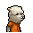|[羊駝．迪亞哥](羊駝．迪亞哥.md)|2|嘿嘿\~又有好東西了…|
|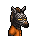|[斑馬．富蘭克林](斑馬．富蘭克林.md)|2|這或許有用\~呃\~也可能沒用…|
|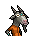|[山羊．威爾伯](山羊．威爾伯.md)|2|你將聽見“它”的謝意…|
|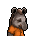|[貘．米格爾](貘．米格爾.md)|2|（小聲）來自素材的禮物，有研究的價值…|
||[斑鬣狗．文森特](斑鬣狗．文森特.md)|2|嘿\~我剛才就預感會有好事發生！|
|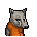|[鹿豚．理查德](鹿豚．理查德.md)|2|這是給我的嗎，小子？|
|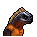|[鬣蜥．皮克曼](鬣蜥．皮克曼.md)|2|嘶\~有趣的禮物\~|
|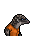|[穿山甲．林](穿山甲．林.md)|2|但願你送我禮物不是另有所圖。|
|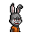|[兔子．懷特](兔子．懷特.md)|2|嗯…我的魔術機關沒準用得上它。|
||[狐貍．托馬斯](狐貍．托馬斯.md)|-2|你是讓我幫你丟掉它嗎？|
|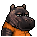|[河馬．弗蘭克](河馬．弗蘭克.md)|-2|喂\~我可不想被這玩意兒劃傷手！|
||[水牛．比爾](水牛．比爾.md)|-2|我可不會用這種垃圾來干架。|
|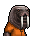|[海象．溫斯頓](海象．溫斯頓.md)|-2|喂\~誰教你把垃圾當做禮物的？！|
|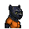|[黑豹．鮑勃](黑豹．鮑勃.md)|-2|喂\~別把垃圾塞給我。|
|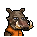|[疣豬．哈庫拉](疣豬．哈庫拉.md)|-2|（打哈欠）無聊的東西…|
|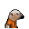|[食蟻獸．費爾南多](食蟻獸．費爾南多.md)|-2|喂\~我可不想在身上放這些沒用的東西…|
||[海獺．菲爾](海獺．菲爾.md)|-2|我很好奇，你是怎麼想到把這個當做“禮物”的。|
|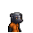|[臭鼬．沃爾特](臭鼬．沃爾特.md)|-2|我想…我可能用不著這個。|
|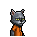|[灰貓．班姆](灰貓．班姆.md)|-2|我們正在面臨危機！拜托\~拿點有用的東西來吧。|
|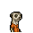|[狐獴．泰迪](狐獴．泰迪.md)|-2|雖然我不該挑剔你的禮物…但是為了咱們友誼的質量，我還是想說上幾句。|
||[浣熊．面條](浣熊．面條.md)|-2|如果這就是你的底牌的話，那可太糟糕了…|
|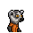|[環尾狐猴．羅伯特](環尾狐猴．羅伯特.md)|-2|這會害我關禁閉的，我在禁閉室裡可沒法開發遊戲。|
|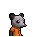|[負鼠．埃迪](負鼠．埃迪.md)|-2|你知道我遇到了多大的麻煩嗎？你覺得靠這個破爛能解決嗎？|
|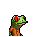|[樹蛙．格雷](樹蛙．格雷.md)|-2|我可不需要什麼防身武器…|
||[大象．金波](大象．金波.md)|-20|小子\~你以後最好想清楚再給我東西\~我不喜歡垃圾！|
|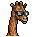|[長頸鹿．吉米](長頸鹿．吉米.md)|-20|別這樣\~會讓別人誤會的…|
|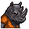|[犀牛．伊萬](犀牛．伊萬.md)|-20|喂！別把你的垃圾塞給我！|
|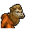|[駱駝．托尼](駱駝．托尼.md)|-20|武器給我惹得麻煩已經夠多了…|
|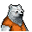|[北極熊．弗拉基米爾](北極熊．弗拉基米爾.md)|-20|“冰山”討厭垃圾。|
|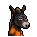|[驢子．山姆](驢子．山姆.md)|-20|我可不是你的垃圾桶…|
||[馴鹿．魯道夫](馴鹿．魯道夫.md)|-20|聽好了，超級英雄可不會用這種危險的武器。|
|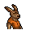|[袋鼠．喬瑟夫](袋鼠．喬瑟夫.md)|-20|你覺得我會喜歡這件…垃圾嗎？|
||[鱷魚．克蘭奇](鱷魚．克蘭奇.md)|-20|我可不需要這種破爛。|
|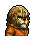|[雄獅．阿歷克斯](雄獅．阿歷克斯.md)|-20|喂！你腦子裡到底在想什麼？|
|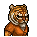|[老虎．約翰](老虎．約翰.md)|-20|……走開。|
||[熊貓．老李](熊貓．老李.md)|-20|此乃何意…？！|
||[賽馬．雷伊](賽馬．雷伊.md)|-20|哦\~該死的暴力\~它只會帶來災難\~|
|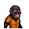|[猩猩．凱撒](猩猩．凱撒.md)|-20|錯誤的選擇…大錯特錯。|
|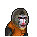|[山魈．拉斐爾](山魈．拉斐爾.md)|-20|呵\~毫無價值的東西…|
|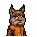|[猞猁．克里斯](猞猁．克里斯.md)|-20|如此敷衍我…可是要扣分的。|
|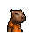|[水豚．伯納德](水豚．伯納德.md)|-20|以後這種垃圾你還是自己留著好了。|
|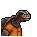|[象龜．威廉姆](象龜．威廉姆.md)|-20|年輕人…暴力…終將招致惡果…|
|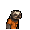|[樹懶．蒂姆](樹懶．蒂姆.md)|-20|（打哈欠）我可沒地方裝這個…垃圾。|
|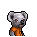|[考拉．凱文](考拉．凱文.md)|-20|喂！你當我是收破爛的嗎？|
|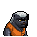|[蜜獾．麥克斯](蜜獾．麥克斯.md)|-20|喂\~我警告你，別再給我這些破爛了！|
|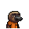|[鴨嘴獸．泰瑞](鴨嘴獸．泰瑞.md)|-20|垃圾的價值減去倉儲成本，最後的收益將是…負值！|

