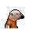

# 雙節棍

|品級|分類|體積|最大堆疊|價值|違禁值|
|:--:|:--:|:--:|:--:|:--:|:--:|
|高級|道具、武器、棍棒|一格|1|100|5|

|製作材料|製作時間|花費精力|
|:--:|:--:|:--:|
|[折斷的木條](159-折斷的木條.md)\*2 / [鞋帶](124-鞋帶.md)\*1 / [釘子](123-釘子.md)\*2|60|15|

可用來當做滑索的掛鉤。

> 呼吸吐納心自在，氣沉丹田手心開。

## 送禮

|圖片|姓名|好感|回應|
|:--:|--|:--:|--|
||[穿山甲．林](穿山甲．林.md)|16|嘿！這不是唐在電影裡用的武器嗎！|
||[水牛．比爾](水牛．比爾.md)|12|雖然比不上我的牛角，但也算是件好玩意兒。|
||[鱷魚．克蘭奇](鱷魚．克蘭奇.md)|12|誇獎你一下\~這東西還算不錯。|
||[雄獅．阿歷克斯](雄獅．阿歷克斯.md)|12|呵呵\~這東西好像還有點意思。|
||[熊貓．老李](熊貓．老李.md)|12|力道相合謂之功夫\~|
||[黑豹．鮑勃](黑豹．鮑勃.md)|12|當年警校……呃\~謹小慎微\~對練習這個會有幫助…|
||[斑鬣狗．文森特](斑鬣狗．文森特.md)|12|嘿\~要我給你露兩手嗎，伙計！|
||[鹿豚．理查德](鹿豚．理查德.md)|12|奇怪的武器…勾起了我的興趣。|
||[疣豬．哈庫拉](疣豬．哈庫拉.md)|12|嘿\~我在電影裡見過這個！|
||[蜜獾．麥克斯](蜜獾．麥克斯.md)|12|呵\~這還有點禮物的樣子。|
||[河馬．弗蘭克](河馬．弗蘭克.md)|8|呵呵呵\~這個還算不錯\~|
||[犀牛．伊萬](犀牛．伊萬.md)|8|嗯\~這東西或許能幫助我鍛煉。|
||[黑熊．亨利](黑熊．亨利.md)|8|給我的嗎？這要是吃的就好了…|
||[羊駝．迪亞哥](羊駝．迪亞哥.md)|8|嘿嘿\~又有好東西了…|
||[老虎．約翰](老虎．約翰.md)|8|多此一舉……|
||[猩猩．凱撒](猩猩．凱撒.md)|8|嗯\~一件禮物嗎？|
||[貘．米格爾](貘．米格爾.md)|8|（小聲）來自素材的禮物，有研究的價值…|
||[山魈．拉斐爾](山魈．拉斐爾.md)|8|禮物嗎？換成錢的話，價格應該是…（小聲嘀咕）|
||[猞猁．克里斯](猞猁．克里斯.md)|8|很高興你能送我禮物\~|
||[鬣蜥．皮克曼](鬣蜥．皮克曼.md)|8|嘶\~有趣的禮物\~|
||[食蟻獸．費爾南多](食蟻獸．費爾南多.md)|8|咱們囚犯之間就該互相幫助\~不是嗎？|
||[海獺．菲爾](海獺．菲爾.md)|8|禮物\~我就知道今天會有好事。|
||[灰貓．班姆](灰貓．班姆.md)|8|物品上也會殘留稀薄的靈力。|
||[浣熊．面條](浣熊．面條.md)|8|這件禮物就是今天的“賭注”嗎？|
||[負鼠．埃迪](負鼠．埃迪.md)|8|謝了，伙計…|
||[兔子．懷特](兔子．懷特.md)|8|這真是個不大不小的驚喜。|
||[樹蛙．格雷](樹蛙．格雷.md)|8|謝謝你的禮物，伙計…|
||[狐貍．托馬斯](狐貍．托馬斯.md)|-8|呃\~這東西…該怎麼用？|
||[大象．金波](大象．金波.md)|-8|喂\~你覺得以我的實力，會需要這個嗎？|
||[長頸鹿．吉米](長頸鹿．吉米.md)|-8|哈\~這下總算有點黑客的樣子了。|
||[北極熊．弗拉基米爾](北極熊．弗拉基米爾.md)|-8|摔跤手可不需要武器。|
||[海象．溫斯頓](海象．溫斯頓.md)|-8|我可不會雜技…|
||[驢子．山姆](驢子．山姆.md)|-8|我用這個只會讓自己顯得更蠢…|
||[馴鹿．魯道夫](馴鹿．魯道夫.md)|-8|呃\~我以前用過這個，它總是會掛在我的鹿角上…|
||[袋鼠．喬瑟夫](袋鼠．喬瑟夫.md)|-8|\~我有拳頭就足夠了。|
||[斑馬．富蘭克林](斑馬．富蘭克林.md)|-8|這東西在我眼裡就像是原始人的石頭。|
||[山羊．威爾伯](山羊．威爾伯.md)|-8|噓……|
||[水豚．伯納德](水豚．伯納德.md)|-8|用暴力解決暴力，只會帶來新的暴力。|
||[象龜．威廉姆](象龜．威廉姆.md)|-8|咳咳\~我這副老身板…可不適合…這個…|
||[樹懶．蒂姆](樹懶．蒂姆.md)|-8|用這個解決麻煩，只能帶來更多麻煩。|
||[考拉．凱文](考拉．凱文.md)|-8|吶\~我可不想因為這個被關禁閉。|
||[臭鼬．沃爾特](臭鼬．沃爾特.md)|-8|私藏這種違禁品可不是個好主意。|
||[狐獴．泰迪](狐獴．泰迪.md)|-8|哦\~這東西會給我帶來麻煩的！我得少惹事情，不然他們會把我送回病區囚室的。你也不想失去我這個朋友，對吧？|
||[環尾狐猴．羅伯特](環尾狐猴．羅伯特.md)|-8|這會害我關禁閉的，我在禁閉室裡可沒法開發遊戲。|
||[鴨嘴獸．泰瑞](鴨嘴獸．泰瑞.md)|-8|這個如果被獄警發現，那可就要爆倉了…|
||[駱駝．托尼](駱駝．托尼.md)|-80|武器給我惹得麻煩已經夠多了…|
||[賽馬．雷伊](賽馬．雷伊.md)|-80|哦\~該死的暴力\~它只會帶來災難\~|

