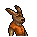
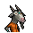

# 眼鏡

|品級|分類|體積|最大堆疊|價值|違禁值|
|:--:|:--:|:--:|:--:|:--:|:--:|
|高級|服飾、眼鏡|一格|1|150|0|

裝備後：讀書時，點數+4。

> “眼離書本一尺，胸離書桌一拳”——出自《靈長動物用眼指南》

## 送禮

|圖片|姓名|好感|回應|
|:--:|--|:--:|--|
||[山魈．拉斐爾](山魈．拉斐爾.md)|20|如此貴重的禮物…看來你是有求於我了？|
||[象龜．威廉姆](象龜．威廉姆.md)|20|謝謝你…好孩子…我正需要這個。|
||[樹懶．蒂姆](樹懶．蒂姆.md)|20|如果戴上這個…我應該會看起來多幾分精神。|
||[食蟻獸．費爾南多](食蟻獸．費爾南多.md)|20|謝謝，朋友\~這副眼鏡的度數剛好合適。|
||[臭鼬．沃爾特](臭鼬．沃爾特.md)|20|這度數剛好合適，實在是太感謝了。|
||[狐獴．泰迪](狐獴．泰迪.md)|20|哈！一副新眼鏡！有什麼能比一副度數不多也不少的眼鏡更好的禮物呢？答案是，沒有！|
||[鴨嘴獸．泰瑞](鴨嘴獸．泰瑞.md)|20|咱們搞金融的就該穿的像模像樣，主要是為了讓客戶安心。|
||[狐貍．托馬斯](狐貍．托馬斯.md)|15|嘿\~這度數剛好合適。|
||[長頸鹿．吉米](長頸鹿．吉米.md)|15|哦\~謝謝你的禮物。|
||[熊貓．老李](熊貓．老李.md)|15|哈\~好禮相送，汝欲以“禮”服人否？|
||[斑馬．富蘭克林](斑馬．富蘭克林.md)|15|經過計算…我想我會用上它的。|
||[猩猩．凱撒](猩猩．凱撒.md)|15|很好，我看到了你的尊重。|
||[水豚．伯納德](水豚．伯納德.md)|15|這看起來沒什麼威脅…謝了。|
||[考拉．凱文](考拉．凱文.md)|15|嘿\~伙計，你可太夠意思了！|
||[海獺．菲爾](海獺．菲爾.md)|15|你說我總中不了獎，是不是和我的視力有關…|
||[浣熊．面條](浣熊．面條.md)|15|這是件不錯的禮物，你的觀察力還不賴。|
||[環尾狐猴．羅伯特](環尾狐猴．羅伯特.md)|15|哈！一件新裝備！|
||[大象．金波](大象．金波.md)|10|算你識相，小子。|
||[河馬．弗蘭克](河馬．弗蘭克.md)|10|呵呵呵\~這個還算不錯\~|
||[駱駝．托尼](駱駝．托尼.md)|10|謝謝你的禮物，我的朋友\~|
||[北極熊．弗拉基米爾](北極熊．弗拉基米爾.md)|10|巨魔“冰山”不會拒絕貢品\~|
||[海象．溫斯頓](海象．溫斯頓.md)|10|既然你拿出來了，那我就收下好了…|
||[驢子．山姆](驢子．山姆.md)|10|這是禮物嗎？…那就謝了\~伙計。|
||[馴鹿．魯道夫](馴鹿．魯道夫.md)|10|謝謝你的禮物\~|
||[袋鼠．喬瑟夫](袋鼠．喬瑟夫.md)|10|你太客氣了伙計\~|
||[鱷魚．克蘭奇](鱷魚．克蘭奇.md)|10|你想用這個來討好我嗎？|
||[雄獅．阿歷克斯](雄獅．阿歷克斯.md)|10|哼\~這就是你的禮物嗎\~菜鳥？|
||[老虎．約翰](老虎．約翰.md)|10|多此一舉……|
||[賽馬．雷伊](賽馬．雷伊.md)|10|嘿\~我就知道你對我有意思\~|
||[山羊．威爾伯](山羊．威爾伯.md)|10|你將聽見“它”的謝意…|
||[貘．米格爾](貘．米格爾.md)|10|（小聲）來自素材的禮物，有研究的價值…|
||[黑豹．鮑勃](黑豹．鮑勃.md)|10|給我禮物嗎？…好吧。|
||[鹿豚．理查德](鹿豚．理查德.md)|10|這是給我的嗎，小子？|
||[疣豬．哈庫拉](疣豬．哈庫拉.md)|10|嘿\~嘿\~這是給我的嗎？|
||[猞猁．克里斯](猞猁．克里斯.md)|10|很高興你能送我禮物\~|
||[鬣蜥．皮克曼](鬣蜥．皮克曼.md)|10|嘶\~有趣的禮物\~|
||[穿山甲．林](穿山甲．林.md)|10|但願你送我禮物不是另有所圖。|
||[灰貓．班姆](灰貓．班姆.md)|10|物品上也會殘留稀薄的靈力。|
||[負鼠．埃迪](負鼠．埃迪.md)|10|謝了，伙計…|
||[兔子．懷特](兔子．懷特.md)|10|這真是個不大不小的驚喜。|
||[樹蛙．格雷](樹蛙．格雷.md)|10|謝謝你的禮物，伙計…|
||[犀牛．伊萬](犀牛．伊萬.md)|-10|戴上這東西可不好鍛煉…|
||[水牛．比爾](水牛．比爾.md)|-10|戴上這個玻璃片子還怎麼打架？！|
||[黑熊．亨利](黑熊．亨利.md)|-10|哦\~這可不是我的風格。|
||[蜜獾．麥克斯](蜜獾．麥克斯.md)|-10|喂\~你覺得我會需要這個嗎？|
||[羊駝．迪亞哥](羊駝．迪亞哥.md)|-100|書呆子才會用這個，我可不是呆子\~！|
||[斑鬣狗．文森特](斑鬣狗．文森特.md)|-100|喂\~這是什麼鬼東西？我他媽才不想要！|

