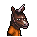

# 棒球帽

|品級|分類|體積|最大堆疊|價值|違禁值|
|:--:|:--:|:--:|:--:|:--:|:--:|
|高級|服飾、帽子|一格|1|200|0|

裝備後：魅力+2。

> 烈火隊以兇狠的打法稱霸球場，也是涉及最多暴力事件的球隊。

## 送禮

|圖片|姓名|好感|回應|
|:--:|--|:--:|--|
||[駱駝．托尼](駱駝．托尼.md)|24|哦！你真是太大方了\~我的朋友！|
||[浣熊．面條](浣熊．面條.md)|24|嘿\~你知道嗎？牌局的勝率是和牌手帽檐的高度成反比的。|
||[大象．金波](大象．金波.md)|18|小子\~你的禮物還算上道。|
||[長頸鹿．吉米](長頸鹿．吉米.md)|18|我說了\~我不喜歡運動…|
||[犀牛．伊萬](犀牛．伊萬.md)|18|嘿\~你是這支隊伍的粉絲嗎…？|
||[黑熊．亨利](黑熊．亨利.md)|18|嘿\~我喜歡這種街頭風格。|
||[賽馬．雷伊](賽馬．雷伊.md)|18|嘿\~你覺得我戴著好看嗎？|
||[猞猁．克里斯](猞猁．克里斯.md)|18|這是我想要的，咱倆果然\~合得來。|
||[水豚．伯納德](水豚．伯納德.md)|18|這看起來沒什麼威脅…謝了。|
||[考拉．凱文](考拉．凱文.md)|18|嘿\~伙計，你可太夠意思了！|
||[海獺．菲爾](海獺．菲爾.md)|18|嘿\~我喜歡帽子…這是件好禮物。|
||[狐獴．泰迪](狐獴．泰迪.md)|18|唔！我戴上這個帥不帥？姑娘們看了一定會愛上我的，你說是嗎？|
||[負鼠．埃迪](負鼠．埃迪.md)|18|你說如果我把臉都遮住，會不會就沒人認的出了？|
||[狐貍．托馬斯](狐貍．托馬斯.md)|12|這是給我的嗎？…謝了。|
||[河馬．弗蘭克](河馬．弗蘭克.md)|12|呵呵呵\~這個還算不錯\~|
||[水牛．比爾](水牛．比爾.md)|12|喂\~我可沒有回禮給你。|
||[北極熊．弗拉基米爾](北極熊．弗拉基米爾.md)|12|巨魔“冰山”不會拒絕貢品\~|
||[海象．溫斯頓](海象．溫斯頓.md)|12|既然你拿出來了，那我就收下好了…|
||[驢子．山姆](驢子．山姆.md)|12|這是禮物嗎？…那就謝了\~伙計。|
||[袋鼠．喬瑟夫](袋鼠．喬瑟夫.md)|12|你太客氣了伙計\~|
||[羊駝．迪亞哥](羊駝．迪亞哥.md)|12|嘿嘿\~又有好東西了…|
||[鱷魚．克蘭奇](鱷魚．克蘭奇.md)|12|你想用這個來討好我嗎？|
||[雄獅．阿歷克斯](雄獅．阿歷克斯.md)|12|哼\~這就是你的禮物嗎\~菜鳥？|
||[老虎．約翰](老虎．約翰.md)|12|多此一舉……|
||[熊貓．老李](熊貓．老李.md)|12|嚯嚯\~禮輕情意重\~|
||[斑馬．富蘭克林](斑馬．富蘭克林.md)|12|這或許有用\~呃\~也可能沒用…|
||[猩猩．凱撒](猩猩．凱撒.md)|12|嗯\~一件禮物嗎？|
||[貘．米格爾](貘．米格爾.md)|12|（小聲）來自素材的禮物，有研究的價值…|
||[黑豹．鮑勃](黑豹．鮑勃.md)|12|給我禮物嗎？…好吧。|
||[斑鬣狗．文森特](斑鬣狗．文森特.md)|12|嘿\~我剛才就預感會有好事發生！|
||[鹿豚．理查德](鹿豚．理查德.md)|12|這是給我的嗎，小子？|
||[疣豬．哈庫拉](疣豬．哈庫拉.md)|12|嘿\~嘿\~這是給我的嗎？|
||[山魈．拉斐爾](山魈．拉斐爾.md)|12|禮物嗎？換成錢的話，價格應該是…（小聲嘀咕）|
||[鬣蜥．皮克曼](鬣蜥．皮克曼.md)|12|嘶\~有趣的禮物\~|
||[象龜．威廉姆](象龜．威廉姆.md)|12|謝謝你…年輕人…|
||[樹懶．蒂姆](樹懶．蒂姆.md)|12|（打哈欠）…謝謝你的禮物\~|
||[食蟻獸．費爾南多](食蟻獸．費爾南多.md)|12|咱們囚犯之間就該互相幫助\~不是嗎？|
||[穿山甲．林](穿山甲．林.md)|12|但願你送我禮物不是另有所圖。|
||[蜜獾．麥克斯](蜜獾．麥克斯.md)|12|喂\~你打算用這個跟我套近乎嗎？|
||[臭鼬．沃爾特](臭鼬．沃爾特.md)|12|謝謝你的禮物，我想我會用到它的。|
||[灰貓．班姆](灰貓．班姆.md)|12|物品上也會殘留稀薄的靈力。|
||[環尾狐猴．羅伯特](環尾狐猴．羅伯特.md)|12|嘿\~謝謝你禮物。|
||[鴨嘴獸．泰瑞](鴨嘴獸．泰瑞.md)|12|這筆投資包你穩賺不賠。|
||[兔子．懷特](兔子．懷特.md)|12|這真是個不大不小的驚喜。|
||[樹蛙．格雷](樹蛙．格雷.md)|12|謝謝你的禮物，伙計…|
||[馴鹿．魯道夫](馴鹿．魯道夫.md)|-12|我可不想把我帥氣的鹿角遮住\~|
||[山羊．威爾伯](山羊．威爾伯.md)|-12|噓……|

