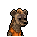

# 酒葫蘆

|品級|分類|體積|最大堆疊|價值|違禁值|
|:--:|:--:|:--:|:--:|:--:|:--:|
|高級|道具|一格|1|150|0|

帶在身上就能產生效果：魅力+1。

> 據說老李家中還有六個一模一樣的葫蘆…

## 送禮

|圖片|姓名|好感|回應|
|:--:|--|:--:|--|
||[水牛．比爾](水牛．比爾.md)|20|哈哈\~你怎麼知道我早就想要這個了？！|
||[北極熊．弗拉基米爾](北極熊．弗拉基米爾.md)|20|（嗅\~嗅）哈\~裡面還殘留著酒香。|
||[海象．溫斯頓](海象．溫斯頓.md)|20|或許借酒消愁會是個不錯的選擇。|
||[大象．金波](大象．金波.md)|15|小子\~你的禮物還算上道。|
||[駱駝．托尼](駱駝．托尼.md)|15|嘿\~這看上去應該能賣個好價錢。|
||[羊駝．迪亞哥](羊駝．迪亞哥.md)|15|嘿\~我有了一個新尿壺！|
||[雄獅．阿歷克斯](雄獅．阿歷克斯.md)|15|菜鳥\~以後給我東西，至少得是這種級別。|
||[老虎．約翰](老虎．約翰.md)|15|提醒你一句，從我這兒可得不到什麼好處…|
||[賽馬．雷伊](賽馬．雷伊.md)|15|嘿\~你就像我肚子裡的小蟲蟲一樣\~了解我\~|
||[斑鬣狗．文森特](斑鬣狗．文森特.md)|15|喲喲\~伙計，我喜歡這個！|
||[鹿豚．理查德](鹿豚．理查德.md)|15|這東西沒準有點用，我收下了。|
||[疣豬．哈庫拉](疣豬．哈庫拉.md)|15|嘿\~不知道用這個喝啤酒是什麼味道\~|
||[象龜．威廉姆](象龜．威廉姆.md)|15|我的孩子…你可真客氣…|
||[考拉．凱文](考拉．凱文.md)|15|嘿\~伙計，你可太夠意思了！|
||[食蟻獸．費爾南多](食蟻獸．費爾南多.md)|15|（嗅\~嗅）酒味裡好像還混雜了些…草藥的味道。|
||[蜜獾．麥克斯](蜜獾．麥克斯.md)|15|呵\~這還有點禮物的樣子。|
||[灰貓．班姆](灰貓．班姆.md)|15|酒精能讓我對靈力的感知更加敏銳…|
||[狐獴．泰迪](狐獴．泰迪.md)|15|（嗅\~嗅）這葫蘆裡有股酒氣，剛剛我還以為這是個尿壺呢？所以聞之前我還做了不少的心理建設…|
||[兔子．懷特](兔子．懷特.md)|15|我習慣在表演之前喝上一杯，再跳上一支踢踏舞。|
||[長頸鹿．吉米](長頸鹿．吉米.md)|10|我說了\~我不喜歡運動…|
||[河馬．弗蘭克](河馬．弗蘭克.md)|10|呵呵呵\~這個還算不錯\~|
||[犀牛．伊萬](犀牛．伊萬.md)|10|嗯\~這東西或許能幫助我鍛煉。|
||[黑熊．亨利](黑熊．亨利.md)|10|給我的嗎？…那我就不客氣了。|
||[驢子．山姆](驢子．山姆.md)|10|這是禮物嗎？…那就謝了\~伙計。|
||[袋鼠．喬瑟夫](袋鼠．喬瑟夫.md)|10|你太客氣了伙計\~|
||[鱷魚．克蘭奇](鱷魚．克蘭奇.md)|10|你想用這個來討好我嗎？|
||[貘．米格爾](貘．米格爾.md)|10|（小聲）來自素材的禮物，有研究的價值…|
||[山魈．拉斐爾](山魈．拉斐爾.md)|10|禮物嗎？換成錢的話，價格應該是…（小聲嘀咕）|
||[猞猁．克里斯](猞猁．克里斯.md)|10|很高興你能送我禮物\~|
||[鬣蜥．皮克曼](鬣蜥．皮克曼.md)|10|嘶\~有趣的禮物\~|
||[水豚．伯納德](水豚．伯納德.md)|10|這只是件單純的禮物嗎？|
||[樹懶．蒂姆](樹懶．蒂姆.md)|10|（打哈欠）…謝謝你的禮物\~|
||[穿山甲．林](穿山甲．林.md)|10|但願你送我禮物不是另有所圖。|
||[臭鼬．沃爾特](臭鼬．沃爾特.md)|10|謝謝你的禮物，我想我會用到它的。|
||[浣熊．面條](浣熊．面條.md)|10|這件禮物就是今天的“賭注”嗎？|
||[負鼠．埃迪](負鼠．埃迪.md)|10|謝了，伙計…|
||[鴨嘴獸．泰瑞](鴨嘴獸．泰瑞.md)|10|這筆投資包你穩賺不賠。|
||[樹蛙．格雷](樹蛙．格雷.md)|10|謝謝你的禮物，伙計…|
||[狐貍．托馬斯](狐貍．托馬斯.md)|-10|（嗅\~嗅）這葫蘆除了酒之外，還裝過什麼別的嗎？|
||[斑馬．富蘭克林](斑馬．富蘭克林.md)|-10|我需要保持清醒，非常清醒。|
||[猩猩．凱撒](猩猩．凱撒.md)|-10|你浪費了一件物品，而我損失了寶貴的時間。|
||[山羊．威爾伯](山羊．威爾伯.md)|-10|噓……|
||[黑豹．鮑勃](黑豹．鮑勃.md)|-10|這東西對我來說可沒用。|
||[環尾狐猴．羅伯特](環尾狐猴．羅伯特.md)|-10|呃…抱歉，我對酒精實在缺乏好感。|
||[馴鹿．魯道夫](馴鹿．魯道夫.md)|-100|我已經戒酒了…|
||[熊貓．老李](熊貓．老李.md)|-100|喂！此乃吾之物，本應物歸原主！|
||[海獺．菲爾](海獺．菲爾.md)|-100|我討厭酒精…我會在這兒都是它害的。|

