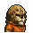

# 薄荷葉

|品級|分類|體積|最大堆疊|價值|違禁值|
|:--:|:--:|:--:|:--:|:--:|:--:|
|初級|藥品、材料|半格|9|20|0|

精力+5，心態+2。\
副作用：健康`-2`

> 提神！醒腦！國字臉！

## 送禮

|圖片|姓名|好感|回應|
|:--:|--|:--:|--|
||[駱駝．托尼](駱駝．托尼.md)|8|謝了朋友\~這下托尼商店又有新貨了！|
||[灰貓．班姆](灰貓．班姆.md)|8|嚼這個能加速我的靈力恢復…雖然我也不明白這是為什麼。|
||[河馬．弗蘭克](河馬．弗蘭克.md)|6|聽說嚼這個會變國字臉？那都是胡扯。|
||[馴鹿．魯道夫](馴鹿．魯道夫.md)|6|據說嚼這個能練出性感的下巴…|
||[袋鼠．喬瑟夫](袋鼠．喬瑟夫.md)|6|呼\~我正需要來點這個。|
||[羊駝．迪亞哥](羊駝．迪亞哥.md)|6|我只是一只愛吃草的羊駝而已…哈！|
||[熊貓．老李](熊貓．老李.md)|6|哈\~好禮相送，汝欲以“禮”服人否？|
||[賽馬．雷伊](賽馬．雷伊.md)|6|嘿\~我喜歡這個\~因為是你送的\~|
||[鹿豚．理查德](鹿豚．理查德.md)|6|嗯\~這沒準能用來治療我的頭疼。|
||[疣豬．哈庫拉](疣豬．哈庫拉.md)|6|嘿\~我正需要這個來打發無聊呢。|
||[象龜．威廉姆](象龜．威廉姆.md)|6|我的孩子…你可真客氣…|
||[樹懶．蒂姆](樹懶．蒂姆.md)|6|謝謝\~我的確需要提提神了…|
||[考拉．凱文](考拉．凱文.md)|6|雖然比不上桉樹葉，但味道也算湊合了\~|
||[蜜獾．麥克斯](蜜獾．麥克斯.md)|6|呼\~不嚼點東西真是渾身難受。|
||[臭鼬．沃爾特](臭鼬．沃爾特.md)|6|這正是我需要的新鮮草藥…|
||[大象．金波](大象．金波.md)|4|算你識相，小子。|
||[長頸鹿．吉米](長頸鹿．吉米.md)|4|哦\~謝謝你的禮物。|
||[水牛．比爾](水牛．比爾.md)|4|喂\~我可沒有回禮給你。|
||[北極熊．弗拉基米爾](北極熊．弗拉基米爾.md)|4|巨魔“冰山”不會拒絕貢品\~|
||[海象．溫斯頓](海象．溫斯頓.md)|4|既然你拿出來了，那我就收下好了…|
||[驢子．山姆](驢子．山姆.md)|4|這是禮物嗎？…那就謝了\~伙計。|
||[鱷魚．克蘭奇](鱷魚．克蘭奇.md)|4|你想用這個來討好我嗎？|
||[雄獅．阿歷克斯](雄獅．阿歷克斯.md)|4|哼\~這就是你的禮物嗎\~菜鳥？|
||[老虎．約翰](老虎．約翰.md)|4|多此一舉……|
||[斑馬．富蘭克林](斑馬．富蘭克林.md)|4|這或許有用\~呃\~也可能沒用…|
||[山羊．威爾伯](山羊．威爾伯.md)|4|你將聽見“它”的謝意…|
||[貘．米格爾](貘．米格爾.md)|4|（小聲）來自素材的禮物，有研究的價值…|
||[黑豹．鮑勃](黑豹．鮑勃.md)|4|給我禮物嗎？…好吧。|
||[斑鬣狗．文森特](斑鬣狗．文森特.md)|4|嘿\~我剛才就預感會有好事發生！|
||[山魈．拉斐爾](山魈．拉斐爾.md)|4|禮物嗎？換成錢的話，價格應該是…（小聲嘀咕）|
||[猞猁．克里斯](猞猁．克里斯.md)|4|很高興你能送我禮物\~|
||[鬣蜥．皮克曼](鬣蜥．皮克曼.md)|4|嘶\~有趣的禮物\~|
||[水豚．伯納德](水豚．伯納德.md)|4|這只是件單純的禮物嗎？|
||[海獺．菲爾](海獺．菲爾.md)|4|禮物\~我就知道今天會有好事。|
||[浣熊．面條](浣熊．面條.md)|4|這件禮物就是今天的“賭注”嗎？|
||[環尾狐猴．羅伯特](環尾狐猴．羅伯特.md)|4|嘿\~謝謝你禮物。|
||[負鼠．埃迪](負鼠．埃迪.md)|4|謝了，伙計…|
||[鴨嘴獸．泰瑞](鴨嘴獸．泰瑞.md)|4|這筆投資包你穩賺不賠。|
||[兔子．懷特](兔子．懷特.md)|4|這真是個不大不小的驚喜。|
||[樹蛙．格雷](樹蛙．格雷.md)|4|謝謝你的禮物，伙計…|
||[狐貍．托馬斯](狐貍．托馬斯.md)|-4|…這可不是什麼好東西。|
||[犀牛．伊萬](犀牛．伊萬.md)|-4|這東西對我的肌肉可沒好處。|
||[黑熊．亨利](黑熊．亨利.md)|-4|我可不能拿這個當飯吃…|
||[猩猩．凱撒](猩猩．凱撒.md)|-4|你浪費了一件物品，而我損失了寶貴的時間。|
||[食蟻獸．費爾南多](食蟻獸．費爾南多.md)|-4|你看不出來嗎？我的嘴巴可沒法吃這個。|
||[穿山甲．林](穿山甲．林.md)|-4|你知道嗎？有一味藥就是拿這個和我的鱗片燉湯喝，真他媽可笑！|
||[狐獴．泰迪](狐獴．泰迪.md)|-4|我想我暫時不需要提神了，你覺得呢？說實話我很懷念打呵欠的感覺…|

