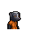

# 紫鳶花

|品級|分類|體積|最大堆疊|價值|違禁值|
|:--:|:--:|:--:|:--:|:--:|:--:|
|初級|藥品、材料|半格|9|15|0|

專注+1。\
副作用：健康`-2`

> 警告！花粉過敏者請勿食用。

## 送禮

|圖片|姓名|好感|回應|
|:--:|--|:--:|--|
||[賽馬．雷伊](賽馬．雷伊.md)|8|嘿\~你這是要和我表白嗎？帥哥\~|
||[驢子．山姆](驢子．山姆.md)|6|喂\~這花可真香，我可以夾在給妮可的信裡…|
||[貘．米格爾](貘．米格爾.md)|6|你知道我需要什麼？看來你對心理學也有所研究…素材002號。|
||[猞猁．克里斯](猞猁．克里斯.md)|6|多美的花呀\~就和你我一樣。|
||[臭鼬．沃爾特](臭鼬．沃爾特.md)|6|這正是我需要的新鮮草藥…|
||[狐獴．泰迪](狐獴．泰迪.md)|6|嘿\~這個花的香氣能讓我平靜下來…|
||[狐貍．托馬斯](狐貍．托馬斯.md)|4|這是給我的嗎？…謝了。|
||[駱駝．托尼](駱駝．托尼.md)|4|謝謝你的禮物，我的朋友\~|
||[馴鹿．魯道夫](馴鹿．魯道夫.md)|4|謝謝你的禮物\~|
||[羊駝．迪亞哥](羊駝．迪亞哥.md)|4|嘿嘿\~又有好東西了…|
||[熊貓．老李](熊貓．老李.md)|4|嚯嚯\~禮輕情意重\~|
||[斑馬．富蘭克林](斑馬．富蘭克林.md)|4|這或許有用\~呃\~也可能沒用…|
||[山羊．威爾伯](山羊．威爾伯.md)|4|你將聽見“它”的謝意…|
||[黑豹．鮑勃](黑豹．鮑勃.md)|4|給我禮物嗎？…好吧。|
||[象龜．威廉姆](象龜．威廉姆.md)|4|謝謝你…年輕人…|
||[樹懶．蒂姆](樹懶．蒂姆.md)|4|（打哈欠）…謝謝你的禮物\~|
||[考拉．凱文](考拉．凱文.md)|4|謝了\~這應該能值點錢…|
||[海獺．菲爾](海獺．菲爾.md)|4|禮物\~我就知道今天會有好事。|
||[灰貓．班姆](灰貓．班姆.md)|4|物品上也會殘留稀薄的靈力。|
||[浣熊．面條](浣熊．面條.md)|4|這件禮物就是今天的“賭注”嗎？|
||[環尾狐猴．羅伯特](環尾狐猴．羅伯特.md)|4|嘿\~謝謝你禮物。|
||[鴨嘴獸．泰瑞](鴨嘴獸．泰瑞.md)|4|這筆投資包你穩賺不賠。|
||[兔子．懷特](兔子．懷特.md)|4|這真是個不大不小的驚喜。|
||[樹蛙．格雷](樹蛙．格雷.md)|4|謝謝你的禮物，伙計…|
||[長頸鹿．吉米](長頸鹿．吉米.md)|-4|你東西上面有股怪味…|
||[北極熊．弗拉基米爾](北極熊．弗拉基米爾.md)|-4|“冰山”不喜歡花，我也不喜歡…|
||[黑熊．亨利](黑熊．亨利.md)|-4|……你在想什麼？|
||[海象．溫斯頓](海象．溫斯頓.md)|-4|我對花可沒興趣\~上面全是泥巴的臭味。|
||[袋鼠．喬瑟夫](袋鼠．喬瑟夫.md)|-4|呵\~奇怪的禮物…|
||[老虎．約翰](老虎．約翰.md)|-4|我不需要這個，別來煩我了。|
||[猩猩．凱撒](猩猩．凱撒.md)|-4|無論你想表達什麼，都不是明智的選擇。|
||[斑鬣狗．文森特](斑鬣狗．文森特.md)|-4|嘖\~別給我這麼無趣的東西好嗎？|
||[鹿豚．理查德](鹿豚．理查德.md)|-4|你知道給一頭鹿豚送花代表什麼嗎？呵\~我想你不知道。|
||[山魈．拉斐爾](山魈．拉斐爾.md)|-4|給你個忠告：有時胡亂送禮，可是會適得其反的。|
||[鬣蜥．皮克曼](鬣蜥．皮克曼.md)|-4|嘶\~花？多麼庸俗又無趣的主題。|
||[水豚．伯納德](水豚．伯納德.md)|-4|你知道讓別的家伙看見會傳什麼閒話嗎？|
||[食蟻獸．費爾南多](食蟻獸．費爾南多.md)|-4|花…？我想你選錯了送禮的對象。|
||[穿山甲．林](穿山甲．林.md)|-4|喂！在這裡只有軟蛋才會喜歡花！|
||[負鼠．埃迪](負鼠．埃迪.md)|-4|…我現在沒心情和你開玩笑。|
||[大象．金波](大象．金波.md)|-40|花…？你想我在手下面前丟臉嗎？！|
||[河馬．弗蘭克](河馬．弗蘭克.md)|-40|喂\~！你在想什麼？我對你可沒興趣！|
||[犀牛．伊萬](犀牛．伊萬.md)|-40|喂！你覺得我會是喜歡這個的“娘娘腔”嗎？|
||[水牛．比爾](水牛．比爾.md)|-40|花…？你是在挑釁我嗎？！|
||[鱷魚．克蘭奇](鱷魚．克蘭奇.md)|-40|你是在挑釁我嗎？！|
||[雄獅．阿歷克斯](雄獅．阿歷克斯.md)|-40|喂！你腦子裡到底在想什麼？|
||[疣豬．哈庫拉](疣豬．哈庫拉.md)|-40|啊\~啊嚏！真該死\~我對花\~花粉過敏\~！|
||[蜜獾．麥克斯](蜜獾．麥克斯.md)|-40|你是在挑釁我嗎？混蛋！|

