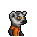

# 啤酒

|品級|分類|體積|最大堆疊|價值|違禁值|
|:--:|:--:|:--:|:--:|:--:|:--:|
|中級|食物、酒精|一格|3|50|1|

心態+10。\
攝入酒精：3~6

> 生活是苦澀，希望是泡沫…

## 送禮

|圖片|姓名|好感|回應|
|:--:|--|:--:|--|
||[大象．金波](大象．金波.md)|12|哈\~你小子這回算是挑對禮物了！|
||[水牛．比爾](水牛．比爾.md)|12|哈\~有了這個\~今晚又能睡個好覺了！|
||[疣豬．哈庫拉](疣豬．哈庫拉.md)|12|啤酒這玩意兒\~喝再多都不覺得夠啊！|
||[考拉．凱文](考拉．凱文.md)|12|哈！我正需要這個來忘記煩心事呢。|
||[長頸鹿．吉米](長頸鹿．吉米.md)|9|嘿\~你的禮物就像指針一般精確。|
||[駱駝．托尼](駱駝．托尼.md)|9|嘿\~這可是緊俏商品\~|
||[北極熊．弗拉基米爾](北極熊．弗拉基米爾.md)|9|雖然度數不夠，但至少味道還不錯\~|
||[海象．溫斯頓](海象．溫斯頓.md)|9|這可不夠給勁，就當解渴好了…|
||[驢子．山姆](驢子．山姆.md)|9|嘿\~真希望每天都能收到這種禮物。|
||[羊駝．迪亞哥](羊駝．迪亞哥.md)|9|嘿\~看來我得準備點下酒菜了。|
||[鱷魚．克蘭奇](鱷魚．克蘭奇.md)|9|誇獎你一下\~這東西還算不錯。|
||[雄獅．阿歷克斯](雄獅．阿歷克斯.md)|9|菜鳥\~以後給我東西，至少得是這種級別。|
||[老虎．約翰](老虎．約翰.md)|9|提醒你一句，從我這兒可得不到什麼好處…|
||[熊貓．老李](熊貓．老李.md)|9|哈\~好禮相送，汝欲以“禮”服人否？|
||[賽馬．雷伊](賽馬．雷伊.md)|9|嘿\~你是想玩酒後吐真言的遊戲嗎\~|
||[斑鬣狗．文森特](斑鬣狗．文森特.md)|9|喲喲\~伙計，我喜歡這個！|
||[鹿豚．理查德](鹿豚．理查德.md)|9|嗯\~這沒準能用來治療我的頭疼。|
||[水豚．伯納德](水豚．伯納德.md)|9|一罐啤酒\~或許能讓我忘掉一些煩惱\~|
||[象龜．威廉姆](象龜．威廉姆.md)|9|我的孩子…你可真客氣…|
||[食蟻獸．費爾南多](食蟻獸．費爾南多.md)|9|傷口無論在身上還是心裡…都能用酒精來消毒。|
||[蜜獾．麥克斯](蜜獾．麥克斯.md)|9|呵\~這還有點禮物的樣子。|
||[灰貓．班姆](灰貓．班姆.md)|9|酒精能讓我對靈力的感知更加敏銳…|
||[狐獴．泰迪](狐獴．泰迪.md)|9|我曾經試過將自己灌醉來使自己安靜下來，但糟糕的是…我的酒量居然出奇的好！|
||[兔子．懷特](兔子．懷特.md)|9|我習慣在表演之前喝上一杯，再跳上一支踢踏舞。|
||[河馬．弗蘭克](河馬．弗蘭克.md)|6|呵呵呵\~這個還算不錯\~|
||[犀牛．伊萬](犀牛．伊萬.md)|6|嗯\~這東西或許能幫助我鍛煉。|
||[黑熊．亨利](黑熊．亨利.md)|6|這能讓我的心情好起來…|
||[袋鼠．喬瑟夫](袋鼠．喬瑟夫.md)|6|你太客氣了伙計\~|
||[貘．米格爾](貘．米格爾.md)|6|（小聲）來自素材的禮物，有研究的價值…|
||[山魈．拉斐爾](山魈．拉斐爾.md)|6|禮物嗎？換成錢的話，價格應該是…（小聲嘀咕）|
||[猞猁．克里斯](猞猁．克里斯.md)|6|很高興你能送我禮物\~|
||[鬣蜥．皮克曼](鬣蜥．皮克曼.md)|6|嘶\~有趣的禮物\~|
||[樹懶．蒂姆](樹懶．蒂姆.md)|6|（打哈欠）…謝謝你的禮物\~|
||[穿山甲．林](穿山甲．林.md)|6|但願你送我禮物不是另有所圖。|
||[臭鼬．沃爾特](臭鼬．沃爾特.md)|6|謝謝你的禮物，我想我會用到它的。|
||[浣熊．面條](浣熊．面條.md)|6|這件禮物就是今天的“賭注”嗎？|
||[負鼠．埃迪](負鼠．埃迪.md)|6|謝了，伙計…|
||[鴨嘴獸．泰瑞](鴨嘴獸．泰瑞.md)|6|這筆投資包你穩賺不賠。|
||[樹蛙．格雷](樹蛙．格雷.md)|6|謝謝你的禮物，伙計…|
||[狐貍．托馬斯](狐貍．托馬斯.md)|-6|酒喝多了，容易誤事…|
||[斑馬．富蘭克林](斑馬．富蘭克林.md)|-6|我需要保持清醒，非常清醒。|
||[猩猩．凱撒](猩猩．凱撒.md)|-6|你浪費了一件物品，而我損失了寶貴的時間。|
||[山羊．威爾伯](山羊．威爾伯.md)|-6|噓……|
||[黑豹．鮑勃](黑豹．鮑勃.md)|-6|我對喝酒沒什麼興趣。|
||[環尾狐猴．羅伯特](環尾狐猴．羅伯特.md)|-6|呃…抱歉，我對酒精實在缺乏好感。|
||[馴鹿．魯道夫](馴鹿．魯道夫.md)|-60|我已經戒酒了…|
||[海獺．菲爾](海獺．菲爾.md)|-60|我討厭酒精…我會在這兒都是它害的。|

