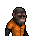

# 茶包

|品級|分類|體積|最大堆疊|價值|違禁值|
|:--:|:--:|:--:|:--:|:--:|:--:|
|中級|道具、食物|半格|9|30|0|

智力+1，持續2小時。\
使用限制：需要用熱水沖泡

> 在這裡，多數的茶包都是用襪子做的…

## 送禮

|圖片|姓名|好感|回應|
|:--:|--|:--:|--|
||[海象．溫斯頓](海象．溫斯頓.md)|8|我的確需要平靜下來…|
||[熊貓．老李](熊貓．老李.md)|8|身陷囹圄，心如閒云\~|
||[山魈．拉斐爾](山魈．拉斐爾.md)|8|恭喜你選對了禮物，沒眼光的家伙可掙不到錢。|
||[樹懶．蒂姆](樹懶．蒂姆.md)|8|（打哈欠）對我來說這比咖啡…還要提神。|
||[穿山甲．林](穿山甲．林.md)|8|茶葉的味道總能讓我放鬆下來…|
||[狐貍．托馬斯](狐貍．托馬斯.md)|6|嘿\~我想我正需要這個。|
||[斑馬．富蘭克林](斑馬．富蘭克林.md)|6|睡眠\~是對我天賦的一種浪費\~|
||[猩猩．凱撒](猩猩．凱撒.md)|6|你知道我要什麼，這很值得誇獎。|
||[猞猁．克里斯](猞猁．克里斯.md)|6|這是我想要的，咱倆果然\~合得來。|
||[象龜．威廉姆](象龜．威廉姆.md)|6|我的孩子…你可真客氣…|
||[食蟻獸．費爾南多](食蟻獸．費爾南多.md)|6|嗯\~我的確需要提提神了。|
||[臭鼬．沃爾特](臭鼬．沃爾特.md)|6|我或許可以在新藥裡加上一點…茶葉？|
||[鴨嘴獸．泰瑞](鴨嘴獸．泰瑞.md)|6|沒什麼能比一杯茶更能讓我心情放鬆了。|
||[樹蛙．格雷](樹蛙．格雷.md)|6|（兩棲語）呱……呱\~呱。|
||[長頸鹿．吉米](長頸鹿．吉米.md)|4|出老千的家伙都該下九層地獄！|
||[河馬．弗蘭克](河馬．弗蘭克.md)|4|呵呵呵\~這個還算不錯\~|
||[犀牛．伊萬](犀牛．伊萬.md)|4|嗯\~這東西或許能幫助我鍛煉。|
||[駱駝．托尼](駱駝．托尼.md)|4|謝謝你的禮物，我的朋友\~|
||[北極熊．弗拉基米爾](北極熊．弗拉基米爾.md)|4|巨魔“冰山”不會拒絕貢品\~|
||[黑熊．亨利](黑熊．亨利.md)|4|給我的嗎？…那我就不客氣了。|
||[驢子．山姆](驢子．山姆.md)|4|這是禮物嗎？…那就謝了\~伙計。|
||[馴鹿．魯道夫](馴鹿．魯道夫.md)|4|謝謝你的禮物\~|
||[袋鼠．喬瑟夫](袋鼠．喬瑟夫.md)|4|你太客氣了伙計\~|
||[雄獅．阿歷克斯](雄獅．阿歷克斯.md)|4|哼\~這就是你的禮物嗎\~菜鳥？|
||[老虎．約翰](老虎．約翰.md)|4|多此一舉……|
||[賽馬．雷伊](賽馬．雷伊.md)|4|嘿\~我就知道你對我有意思\~|
||[貘．米格爾](貘．米格爾.md)|4|（小聲）來自素材的禮物，有研究的價值…|
||[黑豹．鮑勃](黑豹．鮑勃.md)|4|給我禮物嗎？…好吧。|
||[鹿豚．理查德](鹿豚．理查德.md)|4|這是給我的嗎，小子？|
||[鬣蜥．皮克曼](鬣蜥．皮克曼.md)|4|嘶\~有趣的禮物\~|
||[水豚．伯納德](水豚．伯納德.md)|4|這只是件單純的禮物嗎？|
||[考拉．凱文](考拉．凱文.md)|4|謝了\~這應該能值點錢…|
||[海獺．菲爾](海獺．菲爾.md)|4|禮物\~我就知道今天會有好事。|
||[蜜獾．麥克斯](蜜獾．麥克斯.md)|4|喂\~你打算用這個跟我套近乎嗎？|
||[灰貓．班姆](灰貓．班姆.md)|4|物品上也會殘留稀薄的靈力。|
||[浣熊．面條](浣熊．面條.md)|4|這件禮物就是今天的“賭注”嗎？|
||[環尾狐猴．羅伯特](環尾狐猴．羅伯特.md)|4|嘿\~謝謝你禮物。|
||[兔子．懷特](兔子．懷特.md)|4|這真是個不大不小的驚喜。|
||[大象．金波](大象．金波.md)|-4|我不喜歡苦的東西，我已經吃了夠多苦了，你明白嗎？|
||[水牛．比爾](水牛．比爾.md)|-4|喂\~真的有家伙會喜歡這玩意兒的味道嗎？|
||[鱷魚．克蘭奇](鱷魚．克蘭奇.md)|-4|呸\~我不喜歡這東西的味道。|
||[山羊．威爾伯](山羊．威爾伯.md)|-4|噓……|
||[疣豬．哈庫拉](疣豬．哈庫拉.md)|-4|唉\~這日子已經夠沒滋味了…你還要我喝這個？|
||[狐獴．泰迪](狐獴．泰迪.md)|-4|我想我暫時不需要提神了，你覺得呢？說實話我很懷念打呵欠的感覺…|
||[負鼠．埃迪](負鼠．埃迪.md)|-4|哎\~我的生活已經夠苦的了…|
||[羊駝．迪亞哥](羊駝．迪亞哥.md)|-40|嘔\~我討厭茶葉的味道…|
||[斑鬣狗．文森特](斑鬣狗．文森特.md)|-40|喂\~我看著像一邊喝茶一邊看書的呆子嗎？！|

