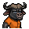
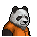

# 肥皂

|品級|分類|體積|最大堆疊|價值|違禁值|
|:--:|:--:|:--:|:--:|:--:|:--:|
|初級|道具、材料|半格|1|30|0|

洗澡時使用：健康+5。

> 這可得小心拿好，掉在地上就糟了…

## 送禮

|圖片|姓名|好感|回應|
|:--:|--|:--:|--|
||[海獺．菲爾](海獺．菲爾.md)|8|你聽過肥皂泡占卜嗎？我最近正在研究這個…|
||[鴨嘴獸．泰瑞](鴨嘴獸．泰瑞.md)|8|股市不要泡沫，但是洗澡需要。|
||[樹蛙．格雷](樹蛙．格雷.md)|8|再不用肥皂洗澡的話，我的背後都要長出蒜頭來了…|
||[河馬．弗蘭克](河馬．弗蘭克.md)|6|缺了這個，我的日子可過不下去。|
||[水牛．比爾](水牛．比爾.md)|6|誰能霸占浴室，誰才是真正的強者，你明白嗎？|
||[北極熊．弗拉基米爾](北極熊．弗拉基米爾.md)|6|“冰山”之上可不能殘留污垢。|
||[海象．溫斯頓](海象．溫斯頓.md)|6|哎\~如果這是香皂的話就更好了…|
||[鱷魚．克蘭奇](鱷魚．克蘭奇.md)|6|誇獎你一下\~這東西還算不錯。|
||[賽馬．雷伊](賽馬．雷伊.md)|6|嘿\~你這也太直接了\~|
||[貘．米格爾](貘．米格爾.md)|6|你知道我需要什麼？看來你對心理學也有所研究…素材002號。|
||[鹿豚．理查德](鹿豚．理查德.md)|6|嗯…是該洗洗了。|
||[猞猁．克里斯](猞猁．克里斯.md)|6|這是我想要的，咱倆果然\~合得來。|
||[水豚．伯納德](水豚．伯納德.md)|6|我是得在洗澡的時候帶上一塊備用肥皂。|
||[象龜．威廉姆](象龜．威廉姆.md)|6|我正需要用它…洗掉殼子上的…苔蘚。|
||[臭鼬．沃爾特](臭鼬．沃爾特.md)|6|但願這能遮住一點臭味…|
||[環尾狐猴．羅伯特](環尾狐猴．羅伯特.md)|6|和你說個秘密，我總能在洗澡時靈光乍現。|
||[狐貍．托馬斯](狐貍．托馬斯.md)|4|這是給我的嗎？…謝了。|
||[大象．金波](大象．金波.md)|4|算你識相，小子。|
||[長頸鹿．吉米](長頸鹿．吉米.md)|4|哦\~謝謝你的禮物。|
||[犀牛．伊萬](犀牛．伊萬.md)|4|嗯\~這東西或許能幫助我鍛煉。|
||[黑熊．亨利](黑熊．亨利.md)|4|給我的嗎？這要是吃的就好了…|
||[驢子．山姆](驢子．山姆.md)|4|這是禮物嗎？…那就謝了\~伙計。|
||[馴鹿．魯道夫](馴鹿．魯道夫.md)|4|謝謝你的禮物\~|
||[袋鼠．喬瑟夫](袋鼠．喬瑟夫.md)|4|你太客氣了伙計\~|
||[羊駝．迪亞哥](羊駝．迪亞哥.md)|4|嘿嘿\~又有好東西了…|
||[熊貓．老李](熊貓．老李.md)|4|嚯嚯\~禮輕情意重\~|
||[斑馬．富蘭克林](斑馬．富蘭克林.md)|4|這或許有用\~呃\~也可能沒用…|
||[猩猩．凱撒](猩猩．凱撒.md)|4|嗯\~一件禮物嗎？|
||[黑豹．鮑勃](黑豹．鮑勃.md)|4|給我禮物嗎？…好吧。|
||[山魈．拉斐爾](山魈．拉斐爾.md)|4|禮物嗎？換成錢的話，價格應該是…（小聲嘀咕）|
||[考拉．凱文](考拉．凱文.md)|4|謝了\~這應該能值點錢…|
||[食蟻獸．費爾南多](食蟻獸．費爾南多.md)|4|咱們囚犯之間就該互相幫助\~不是嗎？|
||[狐獴．泰迪](狐獴．泰迪.md)|4|嘿！禮物\~這是一件禮物！哦\~我想它就是咱們友誼的象徵對嗎？|
||[浣熊．面條](浣熊．面條.md)|4|這件禮物就是今天的“賭注”嗎？|
||[兔子．懷特](兔子．懷特.md)|4|這真是個不大不小的驚喜。|
||[駱駝．托尼](駱駝．托尼.md)|-4|呃\~這東西可不值錢…|
||[雄獅．阿歷克斯](雄獅．阿歷克斯.md)|-4|喂\~這種破爛以後別再拿來了！|
||[老虎．約翰](老虎．約翰.md)|-4|我不需要這個，別來煩我了。|
||[山羊．威爾伯](山羊．威爾伯.md)|-4|噓……|
||[斑鬣狗．文森特](斑鬣狗．文森特.md)|-4|我可不用這個，真男人就該臭一點！|
||[疣豬．哈庫拉](疣豬．哈庫拉.md)|-4|哼\~我可不用這個\~身上沒有泥巴我會失眠的！|
||[鬣蜥．皮克曼](鬣蜥．皮克曼.md)|-4|嘶\~我對這個不感興趣。|
||[樹懶．蒂姆](樹懶．蒂姆.md)|-4|我的毛上生有綠藻…我可不想洗掉它們。|
||[穿山甲．林](穿山甲．林.md)|-4|只要你不帶肥皂…就沒有丟肥皂的風險。|
||[蜜獾．麥克斯](蜜獾．麥克斯.md)|-4|就這…？這也能叫禮物？|
||[灰貓．班姆](灰貓．班姆.md)|-4|我們正在面臨危機！拜托\~拿點有用的東西來吧。|
||[負鼠．埃迪](負鼠．埃迪.md)|-4|把自己洗的這麼干凈有什麼用？還怕那家伙看不上我嗎？！|

