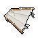

# 滑翔服尾翼

|品級|分類|體積|最大堆疊|價值|違禁值|
|:--:|:--:|:--:|:--:|:--:|:--:|
|高級|道具|一格|1|120|10|

|製作材料|製作時間|花費精力|
|:--:|:--:|:--:|
|[折斷的木條](159-折斷的木條.md)\*2 / [床單](83-床單.md)\*1 / [鞋帶](124-鞋帶.md)\*2|60|15|

滑翔服的第三部分。

> 完整的滑翔服擁有：左翼,右翼,尾翼。
