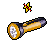

# 動物迷城資料集

## 囚犯

||||||
|:--:|:--:|:--:|:--:|:--:|
|  |  |  |  |  |
| [狐貍．托馬斯](狐貍．托馬斯.md) | [大象．金波](大象．金波.md) | [長頸鹿．吉米](長頸鹿．吉米.md) | [河馬．弗蘭克](河馬．弗蘭克.md) | [犀牛．伊萬](犀牛．伊萬.md) |
|  |  |  |  |  |
| [水牛．比爾](水牛．比爾.md) | [駱駝．托尼](駱駝．托尼.md) | [北極熊．弗拉基米爾](北極熊．弗拉基米爾.md) | [黑熊．亨利](黑熊．亨利.md) | [海象．溫斯頓](海象．溫斯頓.md) |
|  |  |  |  |  |
| [驢子．山姆](驢子．山姆.md) | [馴鹿．魯道夫](馴鹿．魯道夫.md) | [袋鼠．喬瑟夫](袋鼠．喬瑟夫.md) | [羊駝．迪亞哥](羊駝．迪亞哥.md) | [高地牛．摩根](高地牛．摩根.md) |
|  |  |  |  |  |
| [鱷魚．克蘭奇](鱷魚．克蘭奇.md) | [雄獅．阿歷克斯](雄獅．阿歷克斯.md) | [老虎．約翰](老虎．約翰.md) | [熊貓．老李](熊貓．老李.md) | [斑馬．富蘭克林](斑馬．富蘭克林.md) |
|  |  |  |  |  |
| [賽馬．雷伊](賽馬．雷伊.md) | [猩猩．凱撒](猩猩．凱撒.md) | [山羊．威爾伯](山羊．威爾伯.md) | [貘．米格爾](貘．米格爾.md) | [黑豹．鮑勃](黑豹．鮑勃.md) |
|  |  |  |  |  |
| [灰狼．芬里爾](灰狼．芬里爾.md) | [斑鬣狗．文森特](斑鬣狗．文森特.md) | [鹿豚．理查德](鹿豚．理查德.md) | [疣豬．哈庫拉](疣豬．哈庫拉.md) | [山魈．拉斐爾](山魈．拉斐爾.md) |
|  |  |  |  |  |
| [猞猁．克里斯](猞猁．克里斯.md) | [鬣蜥．皮克曼](鬣蜥．皮克曼.md) | [水豚．伯納德](水豚．伯納德.md) | [象龜．威廉姆](象龜．威廉姆.md) | [樹懶．蒂姆](樹懶．蒂姆.md) |
|  |  |  |  |  |
| [考拉．凱文](考拉．凱文.md) | [食蟻獸．費爾南多](食蟻獸．費爾南多.md) | [穿山甲．林](穿山甲．林.md) | [海獺．菲爾](海獺．菲爾.md) | [蜜獾．麥克斯](蜜獾．麥克斯.md) |
|  |  |  |  |  |
| [臭鼬．沃爾特](臭鼬．沃爾特.md) | [灰貓．班姆](灰貓．班姆.md) | [狐獴．泰迪](狐獴．泰迪.md) | [浣熊．面條](浣熊．面條.md) | [環尾狐猴．羅伯特](環尾狐猴．羅伯特.md) |
|  |  |  |  |  |
| [負鼠．埃迪](負鼠．埃迪.md) | [鴨嘴獸．泰瑞](鴨嘴獸．泰瑞.md) | [兔子．懷特](兔子．懷特.md) | [樹蛙．格雷](樹蛙．格雷.md) | [恐龍．雷克斯](恐龍．雷克斯.md) |
|  |  |  |  |  |
| [未完成．角色](未完成．角色.md) |  |  |  |  |

## 物品

||||||
|:--:|:--:|:--:|:--:|:--:|
|  |  |  |  |  |
| [布條](道具.md#布條) | [運動鞋](道具.md#運動鞋) | [皮鞋](道具.md#皮鞋) | [帆布鞋](道具.md#帆布鞋) | [拖鞋](道具.md#拖鞋) |
|  |  |  |  |  |
| [墨鏡](道具.md#墨鏡) | [眼鏡](道具.md#眼鏡) | [頭帶](道具.md#頭帶) | [棒球帽](道具.md#棒球帽) | [毛線帽](道具.md#毛線帽) |
|  |  |  |  |  |
| [橡膠手套](道具.md#橡膠手套) | [黑手](道具.md#黑手) | [手錶](道具.md#手錶) | [護身符](道具.md#護身符) | [牙齒項鏈](道具.md#牙齒項鏈) |
|  |  |  |  |  |
| [《死靈之書》](道具.md#《死靈之書》) | [開鎖器](道具.md#開鎖器) | [開鎖器(P)](道具.md#開鎖器(P)) | [自制口罩](道具.md#自制口罩) | [警用防毒面具](道具.md#警用防毒面具) |
|  |  |  |  |  |
| [隨身聽（開機）](道具.md#隨身聽（開機）) | [隨身聽（關機）](道具.md#隨身聽（關機）) | [隨身聽（沒電）](道具.md#隨身聽（沒電）) | [酒葫蘆](道具.md#酒葫蘆) | [黑桃A](道具.md#黑桃A) |
|  |  |  |  |  |
| [薄荷葉](道具.md#薄荷葉) | [薄荷葉卷](道具.md#薄荷葉卷) | [蘑菇](道具.md#蘑菇) | [蘑菇粉](道具.md#蘑菇粉) | [瀉藥](道具.md#瀉藥) |
|  |  |  |  |  |
| [紫鳶花](道具.md#紫鳶花) | [花瓣粉](道具.md#花瓣粉) | [安眠藥](道具.md#安眠藥) | [安眠曲奇](道具.md#安眠曲奇) | [止疼片](道具.md#止疼片) |
|  |  |  |  |  |
| [興奮劑](道具.md#興奮劑) | [醫用酒精](道具.md#醫用酒精) | [鎮靜劑](道具.md#鎮靜劑) | [啤酒](道具.md#啤酒) | [蘋果酒](道具.md#蘋果酒) |
|  |  |  |  |  |
| [精釀蘋果酒](道具.md#精釀蘋果酒) | [蘋果](道具.md#蘋果) | [華夫餅](道具.md#華夫餅) | [奶油華夫餅](道具.md#奶油華夫餅) | [一把咖啡豆](道具.md#一把咖啡豆) |
|  |  |  |  |  |
| [口香糖](道具.md#口香糖) | [曲奇餅乾](道具.md#曲奇餅乾) | [焦糖棒](道具.md#焦糖棒) | [汽水](道具.md#汽水) | [酸奶](道具.md#酸奶) |
|  |  |  |  |  |
| [土豆披薩](道具.md#土豆披薩) | [咖啡粉](道具.md#咖啡粉) | [茶包](道具.md#茶包) | [超辣泡麵](道具.md#超辣泡麵) | [蛋白粉](道具.md#蛋白粉) |
|  |  |  |  |  |
| [紙鶴](道具.md#紙鶴) | [枕頭](道具.md#枕頭) | [毯子](道具.md#毯子) | [假人](道具.md#假人) | [床單](道具.md#床單) |
|  |  |  |  |  |
| [繩索](道具.md#繩索) | [迴紋針](道具.md#迴紋針) | [酒精燈](道具.md#酒精燈) | [肥皂](道具.md#肥皂) | [香皂](道具.md#香皂) |
|  |  |  |  |  |
| [鑰匙模具（洗衣房）](道具.md#鑰匙模具（洗衣房）) | [塑料鑰匙（洗衣房）](道具.md#塑料鑰匙（洗衣房）) | [鑰匙模具（裝備庫）](道具.md#鑰匙模具（裝備庫）) | [塑料鑰匙（裝備庫）](道具.md#塑料鑰匙（裝備庫）) | [鑰匙模具（藥房）](道具.md#鑰匙模具（藥房）) |
|  |  |  |  |  |
| [塑料鑰匙（藥房）](道具.md#塑料鑰匙（藥房）) | [腐蝕溶液](道具.md#腐蝕溶液) | [滑翔服左翼](道具.md#滑翔服左翼) | [滑翔服右翼](道具.md#滑翔服右翼) | [滑翔服尾翼](道具.md#滑翔服尾翼) |
|  |  |  |  |  |
| [肥皂槍](道具.md#肥皂槍) | [計算機](道具.md#計算機) | [《花花世界》（全新）](道具.md#《花花世界》（全新）) | [《花花世界》（看過）](道具.md#《花花世界》（看過）) | [《花花世界》（翻爛）](道具.md#《花花世界》（翻爛）) |
|  |  |  |  |  |
| [馬女郎海報](道具.md#馬女郎海報) | [貓女郎海報](道具.md#貓女郎海報) | [狐女郎海報](道具.md#狐女郎海報) | [兔女郎海報](道具.md#兔女郎海報) | [咖啡磨](道具.md#咖啡磨) |
|  |  |  |  |  |
| [掌上遊戲機](道具.md#掌上遊戲機) | [掌上遊戲機（沒電）](道具.md#掌上遊戲機（沒電）) | [手電筒](道具.md#手電筒) | [手電筒（沒電）](道具.md#手電筒（沒電）) | [電池](道具.md#電池) |
|  |  |  |  |  |
| [牙刷](道具.md#牙刷) | [牙膏](道具.md#牙膏) | [空的牙膏管](道具.md#空的牙膏管) | [消毒液](道具.md#消毒液) | [除銹劑](道具.md#除銹劑) |
|  |  |  |  |  |
| [火柴](道具.md#火柴) | [膠帶](道具.md#膠帶) | [顏料](道具.md#顏料) | [釘子](道具.md#釘子) | [鞋帶](道具.md#鞋帶) |
|  |  |  |  |  |
| [白紙](道具.md#白紙) | [花束](道具.md#花束) | [紅頭巾](道具.md#紅頭巾) | [綠頭巾](道具.md#綠頭巾) | [胡亂的涂鴉](道具.md#胡亂的涂鴉) |
|  |  |  |  |  |
| [簡單的漫畫](道具.md#簡單的漫畫) | [精美的畫作](道具.md#精美的畫作) | [鉛筆](道具.md#鉛筆) | [鉛筆](道具.md#鉛筆) | [圓珠筆](道具.md#圓珠筆) |
|  |  |  |  |  |
| [圓珠筆](道具.md#圓珠筆) | [硬幣](道具.md#硬幣) | [長螺絲](道具.md#長螺絲) | [簡易螺絲刀](道具.md#簡易螺絲刀) | [簡易螺絲刀(P)](道具.md#簡易螺絲刀(P)) |
|  |  |  |  |  |
| [簡易螺絲刀(+)](道具.md#簡易螺絲刀(+)) | [簡易螺絲刀(P+)](道具.md#簡易螺絲刀(P+)) | [高效螺絲鉆](道具.md#高效螺絲鉆) | [高效螺絲鉆(P)](道具.md#高效螺絲鉆(P)) | [扳手](道具.md#扳手) |
|  |  |  |  |  |
| [湯匙](道具.md#湯匙) | [湯匙](道具.md#湯匙) | [簡易鶴嘴鋤](道具.md#簡易鶴嘴鋤) | [簡易鶴嘴鋤(P)](道具.md#簡易鶴嘴鋤(P)) | [簡易鶴嘴鋤(+)](道具.md#簡易鶴嘴鋤(+)) |
|  |  |  |  |  |
| [簡易鶴嘴鋤(P+)](道具.md#簡易鶴嘴鋤(P+)) | [加固鶴嘴鋤](道具.md#加固鶴嘴鋤) | [加固鶴嘴鋤(P)](道具.md#加固鶴嘴鋤(P)) | [加固鶴嘴鋤(+)](道具.md#加固鶴嘴鋤(+)) | [加固鶴嘴鋤(P+)](道具.md#加固鶴嘴鋤(P+)) |
|  |  |  |  |  |
| [釘錘](道具.md#釘錘) | [剪刀](道具.md#剪刀) | [碎玻璃](道具.md#碎玻璃) | [玻璃匕首](道具.md#玻璃匕首) | [玻璃匕首(+)](道具.md#玻璃匕首(+)) |
|  |  |  |  |  |
| [牙刷匕首](道具.md#牙刷匕首) | [牙刷匕首(+)](道具.md#牙刷匕首(+)) | [水果刀](道具.md#水果刀) | [折斷的木條](道具.md#折斷的木條) | [雙節棍](道具.md#雙節棍) |
|  |  |  |  |  |
| [雙節棍(+)](道具.md#雙節棍(+)) | [釘棒](道具.md#釘棒) | [釘棒(+)](道具.md#釘棒(+)) | [鐵管](道具.md#鐵管) | [警棍](道具.md#警棍) |
|  |  |  |  |  |
| [皮帶](道具.md#皮帶) | [皮帶](道具.md#皮帶) | [烤麵包](道具.md#烤麵包) | [南瓜粥](道具.md#南瓜粥) | [蘋果派](道具.md#蘋果派) |
|  |  |  |  |  |
| [煎蛋卷](道具.md#煎蛋卷) | [手握飯團](道具.md#手握飯團) | [炸薯條](道具.md#炸薯條) | [蘑菇意面](道具.md#蘑菇意面) | [傳統蒸餃](道具.md#傳統蒸餃) |
|  |  |  |  |  |
| [烤麵包](道具.md#烤麵包) | [南瓜粥](道具.md#南瓜粥) | [蘋果派](道具.md#蘋果派) | [煎蛋卷](道具.md#煎蛋卷) | [手握飯團](道具.md#手握飯團) |
|  |  |  |  |  |
| [炸薯條](道具.md#炸薯條) | [蘑菇意面](道具.md#蘑菇意面) | [傳統蒸餃](道具.md#傳統蒸餃) | [獄警制服](道具.md#獄警制服) | [警哨](道具.md#警哨) |
|  |  |  |  |  |
| [洗衣房鑰匙](道具.md#洗衣房鑰匙) | [裝備庫鑰匙](道具.md#裝備庫鑰匙) | [藥房鑰匙](道具.md#藥房鑰匙) | [給貝絲的情書](道具.md#給貝絲的情書) | [給瑪姬的情書](道具.md#給瑪姬的情書) |
|  |  |  |  |  |
| [給妻子的情書](道具.md#給妻子的情書) | [小說手稿](道具.md#小說手稿) | [發霉的麵包](道具.md#發霉的麵包) | [金龜子](道具.md#金龜子) | [《森之音》](道具.md#《森之音》) |
|  |  |  |  |  |
| [《森之音》（改造）](道具.md#《森之音》（改造）) | [神秘紙袋](道具.md#神秘紙袋) | [DEMO限定紙鶴](道具.md#DEMO限定紙鶴) | [備用帳簿](道具.md#備用帳簿) |  |
