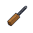
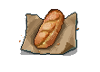
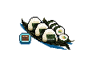

# 動物迷城資料集

## [角色](角色一覽.md)

||||||
|:--:|:--:|:--:|:--:|:--:|
||||||
|[狐貍．托馬斯](狐貍．托馬斯.md)|[大象．金波](大象．金波.md)|[長頸鹿．吉米](長頸鹿．吉米.md)|[河馬．弗蘭克](河馬．弗蘭克.md)|[犀牛．伊萬](犀牛．伊萬.md)|
||||||
|[水牛．比爾](水牛．比爾.md)|[駱駝．托尼](駱駝．托尼.md)|[北極熊．弗拉基米爾](北極熊．弗拉基米爾.md)|[黑熊．亨利](黑熊．亨利.md)|[海象．溫斯頓](海象．溫斯頓.md)|
||||||
|[驢子．山姆](驢子．山姆.md)|[馴鹿．魯道夫](馴鹿．魯道夫.md)|[袋鼠．喬瑟夫](袋鼠．喬瑟夫.md)|[羊駝．迪亞哥](羊駝．迪亞哥.md)|[高地牛．摩根](高地牛．摩根.md)|
||||||
|[鱷魚．克蘭奇](鱷魚．克蘭奇.md)|[雄獅．阿歷克斯](雄獅．阿歷克斯.md)|[老虎．約翰](老虎．約翰.md)|[熊貓．老李](熊貓．老李.md)|[斑馬．富蘭克林](斑馬．富蘭克林.md)|
||||||
|[賽馬．雷伊](賽馬．雷伊.md)|[猩猩．凱撒](猩猩．凱撒.md)|[山羊．威爾伯](山羊．威爾伯.md)|[貘．米格爾](貘．米格爾.md)|[黑豹．鮑勃](黑豹．鮑勃.md)|
||||||
|[灰狼．芬里爾](灰狼．芬里爾.md)|[斑鬣狗．文森特](斑鬣狗．文森特.md)|[鹿豚．理查德](鹿豚．理查德.md)|[疣豬．哈庫拉](疣豬．哈庫拉.md)|[山魈．拉斐爾](山魈．拉斐爾.md)|
||||||
|[猞猁．克里斯](猞猁．克里斯.md)|[鬣蜥．皮克曼](鬣蜥．皮克曼.md)|[水豚．伯納德](水豚．伯納德.md)|[象龜．威廉姆](象龜．威廉姆.md)|[樹懶．蒂姆](樹懶．蒂姆.md)|
||||||
|[考拉．凱文](考拉．凱文.md)|[食蟻獸．費爾南多](食蟻獸．費爾南多.md)|[穿山甲．林](穿山甲．林.md)|[海獺．菲爾](海獺．菲爾.md)|[蜜獾．麥克斯](蜜獾．麥克斯.md)|
||||||
|[臭鼬．沃爾特](臭鼬．沃爾特.md)|[灰貓．班姆](灰貓．班姆.md)|[狐獴．泰迪](狐獴．泰迪.md)|[浣熊．面條](浣熊．面條.md)|[環尾狐猴．羅伯特](環尾狐猴．羅伯特.md)|
||||||
|[負鼠．埃迪](負鼠．埃迪.md)|[鴨嘴獸．泰瑞](鴨嘴獸．泰瑞.md)|[兔子．懷特](兔子．懷特.md)|[樹蛙．格雷](樹蛙．格雷.md)|[恐龍．雷克斯](恐龍．雷克斯.md)|
||||||
|[未完成．角色](未完成．角色.md)|||||

## 物品

||||||
|:--:|:--:|:--:|:--:|:--:|
||||||
|[布條](84-布條.md)|[運動鞋](14-運動鞋.md)|[皮鞋](15-皮鞋.md)|[帆布鞋](16-帆布鞋.md)|[拖鞋](17-拖鞋.md)|
||||||
|[墨鏡](18-墨鏡.md)|[眼鏡](19-眼鏡.md)|[頭帶](20-頭帶.md)|[棒球帽](21-棒球帽.md)|[毛線帽](22-毛線帽.md)|
||||||
|[橡膠手套](25-橡膠手套.md)|[黑手](26-黑手.md)|[手錶](27-手錶.md)|[護身符](29-護身符.md)|[牙齒項鏈](30-牙齒項鏈.md)|
||||||
|[《死靈之書》](31-《死靈之書》.md)|[開鎖器](87-開鎖器.md)|[開鎖器(P)](38-開鎖器(P).md)|[自製口罩](32-自製口罩.md)|[警用防毒面具](33-警用防毒面具.md)|
||||||
|[隨身聽（開機）](34-隨身聽（開機）.md)|[隨身聽（關機）](35-隨身聽（關機）.md)|[隨身聽（沒電）](36-隨身聽（沒電）.md)|[酒葫蘆](37-酒葫蘆.md)|[黑桃A](39-黑桃A.md)|
||||||
|[薄荷葉](40-薄荷葉.md)|[薄荷葉卷](41-薄荷葉卷.md)|[蘑菇](42-蘑菇.md)|[蘑菇粉](43-蘑菇粉.md)|[瀉藥](44-瀉藥.md)|
||||||
|[紫鳶花](45-紫鳶花.md)|[花瓣粉](46-花瓣粉.md)|[安眠藥](47-安眠藥.md)|[安眠曲奇](48-安眠曲奇.md)|[止疼片](49-止疼片.md)|
||||||
|[興奮劑](50-興奮劑.md)|[醫用酒精](51-醫用酒精.md)|[鎮靜劑](53-鎮靜劑.md)|[啤酒](54-啤酒.md)|[蘋果酒](55-蘋果酒.md)|
||||||
|[精釀蘋果酒](56-精釀蘋果酒.md)|[蘋果](64-蘋果.md)|[華夫餅](67-華夫餅.md)|[奶油華夫餅](68-奶油華夫餅.md)|[一把咖啡豆](69-一把咖啡豆.md)|
||||||
|[口香糖](70-口香糖.md)|[曲奇餅乾](71-曲奇餅乾.md)|[焦糖棒](72-焦糖棒.md)|[汽水](73-汽水.md)|[酸奶](74-酸奶.md)|
||||||
|[土豆披薩](75-土豆披薩.md)|[咖啡粉](76-咖啡粉.md)|[茶包](77-茶包.md)|[超辣泡麵](78-超辣泡麵.md)|[蛋白粉](79-蛋白粉.md)|
||||||
|[紙鶴](126-紙鶴.md)|[枕頭](80-枕頭.md)|[毯子](81-毯子.md)|[假人](82-假人.md)|[床單](83-床單.md)|
||||||
|[繩索](85-繩索.md)|[迴紋針](86-迴紋針.md)|[酒精燈](52-酒精燈.md)|[肥皂](88-肥皂.md)|[香皂](89-香皂.md)|
||||||
|[鑰匙模具（洗衣房）](90-鑰匙模具（洗衣房）.md)|[塑料鑰匙（洗衣房）](91-塑料鑰匙（洗衣房）.md)|[鑰匙模具（裝備庫）](92-鑰匙模具（裝備庫）.md)|[塑料鑰匙（裝備庫）](93-塑料鑰匙（裝備庫）.md)|[鑰匙模具（藥房）](94-鑰匙模具（藥房）.md)|
||||||
|[塑料鑰匙（藥房）](95-塑料鑰匙（藥房）.md)|[腐蝕溶液](96-腐蝕溶液.md)|[滑翔服左翼](97-滑翔服左翼.md)|[滑翔服右翼](98-滑翔服右翼.md)|[滑翔服尾翼](99-滑翔服尾翼.md)|
||||||
|[肥皂槍](100-肥皂槍.md)|[計算機](101-計算機.md)|[《花花世界》（全新）](102-《花花世界》（全新）.md)|[《花花世界》（看過）](103-《花花世界》（看過）.md)|[《花花世界》（翻爛）](104-《花花世界》（翻爛）.md)|
||||||
|[馬女郎海報](105-馬女郎海報.md)|[貓女郎海報](106-貓女郎海報.md)|[狐女郎海報](107-狐女郎海報.md)|[兔女郎海報](108-兔女郎海報.md)|[咖啡磨](109-咖啡磨.md)|
||||||
|[掌上遊戲機](110-掌上遊戲機.md)|[掌上遊戲機（沒電）](111-掌上遊戲機（沒電）.md)|[手電筒](112-手電筒.md)|[手電筒（沒電）](113-手電筒（沒電）.md)|[電池](114-電池.md)|
||||||
|[牙刷](115-牙刷.md)|[牙膏](116-牙膏.md)|[空的牙膏管](117-空的牙膏管.md)|[消毒液](118-消毒液.md)|[除銹劑](119-除銹劑.md)|
||||||
|[火柴](120-火柴.md)|[膠帶](121-膠帶.md)|[顏料](122-顏料.md)|[釘子](123-釘子.md)|[鞋帶](124-鞋帶.md)|
||||||
|[白紙](125-白紙.md)|[花束](127-花束.md)|[紅頭巾](23-紅頭巾.md)|[綠頭巾](24-綠頭巾.md)|[胡亂的塗鴉](128-胡亂的塗鴉.md)|
||||||
|[簡單的漫畫](129-簡單的漫畫.md)|[精美的畫作](130-精美的畫作.md)|[鉛筆](131-鉛筆.md)|[鉛筆](132-鉛筆.md)|[圓珠筆](133-圓珠筆.md)|
||||||
|[圓珠筆](134-圓珠筆.md)|[硬幣](135-硬幣.md)|[長螺絲](136-長螺絲.md)|[簡易螺絲刀](137-簡易螺絲刀.md)|[簡易螺絲刀(P)](138-簡易螺絲刀(P).md)|
||||||
|[簡易螺絲刀(+)](206-簡易螺絲刀(+).md)|[簡易螺絲刀(P+)](139-簡易螺絲刀(P+).md)|[高效螺絲鑽](140-高效螺絲鑽.md)|[高效螺絲鑽(P)](141-高效螺絲鑽(P).md)|[扳手](142-扳手.md)|
||||||
|[湯匙](143-湯匙.md)|[湯匙](144-湯匙.md)|[簡易鶴嘴鋤](145-簡易鶴嘴鋤.md)|[簡易鶴嘴鋤(P)](146-簡易鶴嘴鋤(P).md)|[簡易鶴嘴鋤(+)](207-簡易鶴嘴鋤(+).md)|
||||||
|[簡易鶴嘴鋤(P+)](147-簡易鶴嘴鋤(P+).md)|[加固鶴嘴鋤](148-加固鶴嘴鋤.md)|[加固鶴嘴鋤(P)](149-加固鶴嘴鋤(P).md)|[加固鶴嘴鋤(+)](208-加固鶴嘴鋤(+).md)|[加固鶴嘴鋤(P+)](150-加固鶴嘴鋤(P+).md)|
||||||
|[釘錘](151-釘錘.md)|[剪刀](152-剪刀.md)|[碎玻璃](153-碎玻璃.md)|[玻璃匕首](154-玻璃匕首.md)|[玻璃匕首(+)](155-玻璃匕首(+).md)|
||||||
|[牙刷匕首](156-牙刷匕首.md)|[牙刷匕首(+)](157-牙刷匕首(+).md)|[水果刀](158-水果刀.md)|[折斷的木條](159-折斷的木條.md)|[雙節棍](160-雙節棍.md)|
||||||
|[雙節棍(+)](161-雙節棍(+).md)|[釘棒](162-釘棒.md)|[釘棒(+)](163-釘棒(+).md)|[鐵管](164-鐵管.md)|[警棍](165-警棍.md)|
||||||
|[皮帶](166-皮帶.md)|[皮帶](167-皮帶.md)|[烤麵包](168-烤麵包.md)|[南瓜粥](169-南瓜粥.md)|[蘋果派](170-蘋果派.md)|
||||||
|[煎蛋卷](171-煎蛋卷.md)|[手握飯糰](172-手握飯糰.md)|[炸薯條](173-炸薯條.md)|[蘑菇意麵](174-蘑菇意麵.md)|[傳統蒸餃](175-傳統蒸餃.md)|
||||||
|[烤麵包](176-烤麵包.md)|[南瓜粥](177-南瓜粥.md)|[蘋果派](178-蘋果派.md)|[煎蛋卷](179-煎蛋卷.md)|[手握飯糰](180-手握飯糰.md)|
||||||
|[炸薯條](181-炸薯條.md)|[蘑菇意麵](182-蘑菇意麵.md)|[傳統蒸餃](183-傳統蒸餃.md)|[獄警制服](189-獄警制服.md)|[警哨](190-警哨.md)|
||||||
|[洗衣房鑰匙](191-洗衣房鑰匙.md)|[裝備庫鑰匙](192-裝備庫鑰匙.md)|[藥房鑰匙](193-藥房鑰匙.md)|[給貝絲的情書](194-給貝絲的情書.md)|[給瑪姬的情書](195-給瑪姬的情書.md)|
||||||
|[給妻子的情書](196-給妻子的情書.md)|[小說手稿](197-小說手稿.md)|[發霉的麵包](200-發霉的麵包.md)|[金龜子](202-金龜子.md)|[《森之音》](203-《森之音》.md)|
||||||
|[《森之音》（改造）](204-《森之音》（改造）.md)|[神秘紙袋](205-神秘紙袋.md)|[DEMO限定紙鶴](209-DEMO限定紙鶴.md)|[備用帳簿](210-備用帳簿.md)||

## [技能](技能.md)

## [學習](學習.md)
