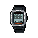
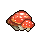

##  兔子．懷特

|體質|力量|敏捷|智力|幫派|
|:--:|:--:|:--:|:--:|:--:|
|3|3|6|6|黑爪幫成員|

### 故事

自稱是魔術師的兔子，計劃在監獄里辦一場魔術表演。對于三教九流的囚犯，一般的小把戲可沒法糊弄他們，于是他準備拿出真正的“狠活”來吸引觀眾。對于他的提議你表現出了濃厚的興趣，可沒想到他居然想讓你來做演出助手。面對“一刀兩斷”這樣的魔術，你有勇氣上臺嗎？

懷特出生在一個魔術世家，祖父和父親都是技藝精湛的魔術師。而懷特更是青出于藍，年紀輕輕就成為了著名的“大禮帽魔術團”的首席魔術師，其他同行們都只能望其項背。但這都是過去的事情了…

懷特命運的扭轉發生在他巡回演出一百場的時候，那天晚上他用自創的招牌魔術“一刀兩斷”再次驚艷觀眾。演出十分順利，結束之后魔術團舉行了盛大的慶功宴。懷特喝的伶仃大醉，隨后還和他的美女助手纏綿了一整夜…

可是兩天之后，電視臺的一檔節目卻驚呆了懷特。一位自稱“揭秘大師”的蒙面家伙通過舞臺表演，揭秘了不少的知名魔術，其中就包括懷特引以為豪的“一刀兩斷”！懷特頓時覺得天旋地轉，因為他比誰都清楚，被透底了的魔術將變得毫無價值。

事已至此，團長只得讓懷特構思新的魔術，但懷特卻毫無心思。因為他現在只想知道自己的“秘密”為何會被揭穿！他堅信“一刀兩斷”毫無破綻，所以一定是有家伙偷看了他的筆記本，而他心中的嫌疑犯只有一個：自己的女助手。

懷特找來了女助手，并威脅將會報警。被嚇壞的女孩只得承認自己在外面欠了一筆錢，為了還債才在那天夜里偷看了他的筆記本。而向她購買其中魔術秘密的家伙，正是幾年前被懷特擠下首席魔術師位置的“企鵝·奧斯瓦爾德”。不過她并不知道的是，奧斯瓦爾德居然會為了對付懷特而搞出“揭秘大師”這出戲碼。

“這是對魔術的背叛，這個混蛋必須付出代價！”知道真相的懷特，從血紅的雙眼之中噴出了怒火。

于是幾天后，假裝不知情的懷特約出了奧斯瓦爾德，向其哭訴自己的魔術被揭秘，現在陷入了困境。奧斯瓦爾德見狀便勸懷特把首席魔術師的位置讓回給他，他則會“好心”讓懷特成為自己的助手。正當這家伙打著如意算盤時，一股眩暈沖上腦門，原來懷特早已在酒中下了藥…

奧斯瓦爾德醒來時已被困在了魔術箱中，而這個魔術便是“一刀兩斷”！懷特笑著告訴他，自己剛剛改進了這個魔術，希望作為“揭秘大師”的奧斯瓦爾德能夠像電視表演時那么“聰明”，順利破解機關。否則閘刀就會落下！不過時間只有十分鐘。

在一旁偷看的女助手被懷特的瘋狂報復所嚇壞了，于是她慌忙的撥通了警察局的電話。但警察過了半個小時才趕到劇場。當然，可憐的奧斯瓦爾德沒能等到那么久…

### 結識對話

- **嘿\~伙計，你喜歡魔術嗎？**
- 魔術嗎…？
- 我只會幾招酒桌把戲。
- 不算喜歡，也不討厭…
- **先自我介紹一下，我是`懷特`，一個魔術師。**
- **我正在籌劃一場監獄魔術秀\~**
- **這里太無聊了，如果有場刺激的魔術表演，伙計們一定愿意花錢來看。**
- 怎樣的魔術才能算…刺激？
- **“一刀兩斷”和“死亡兔洞”這些可都是我的拿手好戲。**
- 這名字聽上去還算有吸引力…
- **這么說你對這場表演有興趣？**
- 你有點說動我了。
- 總比在囚室發呆強…
- **嘿\~太棒了！那咱們就從明天開始`排練`吧！**
- {question1}
- 等等…你說排練？
- **沒錯，魔術排練！你剛才不是答應做我的助演了嗎？**
- **你可是擁有表演“一刀兩斷”的絕佳身材！**
- {sweat1}
- 我說的感興趣，可不是這意思…

### 深入了解對話

- **喂\~今天的天氣真不錯！**
- **怎么樣？在這樣的好天氣里，你準備好魔術彩排了嗎？**
- 今天的天氣…好嗎？
- **至少沒下雪不是嗎？那這就是好天氣！因為手不會被凍僵！**
- 可我還不知道“一刀兩斷”究竟是個怎樣的魔術…
- 沒準我根本做不來。
- 聽上去有些危險…
- **你別被名字嚇到了，那都是唬人用的，其實既簡單又安全。**
- **只是…需要一點點`敏捷`罷了。**
- **不過這也沒多大關系，畢竟被小刀扎上個一兩下也死不掉，不是嗎？**

#### 我對自己的`敏捷`很有信心。

> 他向你解釋了為什么魔術師要保守秘密，以及他曾經的一段遭遇。

- 不過，我還是得了解魔術的全部內容…
- **全部的內容？！不不不，魔術師才不會透露他的魔術！**
- **哪怕對方是自己助手也不行！你只能知道你該知道的部分。**
- 你連助手都信不過嗎？
- 你簡直就是神經過敏…
- **哈？我給你說個故事，你就知道我為何這么在意了！**
- *沒什么比魔術師的復仇更可怕的了…*
- 難道說你要了奧斯瓦爾德的…命？
- **不\~我當然沒有，那樣可太便宜他了！**
- **我廢了他作為魔術師最重要的東西…他的雙手！哦\~準確的說是雙翼！**
- **用被他奪去了“生命”的那個魔術本身，向他復仇！**

#### 取消

- {exclamation1}
- 喂喂\~你不是說“一刀兩斷”只是個名字而已嗎？
- **別大驚小怪的，你只需要在魔術箱里`躲過八刀`就行了，這很簡單。**
- 八刀？！那我至少得有`相配的敏捷`才行！否則我可不會干…
### 初始物品

|物品名稱|物品名稱|物品名稱|物品名稱|物品名稱|
|:--:|:--:|:--:|:--:|:--:|
|  |  |  |  |  |
| [黑手](道具.md#黑手) | [手表](道具.md#手表) | [水果刀](道具.md#水果刀) | [黑桃A](道具.md#黑桃A)*3 | [紫鳶花](道具.md#紫鳶花)*3 |
|  |  |  |  |  |
| [回形針](道具.md#回形針)*3 | [肥皂](道具.md#肥皂) | [計算器](道具.md#計算器) | [湯匙](道具.md#湯匙) |  |
### 送禮

|圖片|物品名稱|好感|回應|
|:--:|--|:--:|--|
||[運動鞋](道具.md#運動鞋)|0|這真是個不大不小的驚喜。|
||[皮鞋](道具.md#皮鞋)|1|兔子總是會從皮鞋里出來，這是個不成文的規定。|
||[帆布鞋](道具.md#帆布鞋)|0|這真是個不大不小的驚喜。|
||[拖鞋](道具.md#拖鞋)|0|這真是個不大不小的驚喜。|
||[墨鏡](道具.md#墨鏡)|0|這真是個不大不小的驚喜。|
||[眼鏡](道具.md#眼鏡)|0|這真是個不大不小的驚喜。|
||[頭帶](道具.md#頭帶)|-1|嘖嘖嘖\~沒有魔術師會打扮成這樣。|
||[棒球帽](道具.md#棒球帽)|0|這真是個不大不小的驚喜。|
||[毛線帽](道具.md#毛線帽)|0|這真是個不大不小的驚喜。|
||[紅頭巾](道具.md#紅頭巾)|-1|嘖嘖嘖\~沒有魔術師會打扮成這樣。|
||[綠頭巾](道具.md#綠頭巾)|-1|嘖嘖嘖\~沒有魔術師會打扮成這樣。|
||[橡膠手套](道具.md#橡膠手套)|1|這或許能用來作我的魔術道具。|
||[黑手](道具.md#黑手)|1|嘻嘻\~能瞬間讓人暈倒…這也是一種魔術。|
||[手表](道具.md#手表)|2|嘿！咔噠咔噠\~我想到了逃脫魔術的新點子！|
||[護身符](道具.md#護身符)|0|這真是個不大不小的驚喜。|
||[牙齒項鏈](道具.md#牙齒項鏈)|0|這真是個不大不小的驚喜。|
||[《死靈之書》](道具.md#《死靈之書》)|0|這真是個不大不小的驚喜。|
||[自制口罩](道具.md#自制口罩)|0|這真是個不大不小的驚喜。|
||[隨身聽（開機）](道具.md#隨身聽（開機）)|0|這真是個不大不小的驚喜。|
||[隨身聽（關機）](道具.md#隨身聽（關機）)|0|這真是個不大不小的驚喜。|
||[隨身聽（沒電）](道具.md#隨身聽（沒電）)|0|這真是個不大不小的驚喜。|
||[酒葫蘆](道具.md#酒葫蘆)|1|我習慣在表演之前喝上一杯，再跳上一支踢踏舞。|
||[黑桃A](道具.md#黑桃A)|2|關于撲克的魔術我會72種，每一種都像魔法一般神奇。|
||[薄荷葉](道具.md#薄荷葉)|0|這真是個不大不小的驚喜。|
||[薄荷葉卷](道具.md#薄荷葉卷)|0|這真是個不大不小的驚喜。|
||[蘑菇](道具.md#蘑菇)|0|這真是個不大不小的驚喜。|
||[蘑菇粉](道具.md#蘑菇粉)|0|這真是個不大不小的驚喜。|
||[瀉藥](道具.md#瀉藥)|0|這真是個不大不小的驚喜。|
||[紫鳶花](道具.md#紫鳶花)|0|這真是個不大不小的驚喜。|
||[花瓣粉](道具.md#花瓣粉)|0|這真是個不大不小的驚喜。|
||[安眠藥](道具.md#安眠藥)|0|這真是個不大不小的驚喜。|
||[止疼片](道具.md#止疼片)|0|這真是個不大不小的驚喜。|
||[興奮劑](道具.md#興奮劑)|0|這真是個不大不小的驚喜。|
||[醫用酒精](道具.md#醫用酒精)|0|這真是個不大不小的驚喜。|
||[酒精燈](道具.md#酒精燈)|0|這真是個不大不小的驚喜。|
||[鎮靜劑](道具.md#鎮靜劑)|0|這真是個不大不小的驚喜。|
||[啤酒](道具.md#啤酒)|1|我習慣在表演之前喝上一杯，再跳上一支踢踏舞。|
||[蘋果酒](道具.md#蘋果酒)|1|我習慣在表演之前喝上一杯，再跳上一支踢踏舞。|
||[精釀蘋果酒](道具.md#精釀蘋果酒)|1|我習慣在表演之前喝上一杯，再跳上一支踢踏舞。|
||[蘋果](道具.md#蘋果)|0|這真是個不大不小的驚喜。|
||[華夫餅](道具.md#華夫餅)|0|這真是個不大不小的驚喜。|
||[奶油華夫餅](道具.md#奶油華夫餅)|0|這真是個不大不小的驚喜。|
||[一把咖啡豆](道具.md#一把咖啡豆)|0|這真是個不大不小的驚喜。|
||[口香糖](道具.md#口香糖)|0|這真是個不大不小的驚喜。|
||[曲奇餅干](道具.md#曲奇餅干)|0|這真是個不大不小的驚喜。|
||[焦糖棒](道具.md#焦糖棒)|0|這真是個不大不小的驚喜。|
||[汽水](道具.md#汽水)|0|這真是個不大不小的驚喜。|
||[酸奶](道具.md#酸奶)|1|哪只兔子能拒絕酸奶的美味呢？|
||[土豆披薩](道具.md#土豆披薩)|0|這真是個不大不小的驚喜。|
||[咖啡粉](道具.md#咖啡粉)|0|這真是個不大不小的驚喜。|
||[茶包](道具.md#茶包)|0|這真是個不大不小的驚喜。|
||[超辣泡面](道具.md#超辣泡面)|0|這真是個不大不小的驚喜。|
||[蛋白粉](道具.md#蛋白粉)|0|這真是個不大不小的驚喜。|
||[布條](道具.md#布條)|0|嗯…我的魔術機關沒準用得上它。|
||[回形針](道具.md#回形針)|0|這真是個不大不小的驚喜。|
||[開鎖器](道具.md#開鎖器)|1|這或許能用來作我的魔術道具。|
||[開鎖器(P)](道具.md#開鎖器(P))|1|這或許能用來作我的魔術道具。|
||[肥皂](道具.md#肥皂)|0|這真是個不大不小的驚喜。|
||[香皂](道具.md#香皂)|0|這真是個不大不小的驚喜。|
||[計算器](道具.md#計算器)|0|這真是個不大不小的驚喜。|
||[《花花世界》（全新）](道具.md#《花花世界》（全新）)|1|你相信嗎？我有不少的魔術靈感來源于…這類雜志。|
||[《花花世界》（看過）](道具.md#《花花世界》（看過）)|0|這真是個不大不小的驚喜。|
||[《花花世界》（翻爛）](道具.md#《花花世界》（翻爛）)|0|這真是個不大不小的驚喜。|
||[馬女郎海報](道具.md#馬女郎海報)|0|這真是個不大不小的驚喜。|
||[貓女郎海報](道具.md#貓女郎海報)|0|這真是個不大不小的驚喜。|
||[狐女郎海報](道具.md#狐女郎海報)|0|這真是個不大不小的驚喜。|
||[兔女郎海報](道具.md#兔女郎海報)|2|嘿\~她太美了！我真想讓她做我的魔術女助手…|
||[咖啡磨](道具.md#咖啡磨)|0|這真是個不大不小的驚喜。|
||[掌上游戲機](道具.md#掌上游戲機)|0|這真是個不大不小的驚喜。|
||[掌上游戲機（沒電）](道具.md#掌上游戲機（沒電）)|0|這真是個不大不小的驚喜。|
||[電池](道具.md#電池)|0|這真是個不大不小的驚喜。|
||[牙刷](道具.md#牙刷)|0|這真是個不大不小的驚喜。|
||[牙膏](道具.md#牙膏)|0|這真是個不大不小的驚喜。|
||[空的牙膏管](道具.md#空的牙膏管)|-2|沒誰會對一支空的牙膏管感興趣！|
||[消毒液](道具.md#消毒液)|-1|我的魔術里可用不上這個…|
||[除銹劑](道具.md#除銹劑)|-1|我的魔術里可用不上這個…|
||[火柴](道具.md#火柴)|0|嗯…我的魔術機關沒準用得上它。|
||[膠帶](道具.md#膠帶)|0|嗯…我的魔術機關沒準用得上它。|
||[顏料](道具.md#顏料)|0|這真是個不大不小的驚喜。|
||[釘子](道具.md#釘子)|0|嗯…我的魔術機關沒準用得上它。|
||[鞋帶](道具.md#鞋帶)|0|嗯…我的魔術機關沒準用得上它。|
||[白紙](道具.md#白紙)|0|嗯…我的魔術機關沒準用得上它。|
||[紙鶴](道具.md#紙鶴)|1|嘿\~在我看來，折紙也算一種魔術。|
||[花束](道具.md#花束)|1|這或許能用來作我的魔術道具。|
||[胡亂的涂鴉](道具.md#胡亂的涂鴉)|-1|我的魔術里可用不上這個…|
||[簡單的漫畫](道具.md#簡單的漫畫)|0|這真是個不大不小的驚喜。|
||[精美的畫作](道具.md#精美的畫作)|1|這幅畫給了我一些不同的靈感！|
||[鉛筆](道具.md#鉛筆)|0|這真是個不大不小的驚喜。|
||[鉛筆](道具.md#鉛筆)|0|這真是個不大不小的驚喜。|
||[圓珠筆](道具.md#圓珠筆)|0|這真是個不大不小的驚喜。|
||[圓珠筆](道具.md#圓珠筆)|0|這真是個不大不小的驚喜。|
||[硬幣](道具.md#硬幣)|0|這真是個不大不小的驚喜。|
||[長螺絲](道具.md#長螺絲)|0|這真是個不大不小的驚喜。|
||[扳手](道具.md#扳手)|0|這真是個不大不小的驚喜。|
||[湯匙](道具.md#湯匙)|2|每個魔術師對湯匙都有一種特殊的感情…|
||[湯匙](道具.md#湯匙)|2|每個魔術師對湯匙都有一種特殊的感情…|
||[釘錘](道具.md#釘錘)|0|這真是個不大不小的驚喜。|
||[剪刀](道具.md#剪刀)|0|這真是個不大不小的驚喜。|
||[碎玻璃](道具.md#碎玻璃)|0|嗯…我的魔術機關沒準用得上它。|
||[玻璃匕首](道具.md#玻璃匕首)|0|這真是個不大不小的驚喜。|
||[玻璃匕首(+)](道具.md#玻璃匕首(+))|0|這真是個不大不小的驚喜。|
||[牙刷匕首](道具.md#牙刷匕首)|0|這真是個不大不小的驚喜。|
||[牙刷匕首(+)](道具.md#牙刷匕首(+))|0|這真是個不大不小的驚喜。|
||[水果刀](道具.md#水果刀)|0|這真是個不大不小的驚喜。|
||[折斷的木條](道具.md#折斷的木條)|0|嗯…我的魔術機關沒準用得上它。|
||[雙節棍](道具.md#雙節棍)|0|這真是個不大不小的驚喜。|
||[雙節棍(+)](道具.md#雙節棍(+))|0|這真是個不大不小的驚喜。|
||[釘棒](道具.md#釘棒)|0|這真是個不大不小的驚喜。|
||[釘棒(+)](道具.md#釘棒(+))|0|這真是個不大不小的驚喜。|
||[鐵管](道具.md#鐵管)|0|這真是個不大不小的驚喜。|
||[皮帶](道具.md#皮帶)|0|這真是個不大不小的驚喜。|
||[皮帶](道具.md#皮帶)|0|這真是個不大不小的驚喜。|
||[發霉的面包](道具.md#發霉的面包)|-2|沒誰會對一塊爛面包感興趣！|
||[金龜子](道具.md#金龜子)|2|哈\~金色傳說！|
||[《森之音》](道具.md#《森之音》)|0|這真是個不大不小的驚喜。|
||[DEMO限定紙鶴](道具.md#DEMO限定紙鶴)|2|嘿\~這是某種心理暗示的小魔術嗎？|

