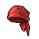
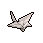

#  北極熊．弗拉基米爾

|體質|力量|敏捷|智力|幫派|戰鬥等級|勒索難度|持有天賦|取得天賦|
|:--:|:--:|:--:|:--:|:--:|:--:|:--:|:--:|:--:|
|11|11|6|8|尖牙幫幹部|強|難|[鬥士](技能.md#鬥士)、[強健](技能.md#強健)|[摔跤手](技能.md#摔跤手)|

## 故事

身材高大的北極熊，曾是一名職業摔跤手。雖然身在監獄，但依然留念著擂臺。他扮演的角色名叫“冰山”，設定上是一頭來自極地的巨魔，雖然擁有強大的力量，但卻懼怕炎熱。而絕招居然是……算了，還是不說了。天氣已經夠冷的了。

少年時期的弗拉基米爾是個不折不扣的渾小子，會修理任何一個他看不順眼的家伙。從學校畢業後，無所事事的他嘗試過很多工作，但無一不因他的暴脾氣而混亂收場。直到有一天，他又因為一點瑣事，在野球場上和其他的小伙子們干起架來，並獨自打趴了對方三人。這一幕剛好被路過的摔跤手“狂鯊”看到，於是對方向年輕的弗拉基米爾發出邀請，希望他能加入自己的摔跤俱樂部。

起初，弗拉基米爾只是抱著打發時間的心態去俱樂部兜了一圈，但他的壞脾氣又惹出了麻煩。他和俱樂部裡一只看似瘦弱的冰原狼發生了口角，但意想不到的是他居然被對方揍得毫無還手之力。從小到大，干架未嘗一敗的弗拉基米爾此刻見識到了摔跤的魅力，一道新世界的大門在他的面前開啟了。

剛進俱樂部的弗拉基米爾每天都要接受地獄級的訓練，數百次的俯臥撐、卷腹、深蹲，再加上幾小時不停歇的實戰對打。天不亮就要起床，晚上只能帶著傷痛入睡。同期的新進隊員都因為受不了苦選擇了退出，但弗拉基米爾卻堅持了下來。苦練三年之後，“狂鯊”將“冰山”的綽號給予了弗拉基米爾，這說明他已做好了登上擂臺的準備。

“冰山”初登擂臺就展現出了驚人的實力，首勝、連勝、冠軍、蟬聯，弗拉基米爾創造了一個又一個的摔跤奇跡，被媒體稱為“一頭來自極地的魔獸”！對於取得的成就，弗拉基米爾一直深深感謝著他的伯樂“狂鯊”。是這個亦師亦友的前輩，將他從暴力的泥潭中拯救出來，並將摔跤手的身份賦予給了他。

但是一切美好的故事仿佛都有著轉折，在“冰山”贏得自己的第三個冠軍腰帶時，壞消息卻意外傳來。退役的“狂鯊”帶著女兒看完電影回家，卻在小巷遭遇持刀歹徒的搶劫。為了保護女兒，“狂鯊”被刺中要害，最終不治身亡。

恩師“狂鯊”的離世讓弗拉基米意志消沉，酒精的作用令他難以控制自己的情緒。在幾天後的一次電視節目中，同為嘉賓的一名拳擊手嘲諷到“摔跤手都只是些打假賽的演員，根本沒有真正的實力，那個連路邊小混混都擺不平的“狂鯊”就是最好的例子。這幫小丑只配出現在蜜糖節的餘興表演裡，而不是屬於斗技者的擂臺上。”這段垃圾話徹底的激怒了弗拉基米爾，他在後臺的更衣室讓那個“嘴臭”的家伙好好見識了一番“狂鯊”的弟子，摔跤手“冰山”那雪崩一般的憤怒！

因為一段垃圾話，那個拳擊手付出了下半生只能坐在輪椅上的代價。而“冰山”弗拉基米爾，也因故意傷害罪被判處了十年監禁。摔跤界的一顆新星就此隕落了…

## 結識對話

- **這天氣實在太熱了，不是嗎？**
- 對你來說，可能是吧…
- **再待在這裡，我就要融化了。**
- 融化…？這也太誇張了吧。
- **沒辦法，我的設定就是這樣。在寒冷的地帶才能保持力量。**
- 設定？這又不是電子遊戲…
- **我`弗拉基米爾`是職業摔跤手，更準確的說\~曾經是。**
- **你應該知道，像我們摔跤手，都會用個故事來包裝自己。**
- **我就是來自極地的巨魔，綽號“冰山”，怕熱是我的弱點。**
- 可這裡是監獄，又不是擂臺…
- **摔跤手只有在無人之處才能摘下“面具”，擂臺無處不在。**
- 好吧“冰山”先生…那摔跤手都有絕招，你的是什麼呢？
- **{happy1}**
- **聽好了，我的第一招是在擂臺上說冷笑話，將對手冰凍！**
- *這本身就是個冷笑話吧…*
- **第二招是被稱作“冰山一腳”的超級飛踢！**
- *……*
- …這種諧音梗，的確很配你的第一招。
- {sweat1}

## 深入了解對話

- **嘿\~你上次說我的絕招聽上去不夠酷對嗎？**
  - 你是指“冰山一腳”嗎？
  - 別提你的那些絕招了…
- **嗯\~我想了一想，覺得你說的有點道理。**
- **摔跤手不能無視觀眾的要求\~**
- **所以我決定開發新的絕招！**
- 哦\~這聽起來還不錯，能讓我見識一下嗎？
- **這招的靈感來自我的師傅“狂鯊”，是個借力打力的招式。**
- **如果對手沒有接近我的力量就無法發揮這招的全部威力。**

#### 我的`力量`可不輸你。

> 他讓你零距離體驗了真正的摔跤，並在休息時講述了他和摔跤的故事。

- **哈\~看上去你的確能接得住我這招。**
- **那好吧\~我就給你展示一下這招“冰雪瘋抱”吧！**
- *難怪他會如此看中摔跤手的身份…*
- 你現在後悔嗎？揍了那個拳擊手一頓…
- **後悔，當然後悔。**
- **但不是因為坐牢，而是因為我辜負了摔跤手的身份。**
- **“摔跤手的拳頭只能在擂臺上揮舞。”**
- **…這是我進俱樂部的第一天，“狂鯊”教給我的。**

#### 取消

- **你的身板太弱了，先去提升點`力量`再來陪我練吧！**
- {sweat1}
- *竟然向對手提要求？*
- *這種“絕招”在擂臺上真的實用嗎…？*

## 特殊對話

### 打招呼（關係極好）

- **想聽冷笑話嗎？**

### 打招呼（關係好）

- **“冰山”在咆哮。**

### 打招呼（關係一般）

- **“冰山”在咆哮。**

### 打招呼（關係差）

- **喂\~我沒興趣閒聊。**

### 打招呼（關係極差）

- **小心點，別給自己惹麻煩。**

### 進行毆打

- **來吧！擂臺的哨聲吹響了！**
- **我會讓你見識到“極地之怒”的！**
- **戰鬥時間到了！你可得撐滿十二回合！**

### 回禮

- **現在作為回禮，我想你收下這個。**

### 勒索成功

- **喂…拿上這`{x1}`塊給我閃開，我的耐心快到頭了。**
- **{hate1}**

### 勒索失敗

- **喂！如果你不想看我爆發的樣子，就趁早消失。**

### 一起吃飯被拒

- **你最好趁我發火之前走遠點。**

### 分享食物

- **“冰山”永遠不會拒絕食物。**

### 加藥被發現

- **你手裡是什麼？鬼鬼祟祟的？**

### 加藥辯解失敗

- **你最好離我的午餐遠一點，聽到沒有？**

## 聊天

- **我正在構思新的絕招…你或許能幫我出出主意。**
- 為什麼突然要這麼做？
- **說實話，那是因為…我的冷笑話都說完了。**
- 或許你只缺一本《笑話大全》而已。
- **哈？笑話大拳！這招聽起來可真不錯！**
- **{happy1}**
- 呃…其實我不是這個意思。

## 初始物品

||||||
|:--:|:--:|:--:|:--:|:--:|
||||||
|[運動鞋](14-運動鞋.md)|[毛線帽](22-毛線帽.md)|[肥皂](88-肥皂.md)|[蘑菇](42-蘑菇.md)*3|[蘋果酒](55-蘋果酒.md)*2|
||||||
|[華夫餅](67-華夫餅.md)*2|[汽水](73-汽水.md)*2|[酸奶](74-酸奶.md)*2|[超辣泡麵](78-超辣泡麵.md)*2||

## 送禮

|圖片|物品名稱|好感|回應|
|:--:|--|:--:|--|
||[DEMO限定紙鶴](209-DEMO限定紙鶴.md)|50|這道光芒…我…無法拒絕它！|
||[運動鞋](14-運動鞋.md)|24|唔\~有了這個，我的“冰山一腳”將更加致命！|
||[墨鏡](18-墨鏡.md)|20|哈！這能幫我抵擋太陽的灼熱光線\~|
||[酒葫蘆](37-酒葫蘆.md)|20|（嗅\~嗅）哈\~裡面還殘留著酒香。|
||[金龜子](202-金龜子.md)|20|哈\~金色傳說！|
||[牙齒項鏈](30-牙齒項鏈.md)|18|尖牙利齒？嗯…很適合“冰山”的角色。|
||[精釀蘋果酒](56-精釀蘋果酒.md)|16|烈酒\~！真是一件驚喜的禮物！|
||[頭帶](20-頭帶.md)|15|唔\~戴上這個沒準能多挨上兩拳。|
||[棒球帽](21-棒球帽.md)|12|巨魔“冰山”不會拒絕貢品\~|
||[紅頭巾](23-紅頭巾.md)|12|這讓我想起了曾經的對手“熔巖巨魔”…|
||[手錶](27-手錶.md)|12|巨魔“冰山”不會拒絕貢品\~|
||[隨身聽（開機）](34-隨身聽（開機）.md)|12|巨魔“冰山”不會拒絕貢品\~|
||[隨身聽（關機）](35-隨身聽（關機）.md)|12|巨魔“冰山”不會拒絕貢品\~|
||[隨身聽（沒電）](36-隨身聽（沒電）.md)|12|巨魔“冰山”不會拒絕貢品\~|
||[蘋果酒](55-蘋果酒.md)|12|烈酒\~！真是一件驚喜的禮物！|
||[奶油華夫餅](68-奶油華夫餅.md)|12|摔跤手需要維持體重…這些食物正是我需要的。|
||[土豆披薩](75-土豆披薩.md)|12|摔跤手需要維持體重…這些食物正是我需要的。|
||[蛋白粉](79-蛋白粉.md)|12|你聽見了嗎？我的肌肉正在呼喚它！|
||[香皂](89-香皂.md)|12|“冰山”之上可不能殘留污垢。|
||[馬女郎海報](105-馬女郎海報.md)|12|巨魔“冰山”不會拒絕貢品\~|
||[貓女郎海報](106-貓女郎海報.md)|12|巨魔“冰山”不會拒絕貢品\~|
||[狐女郎海報](107-狐女郎海報.md)|12|巨魔“冰山”不會拒絕貢品\~|
||[兔女郎海報](108-兔女郎海報.md)|12|巨魔“冰山”不會拒絕貢品\~|
||[眼鏡](19-眼鏡.md)|10|巨魔“冰山”不會拒絕貢品\~|
||[護身符](29-護身符.md)|10|巨魔“冰山”不會拒絕貢品\~|
||[橡膠手套](25-橡膠手套.md)|9|嗯\~這勉強能當做“摔跤手套”來用…|
||[興奮劑](50-興奮劑.md)|9|（嗅\~嗅）我聞到了力量的味道。|
||[啤酒](54-啤酒.md)|9|雖然度數不夠，但至少味道還不錯\~|
||[華夫餅](67-華夫餅.md)|9|摔跤手需要維持體重…這些食物正是我需要的。|
||[超辣泡麵](78-超辣泡麵.md)|9|摔跤手需要維持體重…這些食物正是我需要的。|
||[帆布鞋](16-帆布鞋.md)|8|巨魔“冰山”不會拒絕貢品\~|
||[拖鞋](17-拖鞋.md)|8|巨魔“冰山”不會拒絕貢品\~|
||[毛線帽](22-毛線帽.md)|8|巨魔“冰山”不會拒絕貢品\~|
||[綠頭巾](24-綠頭巾.md)|8|巨魔“冰山”不會拒絕貢品\~|
||[自製口罩](32-自製口罩.md)|8|巨魔“冰山”不會拒絕貢品\~|
||[酒精燈](52-酒精燈.md)|8|巨魔“冰山”不會拒絕貢品\~|
||[《花花世界》（全新）](102-《花花世界》（全新）.md)|8|巨魔“冰山”不會拒絕貢品\~|
||[咖啡磨](109-咖啡磨.md)|8|巨魔“冰山”不會拒絕貢品\~|
||[精美的畫作](130-精美的畫作.md)|8|巨魔“冰山”不會拒絕貢品\~|
||[皮帶](166-皮帶.md)|8|巨魔“冰山”不會拒絕貢品\~|
||[皮帶](167-皮帶.md)|8|巨魔“冰山”不會拒絕貢品\~|
||[《森之音》](203-《森之音》.md)|8|巨魔“冰山”不會拒絕貢品\~|
||[薄荷葉卷](41-薄荷葉卷.md)|6|巨魔“冰山”不會拒絕貢品\~|
||[蘑菇](42-蘑菇.md)|6|（嗅\~嗅）我聞到了力量的味道。|
||[蘑菇粉](43-蘑菇粉.md)|6|（嗅\~嗅）我聞到了力量的味道。|
||[醫用酒精](51-醫用酒精.md)|6|作為摔跤手，我會需要它的。|
||[肥皂](88-肥皂.md)|6|“冰山”之上可不能殘留污垢。|
||[《花花世界》（看過）](103-《花花世界》（看過）.md)|6|巨魔“冰山”不會拒絕貢品\~|
||[黑桃A](39-黑桃A.md)|4|巨魔“冰山”不會拒絕貢品\~|
||[薄荷葉](40-薄荷葉.md)|4|巨魔“冰山”不會拒絕貢品\~|
||[安眠藥](47-安眠藥.md)|4|巨魔“冰山”不會拒絕貢品\~|
||[止疼片](49-止疼片.md)|4|巨魔“冰山”不會拒絕貢品\~|
||[蘋果](64-蘋果.md)|4|巨魔“冰山”不會拒絕貢品\~|
||[一把咖啡豆](69-一把咖啡豆.md)|4|巨魔“冰山”不會拒絕貢品\~|
||[焦糖棒](72-焦糖棒.md)|4|巨魔“冰山”不會拒絕貢品\~|
||[汽水](73-汽水.md)|4|巨魔“冰山”不會拒絕貢品\~|
||[酸奶](74-酸奶.md)|4|巨魔“冰山”不會拒絕貢品\~|
||[咖啡粉](76-咖啡粉.md)|4|巨魔“冰山”不會拒絕貢品\~|
||[茶包](77-茶包.md)|4|巨魔“冰山”不會拒絕貢品\~|
||[《花花世界》（翻爛）](104-《花花世界》（翻爛）.md)|4|巨魔“冰山”不會拒絕貢品\~|
||[牙刷](115-牙刷.md)|4|巨魔“冰山”不會拒絕貢品\~|
||[牙膏](116-牙膏.md)|4|巨魔“冰山”不會拒絕貢品\~|
||[硬幣](135-硬幣.md)|4|巨魔“冰山”不會拒絕貢品\~|
||[湯匙](143-湯匙.md)|4|巨魔“冰山”不會拒絕貢品\~|
||[湯匙](144-湯匙.md)|4|巨魔“冰山”不會拒絕貢品\~|
||[口香糖](70-口香糖.md)|2|巨魔“冰山”不會拒絕貢品\~|
||[曲奇餅乾](71-曲奇餅乾.md)|2|巨魔“冰山”不會拒絕貢品\~|
||[布條](84-布條.md)|-2|我想我不需要這個…|
||[迴紋針](86-迴紋針.md)|-2|我想我不需要這個…|
||[電池](114-電池.md)|-2|我想我不需要這個…|
||[消毒液](118-消毒液.md)|-2|我想我不需要這個…|
||[除銹劑](119-除銹劑.md)|-2|我想我不需要這個…|
||[火柴](120-火柴.md)|-2|我想我不需要這個…|
||[膠帶](121-膠帶.md)|-2|我想我不需要這個…|
||[顏料](122-顏料.md)|-2|我想我不需要這個…|
||[釘子](123-釘子.md)|-2|我想我不需要這個…|
||[鞋帶](124-鞋帶.md)|-2|我想我不需要這個…|
||[白紙](125-白紙.md)|-2|我想我不需要這個…|
||[折斷的木條](159-折斷的木條.md)|-2|摔跤手可不需要武器。|
||[紫鳶花](45-紫鳶花.md)|-4|“冰山”不喜歡花，我也不喜歡…|
||[花瓣粉](46-花瓣粉.md)|-4|（嗅\~嗅）這會讓我失去力量…|
||[鉛筆](131-鉛筆.md)|-4|我想我不需要這個…|
||[鉛筆](132-鉛筆.md)|-4|我想我不需要這個…|
||[玻璃匕首](154-玻璃匕首.md)|-4|摔跤手可不需要武器。|
||[牙刷匕首](156-牙刷匕首.md)|-4|摔跤手可不需要武器。|
||[鎮靜劑](53-鎮靜劑.md)|-6|（嗅\~嗅）這會讓我失去力量…|
||[紙鶴](126-紙鶴.md)|-6|你送錯對象了，我對這個沒興趣…|
||[簡單的漫畫](129-簡單的漫畫.md)|-6|你送錯對象了，我對這個沒興趣…|
||[長螺絲](136-長螺絲.md)|-6|摔跤手可不需要武器。|
||[玻璃匕首(+)](155-玻璃匕首(+).md)|-6|摔跤手可不需要武器。|
||[牙刷匕首(+)](157-牙刷匕首(+).md)|-6|摔跤手可不需要武器。|
||[釘棒](162-釘棒.md)|-6|摔跤手可不需要武器。|
||[鐵管](164-鐵管.md)|-6|摔跤手可不需要武器。|
||[計算機](101-計算機.md)|-8|我想我不需要這個…|
||[花束](127-花束.md)|-8|“冰山”不喜歡花，我也不喜歡…|
||[圓珠筆](133-圓珠筆.md)|-8|我想我不需要這個…|
||[圓珠筆](134-圓珠筆.md)|-8|我想我不需要這個…|
||[剪刀](152-剪刀.md)|-8|摔跤手可不需要武器。|
||[雙節棍](160-雙節棍.md)|-8|摔跤手可不需要武器。|
||[釘棒(+)](163-釘棒(+).md)|-8|摔跤手可不需要武器。|
||[皮鞋](15-皮鞋.md)|-10|穿著這個可上不了擂臺…|
||[水果刀](158-水果刀.md)|-10|摔跤手可不需要武器。|
||[雙節棍(+)](161-雙節棍(+).md)|-10|摔跤手可不需要武器。|
||[《死靈之書》](31-《死靈之書》.md)|-12|你送錯對象了，我對這個沒興趣…|
||[掌上遊戲機](110-掌上遊戲機.md)|-12|你送錯對象了，我對這個沒興趣…|
||[掌上遊戲機（沒電）](111-掌上遊戲機（沒電）.md)|-12|你送錯對象了，我對這個沒興趣…|
||[扳手](142-扳手.md)|-12|摔跤手可不需要武器。|
||[釘錘](151-釘錘.md)|-12|摔跤手可不需要武器。|
||[空的牙膏管](117-空的牙膏管.md)|-20|“冰山”討厭垃圾。|
||[碎玻璃](153-碎玻璃.md)|-20|“冰山”討厭垃圾。|
||[開鎖器](87-開鎖器.md)|-40|摔跤手可不會做這種偷雞摸狗的事情！|
||[開鎖器(P)](38-開鎖器(P).md)|-40|摔跤手可不會做這種偷雞摸狗的事情！|
||[胡亂的塗鴉](128-胡亂的塗鴉.md)|-40|“冰山”討厭垃圾。|
||[發霉的麵包](200-發霉的麵包.md)|-40|“冰山”討厭垃圾。|
||[瀉藥](44-瀉藥.md)|-60|喂！摔跤手可不會用這種陰招！|
||[黑手](26-黑手.md)|-80|喂！摔跤手可不會用這種陰招！|

