## 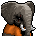 大象．金波

|體質|力量|敏捷|智力|幫派|
|:--:|:--:|:--:|:--:|:--:|
|12|12|4|8|大腳幫老大|

### 故事

整座監獄最大體型的囚犯，手中掌管著“大腳幫”。對自己的力量擁有絕對的自信，言談舉止之中透露出對你的不屑一顧。你輕聲告誡自己，除非必要，否則千萬不要與他為敵…

他出生在被稱為“混蛋街”的地方，那里是下城區中的垃圾場，貧民窟中的罪犯窩。他的父母在街角開了一家快餐店，艱難的維持著家庭的生計。而在一個放學歸來的午後，金波卻看見雙親靜靜地躺在吧臺後的血泊之中。一次尋常的搶劫，兩條無辜的性命。類似的悲劇，每天都在這里上演。

童年的遭遇改變了金波對於世界的看法，他意識到唯有力量才是一切，而弱者甚至連生存的機會都會被剝奪。於是小小年紀的他就加入了街頭的幫派，并靠著自己兇狠的拳頭和聰明的頭腦，一步一步從小頭目成長為了幫派首領。在他成年的時候，整條“混蛋街”已經沒有家伙再敢與他為敵。

然而這樣的“成就”依然無法令他滿足，他的下一個目標就是掌控整個下城區的犯罪世界。他花了幾年時間，通過壓倒性的實力不斷兼并著其他幫派的地盤，直到勢力覆蓋了下城區的半壁江山。但是，正當他的野心即將實現之時，卻遭到了手下的出賣。在一次巨額的犯罪交易中，他被事先埋伏好的特警當場抓獲。

對於一般的罪犯來說，這或許就是故事的結局了，但金波可沒那麼容易被擊敗。他在監獄里干掉了敵對幫派派來的殺手，并很快建立起了“大腳幫”。他以監獄為新的基地，遠程操控著那些撤回“混蛋街”的殘餘手下，以備在出獄之後，東山再起。不過除了這些，金波還有一件事情必須要做：就是讓那個出賣他的叛徒付出血的代價。

### 結識對話

- *好巨大的身材，這就是大象的壓迫感嗎…*
- **喂\~小子，干嘛在我眼前晃來晃去，像只蚊子一樣…**
- **告訴你，我討厭蚊子，總會忍不住想要拍死它們！**
- 冷靜點，我不是來惹麻煩的。
- **別高看自己了\~你對我來說可算不上“麻煩”。**
- **不光是你，關在這兒的其他家伙也都一樣…**
- **（打哈欠）…在我`金波`的眼里全都不值一提。**
- {sweat1}

### 深入了解對話

- **小子\~又是你，這次又有什麼無聊的事情找我？**
- 我只想來交個朋友。
- **和我交朋友？哈哈\~你的大膽倒是讓我有點意外。**
- **不過，作為`大腳幫的老大`，我只會和自己人交朋友。**

#### 我也是`大腳幫`的一員。

> 他漫不經心的和你聊了一會，包括他不為人知的過去。

- 你可以拿我當自己人。
- **既然如此，那我就來說個關於自己人的故事好了。**
- *這就是他的過去嗎？簡直就像黑幫電影…*
- 對於你父母的事情，我感到…
- **閉上嘴吧\~小子，我金波可不需要你來同情。**
- 還有…如果你抓到那個叛徒，會怎麼處置他？
- **相信我，你不會想知道的。**

#### 取消

- **像你這種剛來沒幾天的小子，可還沒這個資格…**
- *看來他只信任`大腳幫`里的家伙…*
### 初始物品

|物品名稱|物品名稱|物品名稱|物品名稱|物品名稱|
|:--:|:--:|:--:|:--:|:--:|
| 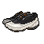 | 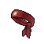 | 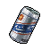 | 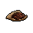 | 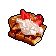 |
| [運動鞋](道具.md#運動鞋) | [頭帶](道具.md#頭帶) | [啤酒](道具.md#啤酒) | [一把咖啡豆](道具.md#一把咖啡豆)*3 | [奶油華夫餅](道具.md#奶油華夫餅) |
| 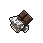 | 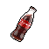 | 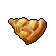 | 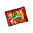 |  |
| [焦糖棒](道具.md#焦糖棒)*2 | [汽水](道具.md#汽水)*2 | [土豆披薩](道具.md#土豆披薩) | [超辣泡麵](道具.md#超辣泡麵)*2 |  |
### 送禮

|圖片|物品名稱|好感|回應|
|:--:|--|:--:|--|
||[運動鞋](道具.md#運動鞋)|1|小子\~你的禮物還算上道。|
||[皮鞋](道具.md#皮鞋)|0|算你識相，小子。|
|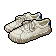|[帆布鞋](道具.md#帆布鞋)|0|算你識相，小子。|
|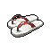|[拖鞋](道具.md#拖鞋)|0|算你識相，小子。|
|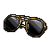|[墨鏡](道具.md#墨鏡)|0|算你識相，小子。|
|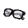|[眼鏡](道具.md#眼鏡)|0|算你識相，小子。|
||[頭帶](道具.md#頭帶)|1|小子\~你的禮物還算上道。|
|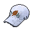|[棒球帽](道具.md#棒球帽)|1|小子\~你的禮物還算上道。|
|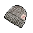|[毛線帽](道具.md#毛線帽)|0|算你識相，小子。|
|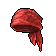|[紅頭巾](道具.md#紅頭巾)|0|算你識相，小子。|
|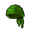|[綠頭巾](道具.md#綠頭巾)|0|算你識相，小子。|
|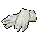|[橡膠手套](道具.md#橡膠手套)|-1|我可用不著這東西，以後拿點有用的過來。|
|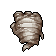|[黑手](道具.md#黑手)|-1|喂\~你覺得以我的實力，會需要這個嗎？|
|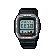|[手錶](道具.md#手錶)|1|小子\~你的禮物還算上道。|
|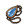|[護身符](道具.md#護身符)|0|算你識相，小子。|
|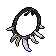|[牙齒項鏈](道具.md#牙齒項鏈)|1|上面的小牙齒就和玩具一樣，不過還算有趣。|
|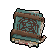|[《死靈之書》](道具.md#《死靈之書》)|-1|你想讓我用它墊桌腳嗎？|
|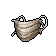|[自制口罩](道具.md#自制口罩)|-1|我可用不著這東西，以後拿點有用的過來。|
|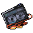|[隨身聽（開機）](道具.md#隨身聽（開機）)|0|算你識相，小子。|
||[隨身聽（關機）](道具.md#隨身聽（關機）)|0|算你識相，小子。|
||[隨身聽（沒電）](道具.md#隨身聽（沒電）)|0|算你識相，小子。|
|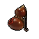|[酒葫蘆](道具.md#酒葫蘆)|1|小子\~你的禮物還算上道。|
|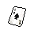|[黑桃A](道具.md#黑桃A)|-1|可笑的把戲！就和你一樣可笑！|
|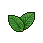|[薄荷葉](道具.md#薄荷葉)|0|算你識相，小子。|
||[薄荷葉卷](道具.md#薄荷葉卷)|0|算你識相，小子。|
|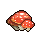|[蘑菇](道具.md#蘑菇)|0|算你識相，小子。|
|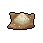|[蘑菇粉](道具.md#蘑菇粉)|0|算你識相，小子。|
|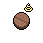|[瀉藥](道具.md#瀉藥)|-1|小子！你覺得我看上去像是會便秘嗎？|
|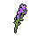|[紫鳶花](道具.md#紫鳶花)|-2|花…？你想我在手下面前丟臉嗎？！|
|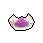|[花瓣粉](道具.md#花瓣粉)|0|算你識相，小子。|
||[安眠藥](道具.md#安眠藥)|0|算你識相，小子。|
|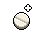|[止疼片](道具.md#止疼片)|0|算你識相，小子。|
|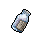|[興奮劑](道具.md#興奮劑)|0|算你識相，小子。|
|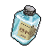|[醫用酒精](道具.md#醫用酒精)|0|算你識相，小子。|
|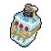|[酒精燈](道具.md#酒精燈)|0|算你識相，小子。|
||[鎮靜劑](道具.md#鎮靜劑)|0|算你識相，小子。|
||[啤酒](道具.md#啤酒)|2|哈\~你小子這回算是挑對禮物了！|
|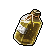|[蘋果酒](道具.md#蘋果酒)|1|以後多拿點這個過來，聽到沒有，小子？|
|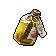|[精釀蘋果酒](道具.md#精釀蘋果酒)|1|以後多拿點這個過來，聽到沒有，小子？|
|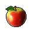|[蘋果](道具.md#蘋果)|1|以後多拿點這個過來，聽到沒有，小子？|
|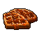|[華夫餅](道具.md#華夫餅)|0|算你識相，小子。|
||[奶油華夫餅](道具.md#奶油華夫餅)|1|甜食？我喜歡甜食！|
||[一把咖啡豆](道具.md#一把咖啡豆)|1|以後多拿點這個過來，聽到沒有，小子？|
|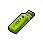|[口香糖](道具.md#口香糖)|0|算你識相，小子。|
|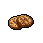|[曲奇餅乾](道具.md#曲奇餅乾)|0|算你識相，小子。|
||[焦糖棒](道具.md#焦糖棒)|1|甜食？我喜歡甜食！|
||[汽水](道具.md#汽水)|1|以後多拿點這個過來，聽到沒有，小子？|
||[酸奶](道具.md#酸奶)|0|算你識相，小子。|
||[土豆披薩](道具.md#土豆披薩)|2|哈\~你小子這回算是挑對禮物了！|
|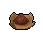|[咖啡粉](道具.md#咖啡粉)|1|以後多拿點這個過來，聽到沒有，小子？|
|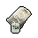|[茶包](道具.md#茶包)|-1|我不喜歡苦的東西，我已經吃了夠多苦了，你明白嗎？|
||[超辣泡麵](道具.md#超辣泡麵)|2|哈\~你小子這回算是挑對禮物了！|
|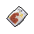|[蛋白粉](道具.md#蛋白粉)|1|以後多拿點這個過來，聽到沒有，小子？|
|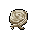|[布條](道具.md#布條)|-2|小子\~你以後最好想清楚再給我東西\~我不喜歡垃圾！|
|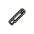|[迴紋針](道具.md#迴紋針)|-1|我可用不著這東西，以後拿點有用的過來。|
|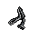|[開鎖器](道具.md#開鎖器)|-1|喂\~你覺得我會需要這個嗎？|
||[開鎖器(P)](道具.md#開鎖器(P))|-1|喂\~你覺得我會需要這個嗎？|
||[肥皂](道具.md#肥皂)|0|算你識相，小子。|
||[香皂](道具.md#香皂)|1|小子\~你的禮物還算上道。|
||[計算機](道具.md#計算機)|0|算你識相，小子。|
||[《花花世界》（全新）](道具.md#《花花世界》（全新）)|0|算你識相，小子。|
||[《花花世界》（看過）](道具.md#《花花世界》（看過）)|0|算你識相，小子。|
||[《花花世界》（翻爛）](道具.md#《花花世界》（翻爛）)|0|算你識相，小子。|
||[馬女郎海報](道具.md#馬女郎海報)|0|算你識相，小子。|
||[貓女郎海報](道具.md#貓女郎海報)|0|算你識相，小子。|
||[狐女郎海報](道具.md#狐女郎海報)|0|算你識相，小子。|
||[兔女郎海報](道具.md#兔女郎海報)|0|算你識相，小子。|
||[咖啡磨](道具.md#咖啡磨)|0|算你識相，小子。|
||[掌上遊戲機](道具.md#掌上遊戲機)|-1|這些按鈕也太小了，你是想看我出糗嗎？！|
||[掌上遊戲機（沒電）](道具.md#掌上遊戲機（沒電）)|-1|這些按鈕也太小了，你是想看我出糗嗎？！|
||[電池](道具.md#電池)|-1|我可用不著這東西，以後拿點有用的過來。|
||[牙刷](道具.md#牙刷)|0|算你識相，小子。|
||[牙膏](道具.md#牙膏)|0|算你識相，小子。|
||[空的牙膏管](道具.md#空的牙膏管)|-2|小子\~你以後最好想清楚再給我東西\~我不喜歡垃圾！|
||[消毒液](道具.md#消毒液)|-2|小子\~你以後最好想清楚再給我東西\~我不喜歡垃圾！|
||[除銹劑](道具.md#除銹劑)|-2|小子\~你以後最好想清楚再給我東西\~我不喜歡垃圾！|
||[火柴](道具.md#火柴)|-2|小子\~你以後最好想清楚再給我東西\~我不喜歡垃圾！|
||[膠帶](道具.md#膠帶)|-2|小子\~你以後最好想清楚再給我東西\~我不喜歡垃圾！|
||[顏料](道具.md#顏料)|-1|我可用不著這東西，以後拿點有用的過來。|
||[釘子](道具.md#釘子)|-2|小子\~你以後最好想清楚再給我東西\~我不喜歡垃圾！|
||[鞋帶](道具.md#鞋帶)|-2|小子\~你以後最好想清楚再給我東西\~我不喜歡垃圾！|
||[白紙](道具.md#白紙)|-2|小子\~你以後最好想清楚再給我東西\~我不喜歡垃圾！|
||[紙鶴](道具.md#紙鶴)|-2|這是什麼…？你在耍我嗎？|
||[花束](道具.md#花束)|-2|花…？你想我在手下面前丟臉嗎？！|
||[胡亂的涂鴉](道具.md#胡亂的涂鴉)|-2|這是什麼…？你在耍我嗎？|
||[簡單的漫畫](道具.md#簡單的漫畫)|-1|這畫可真蠢，就和你的臉一樣。|
||[精美的畫作](道具.md#精美的畫作)|0|算你識相，小子。|
||[鉛筆](道具.md#鉛筆)|-1|我可用不著這東西，以後拿點有用的過來。|
||[鉛筆](道具.md#鉛筆)|-1|我可用不著這東西，以後拿點有用的過來。|
||[圓珠筆](道具.md#圓珠筆)|-1|我可用不著這東西，以後拿點有用的過來。|
||[圓珠筆](道具.md#圓珠筆)|-1|我可用不著這東西，以後拿點有用的過來。|
||[硬幣](道具.md#硬幣)|-2|一塊錢？！你覺得我是乞丐嗎，小子？！|
||[長螺絲](道具.md#長螺絲)|-1|喂\~你覺得以我的實力，會需要這個嗎？|
||[扳手](道具.md#扳手)|0|算你識相，小子。|
||[湯匙](道具.md#湯匙)|-1|你覺得我會喜歡…一根勺子嗎？這他媽又不是根金勺子！|
||[湯匙](道具.md#湯匙)|-1|你覺得我會喜歡…一根勺子嗎？這他媽又不是根金勺子！|
||[釘錘](道具.md#釘錘)|0|算你識相，小子。|
||[剪刀](道具.md#剪刀)|-1|喂\~你覺得以我的實力，會需要這個嗎？|
||[碎玻璃](道具.md#碎玻璃)|-2|小子\~你以後最好想清楚再給我東西\~我不喜歡垃圾！|
||[玻璃匕首](道具.md#玻璃匕首)|-1|喂\~你覺得以我的實力，會需要這個嗎？|
||[玻璃匕首(+)](道具.md#玻璃匕首(+))|-1|喂\~你覺得以我的實力，會需要這個嗎？|
||[牙刷匕首](道具.md#牙刷匕首)|-1|喂\~你覺得以我的實力，會需要這個嗎？|
||[牙刷匕首(+)](道具.md#牙刷匕首(+))|-1|喂\~你覺得以我的實力，會需要這個嗎？|
||[水果刀](道具.md#水果刀)|-1|喂\~你覺得以我的實力，會需要這個嗎？|
||[折斷的木條](道具.md#折斷的木條)|-2|小子\~你以後最好想清楚再給我東西\~我不喜歡垃圾！|
||[雙節棍](道具.md#雙節棍)|-1|喂\~你覺得以我的實力，會需要這個嗎？|
||[雙節棍(+)](道具.md#雙節棍(+))|-1|喂\~你覺得以我的實力，會需要這個嗎？|
||[釘棒](道具.md#釘棒)|-1|喂\~你覺得以我的實力，會需要這個嗎？|
||[釘棒(+)](道具.md#釘棒(+))|-1|喂\~你覺得以我的實力，會需要這個嗎？|
||[鐵管](道具.md#鐵管)|-1|喂\~你覺得以我的實力，會需要這個嗎？|
||[皮帶](道具.md#皮帶)|0|算你識相，小子。|
||[皮帶](道具.md#皮帶)|0|算你識相，小子。|
||[發霉的麵包](道具.md#發霉的麵包)|-2|滾開！你是在討打嗎，白癡？！|
||[金龜子](道具.md#金龜子)|2|哈\~金色傳說！|
||[《森之音》](道具.md#《森之音》)|0|算你識相，小子。|
||[DEMO限定紙鶴](道具.md#DEMO限定紙鶴)|2|小子\~既然你拿出了這個，那我也不得不和你交個朋友了。|

