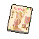

#  山羊．威爾伯

|體質|力量|敏捷|智力|幫派|戰鬥等級|勒索難度|持有天賦|取得天賦|
|:--:|:--:|:--:|:--:|:--:|:--:|:--:|:--:|:--:|
|6|4|7|9|無幫派|強|中|[機智](技能.md#機智)、[醫學](技能.md#醫學)、[建築師](技能.md#建築師)|[啟示之夢](技能.md#啟示之夢)|

## 故事

沉迷神秘主義的古怪山羊，嘴裡說著前言不搭後語的晦澀句子，好像和某個怪異的儀式相關。而你被他稱作降臨的鑰匙，仿佛會在其中會扮演重要角色。不知這只是他的胡亂妄想，還是真有某種超自然力量正在暗中作祟…

威爾伯的家鄉在一座名為“敦威爾”南部小鎮，那座小鎮的歷史非常久遠，但因為地理位置偏僻很少有外人踏足。威爾伯的家族在該鎮很有名望，祖父和父親都是知名學者，祖上傳下來的大莊園也搜藏了不少世間罕見的古物奇書。

年輕時期的威爾伯就和他的祖輩們一樣優秀，在名牌大學順利獲得了神學和語言學的雙博士學位後，威爾伯回到了家鄉繼承了莊園。隨後他就一頭扎進了莊園的地下圖書館中。圖書館內燦若繁星的知識讓威爾伯贊嘆不已，但最令他感興趣的還是那本家族秘傳的“古山羊語”版《死靈之書》。

當他翻開書封的那一刻起，仿佛有什麼東西就在他的腦袋中種下了種子。隨著他的深入閱讀，那顆種子就開始生根發芽。幾十年後，他的意志已經完全被那本書所占據，他也借此窺見了所謂的“宇宙真諦”。“它需要祭品。”威爾伯告訴你“群星的使者向我傳達了它的旨意，我必須服從。”你不知道這些話只是他的妄想，還是真有什麼在對他下達命令。總之，這個家伙照做了…

他以雇傭私人護士的理由在周邊城市發放傳單，很快高額的薪酬就吸引來了不少的年輕女孩。不過威爾伯的最後一項面試要求很奇怪，那就是他只錄用處女，理由是家族的傳統。看似變態的要求並沒有嚇退所有的應聘者，依然有不少的女孩得以進入莊園。

幾年之後，當接到報案的警察打開莊園地下室的大門時，眼前的一幕讓他們全部驚呆了。全裸的女孩們猶如著了魔一般，圍繞著一根詭異雕刻的石柱翩翩起舞，雖然血跡和淤青早已滲透了皮膚，但她們的臉上卻顯露出至福的笑容。

以虐待罪和非法囚禁罪被捕的威爾伯，本可以借由精神病醫生開具的證明逃脫法網。但令人無法理解的是，他卻在審查中表現出了出奇的“正常”，這讓他的“新家”從精神病院變為了這座監獄。他為什麼要這麼做？難道真如他所說，這一切都是“儀式的準備”嗎？

## 結識對話

- **你來啦\~我已等候多時…**
- {question1}
- 怎麼…？你知道我會來找你？
- **當然\~群星的使者，早已在推動命運的磨盤…**
- …你是在念什麼劇本臺詞嗎？
- **你是扭曲的鑰匙，注定會打開輪回的枷鎖…**
- 呃…我沒明白你的意思？
- **\~降臨的儀式，預備的禮節，它在暗中凝視。**
- *這家伙好像不太正常…*
- **\~滴血的匕首，閃動的火焰，失落的圖案，結束既是開始。**
- **我將指引你完成`使命`…**
- *（你感到了一絲莫名的`恐懼`）……*
- 呃\~我突然想到還有點急事，咱們下次再聊吧…
- **命運既是韁繩，你越是逃離，它便勒的越緊…**
- {pain1}

## 深入了解對話

- **開始既是結束…**
- **無法修復的柵欄，早已獻出的祭品。**
- **逃脫會讓它離的更近…**
- **噓…聆聽暗的低語吧。**

#### 回想`《克蘇斯的蘇醒》`。

> 你用小說裡的句子回應了他的胡言亂語，他總算願意好好說話了。

- *我好像能聽懂一些了…*
- *就讓我引用小說裡的句子來和他對話吧。*
- *他到底有什麼目的…*
- 你說的儀式究竟是什麼？
- **降臨、毀滅、虛無、回歸…**
- {sweat1}
- *…這家伙又開始了。*

#### 取消

- {sweat1}
- *果然\~又是這些完全聽不懂的鬼話。*
- *我得先想個辦法理解他在說什麼…*
- *或許得先看點`相關的書`才行。*

## 特殊對話

### 打招呼（關係極好）

- **Azchao'th, Bula Moce.**

### 打招呼（關係好）

- **注視著群星的位置吧…**

### 打招呼（關係一般）

- **命運的磨盤已經轉動…**

### 打招呼（關係差）

- **遵循它的旨意吧…**

### 打招呼（關係極差）

- **聆聽它的低語吧…**

### 進行毆打

- **廝殺吧，這是對混沌的供養…**
- **掙扎吧…在血和暗的深淵裡…**
- **對，沒錯…來吧，我將成為你的引路者。**

### 回禮

- **接納它，將混沌的種子傳遞下去吧…**

### 勒索成功

- **惡的欲望正在膨脹…這些錢就當做飼喂的養料吧。**

### 勒索失敗

- **愚蠢將會受到修正…而錯誤必會帶來懲罰。**

### 一起吃飯被拒

- **（低語）這個位置不屬於你…**

### 分享食物

- **無盡的饑餓正在等待吞噬…**

### 加藥被發現

- **我看見了…你手中之物…**

### 加藥辯解失敗

- **編織吧\~自縛的謊言之網…**

## 聊天

- *真是奇怪…我為什麼又來找這個瘋子？*
- **這都是命運的安排，你只是鑰匙而已，並不是開鎖人…**
- 喂！你怎麼知道我在想什麼？
- **作為“偉大者”的忠實仆從，我早已在夢中得到了預示。**
- **Yacaqu! Shub'th!**
- *哦\~！再和他說下去，我遲早也得發瘋…*

## 初始物品

||||||
|:--:|:--:|:--:|:--:|:--:|
||||||
|[眼鏡](19-眼鏡.md)|[剪刀](152-剪刀.md)|[薄荷葉](40-薄荷葉.md)*4|[布條](84-布條.md)*3|[膠帶](121-膠帶.md)*3|
||||||
|[鉛筆](131-鉛筆.md)|[白紙](125-白紙.md)*5|[湯匙](143-湯匙.md)*2|||

## 送禮

|圖片|物品名稱|好感|回應|
|:--:|--|:--:|--|
||[DEMO限定紙鶴](209-DEMO限定紙鶴.md)|50|使者…我遵從它的旨意…|
||[《死靈之書》](31-《死靈之書》.md)|24|Yacaqu! Shub'th!|
||[釘錘](151-釘錘.md)|24|Yacaqu! Shub'th!|
||[牙齒項鏈](30-牙齒項鏈.md)|18|殺戮之欲，渴血之源…|
||[水果刀](158-水果刀.md)|15|殺戮之欲，渴血之源…|
||[剪刀](152-剪刀.md)|12|殺戮之欲，渴血之源…|
||[眼鏡](19-眼鏡.md)|10|你將聽見“它”的謝意…|
||[鎮靜劑](53-鎮靜劑.md)|9|虛無之夢，輪回之環…|
||[長螺絲](136-長螺絲.md)|9|囚禁之樁，重生之地…|
||[酒精燈](52-酒精燈.md)|8|你將聽見“它”的謝意…|
||[安眠藥](47-安眠藥.md)|6|虛無之夢，輪回之環…|
||[興奮劑](50-興奮劑.md)|6|你將聽見“它”的謝意…|
||[玻璃匕首(+)](155-玻璃匕首(+).md)|6|你將聽見“它”的謝意…|
||[牙刷匕首(+)](157-牙刷匕首(+).md)|6|你將聽見“它”的謝意…|
||[薄荷葉](40-薄荷葉.md)|4|你將聽見“它”的謝意…|
||[蘑菇](42-蘑菇.md)|4|你將聽見“它”的謝意…|
||[蘑菇粉](43-蘑菇粉.md)|4|你將聽見“它”的謝意…|
||[紫鳶花](45-紫鳶花.md)|4|你將聽見“它”的謝意…|
||[花瓣粉](46-花瓣粉.md)|4|你將聽見“它”的謝意…|
||[止疼片](49-止疼片.md)|4|你將聽見“它”的謝意…|
||[釘子](123-釘子.md)|4|Yacaqu! Shub'th!|
||[玻璃匕首](154-玻璃匕首.md)|4|你將聽見“它”的謝意…|
||[牙刷匕首](156-牙刷匕首.md)|4|你將聽見“它”的謝意…|
||[碎玻璃](153-碎玻璃.md)|2|你將聽見“它”的謝意…|
||[口香糖](70-口香糖.md)|-2|噓……|
||[曲奇餅乾](71-曲奇餅乾.md)|-2|噓……|
||[布條](84-布條.md)|-2|噓……|
||[迴紋針](86-迴紋針.md)|-2|噓……|
||[電池](114-電池.md)|-2|噓……|
||[空的牙膏管](117-空的牙膏管.md)|-2|噓……|
||[消毒液](118-消毒液.md)|-2|噓……|
||[除銹劑](119-除銹劑.md)|-2|噓……|
||[火柴](120-火柴.md)|-2|噓……|
||[膠帶](121-膠帶.md)|-2|噓……|
||[顏料](122-顏料.md)|-2|噓……|
||[鞋帶](124-鞋帶.md)|-2|噓……|
||[白紙](125-白紙.md)|-2|噓……|
||[折斷的木條](159-折斷的木條.md)|-2|噓……|
||[黑桃A](39-黑桃A.md)|-4|噓……|
||[醫用酒精](51-醫用酒精.md)|-4|噓……|
||[蘋果](64-蘋果.md)|-4|噓……|
||[一把咖啡豆](69-一把咖啡豆.md)|-4|噓……|
||[焦糖棒](72-焦糖棒.md)|-4|噓……|
||[汽水](73-汽水.md)|-4|噓……|
||[酸奶](74-酸奶.md)|-4|噓……|
||[咖啡粉](76-咖啡粉.md)|-4|噓……|
||[茶包](77-茶包.md)|-4|噓……|
||[開鎖器](87-開鎖器.md)|-4|噓……|
||[開鎖器(P)](38-開鎖器(P).md)|-4|噓……|
||[肥皂](88-肥皂.md)|-4|噓……|
||[《花花世界》（翻爛）](104-《花花世界》（翻爛）.md)|-4|噓……|
||[牙刷](115-牙刷.md)|-4|噓……|
||[牙膏](116-牙膏.md)|-4|噓……|
||[胡亂的塗鴉](128-胡亂的塗鴉.md)|-4|噓……|
||[鉛筆](131-鉛筆.md)|-4|噓……|
||[鉛筆](132-鉛筆.md)|-4|噓……|
||[硬幣](135-硬幣.md)|-4|噓……|
||[湯匙](143-湯匙.md)|-4|噓……|
||[湯匙](144-湯匙.md)|-4|噓……|
||[發霉的麵包](200-發霉的麵包.md)|-4|噓……|
||[橡膠手套](25-橡膠手套.md)|-6|噓……|
||[薄荷葉卷](41-薄荷葉卷.md)|-6|噓……|
||[瀉藥](44-瀉藥.md)|-6|噓……|
||[啤酒](54-啤酒.md)|-6|噓……|
||[蘋果酒](55-蘋果酒.md)|-6|噓……|
||[華夫餅](67-華夫餅.md)|-6|噓……|
||[超辣泡麵](78-超辣泡麵.md)|-6|噓……|
||[蛋白粉](79-蛋白粉.md)|-6|噓……|
||[《花花世界》（看過）](103-《花花世界》（看過）.md)|-6|噓……|
||[紙鶴](126-紙鶴.md)|-6|噓……|
||[簡單的漫畫](129-簡單的漫畫.md)|-6|噓……|
||[釘棒](162-釘棒.md)|-6|噓……|
||[鐵管](164-鐵管.md)|-6|噓……|
||[帆布鞋](16-帆布鞋.md)|-8|噓……|
||[拖鞋](17-拖鞋.md)|-8|噓……|
||[毛線帽](22-毛線帽.md)|-8|噓……|
||[紅頭巾](23-紅頭巾.md)|-8|噓……|
||[綠頭巾](24-綠頭巾.md)|-8|噓……|
||[黑手](26-黑手.md)|-8|噓……|
||[自製口罩](32-自製口罩.md)|-8|噓……|
||[精釀蘋果酒](56-精釀蘋果酒.md)|-8|噓……|
||[奶油華夫餅](68-奶油華夫餅.md)|-8|噓……|
||[土豆披薩](75-土豆披薩.md)|-8|噓……|
||[香皂](89-香皂.md)|-8|噓……|
||[計算機](101-計算機.md)|-8|噓……|
||[《花花世界》（全新）](102-《花花世界》（全新）.md)|-8|噓……|
||[咖啡磨](109-咖啡磨.md)|-8|噓……|
||[花束](127-花束.md)|-8|噓……|
||[精美的畫作](130-精美的畫作.md)|-8|噓……|
||[圓珠筆](133-圓珠筆.md)|-8|噓……|
||[圓珠筆](134-圓珠筆.md)|-8|噓……|
||[雙節棍](160-雙節棍.md)|-8|噓……|
||[釘棒(+)](163-釘棒(+).md)|-8|噓……|
||[皮帶](166-皮帶.md)|-8|噓……|
||[皮帶](167-皮帶.md)|-8|噓……|
||[皮鞋](15-皮鞋.md)|-10|噓……|
||[墨鏡](18-墨鏡.md)|-10|噓……|
||[頭帶](20-頭帶.md)|-10|噓……|
||[酒葫蘆](37-酒葫蘆.md)|-10|噓……|
||[雙節棍(+)](161-雙節棍(+).md)|-10|噓……|
||[金龜子](202-金龜子.md)|-10|噓……|
||[運動鞋](14-運動鞋.md)|-12|噓……|
||[棒球帽](21-棒球帽.md)|-12|噓……|
||[手錶](27-手錶.md)|-12|噓……|
||[隨身聽（開機）](34-隨身聽（開機）.md)|-12|噓……|
||[隨身聽（關機）](35-隨身聽（關機）.md)|-12|噓……|
||[隨身聽（沒電）](36-隨身聽（沒電）.md)|-12|噓……|
||[馬女郎海報](105-馬女郎海報.md)|-12|噓……|
||[貓女郎海報](106-貓女郎海報.md)|-12|噓……|
||[狐女郎海報](107-狐女郎海報.md)|-12|噓……|
||[兔女郎海報](108-兔女郎海報.md)|-12|噓……|
||[掌上遊戲機](110-掌上遊戲機.md)|-12|噓……|
||[掌上遊戲機（沒電）](111-掌上遊戲機（沒電）.md)|-12|噓……|
||[扳手](142-扳手.md)|-12|噓……|
||[《森之音》](203-《森之音》.md)|-80|弱小的舊神，卑微的螻蟻。|
||[護身符](29-護身符.md)|-100|弱小的舊神，卑微的螻蟻。|

