# 動物迷城全文藝資料

## 書籍

### 從零開始學編程

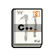

教授編程基礎知識的書，每章結尾還有20道的課后習題。全部做完的話，應該就有參加初級計算機考試的水準了。

#### 首次觀看

我記得指針應該是內存地址…可地址又是什么呀？\
唉\~這些題目也太難了…

#### 觀看完畢

呼\~最后一章的習題也做完了，現在來算算分數吧…\
…嗯…\
……！\
喂喂喂\~不會吧！我居然過及格線了！\
{happy1}

### 7天成為魔術師

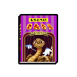

傳奇魔術師“響尾蛇·巴伯”編寫的魔術入門圖書。書中揭秘了在魔術表演中，他是如何利用“障眼法”來藏匿手中物品的。

#### 首次觀看

“先用語言吸引觀眾的注意，再趁機把小球塞進鞋子里…”\
嗯\~居然是鞋子，原來如…\
等一下，作者不是一條蛇嗎？他是哪里弄來的鞋子？

#### 觀看完畢

基本上看完了，雖然都是些基礎的小把戲而已。\
但用來戲弄獄警的話，應該也綽綽有余了…等著瞧吧。

### 生活大百科

一檔長壽電視節目推出的同名圖書。介紹了不少生活中的實用冷知識，比如大便壓水花的七種方法…

#### 首次觀看

原來泡面還能用來修理浴缸…真讓人大吃一驚。\
嗯\~不得不說，這書里的點子還真夠…冷的。

#### 觀看完畢

只要像圖上這樣擠壓，沒電的電池就能重新煥發活力…\
哈\~我好像終于從這本書上找到幾個有用的點子了！

### 手工大冒險

如兒童繪本一般可愛的圖書。書中以“工具箱·托比”為第一視角，講述了主人用它拯救“臥室星球”的故事。

#### 首次觀看

“下一個敵人是統治著“衣柜大陸”的混亂魔君…”\
“托比必須幫助主人制作出新的收納隔斷，才能封印敵人的力量！”\
哦\~！這劇情真是太刺激了…！

#### 觀看完畢

“托比和主人終于拯救了混亂不堪的臥室星球，不過他們的冒險還沒結束…”\
“來自廚房魔域的油膩大軍已經傾巢出動，這次的敵人將更加強大！”\
呼\~已經讀完了嗎？真想早點看到下一本啊\~

### 愛與酒

一本酒類品鑒書籍。介紹了品酒時應當注意的餐桌禮儀，以及適合在酒桌上說的99個桃色小段子…

#### 首次觀看

“喝紅酒的時候最好說些上三路的段子…”\
“而跟啤酒最搭的則是下三路的段子。”\
呃\~這是什么奇怪的理論？有科學依據嗎？

#### 觀看完畢

果然\~酒桌上最好的“配菜”就是這些桃色段子。\
無論喝的是哪種酒，以及一起喝酒的是哪些人…\
不得不說，這本書讓我對酒的了解又更深一步了。

### 時尚男孩

一本指導男士穿搭的時尚畫報。雖然出版日期已經是三年之前了…不過沒關系，監獄的時尚風潮過的總比外面慢很多。

#### 首次觀看

這個款式的帽子真的適合搭配綠色花邊的襪子嗎…？\
不過，可能這就是時尚吧。我不懂應該是我的問題…

#### 觀看完畢

翻完這本畫冊，我好像理解到一點時尚的含義了。\
時尚的秘密就是：越怪越貴，越貴越好。\
哈\~吸收了時尚精神的我，好像變得更有魅力了。

### 電視節目指南

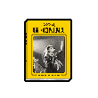

城市電視臺免費贈送的廣告冊。介紹了今年將會推出的電視節目。當然最吸引人的還是午夜綜藝《粉紅浴缸》的第八季。

#### 首次觀看

喂\~《橘貓兄弟》第十二季的男主角要換人了嗎？\
可是這個新演員他并不是一只“橘貓”呀？難道劇名要改成《兔猻兄弟》嗎？

#### 觀看完畢

嗯\~即使沒看過這些節目，光是讀介紹也覺得挺有趣呢…\
今晚就去放映廳看會兒電視吧\~我的興趣已經被勾起來了。\
{happy1}

### 拳王自傳

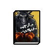

世界拳王“野牛·賈森”的自傳。書中詳細描寫了他在入獄三年間如何學習監獄斗毆，并在出獄后重奪冠軍腰帶的故事。

#### 首次觀看

“在面對三個長尾幫混蛋的夾擊時，我沒有退縮…”\
“監獄生活教會我的本領，我將悉數奉還！”\
哦\~！這家伙真是個鐵打的硬漢…

#### 觀看完畢

“外面的拳賽分的是輸贏，而監獄里的戰斗賭的是生死。”\
結尾的這一句\~是只有經歷過的人才能說出的話吧。\
讀完這本自傳，我好像對監獄斗毆理解的更深了。

### 克蘇斯的蘇醒

講述海底邪神“克蘇斯”蘇醒之后，毀滅世界的恐怖小說。被書評人稱作“超越極噩之夢的驚悚旅程”。

#### 首次觀看

“它扇動著粘液一般的巨大翼膜，懸浮在褪色的星光之下…”\
“發出如同指甲剮蹭黑板的刺耳回聲…”\
哦\~饒了我吧\~這簡直太可怕了…

#### 觀看完畢

要不是那些自作聰明的“調查員”，這個怪物也不會醒來。\
它最后變化成的形態，真是足夠讓我反胃好幾天的…\
不過，讀完這個之后，再可怕的噩夢也嚇不倒我了…

### 游戲寶典

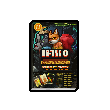

書中介紹了某著名游戲雜志評選出的“近二十年最值得通關的十款電子游戲”，并收錄了這些游戲的隱藏秘技。

#### 首次觀看

這款《功夫神龜》應該是我通關的第一個街機游戲了，當時真的花了我好多錢…\
沒想到集齊四個地圖碎片后，還能開啟隱藏關卡。\
真想找個機會再玩一遍啊\~

#### 觀看完畢

哈\~看了這么多攻略，我總算總結出一點規律了。\
雖然有些秘技藏得很深，但制作者總會留下點線索。\
下次玩到類似的游戲，我沒準一眼就能發現了！

### 冥想與禪修

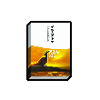

由著名的東方禪修大師“孔雀·穆”所寫。講述了空與無之中蘊含的力量，以及在困境下保持內心平靜的方法。

#### 首次觀看

“越是空，就越是滿，將目光從杯中移開…”\
……啊\~這些話也太深奧了，我完全聽不明白。

#### 觀看完畢

總算是讀完了\~雖然書里的道理基本沒看懂，但我的內心卻十分平靜。\
難道這就是禪修神秘莫測的的力量？

### 怪盜筆記上冊

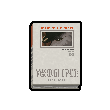

描寫傳奇怪盜“烏鴉·羅賓”的長篇小說的上冊。講述了羅賓是如何在層層戒備之下盜竊世界名畫，并營救美貌女伯爵的故事。

#### 首次觀看

“只見羅賓扔掉手杖，隨后縱身一躍跳下鐘樓…”\
“正當眾人都以為他必死無疑之時，一個黑影卻出現在了空中。”\
喂\~他可是只烏鴉啊！這些警衛難道不知道烏鴉會飛嗎？

#### 觀看完畢

“女伯爵醒來之后發現羅賓已經不見了蹤影，只在床上留下一張字條…”\
“女伯爵讀了字條后，望著窗外害羞的笑了。”\
哦\~不愧是怪盜羅賓，不但偷到了畫，還偷走了她的心。

### 怪盜筆記下冊

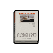

怪盜羅賓的故事將繼續發展，在這一部中他將直面他的最強對手探長“獵鷹·夏加尼”。不知羅賓還能否完成他的秘密計劃。

#### 首次觀看

“探長已經在郵輪布下了天羅地網，只等羅賓獻身。”\
哦\~！這個探長可不是個省油的燈，我看羅賓這次是遇到對手了。

#### 觀看完畢

“警探醒來之后發現羅賓已經不見了蹤影，只在桌上留下一張字條…”\
“警探讀了字條之后，氣的漲紅了臉！隨后大喊手下進來救他。”\
哈哈哈！真是出人意料，羅賓竟然在偷來的鉆石上涂了麻醉劑。\
警探在審訊他的時候，居然被繳獲的贓物給迷暈了。\
看來這次又是羅賓贏了，真不愧是傳說中的怪盜！

### 街頭防身50招

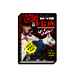

“本書介紹的防身術，融合了拳擊、摔跤、古流武術于一體。讓你無論是面對流氓、醉鬼，還是持械匪徒時都能從容應對。”

#### 首次觀看

“如果對方從背后襲胸的話，你可以用高跟鞋狠踩其腳背。”\
呃\~這一章好像是女子防身專門篇，我還是跳過好了…

#### 觀看完畢

“如果對方持有手槍和弩箭等遠程武器時，請記住…”\
“…立即逃跑，并盡快報警！”\
嗯\~我同意。畢竟這是武術，不是巫術…

### 逃脫大師回憶錄

已故的戲法大師“壁虎·威爾”在老年時期所寫的回憶錄。其中著重描寫了他人生之中三段著名的逃婚經歷，可謂精彩絕倫。

#### 首次觀看

“那年我只有二十出頭，我愛琳達，可我還沒有準備好和她結婚。”\
“所以我在婚禮上逃脫了，也算為她做了一次專屬表演。”\
喂\~！這個家伙做出這么過分的事情，居然毫無悔意…

#### 觀看完畢

“我離開她們，逃避婚姻，并不是不愛她…”\
“我的表演是在捉弄死神，好幾次因為道具損壞，我差點沒能活下來。”\
“我不想我的愛人成為年輕的寡婦。所以我只能做個無情的混蛋…”\
呃\~看來是我誤會他了，這個家伙其實也不壞。

### 改造大全

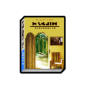

“想把散架的舊椅子變為院子里的秋千嗎？想在奶奶留下的閣樓里塞下更多東西嗎？千萬別錯過這本書！”

#### 首次觀看

榫卯結構真是神奇，居然不用釘子就能牢牢固定…\
而且還散發出一種哲學的美感，可能這就是東方的古老智慧吧。

#### 觀看完畢

按照這本書上的方法，我只要把柜子的隔斷往前稍微挪動5公分…\
再用一塊紙板從另一側插入進去，就能做出一個隱秘空間了。\
哈\~這么簡單的點子，我之前怎么沒想到呢。

### 國王的游戲I卷

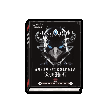

由著名作家“貓頭鷹·喬治”撰寫的奇幻巨著的第一卷。講述了鷹國的老國王死后，年幼的王子如何擊敗叔叔奪回王位的故事。

#### 首次觀看

“國王死后，公爵串通了宰相，誣陷王后施展巫術殺死了國王。”\
“即將被關入冰封牢籠的王后只能再見王子最后一面。”\
“他摸著王子的臉說道：這可不是孩子間的游戲，你該長大了…”\
哎\~真是一個悲慘的開篇。這小子怎么斗得過他那老奸巨猾的叔叔呢？

#### 觀看完畢

“隨著利爪刺入胸膛，公爵才知道自己被眼前的這個孩子給騙了。”\
“歷經了五年的臥薪嘗膽，王子終于報了當年的殺父囚母之仇。”\
“從今天開始，國王之位再次回歸正統！”\
呼\~沒想到他竟然會用離間計讓公爵和宰相間自相殘殺！\
這樣的逆境翻盤的故事，讀起來真是酣暢淋漓。

### 國王的游戲II卷

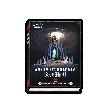

小說的第二部。在王子重登王位之后，他急切的想要找到將母親從冰封牢籠解救出來的方法。可這需要付出怎樣的代價呢？

#### 首次觀看

“皇家巫師告訴新國王，只有傳說中的龍焰才能融化冰封牢籠。”\
“而純種龍族早在古代戰爭中被消滅了，現在剩下的只有混血的龍鷹了。”\
啊\~看來最后的希望也破滅了，他該如何救出母親呢？

#### 觀看完畢

“看著牢籠之中被凍結的母親，國王終于采納了皇家巫師的建議…”\
“抓捕王國之中所有的龍鷹少女，用她們的血肉重塑一只傀儡巨龍。”\
“可是這樣瘋狂而殘忍的政令注定不會帶來好的結果…”\
“鷹之王國將再次陷入魔法與戰爭的深淵之中。”\
哎\~沒想到故事居然會發展成這樣。屠龍者終成惡龍了。

### 國王的游戲III卷

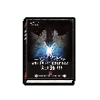

小說來到了高潮迭起的第三部！反抗軍首領"齊格飛"率領英雄們來到了王都城下。即將與國王和他的傀儡巨龍展開決戰！

#### 首次觀看

“傀儡巨龍雖尚未完成，可即使無法噴火，巨大的身軀依然可怖。”\
“許多英雄們都在攻城戰中戰死了，包括齊格飛的未婚妻…”\
哦\~該死\~這本書究竟要戳傷我的心多少次才肯罷休呢？\
每個我喜歡的角色最終的命運怎都如此的悲慘…

#### 觀看完畢

“隨著利劍刺入胸膛，傀儡巨龍的身體終于分崩離析，化為灰燼…”\
“這樣一來囚禁在它體內的龍鷹少女們的靈魂也能回歸天國了。”\
“而一旁的王座上，國王已不見了蹤影。此刻他正獨自走向冰封牢籠…”\
“既然無法救出母親，那么他就選擇去永遠陪伴她。”\
終于結束了嗎？這個充滿了悲劇色彩的故事。\
我猜作者是想說，無論多聰明的家伙，在權利面前都只是棋子而已。

### 辦公室瑜伽術

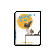

可以在狹小空間內練習瑜伽的指南圖書。專為久坐于辦公室的公司白領量身定制。是時下最受歡迎的健康之道。

#### 首次觀看

這個動作看起來也太難了吧\~誰的腿能彎成那樣？\
我還是挑兩個簡單一點的動作學一學好了…

#### 觀看完畢

沒想到在一米見方的地方可以完成這么多復雜的動作。\
我甚至都想把這些動作用在別的地方了…\
比如…最后的那招“超級摩天輪”。

### 談判專家鮑勃

一本關于商業并購技巧的書，作者是著名經濟學家“鮑勃.鮑爾”。讀完后或許能變得更會談判。

#### 首次觀看

“永遠別問對方要不要買，而是要問他想買幾個…”\
“…這樣你至少能賣出去一個，而不會一無所獲。”\
哦\~這招不錯，我學到了。

#### 觀看完畢

哈\~終于看完了！這書比想象中有趣不少呢。\
能把專業性如此強的書，寫的這么通俗，這個作者真有兩把刷子。\
我好像也稍微能摸到一點談判學的門道了。

### 量子學習法

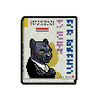

超級暢銷的學習法著作。書封上寫著“今日解密學習密碼，明日成就傳世偉業！”（哦~真是俗道家了…）

#### 首次觀看

這寫的都是些什么鬼東西。一點實質性的內容都沒有…

#### 觀看完畢

哦\~看這種書簡直就是在浪費時間，這種套話我都寫得出…\
哎…？這是不是說明，我也能去教別人這種學習法了。

## 遊戲

### 旋轉方塊T

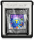

挑戰玩家反應力的游戲。本作還特別追加了高分生存模式。通關后或許能變得更加敏捷。

#### 首次觀看

剛剛的連續旋轉如果可以再熟練一點的話…\
說不定就能撐到下一關了。

#### 觀看完畢

最后一個高分挑戰也達成了！這樣一來也算是通關了吧。\
雖然是老游戲，不過玩法還真是經典。\
我的反應力好像也跟著變快了。

### 蘑菇兄弟

超經典的動作游戲。玩家扮演特種部隊王牌“蘑菇兄弟”。潛入敵人基地，營救被綁架的女科學家。超高難度，挑戰十足。

#### 首次觀看

這里實在是太難跳過去了，平臺又窄，距離又遠…\
哦\~可惡！又失敗了！這下要從水管那里重新開始了…

#### 觀看完畢

終于救出女科學家了！這下敵人的計劃應該泡湯了吧。\
這款游戲真是太有創意了。平臺跳躍和潛行真是絕配！\
我迫不及待想玩這個系列的下一部作品了！

### 像素世界

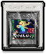

一款玩家可以釋放創意，制造世界的游戲。大到關卡地圖，小到裝備道具，無所不能。這款作品可謂掀起了游戲的革命。

#### 首次觀看

呃\~我好像得搭一座橋才能過河，可是木材不夠了…\
不過…或許我可以用這點木材建一條船，說不定也可以\~

#### 觀看完畢

通天塔終于建成了！這下最后一個收集品也能拿到了。\
現在就來看看最終的數據統計吧…\
哇\~我在游戲里居然制作了超過1000件物品，真是不可思議！

### 櫻花物語

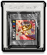

大受好評的戀愛模擬游戲。講述了玩家扮演的劇團經理帶領性格各異的女團員們完成全球巡演的故事。讓愛在掌中燃燒吧！

#### 首次觀看

“大和經理\~！你為什么會躲在女澡堂里呢？快出去！”\
哦\~弄錯選項了。這下花子對我的好感度得下降了。\
不過，我是真的很想看看澡堂里的景色啊…

#### 觀看完畢

“沒想到大和經理和我的心意是相通的，那我也不會再逃避了！”\
看來表白成功了！這樣就達成和庫莉兒成為情侶的結局了…\
雖然有點對不起花子。不過相比可愛，我還是喜歡性感更多啊\~

### 德古拉之怒

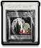

經典游戲《德庫拉復活》的外傳作品。本作完美繼承了系列扎實的手感，并講述了一百年前吸血鬼和亡靈爭奪魔域的故事。

#### 首次觀看

哈\~能扮演吸血鬼是在是太爽了！根本不用擔心扣血。\
既然這樣，我干脆把所有的技能點都用來提升暴擊好了。

#### 觀看完畢

這是最后一擊了\~你這個五條血的骷髏王！去死吧！\
……\
“是你贏了…吸血小子…但從今以后，永生的詛咒將會永遠伴隨著你…”\
死都死了，哪來那么多廢話？！快給我灰飛煙滅吧\~\
從現在開始，魔域的新主人就是我吸血鬼王德古拉了！

### 白狼IV

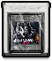

沉寂已久的《白狼》系列回歸之作。傳奇戰士“威廉”將再次奪回他的野性力量。而他的身世之謎又能否在本作中被解開呢？

#### 首次觀看

是救村民還是救女巫？哇\~這太讓人糾結了…\
村民雖然混蛋，但只是被蠱惑了而已。而女巫又這么的漂亮…\
啊\~算了。我還是在這里存個檔，然后都試試好了…

#### 觀看完畢

到最后也只是找到了一條項鏈，里面有主角身世的線索而已…\
看來故事還遠沒有結束，我估計這個系列至少得再出上兩、三作。\
希望那個時候，主角能完全解開他體內的力量封印吧。

### 昆蟲農場

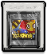

休閑游戲愛好者不能錯過的作品。讓你在掌中擁有屬于自己的昆蟲農場。充滿特色的種植和釀造系統更是備受玩家好評！

#### 首次觀看

一個蜂箱的收入是60塊，收獲時間是4天…\
一個酒桶的收入是30塊，收獲時間是8天…\
還要扣除成本！這簡直就是做數學題，根本不休閑吶…

#### 觀看完畢

我的農場被評為全鎮最佳了！果然裝飾品還是得鋪滿才行。\
玩了這個游戲還學到不少的農活知識。\
搞不好出獄后我還能去鄉下找個活干，畢竟我的南瓜可是全鎮最大的！

## 電視劇

### 肥皂公園

已經播出了十二季的情景喜劇。講述了”肥皂公園“小鎮上幾個嚙齒動物家庭間的搞笑故事。劇情因為庸俗且幼稚，而廣受大眾的歡迎。（今晚播出第{x1}集）

#### 首次觀看

片頭曲：叮咯啉咯叮\~叮咯啉咯叮\~肥皂公園逗開心\~\
旁白：第{x1}集《{x2}》，好戲開鑼\~

#### 觀看完畢

sitcom_evaluate

## 電影

### 柯里昂家族

改編自著名長篇小說《貓與雪茄煙》。講述了混跡黑道底層的“豹貓·柯里昂”是如何憑借自己的智慧和心狠手辣一步步成長為黑幫首領的故事。該片曾獲得最受囚犯喜愛電影的第二名。

#### 觀看完畢

居然不惜用一百萬來教兒子一個道理，這筆冤枉錢花的可真大氣！\
能做到這一步的，恐怕也只有“豹貓·柯里昂”了。\
看完之后，我好像明白真正的黑道究竟該如何行事了…

### 安迪的救贖

在南部的一座無名小鎮上，“犰狳·安迪”正在某幢建筑里，進行著一件不能透露的事情。本片被著名影評雜志《搶戲》評選為“十大絕不能被劇透影片”的榜首。

#### 觀看完畢

安迪的朋友們都錯了，他借走那條繩子只是為了假裝上吊而已。\
因為他調查過，醫院的墻壁是整座監獄里最薄的。\
哈\~這果然是一部不到最后都猜不到結局的電影…\
不過最讓我欽佩的，還是他臨危不亂的大心臟。

### 龍虎爭霸

天下第一武斗會上，武術大師“霍”被下毒暗算而死。他的徒弟“唐”決心查出幕后黑手，并親手為師傅報仇雪恨。

#### 觀看完畢

唐終于親手為師傅報仇了，真是一部精彩的功夫片啊！\
看的我熱血沸騰，好想也能擁有唐那樣的身手呀。\
還有他用的雙節棍，真是我見過最帥的武器了！啊噠\~

### 間諜任務

情報局王牌特工“海豹·伊森”重出江湖。在這一集中，犯罪集團首腦“S先生”盜取了名為“定海神針”的巨型武器。于是伊森將再度組建“羅漢小隊”，嘗試阻止“S先生”的邪惡計劃。

#### 觀看完畢

呃…怎么說呢…頭套的戲碼的確有點用多了。\
不過，中間的動作戲還是挺精彩的，特別是那段水下追逐戰。\
如果不是伊森超強的專注力，早就被“S先生”干掉了。

### 歡迎來到霍金斯

南部小鎮霍金斯突然遭受連續異常天氣侵襲，鎮上小學四年級的三個搗蛋鬼決定展開調查，尋找他們失蹤的<T>科學</T>老師“布朗博士”。

#### 觀看完畢

呼\~終于擊敗這個可以無限再生的怪物了！真是場驚險的戰斗！\
外星人絕不會想到，它們的侵略計劃居然會敗在幾個孩子手里。\
可能知識就是力量吧。看完之后我好像也學到了不少“冷科學”。

### 殺手之死

職業殺手“公雞·列奧”，體檢時被查出身患絕癥。生命不到一年的他，卻意外收到一個十六歲女孩的任務委托。在生命的最后時光，他又將作出怎樣的選擇呢？

#### 觀看完畢

{weep1}\
喔\~我哭了嗎？真是丟臉，這明明只是個電影而已…\
這個結局是不是個悲劇呢？這可能只有列奧自己才知道了。\
不過，這個男主角的演技真沒得說，全身上下都散發著魅力。

### 我有大老二

警方為了調查一個跨國假鈔集團，安排臥底探員“角馬·強尼”參加了一場有該集團首腦參與的撲克賭局。可是計劃進行中卻遭到內奸背叛，事到如今唯有贏得賭局才能獲得一線生機。

#### 觀看完畢

真是一場驚心動魄的賭局，我到現在還在耳根出汗。\
首腦最終敗在了自己的出千工具上，也算是自食其果吧。\
看來出千這種事情，還是得慎之又慎吶。

### 生死攀巖

影片記錄了“巖羊·亞歷山大”憑借自己的技巧和勇氣征服國王峰陡峭巖壁的傳奇事跡。本片被某知名獎項評選為“能夠改變你一生的十部電影”之一。

#### 觀看完畢

我到現在都說不出話來。他是那么平靜，但又充滿力量。\
可能是受到了他的感染，我也對攀巖也產生興趣了。\
雖然沒法像他那樣登上高山，但或許我可以爬些別的什么…

### 宇宙戰爭

廣袤的星河之中，正在爆發一場戰爭。充滿野心的西銀河提督公然反叛，挾持聯邦議會，妄圖統治銀河。而另一方，十八位自由艦隊的指揮官也已組成了聯軍。最終決戰即將打響！

#### 觀看完畢

青龍號的艦長帥呆了，居然把飛彈射進了巨熊號的主炮管里。\
這種駕駛技術，再加上無畏的勇氣。可謂是全銀河無雙了！\
據說這個系列會拍成三部曲，我已經等不及要看下一部了！

## 遊戲?

### 致命戰士

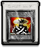

以超真實畫面為賣點的格斗游戲《絕命戰士》的續作。游戲在前作的基礎上增加了8名新戰士，和多達100種的挑釁動作！

#### 首次觀看

哈\~沒什么能比操縱女戰士更加血脈噴張的事了！\
特別是釋放絕招時的爆衣特寫，真是個天才的設計！

#### 觀看完畢

通關后就能選擇劇情模式里的大反派了，算是個小驚喜吧…\
不過這個家伙除了招式厲害一些，我對他實在缺少興趣。\
可能是形象太丑了點，完全不敢去想他爆衣時的樣子…

### 電競傳奇

一款電競主題的模擬經營游戲，目標是將手中名不見經傳的業余戰隊在幾個賽季的時間內培養為一支享譽世界的頂級強隊。

#### 首次觀看

下場比賽的對手戰力可不低，看來我得好好準備一番了。\
首先我需要招募一個新的打野，現在這個實在拉跨…

#### 觀看完畢

哦\~真是一場激烈的比賽，差一點就被對面翻盤了。\
這下終于得到世界賽的冠軍了，真得感謝我的這些隊員們啊…\
一起并肩作戰這么久，我是不會忘記你們的。

## 運動

### 籃球比賽

今晚播出：FBA（森林職業籃球聯賽）常規賽第32場，由“湖岸城浪花隊”主場迎戰“雙峰山螺旋槳隊”。（主客隊“支持率”比為：{x1}/{x2}）

#### 觀看完畢

真是場無聊的比賽。

### 籃球比賽

今晚播出：FBA（森林職業籃球聯賽）常規賽第33場，由“圓石城磁鐵隊”主場迎戰“首都巨像隊”。（主客隊“支持率”比為：{x1}/{x2}）

#### 觀看完畢

真是場無聊的比賽。

### 籃球比賽

今晚播出：FBA（森林職業籃球聯賽）常規賽第34場，由“四角城浪子隊”主場迎戰“黑沙島海盜隊”。（主客隊“支持率”比為：{x1}/{x2}）

#### 觀看完畢

真是場無聊的比賽。

### 籃球比賽

今晚播出：FBA（森林職業籃球聯賽）常規賽第35場，由“三岔灣風暴隊”主場迎戰“自由城利劍隊”。（主客隊“支持率”比為：{x1}/{x2}）

#### 觀看完畢

真是場無聊的比賽。

