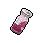
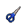

##  斑馬．富蘭克林

|體質|力量|敏捷|智力|
|:--:|:--:|:--:|:--:|
|8|7|10|7|

### 簡介

熱衷于機械制作的斑馬，常常在腦海里構思設計圖。你在無意間偷聽到了他的自言自語，誤以為他要制作的東西是一顆定時炸彈。你慌亂的打斷了他的思路，卻發現阻止的“大危機”只是一臺“自動掃地機”而已…

### 故事

富蘭克林自小就展現出了他天資不凡的創造能力，在五歲便可以獨自修理家中損壞的電器，十歲就獲得了幾項發明專利。幾年后，年紀輕輕的富蘭克林，就被一位教授看中，破格進入了知名大學深造。那位伯樂就是著名的發明家鼴鼠·埃迪。

富蘭克林在大學努力學習，很快就修完了全部的課程，還在課余時間完成了一項的新發明。埃迪教授鼓勵富蘭克林，這項發明很棒，希望他努力優化設計。他也會幫助富蘭克林找到對這項發明感興趣的投資人，不會讓這項能為世界帶來改變的發明埋沒在圖紙上。

可是幾周過后之后，埃迪教授回來告訴富蘭克林。雖然他已經極力的進行了推薦，但依然沒有投資人愿意相信一個寂寂無名的年輕發明家。正當富蘭克林心灰意冷之時，埃迪教授想出了一個權宜之計。他提出富蘭克林可以暫時把專利轉讓給他，以他的名氣肯定能得到投資人的信任，等制造出的產品大獲成功之后，他再將專利歸還給富蘭克林。出于對埃迪教授的信任，以及想要證明自己的迫切愿望，富蘭克林接受了這個提議。

就如埃迪教授所說，發明很快便得到了投資，產品也在一年之后順利推出。產品的大受歡迎讓富蘭克林激動不已，此刻他從內心深處感受到了身為一名發明家的成就感。幾天之后，他拜訪了埃迪教授，想與他溝通歸還專利的事宜。埃迪教授親切告訴富蘭克林，他早已找到投資人說明此事，但對方因為擔心會影響產品銷量而進行了拒絕。不過他答應富蘭克林，一定會繼續說服對方。

一周、一月、一年，富蘭克林每次前去詢問得到的答案都是否定，并且埃迪教授的態度也越來也不耐煩。最后一次登門拜訪甚至沒讓富蘭克林進門，并且斥責富蘭克林是個不知顧全大局的傻瓜。富蘭克林并不是傻瓜，他終于明白了埃迪教授的意思。那個權宜之計從一開始就是騙取他專利的卑鄙計劃，富蘭克林還一直尊敬的將他當做老師。

第二天，富蘭克林再次登門拜訪，不過這次他沒有提起歸還專利的事情，而是帶來了一件新發明的“測試型號”。見到“傻瓜”再次送上門來的埃迪教授喜出望外，熱情的迎接了富蘭克林，并且親自試用了這件“腦波放大器”…

“噼啪！”一股過載的電流從儀器中迸發出來。隨后，著名的大學教授、教育學家、發明家、企業家，鼴鼠·埃迪的腦損傷使其智力永久的降低到了三歲兒童的水平，這比富蘭克林設計的好的五歲水平還少了兩歲，看來“測試型號”的確存在著相當大的“風險”…

### 結識對話

- **（自言自語）如果把傳感器裝在底部，然后…**
- *傳感器…？*
- **（自言自語）再把計時器連接上去…**
- *計時器…？*
- **（自言自語）最后再接上紅線和藍線，那么…**
- *紅線和藍線…？*
- {think1}
- *這不是電影里常演的…`定時炸彈`嗎？*
- **（自言自語）只要打開開關，等倒計時結束之后，一切就都消失了…**
- {exclamation1}
- *一定是炸彈沒錯了！這家伙想要炸掉監獄！*
- *我得阻止他才行！！！*
- **{question1}**
- **喂！你站在這里好久了，難道是在偷聽嗎…？**
- 沒錯！你瘋狂的計劃已經被我發現了！
- **呃…`自動掃地機`這個點子真有這么爛嗎？**
- **我還以為會大受歡迎呢…**
- *自動…掃地機？*
- {sweat1}
- …是我想太多了嗎？

### 深入了解對話

- 嗨\~富蘭克林，你又在構思什么古怪的發明嗎？
- **{down1}**
- **哎\~我正在發愁呢…**
- **我的新發明遇到了困難，可能是圖紙上出了問題。**
- **你能看得懂設計草圖嗎？**

#### 你可別小看我的`智力`。

> 你很快找出了圖紙上的錯誤，他在高興之余說了些自己的故事。

- 檢查設計圖這種工作，對我來說小菜一碟\~
- **那事不宜遲，馬上開始吧…**
- *如果主角是我的話，我又會怎么做呢？*
- 被信任的人背叛的感覺很不好受吧…？
- **那家伙雖然是個騙子和混蛋，但他有句話卻沒說錯。**
- **他說“發明家的職責是為世界帶來幸福。”**
- **回想我的所作所為，也算是背叛了“發明家”這個職業吧。**
- **所以，我現在必須用更好的作品來替自己贖罪才行…**

#### 取消

- 抱歉\~數字和圖形對我來說簡直就是噩夢…
- 你最好找個比自己`更聰明`的家伙幫忙吧。
### 初始物品

|物品名稱|物品名稱|物品名稱|物品名稱|物品名稱|
|:--:|:--:|:--:|:--:|:--:|
|  |  |  |  |  |
| [墨鏡](道具.md#墨鏡) | [橡膠手套](道具.md#橡膠手套)*2 | [長螺絲](道具.md#長螺絲)*2 | [鐵管](道具.md#鐵管) | [蘋果](道具.md#蘋果)*2 |
|  |  |  |  |  |
| [計算器](道具.md#計算器) | [電池](道具.md#電池)*5 | [回形針](道具.md#回形針)*3 | [膠帶](道具.md#膠帶)*4 |  |
### 送禮

|圖片|物品名稱|好感|回應|
|:--:|--|:--:|--|
||[運動鞋](道具.md#運動鞋)|0|這或許有用\~呃\~也可能沒用…|
||[皮鞋](道具.md#皮鞋)|0|這或許有用\~呃\~也可能沒用…|
||[帆布鞋](道具.md#帆布鞋)|0|這或許有用\~呃\~也可能沒用…|
||[拖鞋](道具.md#拖鞋)|-1|拜托\~你打斷我的思路\~就為了這個？|
||[墨鏡](道具.md#墨鏡)|1|經過計算…我想我會用上它的。|
||[眼鏡](道具.md#眼鏡)|1|經過計算…我想我會用上它的。|
||[頭帶](道具.md#頭帶)|-1|拜托\~你打斷我的思路\~就為了這個？|
||[棒球帽](道具.md#棒球帽)|0|這或許有用\~呃\~也可能沒用…|
||[毛線帽](道具.md#毛線帽)|0|這或許有用\~呃\~也可能沒用…|
||[紅頭巾](道具.md#紅頭巾)|-1|拜托\~你打斷我的思路\~就為了這個？|
||[綠頭巾](道具.md#綠頭巾)|-1|拜托\~你打斷我的思路\~就為了這個？|
||[橡膠手套](道具.md#橡膠手套)|1|經過計算…我想我會用上它的。|
||[黑手](道具.md#黑手)|-1|拜托\~你打斷我的思路\~就為了這個？|
||[手表](道具.md#手表)|2|嘿\~我的新發明正需要這些元件！|
||[護身符](道具.md#護身符)|-1|呵呵\~你能靠祈禱來發電嗎？|
||[牙齒項鏈](道具.md#牙齒項鏈)|-1|拜托\~你打斷我的思路\~就為了這個？|
||[《死靈之書》](道具.md#《死靈之書》)|-1|這是什么？魔法？哦\~拜托，我只相信科學。|
||[自制口罩](道具.md#自制口罩)|1|經過計算…我想我會用上它的。|
||[隨身聽（開機）](道具.md#隨身聽（開機）)|2|嘿\~我的新發明正需要這些元件！|
||[隨身聽（關機）](道具.md#隨身聽（關機）)|2|嘿\~我的新發明正需要這些元件！|
||[隨身聽（沒電）](道具.md#隨身聽（沒電）)|2|嘿\~我的新發明正需要這些元件！|
||[酒葫蘆](道具.md#酒葫蘆)|-1|我需要保持清醒，非常清醒。|
||[黑桃A](道具.md#黑桃A)|0|這或許有用\~呃\~也可能沒用…|
||[薄荷葉](道具.md#薄荷葉)|0|這或許有用\~呃\~也可能沒用…|
||[薄荷葉卷](道具.md#薄荷葉卷)|0|這或許有用\~呃\~也可能沒用…|
||[蘑菇](道具.md#蘑菇)|0|這或許有用\~呃\~也可能沒用…|
||[蘑菇粉](道具.md#蘑菇粉)|0|這或許有用\~呃\~也可能沒用…|
||[瀉藥](道具.md#瀉藥)|-2|為什么給我這個？你的腦袋短路了嗎？！|
||[紫鳶花](道具.md#紫鳶花)|0|這或許有用\~呃\~也可能沒用…|
||[花瓣粉](道具.md#花瓣粉)|0|這或許有用\~呃\~也可能沒用…|
||[安眠藥](道具.md#安眠藥)|1|睡眠\~是對我天賦的一種浪費\~|
||[止疼片](道具.md#止疼片)|0|這或許有用\~呃\~也可能沒用…|
||[興奮劑](道具.md#興奮劑)|0|這或許有用\~呃\~也可能沒用…|
||[醫用酒精](道具.md#醫用酒精)|1|經過計算…我想我會用上它的。|
||[酒精燈](道具.md#酒精燈)|2|嚯\~監獄里的普羅米修斯\~|
||[鎮靜劑](道具.md#鎮靜劑)|0|這或許有用\~呃\~也可能沒用…|
||[啤酒](道具.md#啤酒)|-1|我需要保持清醒，非常清醒。|
||[蘋果酒](道具.md#蘋果酒)|-1|我需要保持清醒，非常清醒。|
||[精釀蘋果酒](道具.md#精釀蘋果酒)|-1|我需要保持清醒，非常清醒。|
||[蘋果](道具.md#蘋果)|2|這些維生素能讓我的大腦更活躍！|
||[華夫餅](道具.md#華夫餅)|0|這或許有用\~呃\~也可能沒用…|
||[奶油華夫餅](道具.md#奶油華夫餅)|0|這或許有用\~呃\~也可能沒用…|
||[一把咖啡豆](道具.md#一把咖啡豆)|1|睡眠\~是對我天賦的一種浪費\~|
||[口香糖](道具.md#口香糖)|0|這或許有用\~呃\~也可能沒用…|
||[曲奇餅干](道具.md#曲奇餅干)|0|這或許有用\~呃\~也可能沒用…|
||[焦糖棒](道具.md#焦糖棒)|1|我的腦細胞需要更多的糖分。|
||[汽水](道具.md#汽水)|0|這或許有用\~呃\~也可能沒用…|
||[酸奶](道具.md#酸奶)|0|這或許有用\~呃\~也可能沒用…|
||[土豆披薩](道具.md#土豆披薩)|0|這或許有用\~呃\~也可能沒用…|
||[咖啡粉](道具.md#咖啡粉)|1|睡眠\~是對我天賦的一種浪費\~|
||[茶包](道具.md#茶包)|1|睡眠\~是對我天賦的一種浪費\~|
||[超辣泡面](道具.md#超辣泡面)|0|這或許有用\~呃\~也可能沒用…|
||[蛋白粉](道具.md#蛋白粉)|0|這或許有用\~呃\~也可能沒用…|
||[布條](道具.md#布條)|0|這或許有用\~呃\~也可能沒用…|
||[回形針](道具.md#回形針)|0|這或許有用\~呃\~也可能沒用…|
||[開鎖器](道具.md#開鎖器)|0|這或許有用\~呃\~也可能沒用…|
||[開鎖器(P)](道具.md#開鎖器(P))|0|這或許有用\~呃\~也可能沒用…|
||[肥皂](道具.md#肥皂)|0|這或許有用\~呃\~也可能沒用…|
||[香皂](道具.md#香皂)|0|這或許有用\~呃\~也可能沒用…|
||[計算器](道具.md#計算器)|2|嘿\~我的新發明正需要這些元件！|
||[《花花世界》（全新）](道具.md#《花花世界》（全新）)|1|……有時候放松一下也很必要。|
||[《花花世界》（看過）](道具.md#《花花世界》（看過）)|0|這或許有用\~呃\~也可能沒用…|
||[《花花世界》（翻爛）](道具.md#《花花世界》（翻爛）)|0|這或許有用\~呃\~也可能沒用…|
||[馬女郎海報](道具.md#馬女郎海報)|1|……有時候放松一下也很必要。|
||[貓女郎海報](道具.md#貓女郎海報)|0|這或許有用\~呃\~也可能沒用…|
||[狐女郎海報](道具.md#狐女郎海報)|0|這或許有用\~呃\~也可能沒用…|
||[兔女郎海報](道具.md#兔女郎海報)|0|這或許有用\~呃\~也可能沒用…|
||[咖啡磨](道具.md#咖啡磨)|1|經過計算…我想我會用上它的。|
||[掌上游戲機](道具.md#掌上游戲機)|2|嘿\~我的新發明正需要這些元件！|
||[掌上游戲機（沒電）](道具.md#掌上游戲機（沒電）)|2|嘿\~我的新發明正需要這些元件！|
||[電池](道具.md#電池)|1|經過計算…我想我會用上它的。|
||[牙刷](道具.md#牙刷)|0|這或許有用\~呃\~也可能沒用…|
||[牙膏](道具.md#牙膏)|0|這或許有用\~呃\~也可能沒用…|
||[空的牙膏管](道具.md#空的牙膏管)|0|這或許有用\~呃\~也可能沒用…|
||[消毒液](道具.md#消毒液)|0|這或許有用\~呃\~也可能沒用…|
||[除銹劑](道具.md#除銹劑)|1|經過計算…我想我會用上它的。|
||[火柴](道具.md#火柴)|0|這或許有用\~呃\~也可能沒用…|
||[膠帶](道具.md#膠帶)|0|這或許有用\~呃\~也可能沒用…|
||[顏料](道具.md#顏料)|-1|拜托\~你打斷我的思路\~就為了這個？|
||[釘子](道具.md#釘子)|0|這或許有用\~呃\~也可能沒用…|
||[鞋帶](道具.md#鞋帶)|0|這或許有用\~呃\~也可能沒用…|
||[白紙](道具.md#白紙)|0|這或許有用\~呃\~也可能沒用…|
||[紙鶴](道具.md#紙鶴)|0|這或許有用\~呃\~也可能沒用…|
||[花束](道具.md#花束)|-1|拜托\~你打斷我的思路\~就為了這個？|
||[胡亂的涂鴉](道具.md#胡亂的涂鴉)|-2|為什么給我這個？你的腦袋短路了嗎？！|
||[簡單的漫畫](道具.md#簡單的漫畫)|-1|拜托\~你打斷我的思路\~就為了這個？|
||[精美的畫作](道具.md#精美的畫作)|0|這或許有用\~呃\~也可能沒用…|
||[鉛筆](道具.md#鉛筆)|0|這或許有用\~呃\~也可能沒用…|
||[鉛筆](道具.md#鉛筆)|0|這或許有用\~呃\~也可能沒用…|
||[圓珠筆](道具.md#圓珠筆)|0|這或許有用\~呃\~也可能沒用…|
||[圓珠筆](道具.md#圓珠筆)|0|這或許有用\~呃\~也可能沒用…|
||[硬幣](道具.md#硬幣)|0|這或許有用\~呃\~也可能沒用…|
||[長螺絲](道具.md#長螺絲)|2|嘿\~我的新發明正需要這些元件！|
||[扳手](道具.md#扳手)|2|我說\~你簡直就像擁有一個四維空間袋！|
||[湯匙](道具.md#湯匙)|0|這或許有用\~呃\~也可能沒用…|
||[湯匙](道具.md#湯匙)|0|這或許有用\~呃\~也可能沒用…|
||[釘錘](道具.md#釘錘)|2|我說\~你簡直就像擁有一個四維空間袋！|
||[剪刀](道具.md#剪刀)|0|這或許有用\~呃\~也可能沒用…|
||[碎玻璃](道具.md#碎玻璃)|0|這或許有用\~呃\~也可能沒用…|
||[玻璃匕首](道具.md#玻璃匕首)|-1|這東西在我眼里就像是原始人的石頭。|
||[玻璃匕首(+)](道具.md#玻璃匕首(+))|-1|這東西在我眼里就像是原始人的石頭。|
||[牙刷匕首](道具.md#牙刷匕首)|-1|這東西在我眼里就像是原始人的石頭。|
||[牙刷匕首(+)](道具.md#牙刷匕首(+))|-1|這東西在我眼里就像是原始人的石頭。|
||[水果刀](道具.md#水果刀)|0|這或許有用\~呃\~也可能沒用…|
||[折斷的木條](道具.md#折斷的木條)|0|這或許有用\~呃\~也可能沒用…|
||[雙節棍](道具.md#雙節棍)|-1|這東西在我眼里就像是原始人的石頭。|
||[雙節棍(+)](道具.md#雙節棍(+))|-1|這東西在我眼里就像是原始人的石頭。|
||[釘棒](道具.md#釘棒)|-1|這東西在我眼里就像是原始人的石頭。|
||[釘棒(+)](道具.md#釘棒(+))|-1|這東西在我眼里就像是原始人的石頭。|
||[鐵管](道具.md#鐵管)|0|這或許有用\~呃\~也可能沒用…|
||[皮帶](道具.md#皮帶)|0|這或許有用\~呃\~也可能沒用…|
||[皮帶](道具.md#皮帶)|0|這或許有用\~呃\~也可能沒用…|
||[發霉的面包](道具.md#發霉的面包)|-2|為什么給我這個？你的腦袋短路了嗎？！|
||[金龜子](道具.md#金龜子)|2|哈\~金色傳說！|
||[《森之音》](道具.md#《森之音》)|-1|呵呵\~你能靠祈禱來發電嗎？|
||[DEMO限定紙鶴](道具.md#DEMO限定紙鶴)|2|我懷疑這里面有影響腦電波的裝置…|

