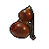

##  斑鬣狗．文森特

|體質|力量|敏捷|智力|幫派|
|:--:|:--:|:--:|:--:|:--:|
|8|7|8|6|尖牙幫成員|

### 故事

玩世不恭的斑鬣狗，嘴里總是哼著匪幫說唱，監獄里的日子對他來說仿佛度假一般愜意。原來他之所以入獄，是因為幫著外面的老大頂了罪。按照幫派的規矩，等他出獄之後，就能分得一塊屬於自己的地盤。他成為黑幫之星的夢想眼看就要實現了。

出生在下城區的文森特就和其他的壞小子一樣，從小厭惡學習，對成為一名黑幫份子充滿了向往。他最愛的的音樂是匪幫說唱，最愛的電影是《江湖浪仔》，他渴望像電影里的男主角一樣叱咤風云的生活。於是從小學開始，他就逃課為黑幫傳遞口信，即使被警察抓住也沒有把內容供出來。不知他是真的有膽識，還只是單純的少根筋而已，總之這種性格受到了黑幫老大的賞識。自此小小年紀的文森特就成為了老大的一名直系手下。

擁有高起點的文森特原本以為他的黑幫之路就會如此這般的順風順水。但沒想到的是，他并不聰明的頭腦卻成了自己邁向成功的絆腳石。一次次搞砸了老大交給他的任務，讓他逐漸被排擠到了幫派的邊緣，直到多年之後文森特依然還待在底層中的底層…

直到三年前的一天，改變文森特命名的機會來了，至少他自己是這麼認為的。他的老大醉酒在家中誤殺了自己的情婦，而這個案子的消息又被走漏給了警方。老大為了脫罪只剩一個辦法，那就是找個家伙來頂包。得知這個消息的文森特思來想去，發現這是他翻盤的唯一機會了，至少替老大坐牢這件事他不會搞砸。於是文森特主動投案自首，被判誤殺罪服刑五年。

“幫派規矩，凡替老大坐牢者皆為大恩！可得數萬安家費，或受領地盤一塊。若得老大首肯，還可在換屆時競選接班人。”一心只想在黑幫混出名堂的文森特自然看不上那區區幾萬的安家費。他選擇了凈身入監，只等出獄那天，前來接他的幫派小弟們喊上一聲“大哥，辛苦了！”

### 結識對話

- **（節奏）喲喲喲\~我就像架轟炸機在你頭頂傾瀉炸彈！**
- **（節奏）耶耶耶\~你只能像個蟲子在我腳下抱頭鼠竄！**
- **喂\~怎麼樣？這兩句夠勁吧！**
- **這可是我昨晚想了一夜才琢磨出來的\~炸場詞！**
  - 我不是很懂音樂…
  - 是有那麼一點上頭。 `好感+5`
- **像我們監獄匪幫，就該唱這種風格的說唱！**
- 你關在這里好像還挺開心…？
- **當然了！我和你們可不一樣，我來這兒可是在鍍金深造！**
- **（小聲）告訴你個秘密…你知道我為什麼會進來嗎？**
- {question1}
- **三年前我外面的老大犯了事，我二話不說幫他把黑鍋背了。**
- **你明白這意味著什麼嗎？**
- {think1}
- **這意味著，我`斑鬣狗·文森特`就是老大欽定的接班人了！**
- **等過兩年我出獄的時候，就能擁有一塊自己的地盤了\~喲！**
- **{happy1}**

### 深入了解對話

- **（節奏）喲喲喲\~盯緊我雙手間的作秀！**
- **（節奏）啾啾啾\~跟上我三分球的節奏！**
  - 這又是你剛想的新詞？
  - 你的作詞水平真“穩定”。
- **是吧？我就知道這歌準能炸！**
- **嘿？你要不要也來接一句？**

#### 我可是個`籃球高手`。

> 他又和你分享了不少“作品”，其中幾首還改編於自己的街頭生涯。

- “嗙叱唻”就交給我吧！
- \~盯緊我雙手間的作秀！
- \~跟上我三分球的節奏！
- ……
- \~最後，我會在你頭上暴扣！
- **喔！喔！喔！**
- **這句真是\~炸！翻！全！場！**
- *他的故事就像他的歌詞一樣無厘頭…*
- 你幫了老大這麼大的忙，他應該常來看你吧？
- **哈\~他們都說我不聰明，我看你比我還笨。**
- **我可是幫老大頂的包，他要是來看我，那不是都露餡了嗎？**
- 你的意思是他從沒來看過你？
- **吶\~這些表面文章都不重要！**
- **咱們混街頭的，義氣都是放在心里的，你懂嗎？**

#### 取消

- 這種程度的韻腳結構，我是不會怕啦，只是…
- 我對`籃球`的了解不多，一時想不出強勁的“嗙叱唻”。
- **的確！也只有我這種`籃球高手`才能寫出如此\~斯哥\~的詞！**
- **{happy1}**

### 打招呼

#### 關係極好

- **喲\~伙計\~想聽我的新歌嗎？**

#### 關係好

- **喲喲\~是你呀\~**

#### 關係一般

- **嘿喂呴\~保持節奏\~**

#### 關係不好

- **喂\~在我面前可別囂張。**

#### 關係極差

- **喂\~你是來找茬的嗎？！**

### 初始物品

||||||
|:--:|:--:|:--:|:--:|:--:|
|  |  |  |  |  |
| [紅頭巾](道具.md#紅頭巾) | [牙刷匕首](道具.md#牙刷匕首) | [玻璃匕首](道具.md#玻璃匕首) | [水果刀](道具.md#水果刀) | [蘑菇](道具.md#蘑菇)*3 |
|  |  |  |  |  |
| [興奮劑](道具.md#興奮劑) | [口香糖](道具.md#口香糖)*3 | [迴紋針](道具.md#迴紋針)*3 | [發霉的麵包](道具.md#發霉的麵包)*3 |  |

### 送禮

|圖片|物品名稱|好感|回應|
|:--:|--|:--:|--|
||[運動鞋](道具.md#運動鞋)|12|喲喲\~伙計，我喜歡這個！|
||[皮鞋](道具.md#皮鞋)|0|嘿\~我剛才就預感會有好事發生！|
||[帆布鞋](道具.md#帆布鞋)|0|嘿\~我剛才就預感會有好事發生！|
||[拖鞋](道具.md#拖鞋)|0|嘿\~我剛才就預感會有好事發生！|
||[墨鏡](道具.md#墨鏡)|10|嘿\~我戴上這個一定會酷炸天！|
||[眼鏡](道具.md#眼鏡)|-20|喂\~這是什麼鬼東西？我他媽才不想要！|
||[頭帶](道具.md#頭帶)|10|喲喲\~伙計，我喜歡這個！|
||[棒球帽](道具.md#棒球帽)|0|嘿\~我剛才就預感會有好事發生！|
||[毛線帽](道具.md#毛線帽)|0|嘿\~我剛才就預感會有好事發生！|
||[紅頭巾](道具.md#紅頭巾)|16|哈\~我的帥氣值就要爆表了！|
||[綠頭巾](道具.md#綠頭巾)|8|喲喲\~伙計，我喜歡這個！|
||[橡膠手套](道具.md#橡膠手套)|0|嘿\~我剛才就預感會有好事發生！|
||[黑手](道具.md#黑手)|0|嘿\~我剛才就預感會有好事發生！|
||[手錶](道具.md#手錶)|0|嘿\~我剛才就預感會有好事發生！|
||[護身符](道具.md#護身符)|-10|嘖\~別給我這麼無趣的東西好嗎？|
||[牙齒項鏈](道具.md#牙齒項鏈)|24|嘿\~我戴上這個一定會酷炸天！|
||[《死靈之書》](道具.md#《死靈之書》)|-24|別他媽勸我看書，我來這兒又不是上學的！|
||[自制口罩](道具.md#自制口罩)|-8|嘖\~別給我這麼無趣的東西好嗎？|
||[隨身聽（開機）](道具.md#隨身聽（開機）)|24|喲喲喲\~！伙計你可真夠哥們！|
||[隨身聽（關機）](道具.md#隨身聽（關機）)|24|喲喲喲\~！伙計你可真夠哥們！|
||[隨身聽（沒電）](道具.md#隨身聽（沒電）)|24|喲喲喲\~！伙計你可真夠哥們！|
||[酒葫蘆](道具.md#酒葫蘆)|10|喲喲\~伙計，我喜歡這個！|
||[黑桃A](道具.md#黑桃A)|0|嘿\~我剛才就預感會有好事發生！|
||[薄荷葉](道具.md#薄荷葉)|0|嘿\~我剛才就預感會有好事發生！|
||[薄荷葉卷](道具.md#薄荷葉卷)|6|喲喲\~伙計，我喜歡這個！|
||[蘑菇](道具.md#蘑菇)|8|嘿喂呴\~采蘑菇的小鬣狗\~|
||[蘑菇粉](道具.md#蘑菇粉)|4|喲喲\~伙計，我喜歡這個！|
||[瀉藥](道具.md#瀉藥)|0|嘿\~我剛才就預感會有好事發生！|
||[紫鳶花](道具.md#紫鳶花)|-4|嘖\~別給我這麼無趣的東西好嗎？|
||[花瓣粉](道具.md#花瓣粉)|-4|嘖\~別給我這麼無趣的東西好嗎？|
||[安眠藥](道具.md#安眠藥)|-4|嘖\~別給我這麼無趣的東西好嗎？|
||[止疼片](道具.md#止疼片)|0|嘿\~我剛才就預感會有好事發生！|
||[興奮劑](道具.md#興奮劑)|12|為無聊的監獄生活加點佐料吧！|
||[醫用酒精](道具.md#醫用酒精)|0|嘿\~我剛才就預感會有好事發生！|
||[酒精燈](道具.md#酒精燈)|0|嘿\~我剛才就預感會有好事發生！|
||[鎮靜劑](道具.md#鎮靜劑)|-12|等等\~鎮靜？！我他媽最不需要的就是鎮靜！|
||[啤酒](道具.md#啤酒)|6|喲喲\~伙計，我喜歡這個！|
||[蘋果酒](道具.md#蘋果酒)|6|喲喲\~伙計，我喜歡這個！|
||[精釀蘋果酒](道具.md#精釀蘋果酒)|8|喲喲\~伙計，我喜歡這個！|
||[蘋果](道具.md#蘋果)|-4|嘔\~我可不想吃這種東西\~|
||[華夫餅](道具.md#華夫餅)|-6|嘔\~我可不想吃這種東西\~|
||[奶油華夫餅](道具.md#奶油華夫餅)|-8|嘔\~我可不想吃這種東西\~|
||[一把咖啡豆](道具.md#一把咖啡豆)|0|嘿\~我剛才就預感會有好事發生！|
||[口香糖](道具.md#口香糖)|2|喲喲\~伙計，我喜歡這個！|
||[曲奇餅乾](道具.md#曲奇餅乾)|-2|嘔\~我可不想吃這種東西\~|
||[焦糖棒](道具.md#焦糖棒)|4|喲喲\~伙計，我喜歡這個！|
||[汽水](道具.md#汽水)|4|喲喲\~伙計，我喜歡這個！|
||[酸奶](道具.md#酸奶)|4|喲喲\~伙計，我喜歡這個！|
||[土豆披薩](道具.md#土豆披薩)|-8|嘔\~我可不想吃這種東西\~|
||[咖啡粉](道具.md#咖啡粉)|0|嘿\~我剛才就預感會有好事發生！|
||[茶包](道具.md#茶包)|-8|喂\~我看著像一邊喝茶一邊看書的呆子嗎？！|
||[超辣泡麵](道具.md#超辣泡麵)|-6|嘔\~我可不想吃這種東西\~|
||[蛋白粉](道具.md#蛋白粉)|0|嘿\~我剛才就預感會有好事發生！|
||[布條](道具.md#布條)|-2|嘖\~我要這破爛干什麼？！|
||[迴紋針](道具.md#迴紋針)|0|嘿\~我剛才就預感會有好事發生！|
||[開鎖器](道具.md#開鎖器)|4|喲喲\~這小玩意兒好像有點意思。|
||[開鎖器(P)](道具.md#開鎖器(P))|4|喲喲\~這小玩意兒好像有點意思。|
||[肥皂](道具.md#肥皂)|-4|我可不用這個，真男人就該臭一點！|
||[香皂](道具.md#香皂)|-8|我可不用這個，真男人就該臭一點！|
||[計算機](道具.md#計算機)|-16|喂\~這是什麼鬼東西？我他媽才不想要！|
||[《花花世界》（全新）](道具.md#《花花世界》（全新）)|16|喲喲喲\~！伙計你可真夠哥們！|
||[《花花世界》（看過）](道具.md#《花花世界》（看過）)|6|喲喲\~伙計，我喜歡這個！|
||[《花花世界》（翻爛）](道具.md#《花花世界》（翻爛）)|0|嘿\~我剛才就預感會有好事發生！|
||[馬女郎海報](道具.md#馬女郎海報)|24|喲喲喲\~！伙計你可真夠哥們！|
||[貓女郎海報](道具.md#貓女郎海報)|12|喲喲\~伙計，我喜歡這個！|
||[狐女郎海報](道具.md#狐女郎海報)|12|喲喲\~伙計，我喜歡這個！|
||[兔女郎海報](道具.md#兔女郎海報)|0|嘿\~我剛才就預感會有好事發生！|
||[咖啡磨](道具.md#咖啡磨)|0|嘿\~我剛才就預感會有好事發生！|
||[掌上遊戲機](道具.md#掌上遊戲機)|12|喲喲\~伙計，我喜歡這個！|
||[掌上遊戲機（沒電）](道具.md#掌上遊戲機（沒電）)|12|喲喲\~伙計，我喜歡這個！|
||[電池](道具.md#電池)|0|嘿\~我剛才就預感會有好事發生！|
||[牙刷](道具.md#牙刷)|-4|嘖\~別給我這麼無趣的東西好嗎？|
||[牙膏](道具.md#牙膏)|-4|嘖\~別給我這麼無趣的東西好嗎？|
||[空的牙膏管](道具.md#空的牙膏管)|-4|喂喂喂！別把垃圾塞給我！|
||[消毒液](道具.md#消毒液)|-2|嘖\~別給我這麼無趣的東西好嗎？|
||[除銹劑](道具.md#除銹劑)|-2|嘖\~別給我這麼無趣的東西好嗎？|
||[火柴](道具.md#火柴)|0|嘿\~我剛才就預感會有好事發生！|
||[膠帶](道具.md#膠帶)|-2|嘖\~我要這破爛干什麼？！|
||[顏料](道具.md#顏料)|-2|嘖\~別給我這麼無趣的東西好嗎？|
||[釘子](道具.md#釘子)|-2|嘖\~我要這破爛干什麼？！|
||[鞋帶](道具.md#鞋帶)|-2|嘖\~我要這破爛干什麼？！|
||[白紙](道具.md#白紙)|-2|嘖\~我要這破爛干什麼？！|
||[紙鶴](道具.md#紙鶴)|-12|喂\~這是什麼鬼東西？我他媽才不想要！|
||[花束](道具.md#花束)|-16|我看著像是會喜歡花的娘娘腔嗎？！混蛋！|
||[胡亂的涂鴉](道具.md#胡亂的涂鴉)|-4|嘖\~我要這破爛干什麼？！|
||[簡單的漫畫](道具.md#簡單的漫畫)|-6|嘖\~別給我這麼無趣的東西好嗎？|
||[精美的畫作](道具.md#精美的畫作)|-8|嘖\~別給我這麼無趣的東西好嗎？|
||[鉛筆](道具.md#鉛筆)|-8|喂\~我看著像是需要這個的書呆子嗎？！|
||[鉛筆](道具.md#鉛筆)|-8|喂\~我看著像是需要這個的書呆子嗎？！|
||[圓珠筆](道具.md#圓珠筆)|-16|喂\~我看著像是需要這個的書呆子嗎？！|
||[圓珠筆](道具.md#圓珠筆)|-16|喂\~我看著像是需要這個的書呆子嗎？！|
||[硬幣](道具.md#硬幣)|0|嘿\~我剛才就預感會有好事發生！|
||[長螺絲](道具.md#長螺絲)|0|嘿\~我剛才就預感會有好事發生！|
||[扳手](道具.md#扳手)|12|喲喲\~伙計，我喜歡這個！|
||[湯匙](道具.md#湯匙)|0|嘿\~我剛才就預感會有好事發生！|
||[湯匙](道具.md#湯匙)|0|嘿\~我剛才就預感會有好事發生！|
||[釘錘](道具.md#釘錘)|12|喲喲\~伙計，我喜歡這個！|
||[剪刀](道具.md#剪刀)|16|哈\~伙計！這下我要牛逼了！|
||[碎玻璃](道具.md#碎玻璃)|0|嘿\~我剛才就預感會有好事發生！|
||[玻璃匕首](道具.md#玻璃匕首)|4|喲喲\~伙計，我喜歡這個！|
||[玻璃匕首(+)](道具.md#玻璃匕首(+))|6|喲喲\~伙計，我喜歡這個！|
||[牙刷匕首](道具.md#牙刷匕首)|4|喲喲\~伙計，我喜歡這個！|
||[牙刷匕首(+)](道具.md#牙刷匕首(+))|6|喲喲\~伙計，我喜歡這個！|
||[水果刀](道具.md#水果刀)|20|哈\~伙計！這下我要牛逼了！|
||[折斷的木條](道具.md#折斷的木條)|0|嘿\~我剛才就預感會有好事發生！|
||[雙節棍](道具.md#雙節棍)|8|嘿\~要我給你露兩手嗎，伙計！|
||[雙節棍(+)](道具.md#雙節棍(+))|10|嘿\~要我給你露兩手嗎，伙計！|
||[釘棒](道具.md#釘棒)|6|喲喲\~伙計，我喜歡這個！|
||[釘棒(+)](道具.md#釘棒(+))|8|喲喲\~伙計，我喜歡這個！|
||[鐵管](道具.md#鐵管)|6|喲喲\~伙計，我喜歡這個！|
||[皮帶](道具.md#皮帶)|0|嘿\~我剛才就預感會有好事發生！|
||[皮帶](道具.md#皮帶)|0|嘿\~我剛才就預感會有好事發生！|
||[發霉的麵包](道具.md#發霉的麵包)|8|哈！這才是真正的美味！|
||[金龜子](道具.md#金龜子)|20|哈\~金色傳說！|
||[《森之音》](道具.md#《森之音》)|-16|別他媽勸我看書，我來這兒又不是上學的！|
||[DEMO限定紙鶴](道具.md#DEMO限定紙鶴)|50|喲喲\~我會為它找首合適的Beat！|

