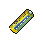

#  樹懶．蒂姆

|體質|力量|敏捷|智力|幫派|戰鬥等級|勒索難度|持有天賦|取得天賦|
|:--:|:--:|:--:|:--:|:--:|:--:|:--:|:--:|:--:|
|7|6|2|7|無幫派|弱|易|[理財](技能.md#理財)|[投資](技能.md#投資)|

## 故事

永遠看起來沒有睡醒的樹懶，擁有在和別人聊天的過程中突然睡著的奇特能力（姑且稱其為能力吧）。但這個行動緩慢,神態迷糊的家伙，仿佛藏有什麼不可告人的秘密。你曾無意間發現他將泥土從褲腿間抖落，這讓你回想起某部電影的經典橋段…

蒂姆在入獄之前曾是某家著名投行的基金經理。雖然他的動作很慢，但幫投資人賺錢的速度卻很快。高強度的工作，加上不擅交際的性格，讓身價不菲的蒂姆到了中年依然單身。

他的房子在河灣地著名的富人社區，那裡的住戶都是城裡有頭有臉的家伙們，有成功商人、演員、以及政客。不過，蒂姆對他們都不感興趣，他每天下班後只做一件事，那就是睡覺。

不過黛西的出現改變了這一切，準確來說應該稱她為“坎農夫人”。她的丈夫是一家酒店企業的老板，幾個月前為黛西在蒂姆家的隔壁租了套別墅。不過坎農先生很少住在這兒，平時只有黛西獨自待在家中。她和蒂姆一樣不愛外出，平日裡最大的愛好就是躺在泳池旁曬太陽。

蒂姆臥室的窗戶就正對著黛西家的院子，美麗性感的黛西任誰都無法不多看兩眼，哪怕是木訥的蒂姆也逃不過。不過，笨拙的蒂姆還是在某天被黛西發現了，可黛西非但沒有斥責蒂姆的無禮舉動，反而主動與他隔空攀談了起來。害羞的蒂姆逗得黛西呵呵直笑，很快他們就成了朋友，但也只是“空氣朋友”而已。

蒂姆嘗試過邀請黛西外出散步，或是來家裡坐坐，但這都被她委婉的拒絕了。期初蒂姆覺得這或許只是有夫之婦的自覺，但在一次閒聊中黛西說漏了嘴。她雖是女主人，但並沒有院門的鑰匙，控制欲極強的丈夫將她如同小鳥一樣關在屋內。而細心的蒂姆還發現，每當坎農先生過來的夜晚，黛西家的音箱總會開的很大聲，第二天她的身上還會留下昨晚“舞蹈”不慎留下的淤青和傷痕…

黛西是一名舞臺劇演員，夢想登上大舞臺。懷揣夢想的她從小鎮來到大城市，苦於沒有背景無法實現夢想。有錢有勢的坎農答應資助她，但代價是奉獻自己的青春。或許是對未來失去了希望，黛西嫁給了年長她許多的坎農。但金錢買來的婚姻注定不會幸福，很快買方就對商品失去了興趣，黛西漸漸成了坎農醉酒後發泄暴力的工具。

黛西帶著傷痕的嘴角苦笑著，仿佛早已接受了自己的命運。但她越是平靜的訴說，蒂姆的內心就越是泛起波瀾…

又是一個喧鬧的夜晚，坎農好像喝的比平時更多，連開到最大聲的音箱都無法蓋住黛西痛苦的慘叫。蒂姆從床上坐起，他想：今夜就不睡了吧，他需要結束這一切。

發泄過後的坎農叫罵著從家中走出，從言語中能聽出，他將去往情人家中尋找另一種慰藉。可是兩盞閃亮的車燈卻截住了他的去路。隨著光亮越來越近，他開始邁著踉蹌的步伐逃離，但他實在太慢了，甚至慢過了一只樹懶…

坎農從未見過蒂姆，而今後也見不到了。

## 結識對話

- **（打哈欠）嗨…你好。**
- *他好像`沒睡醒`的樣子…*
- **怎麼…找我有事？（打哈欠）**
- :point_right:只是打個招呼而已。
- :point_right:簡單聊聊天罷了…
- **原來\~是這樣…（打哈欠）**
- 你看上去好像挺困的…？
- 是昨天夜裡沒睡好嗎？
- **是\~的……**
- 剛剛看你腳底還漏出了沙土…
- {exclamation1}
- 我之前看過一部電影，裡面就有類似的情節…
- {think1}
- 難道說…？你在夜裡不睡覺，（小聲）其實是在挖…
- **………………**
- 你在聽我說嗎…？
- 喂…？！
- **（呼嚕聲）呼\~呼\~**
- *這家伙居然…*
- *居然…就這麼睡著了？*
- {sweat1}

## 深入了解對話

- **（打哈欠）嗨…你好。**
- *這個語氣，和上次一樣的既視感…*
- *他看起來好像又快原地睡著了。*
- **抱歉，我現在很困…**
- 果然，我就知道…！
- **（打哈欠）想聊什麼最好快一點，我的眼皮正在打架…**
- {sweat1}
- *他這種狀態，可沒法正常交流。*

#### 給他`2把[咖啡豆]`。

> 嚼了咖啡豆的蒂姆精神了不少，作為感謝他和你說了個故事。

- 嗨\~嚼點這個提提神吧。
- **哦\~看看這是什麼？能把瞌睡蟲趕走的棕色子彈…**
- *一個意想不到的結局…*
- 你幫黛西徹底擺脫了他丈夫…她有感謝你嗎？
- **感謝…？不，她沒有。相反的她對我只有怨恨。**
- **我當初就該報警的…而不是逞什麼英雄。**
- **法官懷疑她和我有勾結，所以剝奪了她的財產繼承權。**
- 這……
- **別嘗試用簡單的方法解決複雜的問題，不會有好結果。**
- **（打哈欠）抱歉，我又開始犯困了…**
- 喂\~先別睡！我想知道…你褲腿裡漏出的土是怎麼回事。
- **（呼嚕聲）…**
- {sweat1}
- *哎\~又被他搶先了一步…*

#### 取消

- *我得給他弄點提神的東西，比如`2把[咖啡豆]`。*
- **（呼嚕聲）…**

## 特殊對話

### 打招呼（關係極好）

- **我現在的精神頭\~還不錯\~**

### 打招呼（關係好）

- **（打哈欠）哎\~你不困嗎？**

### 打招呼（關係一般）

- **（打哈欠）…嗯？**

### 打招呼（關係差）

- **（打哈欠）我快睡著了…**

### 打招呼（關係極差）

- **（打哈欠）別打擾我行嗎？**

### 進行毆打

- **挑我做對手…你可真夠“厲害”的。**
- **做好陰溝裡翻船的準備吧…**
- **來吧…我能和你耗上一天。**

### 回禮

- **還有，或許我也該送你件禮物。**

### 勒索成功

- **這`{x1}塊`你拿去好了，我不想因為這點錢惹麻煩…**
- **{down1}**

### 勒索失敗

- **（打哈欠）你說完了嗎？剛才的廢話差點沒讓我聽睡著。**

### 一起吃飯被拒

- **（打哈欠）拜托\~我可不想和你坐一桌…**

### 分享食物

- **好的，不過我得先把自己這份吃完…這可能得花上不少時間。**

### 加藥被發現

- **（打呵欠）你想往我的盤子裡丟什麼？**

### 加藥辯解失敗

- **哦…你最好還是把這些“調料”加給自己吧。**

## 聊天

- **（打呵欠）上次說話的時候睡著了，實在有些抱歉…**
- **我是個會計，有時要去典獄長的辦公室幫忙做點帳目工作。**
- **腦力勞動可是很耗精力的，再加上我是只樹懶，所以…這種事情時有發生。**
- {think1}
- *監獄的帳目怎麼會讓一個犯人處理…？*
- *直覺告訴我，這件事情不簡單…*

## 初始物品

||||||
|:--:|:--:|:--:|:--:|:--:|
||||||
|[皮鞋](15-皮鞋.md)|[手錶](27-手錶.md)|[安眠藥](47-安眠藥.md)*3|[醫用酒精](51-醫用酒精.md)*2|[土豆披薩](75-土豆披薩.md)|
||||||
|[茶包](77-茶包.md)*2|[計算機](101-計算機.md)|[白紙](125-白紙.md)*4|[圓珠筆](133-圓珠筆.md)||

## 送禮

|圖片|物品名稱|好感|回應|
|:--:|--|:--:|--|
||[DEMO限定紙鶴](209-DEMO限定紙鶴.md)|50|這可能會導致好感度的…通貨膨脹。|
||[手錶](27-手錶.md)|24|如果戴上這個…我應該會看起來多幾分精神。|
||[皮鞋](15-皮鞋.md)|20|如果穿上這個…我應該會看起來多幾分精神。|
||[眼鏡](19-眼鏡.md)|20|如果戴上這個…我應該會看起來多幾分精神。|
||[金龜子](202-金龜子.md)|20|哈\~金色傳說！|
||[隨身聽（開機）](34-隨身聽（開機）.md)|18|如果把音量調到最大…我應該就不會原地睡著了。|
||[隨身聽（關機）](35-隨身聽（關機）.md)|18|如果把音量調到最大…我應該就不會原地睡著了。|
||[隨身聽（沒電）](36-隨身聽（沒電）.md)|18|如果把音量調到最大…我應該就不會原地睡著了。|
||[計算機](101-計算機.md)|16|謝謝\~這能加快我的計算速度。|
||[圓珠筆](133-圓珠筆.md)|16|謝謝\~這能加快我的計算速度。|
||[圓珠筆](134-圓珠筆.md)|16|謝謝\~這能加快我的計算速度。|
||[棒球帽](21-棒球帽.md)|12|（打哈欠）…謝謝你的禮物\~|
||[《死靈之書》](31-《死靈之書》.md)|12|（打哈欠）…謝謝你的禮物\~|
||[馬女郎海報](105-馬女郎海報.md)|12|（打哈欠）…謝謝你的禮物\~|
||[貓女郎海報](106-貓女郎海報.md)|12|（打哈欠）…謝謝你的禮物\~|
||[狐女郎海報](107-狐女郎海報.md)|12|（打哈欠）…謝謝你的禮物\~|
||[兔女郎海報](108-兔女郎海報.md)|12|（打哈欠）…謝謝你的禮物\~|
||[精美的畫作](130-精美的畫作.md)|12|這幅畫看起來很有升值潛力。|
||[墨鏡](18-墨鏡.md)|10|（打哈欠）…謝謝你的禮物\~|
||[護身符](29-護身符.md)|10|（打哈欠）…謝謝你的禮物\~|
||[酒葫蘆](37-酒葫蘆.md)|10|（打哈欠）…謝謝你的禮物\~|
||[興奮劑](50-興奮劑.md)|9|謝謝\~我的確需要提提神了…|
||[帆布鞋](16-帆布鞋.md)|8|（打哈欠）…謝謝你的禮物\~|
||[毛線帽](22-毛線帽.md)|8|（打哈欠）…謝謝你的禮物\~|
||[自製口罩](32-自製口罩.md)|8|（打哈欠）…謝謝你的禮物\~|
||[酒精燈](52-酒精燈.md)|8|（打哈欠）…謝謝你的禮物\~|
||[精釀蘋果酒](56-精釀蘋果酒.md)|8|（打哈欠）…謝謝你的禮物\~|
||[奶油華夫餅](68-奶油華夫餅.md)|8|（打哈欠）…謝謝你的禮物\~|
||[土豆披薩](75-土豆披薩.md)|8|（打哈欠）…謝謝你的禮物\~|
||[茶包](77-茶包.md)|8|（打哈欠）對我來說這比咖啡…還要提神。|
||[《花花世界》（全新）](102-《花花世界》（全新）.md)|8|（打哈欠）…謝謝你的禮物\~|
||[咖啡磨](109-咖啡磨.md)|8|（打哈欠）…謝謝你的禮物\~|
||[皮帶](166-皮帶.md)|8|（打哈欠）…謝謝你的禮物\~|
||[皮帶](167-皮帶.md)|8|（打哈欠）…謝謝你的禮物\~|
||[《森之音》](203-《森之音》.md)|8|（打哈欠）…謝謝你的禮物\~|
||[橡膠手套](25-橡膠手套.md)|6|（打哈欠）…謝謝你的禮物\~|
||[薄荷葉](40-薄荷葉.md)|6|謝謝\~我的確需要提提神了…|
||[薄荷葉卷](41-薄荷葉卷.md)|6|（打哈欠）…謝謝你的禮物\~|
||[蘑菇](42-蘑菇.md)|6|謝謝\~我的確需要提提神了…|
||[鎮靜劑](53-鎮靜劑.md)|6|（打哈欠）…謝謝你的禮物\~|
||[啤酒](54-啤酒.md)|6|（打哈欠）…謝謝你的禮物\~|
||[蘋果酒](55-蘋果酒.md)|6|（打哈欠）…謝謝你的禮物\~|
||[華夫餅](67-華夫餅.md)|6|（打哈欠）…謝謝你的禮物\~|
||[一把咖啡豆](69-一把咖啡豆.md)|6|謝謝\~我的確需要提提神了…|
||[焦糖棒](72-焦糖棒.md)|6|謝謝\~我的確需要提提神了…|
||[汽水](73-汽水.md)|6|謝謝\~我的確需要提提神了…|
||[咖啡粉](76-咖啡粉.md)|6|謝謝\~我的確需要提提神了…|
||[超辣泡麵](78-超辣泡麵.md)|6|（打哈欠）…謝謝你的禮物\~|
||[蛋白粉](79-蛋白粉.md)|6|（打哈欠）…謝謝你的禮物\~|
||[《花花世界》（看過）](103-《花花世界》（看過）.md)|6|（打哈欠）…謝謝你的禮物\~|
||[紙鶴](126-紙鶴.md)|6|（打哈欠）…謝謝你的禮物\~|
||[簡單的漫畫](129-簡單的漫畫.md)|6|（打哈欠）…謝謝你的禮物\~|
||[鉛筆](131-鉛筆.md)|6|好記性不如爛筆頭…況且我的記性也不算好。|
||[鉛筆](132-鉛筆.md)|6|好記性不如爛筆頭…況且我的記性也不算好。|
||[硬幣](135-硬幣.md)|6|對於會計來說…每一分錢都得入帳。|
||[黑桃A](39-黑桃A.md)|4|（打哈欠）…謝謝你的禮物\~|
||[蘑菇粉](43-蘑菇粉.md)|4|（打哈欠）…謝謝你的禮物\~|
||[紫鳶花](45-紫鳶花.md)|4|（打哈欠）…謝謝你的禮物\~|
||[花瓣粉](46-花瓣粉.md)|4|（打哈欠）…謝謝你的禮物\~|
||[安眠藥](47-安眠藥.md)|4|（打哈欠）…謝謝你的禮物\~|
||[止疼片](49-止疼片.md)|4|（打哈欠）…謝謝你的禮物\~|
||[醫用酒精](51-醫用酒精.md)|4|（打哈欠）…謝謝你的禮物\~|
||[蘋果](64-蘋果.md)|4|（打哈欠）…謝謝你的禮物\~|
||[酸奶](74-酸奶.md)|4|（打哈欠）…謝謝你的禮物\~|
||[《花花世界》（翻爛）](104-《花花世界》（翻爛）.md)|4|（打哈欠）…謝謝你的禮物\~|
||[牙刷](115-牙刷.md)|4|（打哈欠）…謝謝你的禮物\~|
||[牙膏](116-牙膏.md)|4|（打哈欠）…謝謝你的禮物\~|
||[湯匙](143-湯匙.md)|4|（打哈欠）…謝謝你的禮物\~|
||[湯匙](144-湯匙.md)|4|（打哈欠）…謝謝你的禮物\~|
||[口香糖](70-口香糖.md)|2|（打哈欠）…謝謝你的禮物\~|
||[曲奇餅乾](71-曲奇餅乾.md)|2|（打哈欠）…謝謝你的禮物\~|
||[迴紋針](86-迴紋針.md)|2|（打哈欠）…謝謝你的禮物\~|
||[電池](114-電池.md)|2|（打哈欠）…謝謝你的禮物\~|
||[顏料](122-顏料.md)|2|（打哈欠）…謝謝你的禮物\~|
||[白紙](125-白紙.md)|2|（打哈欠）…謝謝你的禮物\~|
||[布條](84-布條.md)|-2|…我想我用不著這個。|
||[空的牙膏管](117-空的牙膏管.md)|-2|…我想我用不著這個。|
||[消毒液](118-消毒液.md)|-2|…我想我用不著這個。|
||[除銹劑](119-除銹劑.md)|-2|…我想我用不著這個。|
||[火柴](120-火柴.md)|-2|…我想我用不著這個。|
||[膠帶](121-膠帶.md)|-2|…我想我用不著這個。|
||[釘子](123-釘子.md)|-2|…我想我用不著這個。|
||[鞋帶](124-鞋帶.md)|-2|…我想我用不著這個。|
||[開鎖器](87-開鎖器.md)|-4|…我想我用不著這個。|
||[開鎖器(P)](38-開鎖器(P).md)|-4|…我想我用不著這個。|
||[肥皂](88-肥皂.md)|-4|我的毛上生有綠藻…我可不想洗掉它們。|
||[胡亂的塗鴉](128-胡亂的塗鴉.md)|-4|抱歉\~以我對畫的鑒賞能力…這幅毫無價值。|
||[玻璃匕首](154-玻璃匕首.md)|-4|用這個解決麻煩，只能帶來更多麻煩。|
||[牙刷匕首](156-牙刷匕首.md)|-4|用這個解決麻煩，只能帶來更多麻煩。|
||[瀉藥](44-瀉藥.md)|-6|我雖然行動很慢…但是並不便秘。|
||[長螺絲](136-長螺絲.md)|-6|用這個解決麻煩，只能帶來更多麻煩。|
||[玻璃匕首(+)](155-玻璃匕首(+).md)|-6|用這個解決麻煩，只能帶來更多麻煩。|
||[牙刷匕首(+)](157-牙刷匕首(+).md)|-6|用這個解決麻煩，只能帶來更多麻煩。|
||[釘棒](162-釘棒.md)|-6|用這個解決麻煩，只能帶來更多麻煩。|
||[鐵管](164-鐵管.md)|-6|用這個解決麻煩，只能帶來更多麻煩。|
||[拖鞋](17-拖鞋.md)|-8|這可不是我穿搭的風格…|
||[紅頭巾](23-紅頭巾.md)|-8|這可不是我穿搭的風格…|
||[綠頭巾](24-綠頭巾.md)|-8|這可不是我穿搭的風格…|
||[黑手](26-黑手.md)|-8|用這個解決麻煩，只能帶來更多麻煩。|
||[香皂](89-香皂.md)|-8|我的毛上生有綠藻…我可不想洗掉它們。|
||[花束](127-花束.md)|-8|呃\~我想你可能送錯對象了…|
||[剪刀](152-剪刀.md)|-8|用這個解決麻煩，只能帶來更多麻煩。|
||[雙節棍](160-雙節棍.md)|-8|用這個解決麻煩，只能帶來更多麻煩。|
||[釘棒(+)](163-釘棒(+).md)|-8|用這個解決麻煩，只能帶來更多麻煩。|
||[頭帶](20-頭帶.md)|-10|呃\~我可沒什麼運動細胞…|
||[水果刀](158-水果刀.md)|-10|用這個解決麻煩，只能帶來更多麻煩。|
||[雙節棍(+)](161-雙節棍(+).md)|-10|用這個解決麻煩，只能帶來更多麻煩。|
||[運動鞋](14-運動鞋.md)|-12|呃\~我可沒什麼運動細胞…|
||[牙齒項鏈](30-牙齒項鏈.md)|-12|戴著這個…我想我會做噩夢的…|
||[掌上遊戲機](110-掌上遊戲機.md)|-12|呃\~我玩這個簡直就是自我折磨…|
||[掌上遊戲機（沒電）](111-掌上遊戲機（沒電）.md)|-12|呃\~我玩這個簡直就是自我折磨…|
||[扳手](142-扳手.md)|-12|用這個解決麻煩，只能帶來更多麻煩。|
||[釘錘](151-釘錘.md)|-12|用這個解決麻煩，只能帶來更多麻煩。|
||[碎玻璃](153-碎玻璃.md)|-20|（打哈欠）我可沒地方裝這個…垃圾。|
||[折斷的木條](159-折斷的木條.md)|-20|（打哈欠）我可沒地方裝這個…垃圾。|
||[發霉的麵包](200-發霉的麵包.md)|-40|（打哈欠）我可沒地方裝這個…垃圾。|

