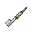

##  樹懶．蒂姆

|體質|力量|敏捷|智力|幫派|
|:--:|:--:|:--:|:--:|:--:|
|7|6|2|7|無幫派|

### 故事

永遠看起來沒有睡醒的樹懶，擁有在和別人聊天的過程中突然睡著的奇特能力（姑且稱其為能力吧）。但這個行動緩慢,神態迷糊的家伙，仿佛藏有什麼不可告人的秘密。你曾無意間發現他將泥土從褲腿間抖落，這讓你回想起某部電影的經典橋段…

蒂姆在入獄之前曾是某家著名投行的基金經理。雖然他的動作很慢，但幫投資人賺錢的速度卻很快。高強度的工作，加上不擅交際的性格，讓身價不菲的蒂姆到了中年依然單身。

他的房子在河灣地著名的富人社區，那里的住戶都是城里有頭有臉的家伙們，有成功商人、演員、以及政客。不過，蒂姆對他們都不感興趣，他每天下班後只做一件事，那就是睡覺。

不過黛西的出現改變了這一切，準確來說應該稱她為“坎農夫人”。她的丈夫是一家酒店企業的老板，幾個月前為黛西在蒂姆家的隔壁租了套別墅。不過坎農先生很少住在這兒，平時只有黛西獨自待在家中。她和蒂姆一樣不愛外出，平日里最大的愛好就是躺在泳池旁曬太陽。

蒂姆臥室的窗戶就正對著黛西家的院子，美麗性感的黛西任誰都無法不多看兩眼，哪怕是木訥的蒂姆也逃不過。不過，笨拙的蒂姆還是在某天被黛西發現了，可黛西非但沒有斥責蒂姆的無禮舉動，反而主動與他隔空攀談了起來。害羞的蒂姆逗得黛西呵呵直笑，很快他們就成了朋友，但也只是“空氣朋友”而已。

蒂姆嘗試過邀請黛西外出散步，或是來家里坐坐，但這都被她委婉的拒絕了。期初蒂姆覺得這或許只是有夫之婦的自覺，但在一次閒聊中黛西說漏了嘴。她雖是女主人，但并沒有院門的鑰匙，控制欲極強的丈夫將她如同小鳥一樣關在屋內。而細心的蒂姆還發現，每當坎農先生過來的夜晚，黛西家的音箱總會開的很大聲，第二天她的身上還會留下昨晚“舞蹈”不慎留下的淤青和傷痕…

黛西是一名舞臺劇演員，夢想登上大舞臺。懷揣夢想的她從小鎮來到大城市，苦於沒有背景無法實現夢想。有錢有勢的坎農答應資助她，但代價是奉獻自己的青春。或許是對未來失去了希望，黛西嫁給了年長她許多的坎農。但金錢買來的婚姻注定不會幸福，很快買方就對商品失去了興趣，黛西漸漸成了坎農醉酒後發泄暴力的工具。

黛西帶著傷痕的嘴角苦笑著，仿佛早已接受了自己的命運。但她越是平靜的訴說，蒂姆的內心就越是泛起波瀾…

又是一個喧鬧的夜晚，坎農好像喝的比平時更多，連開到最大聲的音箱都無法蓋住黛西痛苦的慘叫。蒂姆從床上坐起，他想：今夜就不睡了吧，他需要結束這一切。

發泄過後的坎農叫罵著從家中走出，從言語中能聽出，他將去往情人家中尋找另一種慰藉。可是兩盞閃亮的車燈卻截住了他的去路。隨著光亮越來越近，他開始邁著踉蹌的步伐逃離，但他實在太慢了，甚至慢過了一只樹懶…

坎農從未見過蒂姆，而今後也見不到了。

### 結識對話

- **（打哈欠）嗨…你好。**
- *他好像`沒睡醒`的樣子…*
- **怎麼…找我有事？（打哈欠）**
  - 只是打個招呼而已。
  - 簡單聊聊天罷了…
- **原來\~是這樣…（打哈欠）**
- 你看上去好像挺困的…？
- 是昨天夜里沒睡好嗎？
- **是\~的……**
- 剛剛看你腳底還漏出了沙土…
- {exclamation1}
- 我之前看過一部電影，里面就有類似的情節…
- {think1}
- 難道說…？你在夜里不睡覺，（小聲）其實是在挖…
- **………………**
- 你在聽我說嗎…？
- 喂…？！
- **（呼嚕聲）呼\~呼\~**
- *這家伙居然…*
- *居然…就這麼睡著了？*
- {sweat1}

### 深入了解對話

- **（打哈欠）嗨…你好。**
- *這個語氣，和上次一樣的既視感…*
- *他看起來好像又快原地睡著了。*
- **抱歉，我現在很困…**
- 果然，我就知道…！
- **（打哈欠）想聊什麼最好快一點，我的眼皮正在打架…**
- {sweat1}
- *他這種狀態，可沒法正常交流。*

#### 給他`2把[咖啡豆]`。

> 嚼了咖啡豆的蒂姆精神了不少，作為感謝他和你說了個故事。

- 嗨\~嚼點這個提提神吧。
- **哦\~看看這是什麼？能把瞌睡蟲趕走的棕色子彈…**
- *一個意想不到的結局…*
- 你幫黛西徹底擺脫了他丈夫…她有感謝你嗎？
- **感謝…？不，她沒有。相反的她對我只有怨恨。**
- **我當初就該報警的…而不是逞什麼英雄。**
- **法官懷疑她和我有勾結，所以剝奪了她的財產繼承權。**
- 這……
- **別嘗試用簡單的方法解決復雜的問題，不會有好結果。**
- **（打哈欠）抱歉，我又開始犯困了…**
- 喂\~先別睡！我想知道…你褲腿里漏出的土是怎麼回事。
- **（呼嚕聲）…**
- {sweat1}
- *哎\~又被他搶先了一步…*

#### 取消

- *我得給他弄點提神的東西，比如`2把[咖啡豆]`。*
- **（呼嚕聲）…**
### 初始物品

||||||
|:--:|:--:|:--:|:--:|:--:|
|  |  |  |  |  |
| [皮鞋](道具.md#皮鞋) | [手錶](道具.md#手錶) | [安眠藥](道具.md#安眠藥)*3 | [醫用酒精](道具.md#醫用酒精)*2 | [土豆披薩](道具.md#土豆披薩) |
|  |  |  |  |  |
| [茶包](道具.md#茶包)*2 | [計算機](道具.md#計算機) | [白紙](道具.md#白紙)*4 | [圓珠筆](道具.md#圓珠筆) |  |

### 送禮

|圖片|物品名稱|好感|回應|
|:--:|--|:--:|--|
||[運動鞋](道具.md#運動鞋)|-12|呃\~我可沒什麼運動細胞…|
||[皮鞋](道具.md#皮鞋)|20|如果穿上這個…我應該會看起來多幾分精神。|
||[帆布鞋](道具.md#帆布鞋)|0|（打哈欠）…謝謝你的禮物\~|
||[拖鞋](道具.md#拖鞋)|-8|這可不是我穿搭的風格…|
||[墨鏡](道具.md#墨鏡)|0|（打哈欠）…謝謝你的禮物\~|
||[眼鏡](道具.md#眼鏡)|20|如果戴上這個…我應該會看起來多幾分精神。|
||[頭帶](道具.md#頭帶)|-10|呃\~我可沒什麼運動細胞…|
||[棒球帽](道具.md#棒球帽)|0|（打哈欠）…謝謝你的禮物\~|
||[毛線帽](道具.md#毛線帽)|0|（打哈欠）…謝謝你的禮物\~|
||[紅頭巾](道具.md#紅頭巾)|-8|這可不是我穿搭的風格…|
||[綠頭巾](道具.md#綠頭巾)|-8|這可不是我穿搭的風格…|
||[橡膠手套](道具.md#橡膠手套)|0|（打哈欠）…謝謝你的禮物\~|
||[黑手](道具.md#黑手)|-8|用這個解決麻煩，只能帶來更多麻煩。|
||[手錶](道具.md#手錶)|24|如果戴上這個…我應該會看起來多幾分精神。|
||[護身符](道具.md#護身符)|0|（打哈欠）…謝謝你的禮物\~|
||[牙齒項鏈](道具.md#牙齒項鏈)|-12|戴著這個…我想我會做噩夢的…|
||[《死靈之書》](道具.md#《死靈之書》)|0|（打哈欠）…謝謝你的禮物\~|
||[自制口罩](道具.md#自制口罩)|0|（打哈欠）…謝謝你的禮物\~|
||[隨身聽（開機）](道具.md#隨身聽（開機）)|12|如果把音量調到最大…我應該就不會原地睡著了。|
||[隨身聽（關機）](道具.md#隨身聽（關機）)|12|如果把音量調到最大…我應該就不會原地睡著了。|
||[隨身聽（沒電）](道具.md#隨身聽（沒電）)|12|如果把音量調到最大…我應該就不會原地睡著了。|
||[酒葫蘆](道具.md#酒葫蘆)|0|（打哈欠）…謝謝你的禮物\~|
||[黑桃A](道具.md#黑桃A)|0|（打哈欠）…謝謝你的禮物\~|
||[薄荷葉](道具.md#薄荷葉)|4|謝謝\~我的確需要提提神了…|
||[薄荷葉卷](道具.md#薄荷葉卷)|0|（打哈欠）…謝謝你的禮物\~|
||[蘑菇](道具.md#蘑菇)|4|謝謝\~我的確需要提提神了…|
||[蘑菇粉](道具.md#蘑菇粉)|0|（打哈欠）…謝謝你的禮物\~|
||[瀉藥](道具.md#瀉藥)|-6|我雖然行動很慢…但是并不便秘。|
||[紫鳶花](道具.md#紫鳶花)|0|（打哈欠）…謝謝你的禮物\~|
||[花瓣粉](道具.md#花瓣粉)|0|（打哈欠）…謝謝你的禮物\~|
||[安眠藥](道具.md#安眠藥)|0|（打哈欠）…謝謝你的禮物\~|
||[止疼片](道具.md#止疼片)|0|（打哈欠）…謝謝你的禮物\~|
||[興奮劑](道具.md#興奮劑)|6|謝謝\~我的確需要提提神了…|
||[醫用酒精](道具.md#醫用酒精)|0|（打哈欠）…謝謝你的禮物\~|
||[酒精燈](道具.md#酒精燈)|0|（打哈欠）…謝謝你的禮物\~|
||[鎮靜劑](道具.md#鎮靜劑)|0|（打哈欠）…謝謝你的禮物\~|
||[啤酒](道具.md#啤酒)|0|（打哈欠）…謝謝你的禮物\~|
||[蘋果酒](道具.md#蘋果酒)|0|（打哈欠）…謝謝你的禮物\~|
||[精釀蘋果酒](道具.md#精釀蘋果酒)|0|（打哈欠）…謝謝你的禮物\~|
||[蘋果](道具.md#蘋果)|0|（打哈欠）…謝謝你的禮物\~|
||[華夫餅](道具.md#華夫餅)|0|（打哈欠）…謝謝你的禮物\~|
||[奶油華夫餅](道具.md#奶油華夫餅)|0|（打哈欠）…謝謝你的禮物\~|
||[一把咖啡豆](道具.md#一把咖啡豆)|4|謝謝\~我的確需要提提神了…|
||[口香糖](道具.md#口香糖)|0|（打哈欠）…謝謝你的禮物\~|
||[曲奇餅乾](道具.md#曲奇餅乾)|0|（打哈欠）…謝謝你的禮物\~|
||[焦糖棒](道具.md#焦糖棒)|4|謝謝\~我的確需要提提神了…|
||[汽水](道具.md#汽水)|4|謝謝\~我的確需要提提神了…|
||[酸奶](道具.md#酸奶)|0|（打哈欠）…謝謝你的禮物\~|
||[土豆披薩](道具.md#土豆披薩)|0|（打哈欠）…謝謝你的禮物\~|
||[咖啡粉](道具.md#咖啡粉)|4|謝謝\~我的確需要提提神了…|
||[茶包](道具.md#茶包)|8|（打哈欠）對我來說這比咖啡…還要提神。|
||[超辣泡麵](道具.md#超辣泡麵)|0|（打哈欠）…謝謝你的禮物\~|
||[蛋白粉](道具.md#蛋白粉)|0|（打哈欠）…謝謝你的禮物\~|
||[布條](道具.md#布條)|-2|…我想我用不著這個。|
||[迴紋針](道具.md#迴紋針)|0|（打哈欠）…謝謝你的禮物\~|
||[開鎖器](道具.md#開鎖器)|-4|…我想我用不著這個。|
||[開鎖器(P)](道具.md#開鎖器(P))|-4|…我想我用不著這個。|
||[肥皂](道具.md#肥皂)|-4|我的毛上生有綠藻…我可不想洗掉它們。|
||[香皂](道具.md#香皂)|-8|我的毛上生有綠藻…我可不想洗掉它們。|
||[計算機](道具.md#計算機)|16|謝謝\~這能加快我的計算速度。|
||[《花花世界》（全新）](道具.md#《花花世界》（全新）)|0|（打哈欠）…謝謝你的禮物\~|
||[《花花世界》（看過）](道具.md#《花花世界》（看過）)|0|（打哈欠）…謝謝你的禮物\~|
||[《花花世界》（翻爛）](道具.md#《花花世界》（翻爛）)|0|（打哈欠）…謝謝你的禮物\~|
||[馬女郎海報](道具.md#馬女郎海報)|0|（打哈欠）…謝謝你的禮物\~|
||[貓女郎海報](道具.md#貓女郎海報)|0|（打哈欠）…謝謝你的禮物\~|
||[狐女郎海報](道具.md#狐女郎海報)|0|（打哈欠）…謝謝你的禮物\~|
||[兔女郎海報](道具.md#兔女郎海報)|0|（打哈欠）…謝謝你的禮物\~|
||[咖啡磨](道具.md#咖啡磨)|0|（打哈欠）…謝謝你的禮物\~|
||[掌上遊戲機](道具.md#掌上遊戲機)|-12|呃\~我玩這個簡直就是自我折磨…|
||[掌上遊戲機（沒電）](道具.md#掌上遊戲機（沒電）)|-12|呃\~我玩這個簡直就是自我折磨…|
||[電池](道具.md#電池)|0|（打哈欠）…謝謝你的禮物\~|
||[牙刷](道具.md#牙刷)|0|（打哈欠）…謝謝你的禮物\~|
||[牙膏](道具.md#牙膏)|0|（打哈欠）…謝謝你的禮物\~|
||[空的牙膏管](道具.md#空的牙膏管)|-2|…我想我用不著這個。|
||[消毒液](道具.md#消毒液)|-2|…我想我用不著這個。|
||[除銹劑](道具.md#除銹劑)|-2|…我想我用不著這個。|
||[火柴](道具.md#火柴)|-2|…我想我用不著這個。|
||[膠帶](道具.md#膠帶)|-2|…我想我用不著這個。|
||[顏料](道具.md#顏料)|0|（打哈欠）…謝謝你的禮物\~|
||[釘子](道具.md#釘子)|-2|…我想我用不著這個。|
||[鞋帶](道具.md#鞋帶)|-2|…我想我用不著這個。|
||[白紙](道具.md#白紙)|0|（打哈欠）…謝謝你的禮物\~|
||[紙鶴](道具.md#紙鶴)|0|（打哈欠）…謝謝你的禮物\~|
||[花束](道具.md#花束)|-8|呃\~我想你可能送錯對象了…|
||[胡亂的涂鴉](道具.md#胡亂的涂鴉)|-4|抱歉\~以我對畫的鑒賞能力…這幅毫無價值。|
||[簡單的漫畫](道具.md#簡單的漫畫)|0|（打哈欠）…謝謝你的禮物\~|
||[精美的畫作](道具.md#精美的畫作)|8|這幅畫看起來很有升值潛力。|
||[鉛筆](道具.md#鉛筆)|4|好記性不如爛筆頭…況且我的記性也不算好。|
||[鉛筆](道具.md#鉛筆)|4|好記性不如爛筆頭…況且我的記性也不算好。|
||[圓珠筆](道具.md#圓珠筆)|16|謝謝\~這能加快我的計算速度。|
||[圓珠筆](道具.md#圓珠筆)|16|謝謝\~這能加快我的計算速度。|
||[硬幣](道具.md#硬幣)|4|對於會計來說…每一分錢都得入帳。|
||[長螺絲](道具.md#長螺絲)|-6|用這個解決麻煩，只能帶來更多麻煩。|
||[扳手](道具.md#扳手)|-12|用這個解決麻煩，只能帶來更多麻煩。|
||[湯匙](道具.md#湯匙)|0|（打哈欠）…謝謝你的禮物\~|
||[湯匙](道具.md#湯匙)|0|（打哈欠）…謝謝你的禮物\~|
||[釘錘](道具.md#釘錘)|-12|用這個解決麻煩，只能帶來更多麻煩。|
||[剪刀](道具.md#剪刀)|-8|用這個解決麻煩，只能帶來更多麻煩。|
||[碎玻璃](道具.md#碎玻璃)|-4|（打哈欠）我可沒地方裝這個…垃圾。|
||[玻璃匕首](道具.md#玻璃匕首)|-4|用這個解決麻煩，只能帶來更多麻煩。|
||[玻璃匕首(+)](道具.md#玻璃匕首(+))|-6|用這個解決麻煩，只能帶來更多麻煩。|
||[牙刷匕首](道具.md#牙刷匕首)|-4|用這個解決麻煩，只能帶來更多麻煩。|
||[牙刷匕首(+)](道具.md#牙刷匕首(+))|-6|用這個解決麻煩，只能帶來更多麻煩。|
||[水果刀](道具.md#水果刀)|-10|用這個解決麻煩，只能帶來更多麻煩。|
||[折斷的木條](道具.md#折斷的木條)|-4|（打哈欠）我可沒地方裝這個…垃圾。|
||[雙節棍](道具.md#雙節棍)|-8|用這個解決麻煩，只能帶來更多麻煩。|
||[雙節棍(+)](道具.md#雙節棍(+))|-10|用這個解決麻煩，只能帶來更多麻煩。|
||[釘棒](道具.md#釘棒)|-6|用這個解決麻煩，只能帶來更多麻煩。|
||[釘棒(+)](道具.md#釘棒(+))|-8|用這個解決麻煩，只能帶來更多麻煩。|
||[鐵管](道具.md#鐵管)|-6|用這個解決麻煩，只能帶來更多麻煩。|
||[皮帶](道具.md#皮帶)|0|（打哈欠）…謝謝你的禮物\~|
||[皮帶](道具.md#皮帶)|0|（打哈欠）…謝謝你的禮物\~|
||[發霉的麵包](道具.md#發霉的麵包)|-8|（打哈欠）我可沒地方裝這個…垃圾。|
||[金龜子](道具.md#金龜子)|20|哈\~金色傳說！|
||[《森之音》](道具.md#《森之音》)|0|（打哈欠）…謝謝你的禮物\~|
||[DEMO限定紙鶴](道具.md#DEMO限定紙鶴)|50|這可能會導致好感度的…通貨膨脹。|

