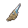
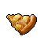
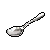
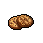

#  樹蛙．格雷

|體質|力量|敏捷|智力|幫派|戰鬥等級|勒索難度|持有天賦|取得天賦|
|:--:|:--:|:--:|:--:|:--:|:--:|:--:|:--:|:--:|
|2|2|6|7|無幫派|弱|易|[醫學](技能.md#醫學)|[毒性體質](技能.md#毒性體質)|

## 故事

紅色的眼睛，綠色的皮膚，作為整座監獄裡唯一的兩棲動物，他的外表十分扎眼。在你靠近他的時候，表現出十分的抗拒。聽解釋後才明白，原來他並非挑釁，而是因為擁有劇毒體質，不想“誤傷”到你。或許這只“表面狠毒”的樹蛙，才是監獄裡少有的好家伙。

格雷在入獄之前曾是一名藥品推銷員。不過也許是外形的原因，他的領導一直不太喜歡他，這使得他的銷售片區被分配到了下城區。這簡直就是推銷員的噩夢，因為他所在公司代理的藥品價格十分昂貴，根本不是下城區的貧民們能夠負擔的起的。

慘淡的銷售業績導致格雷的收入低的可憐。妻子的預產期眼看就快到了，但家裡卻拿不出錢來租用蝌蚪孵化房。想到妻子或許只能在家中的澡盆裡撫養孩子，格雷就感到焦躁不安。

金錢的壓力讓格雷在工作上更加拼命，他開始去往下城區內的幫派地盤嘗試推銷。在聽說他是個賣藥的之後，一名幫派份子把格雷帶去了一幢秘密的建築內。

屋內的破床上躺著不少迷迷糊糊的病患，一名自稱醫生的家伙告訴格雷。因為下城區裡的很多窮人沒錢購買昂貴的藥品，所以難受的時候只能來這裡注射廉價的麻醉劑。不過這就如同飲鴆止渴，麻醉的副作用會讓他們的病情加速惡化。但這又有什麼辦法呢？

那名醫生又告訴格雷，其實在國外有廉價的仿製藥，那些藥品的藥效與正版藥品相似，但價格只有十分之一。他們這兒的貧民以前一直靠著那些仿製藥治療疾病，但是在兩年前城裡的藥品黑市被警方搗毀，現在已經很難再搞到這些仿製藥了。不過，他說格雷或許能幫忙解決這個難題。因為格雷藥品推銷員的身份是很好的掩護，可以較為安全的走私這些仿製藥。

“雖然這些仿製藥價格便宜，但整個下城區內的需求量很大，靠這個賺上一筆肯定不成問題。”醫生勸說到。格雷當然知道這是一樁犯法的買賣，但是考慮到蝌蚪孵化房的租金，他最終答應暫時入伙。

很快第一批仿製藥就順利送到了，它們低廉的價格讓下城區的貧民們流下了熱淚。一天不到的時間，格雷手裡的仿製藥就被搶購一空。就像醫生說的一樣，這讓格雷狠狠的賺了一筆。在之後的幾個月裡，格雷的生意越做越大。每周都會有各式各樣的仿製藥進入下城區，病患們為了能買到所需的藥品常常排起長龍。

蝌蚪孵化房、更大的公寓、新的汽車，格雷如願以償的靠著這樁生意發了家。但他並不是個貪婪的家伙，他明白這其中的風險，他已經開始受到了各方的懷疑，如果再不收手的話肯定會被逮到。於是格雷找到醫生，說出了自己想要退出的打算，他不想自己的孩子們在還是蝌蚪的時候就失去爸爸。

醫生理解格雷的決定，但他也告訴格雷：正因為有了這些藥品，很多病患的情況都在好轉，如果現在停藥的話就前功盡棄了。他懇求格雷再干最後一票，讓病患們可以多屯一些藥在家，至少給他們點時間找別人來代替格雷。

或許是醫生的話打動了格雷，他干了這“最後一票”。可正如格雷預感的那樣，這一次他沒能順利逃過海關的檢查。眼看藥品要被沒收，格雷做出了一件驚人的舉動，他用身上的毒液麻痹了執法的海關警察，並帶著藥品逃走了…

格雷將搶回來的藥品帶去了下城區，並交給了醫生。他明白襲警的罪名有多嚴重，但他也知道這批藥品對於那些病患來說意味著什麼。“從你們手裡賺了那麼多錢，這次就當做臨別禮物好了。”這是格雷去自首前對醫生說的最後一句話。

## 結識對話

- **喂\~你最好離我遠點…呱。**
- {question1}
- :point_right:我妨礙到你了嗎？ `好感+5`
- :point_right:這裡是你的地盤？
- **不，讓你別靠近\~是為你好。**
- 為我好…？
- **看見我皮膚的顏色了嗎？你知道這代表了什麼嗎？**
- **這代表`我有毒`，而且是劇毒。**
- **如果你身上有傷口的話，只要蹭到我一下，保準你進醫院…**
- **到時候我還得和獄警解釋，這都是你自己找上門的…呱。**
- *……*
- **呃\~糟糕，我的口水好像濺到你的鼻子上了…**
- {pain1}

## 深入了解對話

- 嗨\~格雷，最近過得怎麼樣？
- **說實話，不太好…呱。**
- **{down1}**
- **你知道的，我因為皮膚`有毒`，所以在這裡很難交到朋友。**
- **不過我養了一只`[金龜子]`做寵物，它叫喳喳，無聊的時候我會和它說說話。**
- **但今天早上它突然就消失了…呱\~呱。**
- **沒準是我昨晚睡著後…夢游…把它給吃了。**
- **{weep1}**
- **我的喳喳，沒了它我該怎麼熬過今後的日子…呱。**

#### 遞給他一只`[金龜子]`。

> 他很感謝你幫他“找回了”寵物，一下子把你當成了無話不說的朋友。

- **{exclamation1}**
- **是喳喳！你在哪裡找到它的？**
- 呃…你怎麼確定這就是你丟的蟲子？
- **你看它的外殼和翅膀，和喳喳一模一樣！一定是它…呱！**
- 難道不是每只這種蟲子都長這樣嗎？
- 不過既然是給你的，你覺得是就是吧…
- *對和錯有時候真的很難說明白…*
- …那些貧民區的病患們現在怎樣了？既然你都被抓了。
- **我進來以後，醫生經常會來看我，聽他說目前的情況還算是不錯…呱。**
- **因為我最後給他的那批藥，幫病患們熬過了一段時間。**
- **之後他買通了海關裡的一個家伙，現在也算有一條相對安全的渠道了…呱。**
  - 可這畢竟還是違法的…
  - 安全又能維持多久呢？
- **是啊…要想徹底改變現狀，還是得有便宜的正版藥才行。**
- 希望這一天能早點到來吧…

#### 取消

- *哎\~可憐的家伙，眼睛都哭紅了。*
- *或許我該重新幫他捉一只`[金龜子]`來？*
- *反正每只蟲子看起來都長得一個樣…*

## 特殊對話

### 打招呼（關係極好）

- **是你呀\~我的朋友…呱\~呱。**

### 打招呼（關係好）

- **保持距離，伙計…**

### 打招呼（關係一般）

- **你站在原地就好…呱。**

### 打招呼（關係差）

- **怎麼？有什麼事情嗎？**

### 打招呼（關係極差）

- **說實話，我不想理你…呱。**

### 進行毆打

- **你就等著進醫院吧…呱\~**
- **希望我別要了你的命…呱\~**
- **（兩棲語）呱\~呱\~呱\~！**

### 回禮

- **還有，這是我的回禮……呱。**

### 勒索成功

- **呱\~呱…這`{x1}`塊你拿去吧，我認倒霉了…呱\~**
- **{down1}**

### 勒索失敗

- **到此為止吧，別再打我的主意了…呱\~**

### 一起吃飯被拒

- **別坐我邊上…呱\~呱。**

### 分享食物

- **看來今天的午餐又要撐破肚皮了…呱。**

### 加藥被發現

- **你的手裡是什麼…呱\~**

### 加藥辯解失敗

- **離我的午餐遠一點，我可不傻…呱\~**

## 聊天

- **呱……呱\~呱。**
- 嗨\~你在“呱”什麼呢？
- **是你呀\~呱，我剛剛在自言自語，只不過用的是\~兩棲語\~**
- **這是我排解孤單的一種方法…畢竟這裡只有我一只蛙類。**
- 哎\~真希望我也能聽懂你的語言。
- **呃…你還是不懂為好，因為那都是一些\~兩棲髒活\~呱。**

## 初始物品

||||||
|:--:|:--:|:--:|:--:|:--:|
||||||
|[拖鞋](17-拖鞋.md)|[綠頭巾](24-綠頭巾.md)|[薄荷葉](40-薄荷葉.md)*3|[瀉藥](44-瀉藥.md)*2|[《花花世界》（全新）](102-《花花世界》（全新）.md)|
||||||
|[消毒液](118-消毒液.md)*4|[顏料](122-顏料.md)*3|[簡單的漫畫](129-簡單的漫畫.md)|[金龜子](202-金龜子.md)||

## 送禮

|圖片|物品名稱|好感|回應|
|:--:|--|:--:|--|
||[DEMO限定紙鶴](209-DEMO限定紙鶴.md)|50|（兩棲語）呱……呱\~呱。|
||[手錶](27-手錶.md)|24|居然送我這麼貴重的禮物，你實在是太客氣了…|
||[金龜子](202-金龜子.md)|20|嗯\~是該給我的喳喳找個伴了。|
||[拖鞋](17-拖鞋.md)|16|雖然大了一號，但還是很感謝你的好意。|
||[香皂](89-香皂.md)|16|再不用肥皂洗澡的話，我的背後都要長出蒜頭來了…|
||[精美的畫作](130-精美的畫作.md)|16|這畫值得在美術館裡展出，而且得掛在最顯眼的位置。|
||[護身符](29-護身符.md)|15|（兩棲語）呱……呱\~呱。|
||[運動鞋](14-運動鞋.md)|12|謝謝你的禮物，伙計…|
||[棒球帽](21-棒球帽.md)|12|謝謝你的禮物，伙計…|
||[綠頭巾](24-綠頭巾.md)|12|謝謝\~這綠色能給我安全感。|
||[隨身聽（開機）](34-隨身聽（開機）.md)|12|謝謝你的禮物，伙計…|
||[隨身聽（關機）](35-隨身聽（關機）.md)|12|謝謝你的禮物，伙計…|
||[隨身聽（沒電）](36-隨身聽（沒電）.md)|12|謝謝你的禮物，伙計…|
||[計算機](101-計算機.md)|12|（兩棲語）呱……呱\~呱。|
||[《花花世界》（全新）](102-《花花世界》（全新）.md)|12|你知道嗎？單數期的雜誌裡會有一個叫做“兩棲花園”的欄目…|
||[馬女郎海報](105-馬女郎海報.md)|12|謝謝你的禮物，伙計…|
||[貓女郎海報](106-貓女郎海報.md)|12|謝謝你的禮物，伙計…|
||[狐女郎海報](107-狐女郎海報.md)|12|謝謝你的禮物，伙計…|
||[兔女郎海報](108-兔女郎海報.md)|12|謝謝你的禮物，伙計…|
||[掌上遊戲機](110-掌上遊戲機.md)|12|謝謝你的禮物，伙計…|
||[掌上遊戲機（沒電）](111-掌上遊戲機（沒電）.md)|12|謝謝你的禮物，伙計…|
||[圓珠筆](133-圓珠筆.md)|12|（兩棲語）呱……呱\~呱。|
||[圓珠筆](134-圓珠筆.md)|12|（兩棲語）呱……呱\~呱。|
||[《森之音》](203-《森之音》.md)|12|（兩棲語）呱……呱\~呱。|
||[皮鞋](15-皮鞋.md)|10|謝謝你的禮物，伙計…|
||[墨鏡](18-墨鏡.md)|10|謝謝你的禮物，伙計…|
||[眼鏡](19-眼鏡.md)|10|謝謝你的禮物，伙計…|
||[酒葫蘆](37-酒葫蘆.md)|10|謝謝你的禮物，伙計…|
||[雙節棍(+)](161-雙節棍(+).md)|10|謝謝你的禮物，伙計…|
||[紙鶴](126-紙鶴.md)|9|有趣的手工，讓我想起了小時候折的紙青蛙…|
||[簡單的漫畫](129-簡單的漫畫.md)|9|簡單的線條，有趣的故事。|
||[帆布鞋](16-帆布鞋.md)|8|謝謝你的禮物，伙計…|
||[毛線帽](22-毛線帽.md)|8|謝謝你的禮物，伙計…|
||[自製口罩](32-自製口罩.md)|8|謝謝你的禮物，伙計…|
||[酒精燈](52-酒精燈.md)|8|謝謝你的禮物，伙計…|
||[精釀蘋果酒](56-精釀蘋果酒.md)|8|謝謝你的禮物，伙計…|
||[奶油華夫餅](68-奶油華夫餅.md)|8|謝謝你的禮物，伙計…|
||[土豆披薩](75-土豆披薩.md)|8|謝謝你的禮物，伙計…|
||[肥皂](88-肥皂.md)|8|再不用肥皂洗澡的話，我的背後都要長出蒜頭來了…|
||[咖啡磨](109-咖啡磨.md)|8|謝謝你的禮物，伙計…|
||[雙節棍](160-雙節棍.md)|8|謝謝你的禮物，伙計…|
||[皮帶](166-皮帶.md)|8|謝謝你的禮物，伙計…|
||[皮帶](167-皮帶.md)|8|謝謝你的禮物，伙計…|
||[橡膠手套](25-橡膠手套.md)|6|謝謝你的禮物，伙計…|
||[黑桃A](39-黑桃A.md)|6|我的職業經歷告訴我，好運總是眷顧有準備的人。|
||[薄荷葉卷](41-薄荷葉卷.md)|6|謝謝你的禮物，伙計…|
||[瀉藥](44-瀉藥.md)|6|謝謝你的禮物，伙計…|
||[興奮劑](50-興奮劑.md)|6|謝謝你的禮物，伙計…|
||[鎮靜劑](53-鎮靜劑.md)|6|謝謝你的禮物，伙計…|
||[啤酒](54-啤酒.md)|6|謝謝你的禮物，伙計…|
||[蘋果酒](55-蘋果酒.md)|6|謝謝你的禮物，伙計…|
||[華夫餅](67-華夫餅.md)|6|謝謝你的禮物，伙計…|
||[茶包](77-茶包.md)|6|（兩棲語）呱……呱\~呱。|
||[超辣泡麵](78-超辣泡麵.md)|6|謝謝你的禮物，伙計…|
||[蛋白粉](79-蛋白粉.md)|6|謝謝你的禮物，伙計…|
||[《花花世界》（看過）](103-《花花世界》（看過）.md)|6|謝謝你的禮物，伙計…|
||[硬幣](135-硬幣.md)|6|你知道嗎？傳說我們蛙類嘴裡含上硬幣，就能帶來財運…|
||[薄荷葉](40-薄荷葉.md)|4|謝謝你的禮物，伙計…|
||[蘑菇](42-蘑菇.md)|4|謝謝你的禮物，伙計…|
||[蘑菇粉](43-蘑菇粉.md)|4|謝謝你的禮物，伙計…|
||[紫鳶花](45-紫鳶花.md)|4|謝謝你的禮物，伙計…|
||[花瓣粉](46-花瓣粉.md)|4|謝謝你的禮物，伙計…|
||[安眠藥](47-安眠藥.md)|4|謝謝你的禮物，伙計…|
||[止疼片](49-止疼片.md)|4|謝謝你的禮物，伙計…|
||[醫用酒精](51-醫用酒精.md)|4|謝謝你的禮物，伙計…|
||[蘋果](64-蘋果.md)|4|謝謝你的禮物，伙計…|
||[一把咖啡豆](69-一把咖啡豆.md)|4|謝謝你的禮物，伙計…|
||[焦糖棒](72-焦糖棒.md)|4|謝謝你的禮物，伙計…|
||[汽水](73-汽水.md)|4|謝謝你的禮物，伙計…|
||[酸奶](74-酸奶.md)|4|謝謝你的禮物，伙計…|
||[咖啡粉](76-咖啡粉.md)|4|謝謝你的禮物，伙計…|
||[開鎖器](87-開鎖器.md)|4|謝謝你的禮物，伙計…|
||[開鎖器(P)](38-開鎖器(P).md)|4|謝謝你的禮物，伙計…|
||[《花花世界》（翻爛）](104-《花花世界》（翻爛）.md)|4|謝謝你的禮物，伙計…|
||[牙刷](115-牙刷.md)|4|謝謝你的禮物，伙計…|
||[牙膏](116-牙膏.md)|4|謝謝你的禮物，伙計…|
||[胡亂的塗鴉](128-胡亂的塗鴉.md)|4|謝謝你的禮物，伙計…|
||[鉛筆](131-鉛筆.md)|4|謝謝你的禮物，伙計…|
||[鉛筆](132-鉛筆.md)|4|謝謝你的禮物，伙計…|
||[湯匙](143-湯匙.md)|4|謝謝你的禮物，伙計…|
||[湯匙](144-湯匙.md)|4|謝謝你的禮物，伙計…|
||[消毒液](118-消毒液.md)|3|哦\~這能幫我省去不少不必要的麻煩…|
||[顏料](122-顏料.md)|3|我正需要這個來完成我的新畫作。|
||[口香糖](70-口香糖.md)|2|謝謝你的禮物，伙計…|
||[曲奇餅乾](71-曲奇餅乾.md)|2|謝謝你的禮物，伙計…|
||[迴紋針](86-迴紋針.md)|2|謝謝你的禮物，伙計…|
||[電池](114-電池.md)|2|謝謝你的禮物，伙計…|
||[火柴](120-火柴.md)|2|謝謝你的禮物，伙計…|
||[白紙](125-白紙.md)|2|謝謝你的禮物，伙計…|
||[布條](84-布條.md)|-2|我或許會需要這個…但不是現在。|
||[空的牙膏管](117-空的牙膏管.md)|-2|我或許會需要這個…但不是現在。|
||[除銹劑](119-除銹劑.md)|-2|我或許會需要這個…但不是現在。|
||[膠帶](121-膠帶.md)|-2|我或許會需要這個…但不是現在。|
||[釘子](123-釘子.md)|-2|我或許會需要這個…但不是現在。|
||[鞋帶](124-鞋帶.md)|-2|我或許會需要這個…但不是現在。|
||[碎玻璃](153-碎玻璃.md)|-2|我可不需要什麼防身武器…|
||[折斷的木條](159-折斷的木條.md)|-2|我可不需要什麼防身武器…|
||[玻璃匕首](154-玻璃匕首.md)|-4|我可不需要什麼防身武器…|
||[牙刷匕首](156-牙刷匕首.md)|-4|我可不需要什麼防身武器…|
||[長螺絲](136-長螺絲.md)|-6|我可不需要什麼防身武器…|
||[玻璃匕首(+)](155-玻璃匕首(+).md)|-6|我可不需要什麼防身武器…|
||[牙刷匕首(+)](157-牙刷匕首(+).md)|-6|我可不需要什麼防身武器…|
||[釘棒](162-釘棒.md)|-6|我可不需要什麼防身武器…|
||[鐵管](164-鐵管.md)|-6|我可不需要什麼防身武器…|
||[紅頭巾](23-紅頭巾.md)|-8|這紅色太顯眼了…我可不想這麼高調。|
||[黑手](26-黑手.md)|-8|呃…它和我的皮膚比起來簡直就是人畜無害。|
||[花束](127-花束.md)|-8|呃…你不覺得送我這個很奇怪嗎？|
||[剪刀](152-剪刀.md)|-8|我可不需要什麼防身武器…|
||[釘棒(+)](163-釘棒(+).md)|-8|我可不需要什麼防身武器…|
||[頭帶](20-頭帶.md)|-10|這頭帶太顯眼了…我可不想這麼高調。|
||[水果刀](158-水果刀.md)|-10|我可不需要什麼防身武器…|
||[《死靈之書》](31-《死靈之書》.md)|-12|這書上的語言和我家鄉的兩棲語有些類似…不過呢\~內容著實有些恐怖。|
||[扳手](142-扳手.md)|-12|我可不需要什麼防身武器…|
||[釘錘](151-釘錘.md)|-12|我可不需要什麼防身武器…|
||[發霉的麵包](200-發霉的麵包.md)|-40|我雖然皮膚有毒素，但不代表吃了這個也不會拉肚子。|
||[牙齒項鏈](30-牙齒項鏈.md)|-120|這個項鏈簡直就是麻煩的吸鐵石…|

