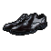
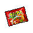

##  樹蛙．格雷

|體質|力量|敏捷|智力|幫派|
|:--:|:--:|:--:|:--:|:--:|
|2|2|6|7|無幫派|

### 故事

紅色的眼睛，綠色的皮膚，作為整座監獄里唯一的兩棲動物，他的外表十分扎眼。在你靠近他的時候，表現出十分的抗拒。聽解釋後才明白，原來他并非挑釁，而是因為擁有劇毒體質，不想“誤傷”到你。或許這只“表面狠毒”的樹蛙，才是監獄里少有的好家伙。

格雷在入獄之前曾是一名藥品推銷員。不過也許是外形的原因，他的領導一直不太喜歡他，這使得他的銷售片區被分配到了下城區。這簡直就是推銷員的噩夢，因為他所在公司代理的藥品價格十分昂貴，根本不是下城區的貧民們能夠負擔的起的。

慘淡的銷售業績導致格雷的收入低的可憐。妻子的預產期眼看就快到了，但家里卻拿不出錢來租用蝌蚪孵化房。想到妻子或許只能在家中的澡盆里撫養孩子，格雷就感到焦躁不安。

金錢的壓力讓格雷在工作上更加拼命，他開始去往下城區內的幫派地盤嘗試推銷。在聽說他是個賣藥的之後，一名幫派份子把格雷帶去了一幢秘密的建筑內。

屋內的破床上躺著不少迷迷糊糊的病患，一名自稱醫生的家伙告訴格雷。因為下城區里的很多窮人沒錢購買昂貴的藥品，所以難受的時候只能來這里注射廉價的麻醉劑。不過這就如同飲鴆止渴，麻醉的副作用會讓他們的病情加速惡化。但這又有什麼辦法呢？

那名醫生又告訴格雷，其實在國外有廉價的仿制藥，那些藥品的藥效與正版藥品相似，但價格只有十分之一。他們這兒的貧民以前一直靠著那些仿制藥治療疾病，但是在兩年前城里的藥品黑市被警方搗毀，現在已經很難再搞到這些仿制藥了。不過，他說格雷或許能幫忙解決這個難題。因為格雷藥品推銷員的身份是很好的掩護，可以較為安全的走私這些仿制藥。

“雖然這些仿制藥價格便宜，但整個下城區內的需求量很大，靠這個賺上一筆肯定不成問題。”醫生勸說到。格雷當然知道這是一樁犯法的買賣，但是考慮到蝌蚪孵化房的租金，他最終答應暫時入伙。

很快第一批仿制藥就順利送到了，它們低廉的價格讓下城區的貧民們流下了熱淚。一天不到的時間，格雷手里的仿制藥就被搶購一空。就像醫生說的一樣，這讓格雷狠狠的賺了一筆。在之後的幾個月里，格雷的生意越做越大。每周都會有各式各樣的仿制藥進入下城區，病患們為了能買到所需的藥品常常排起長龍。

蝌蚪孵化房、更大的公寓、新的汽車，格雷如愿以償的靠著這樁生意發了家。但他并不是個貪婪的家伙，他明白這其中的風險，他已經開始受到了各方的懷疑，如果再不收手的話肯定會被逮到。於是格雷找到醫生，說出了自己想要退出的打算，他不想自己的孩子們在還是蝌蚪的時候就失去爸爸。

醫生理解格雷的決定，但他也告訴格雷：正因為有了這些藥品，很多病患的情況都在好轉，如果現在停藥的話就前功盡棄了。他懇求格雷再干最後一票，讓病患們可以多屯一些藥在家，至少給他們點時間找別人來代替格雷。

或許是醫生的話打動了格雷，他干了這“最後一票”。可正如格雷預感的那樣，這一次他沒能順利逃過海關的檢查。眼看藥品要被沒收，格雷做出了一件驚人的舉動，他用身上的毒液麻痹了執法的海關警察，并帶著藥品逃走了…

格雷將搶回來的藥品帶去了下城區，并交給了醫生。他明白襲警的罪名有多嚴重，但他也知道這批藥品對於那些病患來說意味著什麼。“從你們手里賺了那麼多錢，這次就當做臨別禮物好了。”這是格雷去自首前對醫生說的最後一句話。

### 結識對話

- **喂\~你最好離我遠點…呱。**
- {question1}
  - 我妨礙到你了嗎？ `好感+5`
  - 這里是你的地盤？
- **不，讓你別靠近\~是為你好。**
- 為我好…？
- **看見我皮膚的顏色了嗎？你知道這代表了什麼嗎？**
- **這代表`我有毒`，而且是劇毒。**
- **如果你身上有傷口的話，只要蹭到我一下，保準你進醫院…**
- **到時候我還得和獄警解釋，這都是你自己找上門的…呱。**
- *……*
- **呃\~糟糕，我的口水好像濺到你的鼻子上了…**
- {pain1}

### 深入了解對話

- 嗨\~格雷，最近過得怎麼樣？
- **說實話，不太好…呱。**
- **{down1}**
- **你知道的，我因為皮膚`有毒`，所以在這里很難交到朋友。**
- **不過我養了一只`[金龜子]`做寵物，它叫喳喳，無聊的時候我會和它說說話。**
- **但今天早上它突然就消失了…呱\~呱。**
- **沒準是我昨晚睡著後…夢游…把它給吃了。**
- **{weep1}**
- **我的喳喳，沒了它我該怎麼熬過今後的日子…呱。**

#### 遞給他一只`[金龜子]`。

> 他很感謝你幫他“找回了”寵物，一下子把你當成了無話不說的朋友。

- **{exclamation1}**
- **是喳喳！你在哪裡找到它的？**
- 呃…你怎麼確定這就是你丟的蟲子？
- **你看它的外殼和翅膀，和喳喳一模一樣！一定是它…呱！**
- 難道不是每只這種蟲子都長這樣嗎？
- 不過既然是給你的，你覺得是就是吧…
- *對和錯有時候真的很難說明白…*
- …那些貧民區的病患們現在怎樣了？既然你都被抓了。
- **我進來以後，醫生經常會來看我，聽他說目前的情況還算是不錯…呱。**
- **因為我最後給他的那批藥，幫病患們熬過了一段時間。**
- **之後他買通了海關里的一個家伙，現在也算有一條相對安全的渠道了…呱。**
  - 可這畢竟還是違法的…
  - 安全又能維持多久呢？
- **是啊…要想徹底改變現狀，還是得有便宜的正版藥才行。**
- 希望這一天能早點到來吧…

#### 取消

- *哎\~可憐的家伙，眼睛都哭紅了。*
- *或許我該重新幫他捉一只`[金龜子]`來？*
- *反正每只蟲子看起來都長得一個樣…*
### 初始物品

|物品名稱|物品名稱|物品名稱|物品名稱|物品名稱|
|:--:|:--:|:--:|:--:|:--:|
|  |  |  |  |  |
| [拖鞋](道具.md#拖鞋) | [綠頭巾](道具.md#綠頭巾) | [薄荷葉](道具.md#薄荷葉)*3 | [瀉藥](道具.md#瀉藥)*2 | [《花花世界》（全新）](道具.md#《花花世界》（全新）) |
|  |  |  |  |  |
| [消毒液](道具.md#消毒液)*4 | [顏料](道具.md#顏料)*3 | [簡單的漫畫](道具.md#簡單的漫畫) | [金龜子](道具.md#金龜子) |  |
### 送禮

|圖片|物品名稱|好感|回應|
|:--:|--|:--:|--|
||[運動鞋](道具.md#運動鞋)|0|謝謝你的禮物，伙計…|
||[皮鞋](道具.md#皮鞋)|0|謝謝你的禮物，伙計…|
||[帆布鞋](道具.md#帆布鞋)|0|謝謝你的禮物，伙計…|
||[拖鞋](道具.md#拖鞋)|16|雖然大了一號，但還是很感謝你的好意。|
||[墨鏡](道具.md#墨鏡)|0|謝謝你的禮物，伙計…|
||[眼鏡](道具.md#眼鏡)|0|謝謝你的禮物，伙計…|
||[頭帶](道具.md#頭帶)|-10|這頭帶太顯眼了…我可不想這麼高調。|
||[棒球帽](道具.md#棒球帽)|0|謝謝你的禮物，伙計…|
||[毛線帽](道具.md#毛線帽)|0|謝謝你的禮物，伙計…|
||[紅頭巾](道具.md#紅頭巾)|-8|這紅色太顯眼了…我可不想這麼高調。|
||[綠頭巾](道具.md#綠頭巾)|8|謝謝\~這綠色能給我安全感。|
||[橡膠手套](道具.md#橡膠手套)|0|謝謝你的禮物，伙計…|
||[黑手](道具.md#黑手)|-8|呃…它和我的皮膚比起來簡直就是人畜無害。|
||[手錶](道具.md#手錶)|24|居然送我這麼貴重的禮物，你實在是太客氣了…|
||[護身符](道具.md#護身符)|10|（兩棲語）呱……呱\~呱。|
||[牙齒項鏈](道具.md#牙齒項鏈)|-24|這個項鏈簡直就是麻煩的吸鐵石…|
||[《死靈之書》](道具.md#《死靈之書》)|-12|這書上的語言和我家鄉的兩棲語有些類似…不過呢\~內容著實有些恐怖。|
||[自制口罩](道具.md#自制口罩)|0|謝謝你的禮物，伙計…|
||[隨身聽（開機）](道具.md#隨身聽（開機）)|0|謝謝你的禮物，伙計…|
||[隨身聽（關機）](道具.md#隨身聽（關機）)|0|謝謝你的禮物，伙計…|
||[隨身聽（沒電）](道具.md#隨身聽（沒電）)|0|謝謝你的禮物，伙計…|
||[酒葫蘆](道具.md#酒葫蘆)|0|謝謝你的禮物，伙計…|
||[黑桃A](道具.md#黑桃A)|4|我的職業經歷告訴我，好運總是眷顧有準備的人。|
||[薄荷葉](道具.md#薄荷葉)|0|謝謝你的禮物，伙計…|
||[薄荷葉卷](道具.md#薄荷葉卷)|0|謝謝你的禮物，伙計…|
||[蘑菇](道具.md#蘑菇)|0|謝謝你的禮物，伙計…|
||[蘑菇粉](道具.md#蘑菇粉)|0|謝謝你的禮物，伙計…|
||[瀉藥](道具.md#瀉藥)|0|謝謝你的禮物，伙計…|
||[紫鳶花](道具.md#紫鳶花)|0|謝謝你的禮物，伙計…|
||[花瓣粉](道具.md#花瓣粉)|0|謝謝你的禮物，伙計…|
||[安眠藥](道具.md#安眠藥)|0|謝謝你的禮物，伙計…|
||[止疼片](道具.md#止疼片)|0|謝謝你的禮物，伙計…|
||[興奮劑](道具.md#興奮劑)|0|謝謝你的禮物，伙計…|
||[醫用酒精](道具.md#醫用酒精)|0|謝謝你的禮物，伙計…|
||[酒精燈](道具.md#酒精燈)|0|謝謝你的禮物，伙計…|
||[鎮靜劑](道具.md#鎮靜劑)|0|謝謝你的禮物，伙計…|
||[啤酒](道具.md#啤酒)|0|謝謝你的禮物，伙計…|
||[蘋果酒](道具.md#蘋果酒)|0|謝謝你的禮物，伙計…|
||[精釀蘋果酒](道具.md#精釀蘋果酒)|0|謝謝你的禮物，伙計…|
||[蘋果](道具.md#蘋果)|0|謝謝你的禮物，伙計…|
||[華夫餅](道具.md#華夫餅)|0|謝謝你的禮物，伙計…|
||[奶油華夫餅](道具.md#奶油華夫餅)|0|謝謝你的禮物，伙計…|
||[一把咖啡豆](道具.md#一把咖啡豆)|0|謝謝你的禮物，伙計…|
||[口香糖](道具.md#口香糖)|0|謝謝你的禮物，伙計…|
||[曲奇餅乾](道具.md#曲奇餅乾)|0|謝謝你的禮物，伙計…|
||[焦糖棒](道具.md#焦糖棒)|0|謝謝你的禮物，伙計…|
||[汽水](道具.md#汽水)|0|謝謝你的禮物，伙計…|
||[酸奶](道具.md#酸奶)|0|謝謝你的禮物，伙計…|
||[土豆披薩](道具.md#土豆披薩)|0|謝謝你的禮物，伙計…|
||[咖啡粉](道具.md#咖啡粉)|0|謝謝你的禮物，伙計…|
||[茶包](道具.md#茶包)|4|（兩棲語）呱……呱\~呱。|
||[超辣泡麵](道具.md#超辣泡麵)|0|謝謝你的禮物，伙計…|
||[蛋白粉](道具.md#蛋白粉)|0|謝謝你的禮物，伙計…|
||[布條](道具.md#布條)|-2|我或許會需要這個…但不是現在。|
||[迴紋針](道具.md#迴紋針)|0|謝謝你的禮物，伙計…|
||[開鎖器](道具.md#開鎖器)|0|謝謝你的禮物，伙計…|
||[開鎖器(P)](道具.md#開鎖器(P))|0|謝謝你的禮物，伙計…|
||[肥皂](道具.md#肥皂)|8|再不用肥皂洗澡的話，我的背後都要長出蒜頭來了…|
||[香皂](道具.md#香皂)|16|再不用肥皂洗澡的話，我的背後都要長出蒜頭來了…|
||[計算機](道具.md#計算機)|8|（兩棲語）呱……呱\~呱。|
||[《花花世界》（全新）](道具.md#《花花世界》（全新）)|8|你知道嗎？單數期的雜志里會有一個叫做“兩棲花園”的欄目…|
||[《花花世界》（看過）](道具.md#《花花世界》（看過）)|0|謝謝你的禮物，伙計…|
||[《花花世界》（翻爛）](道具.md#《花花世界》（翻爛）)|0|謝謝你的禮物，伙計…|
||[馬女郎海報](道具.md#馬女郎海報)|0|謝謝你的禮物，伙計…|
||[貓女郎海報](道具.md#貓女郎海報)|0|謝謝你的禮物，伙計…|
||[狐女郎海報](道具.md#狐女郎海報)|0|謝謝你的禮物，伙計…|
||[兔女郎海報](道具.md#兔女郎海報)|0|謝謝你的禮物，伙計…|
||[咖啡磨](道具.md#咖啡磨)|0|謝謝你的禮物，伙計…|
||[掌上遊戲機](道具.md#掌上遊戲機)|0|謝謝你的禮物，伙計…|
||[掌上遊戲機（沒電）](道具.md#掌上遊戲機（沒電）)|0|謝謝你的禮物，伙計…|
||[電池](道具.md#電池)|0|謝謝你的禮物，伙計…|
||[牙刷](道具.md#牙刷)|0|謝謝你的禮物，伙計…|
||[牙膏](道具.md#牙膏)|0|謝謝你的禮物，伙計…|
||[空的牙膏管](道具.md#空的牙膏管)|-2|我或許會需要這個…但不是現在。|
||[消毒液](道具.md#消毒液)|2|哦\~這能幫我省去不少不必要的麻煩…|
||[除銹劑](道具.md#除銹劑)|-2|我或許會需要這個…但不是現在。|
||[火柴](道具.md#火柴)|0|謝謝你的禮物，伙計…|
||[膠帶](道具.md#膠帶)|-2|我或許會需要這個…但不是現在。|
||[顏料](道具.md#顏料)|2|我正需要這個來完成我的新畫作。|
||[釘子](道具.md#釘子)|-2|我或許會需要這個…但不是現在。|
||[鞋帶](道具.md#鞋帶)|-2|我或許會需要這個…但不是現在。|
||[白紙](道具.md#白紙)|0|謝謝你的禮物，伙計…|
||[紙鶴](道具.md#紙鶴)|6|有趣的手工，讓我想起了小時候折的紙青蛙…|
||[花束](道具.md#花束)|-8|呃…你不覺得送我這個很奇怪嗎？|
||[胡亂的涂鴉](道具.md#胡亂的涂鴉)|0|謝謝你的禮物，伙計…|
||[簡單的漫畫](道具.md#簡單的漫畫)|6|簡單的線條，有趣的故事。|
||[精美的畫作](道具.md#精美的畫作)|16|這畫值得在美術館里展出，而且得掛在最顯眼的位置。|
||[鉛筆](道具.md#鉛筆)|0|謝謝你的禮物，伙計…|
||[鉛筆](道具.md#鉛筆)|0|謝謝你的禮物，伙計…|
||[圓珠筆](道具.md#圓珠筆)|8|（兩棲語）呱……呱\~呱。|
||[圓珠筆](道具.md#圓珠筆)|8|（兩棲語）呱……呱\~呱。|
||[硬幣](道具.md#硬幣)|4|你知道嗎？傳說我們蛙類嘴里含上硬幣，就能帶來財運…|
||[長螺絲](道具.md#長螺絲)|-6|我可不需要什麼防身武器…|
||[扳手](道具.md#扳手)|-12|我可不需要什麼防身武器…|
||[湯匙](道具.md#湯匙)|0|謝謝你的禮物，伙計…|
||[湯匙](道具.md#湯匙)|0|謝謝你的禮物，伙計…|
||[釘錘](道具.md#釘錘)|-12|我可不需要什麼防身武器…|
||[剪刀](道具.md#剪刀)|-8|我可不需要什麼防身武器…|
||[碎玻璃](道具.md#碎玻璃)|-2|我可不需要什麼防身武器…|
||[玻璃匕首](道具.md#玻璃匕首)|-4|我可不需要什麼防身武器…|
||[玻璃匕首(+)](道具.md#玻璃匕首(+))|-6|我可不需要什麼防身武器…|
||[牙刷匕首](道具.md#牙刷匕首)|-4|我可不需要什麼防身武器…|
||[牙刷匕首(+)](道具.md#牙刷匕首(+))|-6|我可不需要什麼防身武器…|
||[水果刀](道具.md#水果刀)|-10|我可不需要什麼防身武器…|
||[折斷的木條](道具.md#折斷的木條)|-2|我可不需要什麼防身武器…|
||[雙節棍](道具.md#雙節棍)|0|謝謝你的禮物，伙計…|
||[雙節棍(+)](道具.md#雙節棍(+))|0|謝謝你的禮物，伙計…|
||[釘棒](道具.md#釘棒)|-6|我可不需要什麼防身武器…|
||[釘棒(+)](道具.md#釘棒(+))|-8|我可不需要什麼防身武器…|
||[鐵管](道具.md#鐵管)|-6|我可不需要什麼防身武器…|
||[皮帶](道具.md#皮帶)|0|謝謝你的禮物，伙計…|
||[皮帶](道具.md#皮帶)|0|謝謝你的禮物，伙計…|
||[發霉的麵包](道具.md#發霉的麵包)|-8|我雖然皮膚有毒素，但不代表吃了這個也不會拉肚子。|
||[金龜子](道具.md#金龜子)|20|嗯\~是該給我的喳喳找個伴了。|
||[《森之音》](道具.md#《森之音》)|8|（兩棲語）呱……呱\~呱。|
||[DEMO限定紙鶴](道具.md#DEMO限定紙鶴)|50|（兩棲語）呱……呱\~呱。|

