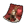

#  水牛．比爾

|體質|力量|敏捷|智力|幫派|戰鬥等級|勒索難度|持有天賦|取得天賦|
|:--:|:--:|:--:|:--:|:--:|:--:|:--:|:--:|:--:|
|11|9|8|6|大腳幫成員|強|難|[強健](技能.md#強健)、[建築師](技能.md#建築師)|[反芻](技能.md#反芻)|

## 故事

一頭脾氣火爆的水牛，彎曲的牛角和擴張的鼻孔充滿了攻擊性。看似在監獄裡待了不少的年頭，對於囚犯間的言談舉止遵守著一套“地下”規則。與他說話需謹慎小心，因為不知何時就會踩中他的“雷區”。

他在街頭長大，有個名叫林肯的弟弟。早早輟學的兄弟倆很小就加入了幫派，一直干著一些跑腿送貨的小差事。直到有一天，老大為了除掉一個污點證人，讓幫派裡的小子們抽簽“殺手令”。不幸的是，尚未成年的林肯居然倒霉的抽到了這張送死簽。

當初是比爾把林肯帶進的幫派，現在眼看林肯要因此葬送一生，他實在自責不已。於是在行動前夕，他偷走了老大交給林肯的槍，替林肯執行了刺殺任務。

當然，從未開過槍的比爾沒能成功的干掉目標，子彈從證人的頭頂擦過，自己卻被法警擊中了三槍。證人成功出庭，比爾所在的幫派被一舉瓦解。隨後，涉嫌謀殺證人的比爾將在監獄之中度過餘生，而弟弟林肯卻得以在社區的幫助下重返校園。

一晃十年過去，林肯終於通過優異的成績獲得了一所名牌大學的錄取，那是他常和比爾說起的自己夢想中的學校。看到弟弟終於擺脫了童年混亂生活的枷鎖，即將迎來光明的前途，身為哥哥的比爾由衷的替他感到高興。他總是告訴自己，如果林肯能夠就此改變命運，那麼自己在牢裡吃上再多的苦也無所謂…

## 結識對話

- 嗨\~
- **{hate1}**
- **嗨什麼嗨？你是在找茬嗎？！**
- {question1}
- 我只是“嗨\~”了一聲而已…有什麼問題嗎？
- **問題？哈\~問題大了！你這家伙是新來的嗎？**
- **在監獄裡面，打招呼可沒那麼隨便！**
- **嗨\~、嘿\~、喂\~、喲\~，它們都有自己的含義。**
- **不想挨揍的話，你最好弄清楚再開口！**
- 呃…可我還是沒弄明白，這些詞到底有什麼區別？
- **{angry1}**
- **我沒聽錯吧？你剛才居然說了“呃”這個詞！**
- **你這下可真的把我給惹毛了！**
- **我給你最後一次機會，要是再用錯詞的話，可別怪我動手！**
- 我……
- 那……
- *算了，我還是別說了…*
- {sweat1}

## 深入了解對話

- 嗯……
- **怎麼\~你是啞巴了嗎？**
- 不\~我只是不知道怎麼和你…打招呼。
- **哈哈\~沒關係，我現在的心情還不錯！**
- **即使你指著我的鼻子罵我，我也不會生氣！**
- **{happy1}**
- 究竟什麼事讓你這麼…高興？
- **要分享喜事的話，這麼干說可太掃興了！**
- **你去幫我弄罐`啤酒`來，我就告訴你\~**

#### 給他`啤酒`。

> 他往嘴裡灌了一大口酒，接著說出了他高興的原因。

- **哈\~有它就行了！**
- **那就讓我們邊喝邊說吧…**
- *原來是他的弟弟被大學錄取了。*
- 你這家伙雖然脾氣挺臭，但沒想到還是個好哥哥。
- 不過…你有沒有想過，如果那天去的不是你？
- **告訴你，如果讓我再選一次的話，我還是會這麼做。**
- **因為，這就是兄弟！**

#### 取消

- 嗯\~要是我手裡有`啤酒`的話就好了。

## 特殊對話

### 打招呼（關係極好）

- **嘿\~有什麼樂子分享嗎？**

### 打招呼（關係好）

- **這日子可真夠無聊的…**

### 打招呼（關係一般）

- **喂\~叫我幹嘛？**

### 打招呼（關係差）

- **幹嘛？有話就快說。**

### 打招呼（關係極差）

- **有話快說，有屁快放。**

### 進行毆打

- **你就等著挨揍吧！混蛋！**
- **來吧！我會把你的屎都揍出來的！**
- **我的牛角會送你上西天的！**

### 回禮

- **既然你送了我這個，那我也給你點東西好了。**

### 勒索成功

- **混蛋！你給我記住，這`{x1}`塊我會加倍討回來的，你等著！**
- **{hate1}**

### 勒索失敗

- **我現在給你三秒，從我眼前消失！你這混蛋！**
- **{angry1}**

### 一起吃飯被拒

- **不想討打的話，就給我滾遠點！**
- **{hate1}**

### 分享食物

- **那就拿來吧，我可以留著慢慢反芻。**

### 加藥被發現

- **混蛋！你的手裡是什麼？！**

### 加藥辯解失敗

- **調料？！最好他媽的是這樣！**

## 聊天

- **你知道嗎？那只老熊貓的手裡有個葫蘆，聽說把水倒進去就能變成酒！**
- 這怎麼可能？
- **你要是不相信的話就弄過來試試…說不定能變成酒的不光是水而已。**
- ……

## 初始物品

||||||
|:--:|:--:|:--:|:--:|:--:|
||||||
|[拖鞋](17-拖鞋.md)|[紅頭巾](23-紅頭巾.md)|[折斷的木條](159-折斷的木條.md)|[釘棒](162-釘棒.md)|[啤酒](54-啤酒.md)*2|
||||||
|[蛋白粉](79-蛋白粉.md)|[汽水](73-汽水.md)|[焦糖棒](72-焦糖棒.md)|[釘子](123-釘子.md)*4||

## 送禮

|圖片|物品名稱|好感|回應|
|:--:|--|:--:|--|
||[DEMO限定紙鶴](209-DEMO限定紙鶴.md)|50|我突然想和你做兄弟了，這可真夠奇怪的…|
||[牙齒項鏈](30-牙齒項鏈.md)|24|哈\~我會讓這上面的“收藏”增加的！|
||[馬女郎海報](105-馬女郎海報.md)|24|喂喂喂！這妞可真夠正點的！|
||[扳手](142-扳手.md)|24|哈！這可是件好“寶貝”！|
||[釘錘](151-釘錘.md)|24|哈！這可是件好“寶貝”！|
||[酒葫蘆](37-酒葫蘆.md)|20|哈哈\~你怎麼知道我早就想要這個了？！|
||[金龜子](202-金龜子.md)|20|哈\~金色傳說！|
||[貓女郎海報](106-貓女郎海報.md)|18|總算能有點樂子了\~|
||[狐女郎海報](107-狐女郎海報.md)|18|總算能有點樂子了\~|
||[兔女郎海報](108-兔女郎海報.md)|18|總算能有點樂子了\~|
||[精釀蘋果酒](56-精釀蘋果酒.md)|16|哈\~有了這個\~今晚又能睡個好覺了！|
||[土豆披薩](75-土豆披薩.md)|16|哈哈\~這下又能飽餐一頓了！|
||[雙節棍(+)](161-雙節棍(+).md)|15|雖然比不上我的牛角，但也算是件好玩意兒。|
||[運動鞋](14-運動鞋.md)|12|喂\~我可沒有回禮給你。|
||[拖鞋](17-拖鞋.md)|12|這東西還像是個正經禮物，我收下了！|
||[棒球帽](21-棒球帽.md)|12|喂\~我可沒有回禮給你。|
||[紅頭巾](23-紅頭巾.md)|12|這東西還像是個正經禮物，我收下了！|
||[手錶](27-手錶.md)|12|喂\~我可沒有回禮給你。|
||[隨身聽（開機）](34-隨身聽（開機）.md)|12|喂\~我可沒有回禮給你。|
||[隨身聽（關機）](35-隨身聽（關機）.md)|12|喂\~我可沒有回禮給你。|
||[隨身聽（沒電）](36-隨身聽（沒電）.md)|12|喂\~我可沒有回禮給你。|
||[啤酒](54-啤酒.md)|12|哈\~有了這個\~今晚又能睡個好覺了！|
||[蘋果酒](55-蘋果酒.md)|12|哈\~有了這個\~今晚又能睡個好覺了！|
||[奶油華夫餅](68-奶油華夫餅.md)|12|不吃飽肚子，哪來的力氣干架！你說是嗎？|
||[香皂](89-香皂.md)|12|誰能霸占浴室，誰才是真正的強者，你明白嗎？|
||[《花花世界》（全新）](102-《花花世界》（全新）.md)|12|總算能有點樂子了\~|
||[雙節棍](160-雙節棍.md)|12|雖然比不上我的牛角，但也算是件好玩意兒。|
||[釘棒(+)](163-釘棒(+).md)|12|雖然比不上我的牛角，但也算是件好玩意兒。|
||[墨鏡](18-墨鏡.md)|10|喂\~我可沒有回禮給你。|
||[頭帶](20-頭帶.md)|10|喂\~我可沒有回禮給你。|
||[護身符](29-護身符.md)|10|喂\~我可沒有回禮給你。|
||[水果刀](158-水果刀.md)|10|喂\~我可沒有回禮給你。|
||[興奮劑](50-興奮劑.md)|9|這東西還像是個正經禮物，我收下了！|
||[華夫餅](67-華夫餅.md)|9|不吃飽肚子，哪來的力氣干架！你說是嗎？|
||[超辣泡麵](78-超辣泡麵.md)|9|不吃飽肚子，哪來的力氣干架！你說是嗎？|
||[蛋白粉](79-蛋白粉.md)|9|這東西還像是個正經禮物，我收下了！|
||[《花花世界》（看過）](103-《花花世界》（看過）.md)|9|總算能有點樂子了\~|
||[釘棒](162-釘棒.md)|9|雖然比不上我的牛角，但也算是件好玩意兒。|
||[鐵管](164-鐵管.md)|9|雖然比不上我的牛角，但也算是件好玩意兒。|
||[帆布鞋](16-帆布鞋.md)|8|喂\~我可沒有回禮給你。|
||[毛線帽](22-毛線帽.md)|8|喂\~我可沒有回禮給你。|
||[酒精燈](52-酒精燈.md)|8|喂\~我可沒有回禮給你。|
||[汽水](73-汽水.md)|8|哈！你知道我有個外號叫“汽水殺手”嗎？|
||[精美的畫作](130-精美的畫作.md)|8|喂\~我可沒有回禮給你。|
||[剪刀](152-剪刀.md)|8|喂\~我可沒有回禮給你。|
||[皮帶](166-皮帶.md)|8|喂\~我可沒有回禮給你。|
||[皮帶](167-皮帶.md)|8|喂\~我可沒有回禮給你。|
||[《森之音》](203-《森之音》.md)|8|喂\~我可沒有回禮給你。|
||[薄荷葉卷](41-薄荷葉卷.md)|6|喂\~我可沒有回禮給你。|
||[瀉藥](44-瀉藥.md)|6|喂\~我可沒有回禮給你。|
||[蘋果](64-蘋果.md)|6|不吃飽肚子，哪來的力氣干架！你說是嗎？|
||[焦糖棒](72-焦糖棒.md)|6|不吃飽肚子，哪來的力氣干架！你說是嗎？|
||[肥皂](88-肥皂.md)|6|誰能霸占浴室，誰才是真正的強者，你明白嗎？|
||[長螺絲](136-長螺絲.md)|6|喂\~我可沒有回禮給你。|
||[玻璃匕首(+)](155-玻璃匕首(+).md)|6|喂\~我可沒有回禮給你。|
||[牙刷匕首(+)](157-牙刷匕首(+).md)|6|喂\~我可沒有回禮給你。|
||[薄荷葉](40-薄荷葉.md)|4|喂\~我可沒有回禮給你。|
||[蘑菇](42-蘑菇.md)|4|喂\~我可沒有回禮給你。|
||[蘑菇粉](43-蘑菇粉.md)|4|喂\~我可沒有回禮給你。|
||[花瓣粉](46-花瓣粉.md)|4|喂\~我可沒有回禮給你。|
||[止疼片](49-止疼片.md)|4|喂\~我可沒有回禮給你。|
||[醫用酒精](51-醫用酒精.md)|4|喂\~我可沒有回禮給你。|
||[一把咖啡豆](69-一把咖啡豆.md)|4|喂\~我可沒有回禮給你。|
||[酸奶](74-酸奶.md)|4|喂\~我可沒有回禮給你。|
||[咖啡粉](76-咖啡粉.md)|4|喂\~我可沒有回禮給你。|
||[《花花世界》（翻爛）](104-《花花世界》（翻爛）.md)|4|喂\~我可沒有回禮給你。|
||[牙刷](115-牙刷.md)|4|喂\~我可沒有回禮給你。|
||[牙膏](116-牙膏.md)|4|喂\~我可沒有回禮給你。|
||[硬幣](135-硬幣.md)|4|喂\~我可沒有回禮給你。|
||[湯匙](143-湯匙.md)|4|喂\~我可沒有回禮給你。|
||[湯匙](144-湯匙.md)|4|喂\~我可沒有回禮給你。|
||[玻璃匕首](154-玻璃匕首.md)|4|喂\~我可沒有回禮給你。|
||[牙刷匕首](156-牙刷匕首.md)|4|喂\~我可沒有回禮給你。|
||[口香糖](70-口香糖.md)|2|喂\~我可沒有回禮給你。|
||[曲奇餅乾](71-曲奇餅乾.md)|2|喂\~我可沒有回禮給你。|
||[釘子](123-釘子.md)|2|喂\~我可沒有回禮給你。|
||[折斷的木條](159-折斷的木條.md)|2|喂\~我可沒有回禮給你。|
||[布條](84-布條.md)|-2|喂！我要這鬼東西幹嘛？|
||[迴紋針](86-迴紋針.md)|-2|喂！我要這鬼東西幹嘛？|
||[電池](114-電池.md)|-2|喂！我要這鬼東西幹嘛？|
||[消毒液](118-消毒液.md)|-2|喂！我要這鬼東西幹嘛？|
||[除銹劑](119-除銹劑.md)|-2|喂！我要這鬼東西幹嘛？|
||[火柴](120-火柴.md)|-2|喂！我要這鬼東西幹嘛？|
||[膠帶](121-膠帶.md)|-2|喂！我要這鬼東西幹嘛？|
||[顏料](122-顏料.md)|-2|喂！我要這鬼東西幹嘛？|
||[鞋帶](124-鞋帶.md)|-2|喂！我要這鬼東西幹嘛？|
||[白紙](125-白紙.md)|-2|喂！我要這鬼東西幹嘛？|
||[碎玻璃](153-碎玻璃.md)|-2|我可不會用這種垃圾來干架。|
||[黑桃A](39-黑桃A.md)|-4|哼\~我可用不著這破玩意兒。|
||[安眠藥](47-安眠藥.md)|-4|哼\~我可用不著這破玩意兒。|
||[茶包](77-茶包.md)|-4|喂\~真的有家伙會喜歡這玩意兒的味道嗎？|
||[鉛筆](131-鉛筆.md)|-4|哼\~我可用不著這破玩意兒。|
||[鉛筆](132-鉛筆.md)|-4|哼\~我可用不著這破玩意兒。|
||[橡膠手套](25-橡膠手套.md)|-6|哼\~我可用不著這破玩意兒。|
||[鎮靜劑](53-鎮靜劑.md)|-6|哼\~我可用不著這破玩意兒。|
||[簡單的漫畫](129-簡單的漫畫.md)|-6|我對這東西沒興趣\~|
||[綠頭巾](24-綠頭巾.md)|-8|我不喜歡這個顏色\~它讓我覺得不自在。|
||[自製口罩](32-自製口罩.md)|-8|喂\~這東西會遮住我性感的鼻孔\~|
||[計算機](101-計算機.md)|-8|哼\~我可用不著這破玩意兒。|
||[咖啡磨](109-咖啡磨.md)|-8|哼\~我可用不著這破玩意兒。|
||[圓珠筆](133-圓珠筆.md)|-8|哼\~我可用不著這破玩意兒。|
||[圓珠筆](134-圓珠筆.md)|-8|哼\~我可用不著這破玩意兒。|
||[皮鞋](15-皮鞋.md)|-10|這玩意兒穿著可真不舒服。|
||[眼鏡](19-眼鏡.md)|-10|戴上這個玻璃片子還怎麼打架？！|
||[《死靈之書》](31-《死靈之書》.md)|-12|喂\~我不喜歡書，看書會讓我頭疼！|
||[掌上遊戲機](110-掌上遊戲機.md)|-12|我對這東西沒興趣\~|
||[掌上遊戲機（沒電）](111-掌上遊戲機（沒電）.md)|-12|我對這東西沒興趣\~|
||[空的牙膏管](117-空的牙膏管.md)|-20|別給我這些垃圾！你是想惹毛我嗎？！|
||[紫鳶花](45-紫鳶花.md)|-40|花…？你是在挑釁我嗎？！|
||[開鎖器](87-開鎖器.md)|-40|偷東西？娘娘腔才會偷東西！|
||[開鎖器(P)](38-開鎖器(P).md)|-40|偷東西？娘娘腔才會偷東西！|
||[胡亂的塗鴉](128-胡亂的塗鴉.md)|-40|別給我這些垃圾！你是想惹毛我嗎？！|
||[發霉的麵包](200-發霉的麵包.md)|-40|別給我這些垃圾！你是想惹毛我嗎？！|
||[紙鶴](126-紙鶴.md)|-60|別給我這些垃圾！你是想惹毛我嗎？！|
||[黑手](26-黑手.md)|-80|喂！你是在看不起我嗎？只有黑爪幫的那幫垃圾才會需要這個！|
||[花束](127-花束.md)|-80|花…？你是在挑釁我嗎？！|

