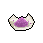

#  水豚．伯納德

|體質|力量|敏捷|智力|幫派|戰鬥等級|勒索難度|持有天賦|取得天賦|
|:--:|:--:|:--:|:--:|:--:|:--:|:--:|:--:|:--:|
|6|6|4|6|無幫派|弱|易|[交涉](技能.md#交涉)|[退役警探](技能.md#退役警探)|

## 故事

警惕性很高的水豚，入獄前是一名警探，這可能是囚犯中最不受歡迎的職業了。他曾經抓不少的混蛋，其中有些家伙就被關在這所監獄之中。而至於一名警探是如何淪落至此的，他卻不願多聊一句。

伯納德已經當了二十年的警探，是個十足的老油條。他奉行的原則是利益第二、安全第一。像敲詐小混混，收取幫派賄賂之類的破事他可沒少干。但真要讓他負責個大案子的時候，他往往不是請假就是開溜。總之，這家伙絕對算不上個好警察…

兩年前的一天，伯納德的老搭檔熬到了退休，局裡給他安排了一個新搭檔，剛從警校畢業的土撥鼠·大衛。這小子的到來讓伯納德頭疼不已。因為大衛剛正不阿的性格，伯納德再也不能自在的撈油水了。並且年輕氣盛的大衛總想著在警局出人頭地，所以常常背著伯納德向局長索要一些大案子，這可違背了伯納德安全第一的原則。

不過，隨著時間的推移，大衛的正義感漸漸感染了伯納德，他心想或許自己可以幫幫這個毛頭小子。於是大衛的勇猛沖勁，配合上伯納德的老道經驗，他們兩一手辦掉了不少的大案，很快成了局裡的明星拍檔。

正當伯納德對自己警察生涯的第二春沾沾自喜時，又一個棘手的案子來了。某個自稱“拼圖”的變態殺手出現在了城市裡，這家伙兇殘異常，並且犯案之後還會挑釁的將“犯案預告”寄往警局。大衛自告奮勇的接下了這個案子，可對手的狡猾卻讓搭檔兩一籌莫展。無法解開兇手謎題的伯納德變得心灰意冷，借著酒精麻痹自己，而不願服輸的大衛只好開始了獨自查案。

幾天後，宿醉醒來的伯納德發現了自家信箱裡的“犯案預告”。這次的謎題出奇的簡單，伯納德沒用多久便解出了答案。但短暫的喜悅很快就被恐懼所取代，因為這個答案指向的正是——大衛。預感大事不好的伯納德驅車前往大衛家中，但一切都已太遲了。大衛的尸體遍體鱗傷，嘴裡還塞了一張字條，上面寫著“遊戲結束，我很開心”。

回到警局的伯納德對於大衛的死愧疚萬分，他發誓要將兇手緝拿歸案。可就在此時，那個自稱“拼圖”的混蛋居然主動前來警局投案。原來他是個從瘋人院逃出來的瘋子，他知道即使被抓住，警察也只能老老實實的把他送去治療。

臨上押運車前，“拼圖”笑著向伯納德出了最後一道謎題“警察永遠都抓不住的罪犯是誰？答案：自首的罪犯\~哈哈哈哈！！！”他的笑聲響徹警局，那是勝利的笑聲…

的確是他贏了，而且贏得很徹底。不過，作為勝利者的他卻沒能坐上押運車，因為一顆來自失敗者的子彈打爆了他的頭。

## 結識對話

- **{question1}**
- **喂…你在看什麼？**
- …我只是四處閒逛而已，這有妨礙到你嗎？
- **不，其實沒有…抱歉，我剛才有點神經緊張了。**
- 你是得罪了什麼家伙嗎？
- **{down1}**
- **如果你和我一樣以前是個`警探`的話，就會知道我得罪誰了。**
- **我在進來前抓過不少的混蛋，他們有的現在還關在這裡…**
- **如果我不謹慎一些的話，或許早就被干掉了。**
- 這聽起來可真是不輕鬆…
- 不過作為警探，你是怎麼落到監獄裡的…難道也是被陷害？
- **我現在還不想聊這個…或許等以後有機會，我會告訴你。**

## 深入了解對話

- 嗨\~伯納德，上次你說有機會的話，會聊聊你進來的原因。
- **抱歉\~那件事會牽扯到警局的內部資料。**
- **雖然我現在已經不是警察了，但也不想到處宣揚。**
- 所以…你是信不過我嗎？

#### 我可是`模范囚犯`。

> 他平靜且略帶悲傷的講述了他和一位“朋友”的故事。

- 不是被派來刺探警局秘密的壞家伙。
- 我只是想交個朋友而已…因為我覺得你可能需要個朋友。
- **一個朋友嗎？好吧…**
- **不過你聽了我的故事之後就會知道，我可不是個值得信賴的“朋友”。**
- *一個充滿遺憾的故事…*
- 振作點\~伯納德，你至少為大衛報仇了。
- **報仇嗎…？那才不是報仇。**
- **就和“拼圖”那個瘋子說的一樣，自從他自首的那一刻起…**
- **我就失去了報仇的機會。**
- **那一槍，充其量只是個失敗者的泄憤而已…**

#### 取消

- **告訴我？我為什麼要相信你這個來路不明的家伙？**
- 難道你從沒把故事說出來過？就這麼一直憋在心裡？
- **我只告訴過老烏龜威廉姆…**
- **不過他和你不同，他是這裡的`模范囚犯`。**
- {think1}
- *他只信任`模范囚犯`嗎？*

## 特殊對話

### 打招呼（關係極好）

- **你想打聽什麼嗎？**

### 打招呼（關係好）

- **小心點，總沒錯…**

### 打招呼（關係一般）

- **別離我太近…**

### 打招呼（關係差）

- **喂\~有話直說吧。**

### 打招呼（關係極差）

- **你又在打什麼鬼主意？**

### 進行毆打

- **你想找茬嗎？哎…這日子真是沒法過了。**
- **這座監獄裡果然每個家伙都是\~蠢貨。**
- **呸\~我就知道待在這裡準沒好事…**

### 回禮

- **…我也給你準備了禮物，雖然不是什麼好東西。**

### 勒索成功

- **拿上這`{x1}`塊離我遠點，我不想再看見你的臉了…**
- **{upset1}**

### 勒索失敗

- **你的這些狠話，都是我做警探時玩剩下的…所以別再打我的主意了。**
- **{upset1}**

### 一起吃飯被拒

- **喂\~別坐這兒行嗎？我只想安心吃頓飯。**

### 分享食物

- **好吧…多吃一點我想也不會有壞處。**

### 加藥被發現

- **你想往我的盤子裡丟什麼？**

### 加藥辯解失敗

- **我提醒你，別打我的主意！**

### 索要食物成功

- **好吧\~全部吃完這些，我也會消化不良的。**

### 索要食物失敗

- **別吃著碗裡\~還盯著鍋裡\~**

## 聊天

- **你知道在這裡\~如何判斷誰想找你的麻煩嗎？**
- {think1}
- **如果有家伙把手藏在口袋裡，然後斜眼盯著你走過來…**
- **那麼，恭喜\~你八成是要挨揍了。**

## 初始物品

||||||
|:--:|:--:|:--:|:--:|:--:|
||||||
|[墨鏡](道具.md#墨鏡)|[眼鏡](道具.md#眼鏡)|[口香糖](道具.md#口香糖)*3|[肥皂](道具.md#肥皂)|[除銹劑](道具.md#除銹劑)*4|
||||||
|[膠帶](道具.md#膠帶)*4|[白紙](道具.md#白紙)*5|[鉛筆](道具.md#鉛筆)|[圓珠筆](道具.md#圓珠筆)||

## 送禮

|圖片|物品名稱|好感|回應|
|:--:|--|:--:|--|
||[DEMO限定紙鶴](道具.md#DEMO限定紙鶴)|50|你別說了，我明白這種潛規則…|
||[手錶](道具.md#手錶)|24|在這裡想要安穩度日，準時比什麼都重要。|
||[墨鏡](道具.md#墨鏡)|20|在這裡目光對視總會招惹些麻煩…|
||[金龜子](道具.md#金龜子)|20|金色傳說…|
||[棒球帽](道具.md#棒球帽)|18|這看起來沒什麼威脅…謝了。|
||[拖鞋](道具.md#拖鞋)|16|這能防止在浴室裡發生“意外”…|
||[皮鞋](道具.md#皮鞋)|15|這看起來沒什麼威脅…謝了。|
||[眼鏡](道具.md#眼鏡)|15|這看起來沒什麼威脅…謝了。|
||[護身符](道具.md#護身符)|15|希望森林之父能庇佑我們吧。|
||[運動鞋](道具.md#運動鞋)|12|這只是件單純的禮物嗎？|
||[《死靈之書》](道具.md#《死靈之書》)|12|這只是件單純的禮物嗎？|
||[隨身聽（開機）](道具.md#隨身聽（開機）)|12|這只是件單純的禮物嗎？|
||[隨身聽（關機）](道具.md#隨身聽（關機）)|12|這只是件單純的禮物嗎？|
||[隨身聽（沒電）](道具.md#隨身聽（沒電）)|12|這只是件單純的禮物嗎？|
||[奶油華夫餅](道具.md#奶油華夫餅)|12|這看起來味道應該不錯\~|
||[土豆披薩](道具.md#土豆披薩)|12|這看起來味道應該不錯\~|
||[香皂](道具.md#香皂)|12|我是得在洗澡的時候帶上一塊備用肥皂。|
||[《花花世界》（全新）](道具.md#《花花世界》（全新）)|12|我緊繃的神經是得松一松了…|
||[馬女郎海報](道具.md#馬女郎海報)|12|這只是件單純的禮物嗎？|
||[貓女郎海報](道具.md#貓女郎海報)|12|這只是件單純的禮物嗎？|
||[狐女郎海報](道具.md#狐女郎海報)|12|這只是件單純的禮物嗎？|
||[兔女郎海報](道具.md#兔女郎海報)|12|這只是件單純的禮物嗎？|
||[咖啡磨](道具.md#咖啡磨)|12|這看起來是個消磨時間的好東西。|
||[掌上遊戲機](道具.md#掌上遊戲機)|12|這只是件單純的禮物嗎？|
||[掌上遊戲機（沒電）](道具.md#掌上遊戲機（沒電）)|12|這只是件單純的禮物嗎？|
||[圓珠筆](道具.md#圓珠筆)|12|我或許能靠寫點東西來消磨時間…謝了。|
||[圓珠筆](道具.md#圓珠筆)|12|我或許能靠寫點東西來消磨時間…謝了。|
||[《森之音》](道具.md#《森之音》)|12|希望森林之父能庇佑我們吧。|
||[酒葫蘆](道具.md#酒葫蘆)|10|這只是件單純的禮物嗎？|
||[薄荷葉卷](道具.md#薄荷葉卷)|9|呼\~只有它能讓我放鬆下來了…|
||[啤酒](道具.md#啤酒)|9|一罐啤酒\~或許能讓我忘掉一些煩惱\~|
||[帆布鞋](道具.md#帆布鞋)|8|這只是件單純的禮物嗎？|
||[毛線帽](道具.md#毛線帽)|8|這只是件單純的禮物嗎？|
||[自製口罩](道具.md#自製口罩)|8|這只是件單純的禮物嗎？|
||[精釀蘋果酒](道具.md#精釀蘋果酒)|8|這只是件單純的禮物嗎？|
||[咖啡粉](道具.md#咖啡粉)|8|這讓我回想起當警察的日子了…|
||[計算機](道具.md#計算機)|8|這只是件單純的禮物嗎？|
||[精美的畫作](道具.md#精美的畫作)|8|這只是件單純的禮物嗎？|
||[皮帶](道具.md#皮帶)|8|這只是件單純的禮物嗎？|
||[皮帶](道具.md#皮帶)|8|這只是件單純的禮物嗎？|
||[橡膠手套](道具.md#橡膠手套)|6|這只是件單純的禮物嗎？|
||[蘋果酒](道具.md#蘋果酒)|6|這只是件單純的禮物嗎？|
||[蘋果](道具.md#蘋果)|6|這看起來味道應該不錯\~|
||[華夫餅](道具.md#華夫餅)|6|這只是件單純的禮物嗎？|
||[一把咖啡豆](道具.md#一把咖啡豆)|6|這看起來味道應該不錯\~|
||[焦糖棒](道具.md#焦糖棒)|6|這看起來味道應該不錯\~|
||[超辣泡麵](道具.md#超辣泡麵)|6|這只是件單純的禮物嗎？|
||[蛋白粉](道具.md#蛋白粉)|6|這只是件單純的禮物嗎？|
||[肥皂](道具.md#肥皂)|6|我是得在洗澡的時候帶上一塊備用肥皂。|
||[《花花世界》（看過）](道具.md#《花花世界》（看過）)|6|這只是件單純的禮物嗎？|
||[紙鶴](道具.md#紙鶴)|6|這只是件單純的禮物嗎？|
||[薄荷葉](道具.md#薄荷葉)|4|這只是件單純的禮物嗎？|
||[安眠藥](道具.md#安眠藥)|4|這只是件單純的禮物嗎？|
||[止疼片](道具.md#止疼片)|4|這只是件單純的禮物嗎？|
||[汽水](道具.md#汽水)|4|這只是件單純的禮物嗎？|
||[酸奶](道具.md#酸奶)|4|這只是件單純的禮物嗎？|
||[茶包](道具.md#茶包)|4|這只是件單純的禮物嗎？|
||[《花花世界》（翻爛）](道具.md#《花花世界》（翻爛）)|4|這只是件單純的禮物嗎？|
||[牙刷](道具.md#牙刷)|4|這只是件單純的禮物嗎？|
||[牙膏](道具.md#牙膏)|4|這只是件單純的禮物嗎？|
||[鉛筆](道具.md#鉛筆)|4|這只是件單純的禮物嗎？|
||[鉛筆](道具.md#鉛筆)|4|這只是件單純的禮物嗎？|
||[硬幣](道具.md#硬幣)|4|這只是件單純的禮物嗎？|
||[湯匙](道具.md#湯匙)|4|這只是件單純的禮物嗎？|
||[湯匙](道具.md#湯匙)|4|這只是件單純的禮物嗎？|
||[口香糖](道具.md#口香糖)|2|這只是件單純的禮物嗎？|
||[曲奇餅乾](道具.md#曲奇餅乾)|2|這只是件單純的禮物嗎？|
||[迴紋針](道具.md#迴紋針)|2|這只是件單純的禮物嗎？|
||[電池](道具.md#電池)|2|這只是件單純的禮物嗎？|
||[火柴](道具.md#火柴)|2|這只是件單純的禮物嗎？|
||[顏料](道具.md#顏料)|2|這只是件單純的禮物嗎？|
||[白紙](道具.md#白紙)|2|這只是件單純的禮物嗎？|
||[布條](道具.md#布條)|-2|別塞給我這些奇怪的東西。|
||[消毒液](道具.md#消毒液)|-2|別塞給我這些奇怪的東西。|
||[除銹劑](道具.md#除銹劑)|-2|別塞給我這些奇怪的東西。|
||[膠帶](道具.md#膠帶)|-2|別塞給我這些奇怪的東西。|
||[釘子](道具.md#釘子)|-2|別塞給我這些奇怪的東西。|
||[鞋帶](道具.md#鞋帶)|-2|別塞給我這些奇怪的東西。|
||[黑桃A](道具.md#黑桃A)|-4|我可不想為了一點錢把老命給搭上…|
||[蘑菇](道具.md#蘑菇)|-4|這玩意兒會給我招來麻煩的…|
||[蘑菇粉](道具.md#蘑菇粉)|-4|這玩意兒會給我招來麻煩的…|
||[紫鳶花](道具.md#紫鳶花)|-4|你知道讓別的家伙看見會傳什麼閒話嗎？|
||[花瓣粉](道具.md#花瓣粉)|-4|這玩意兒會給我招來麻煩的…|
||[醫用酒精](道具.md#醫用酒精)|-4|這玩意兒會給我招來麻煩的…|
||[開鎖器](道具.md#開鎖器)|-4|這玩意兒會給我招來麻煩的…|
||[開鎖器(P)](道具.md#開鎖器(P))|-4|這玩意兒會給我招來麻煩的…|
||[胡亂的塗鴉](道具.md#胡亂的塗鴉)|-4|抱歉\~我對藝術可沒多少鑒賞能力。|
||[玻璃匕首](道具.md#玻璃匕首)|-4|用暴力解決暴力，只會帶來新的暴力。|
||[牙刷匕首](道具.md#牙刷匕首)|-4|用暴力解決暴力，只會帶來新的暴力。|
||[興奮劑](道具.md#興奮劑)|-6|這玩意兒會給我招來麻煩的…|
||[鎮靜劑](道具.md#鎮靜劑)|-6|這玩意兒會給我招來麻煩的…|
||[簡單的漫畫](道具.md#簡單的漫畫)|-6|抱歉\~我對藝術可沒多少鑒賞能力。|
||[長螺絲](道具.md#長螺絲)|-6|用暴力解決暴力，只會帶來新的暴力。|
||[玻璃匕首(+)](道具.md#玻璃匕首(+))|-6|用暴力解決暴力，只會帶來新的暴力。|
||[牙刷匕首(+)](道具.md#牙刷匕首(+))|-6|用暴力解決暴力，只會帶來新的暴力。|
||[釘棒](道具.md#釘棒)|-6|用暴力解決暴力，只會帶來新的暴力。|
||[鐵管](道具.md#鐵管)|-6|用暴力解決暴力，只會帶來新的暴力。|
||[紅頭巾](道具.md#紅頭巾)|-8|我可不想看起來像個“愣頭青”。|
||[綠頭巾](道具.md#綠頭巾)|-8|我可不想看起來像個“愣頭青”。|
||[酒精燈](道具.md#酒精燈)|-8|這玩意兒會給我招來麻煩的…|
||[花束](道具.md#花束)|-8|你知道讓別的家伙看見會傳什麼閒話嗎？|
||[剪刀](道具.md#剪刀)|-8|用暴力解決暴力，只會帶來新的暴力。|
||[雙節棍](道具.md#雙節棍)|-8|用暴力解決暴力，只會帶來新的暴力。|
||[釘棒(+)](道具.md#釘棒(+))|-8|用暴力解決暴力，只會帶來新的暴力。|
||[頭帶](道具.md#頭帶)|-10|我可不想看起來像個“愣頭青”。|
||[水果刀](道具.md#水果刀)|-10|用暴力解決暴力，只會帶來新的暴力。|
||[雙節棍(+)](道具.md#雙節棍(+))|-10|用暴力解決暴力，只會帶來新的暴力。|
||[扳手](道具.md#扳手)|-12|用暴力解決暴力，只會帶來新的暴力。|
||[釘錘](道具.md#釘錘)|-12|用暴力解決暴力，只會帶來新的暴力。|
||[空的牙膏管](道具.md#空的牙膏管)|-20|以後這種垃圾你還是自己留著好了。|
||[碎玻璃](道具.md#碎玻璃)|-20|以後這種垃圾你還是自己留著好了。|
||[折斷的木條](道具.md#折斷的木條)|-20|以後這種垃圾你還是自己留著好了。|
||[發霉的麵包](道具.md#發霉的麵包)|-40|以後這種垃圾你還是自己留著好了。|
||[瀉藥](道具.md#瀉藥)|-60|給我這個干什麼？想讓我倒霉嗎？！|
||[黑手](道具.md#黑手)|-80|給我這個干什麼？想讓我倒霉嗎？！|
||[牙齒項鏈](道具.md#牙齒項鏈)|-120|給我這個干什麼？想讓我倒霉嗎？！|

