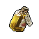

##  河馬．弗蘭克

|體質|力量|敏捷|智力|幫派|
|:--:|:--:|:--:|:--:|:--:|
|12|11|4|6|大腳幫幹部|

### 故事

傳奇殺手“黑道之牙”老弗蘭克的兒子，長相雖與父親相似，但命運卻有所不同。生在黑幫家庭的他，半生都活在父親的陰影之下。有著老派黑幫份子的行事風格。對父親去世前參與編劇的那部電影十分抵觸。

小弗蘭克出生在一個傳統的河馬家庭，家中有兩個姐姐，一個妹妹。在他的童年記憶里，家庭并不富裕，母親身體虛弱，生活的重擔全都壓在了父親的身上。父親退伍之後做過建筑工人、卡車司機、酒吧保鏢。他們沒錢負擔帶有泳池的房子，夏天常常全家擠在一個小小的浴缸里避暑。不過這樣的苦日子在某天之後戛然而止了。那是一個深夜，父親悄悄的從後門回家，身上還帶著可怕的傷痕與血跡。那正是“黑道之牙”傳說的開始。

“黑道之牙”一生犯下過無數的案件，但卻因為從未留下過證據而逍遙法外。直到他垂暮之年才主動向警方自首，或許是良心的不安，也或許是因為其他不為人知的原因。

幾年之後，正當小弗蘭克因為涉嫌黑幫活動而接受警方調查時，老弗蘭克突然答應參與一部黑幫題材紀錄片的拍攝。他向編劇提供了大量的黑幫秘辛，包括自己犯下的一些不為人知的案件。其中就包括了影片中最為令人唏噓的“教堂血案”。那本是一次尋常的內部清除行動，老弗蘭克的任務是干掉躲在教堂里的幫派叛徒，可他卻在行動中失手，同時打死了站在叛徒身後的無辜少女。這是老弗蘭克殺手生涯里，唯一一次傷害到黑幫份子之外的無辜平民，也是他決定金盆洗手的原因。

可小弗蘭克卻告訴你，那件案子根本就不是他父親所為，“黑道之牙”絕不會犯下如此的失誤。那件案子的真正兇手是一個愚蠢的、業餘的、急於證明自己的殺手學徒。而他的父親只是為了幫助那個家伙掩蓋真相，才把這個恥辱攬在了自己的身上…

### 結識對話

- 你該不會是…`河馬·弗蘭克`？那個“黑道之牙”？
- 我看過關於你的紀錄片，不過你看起來…要比電視上年輕。
- **你別搞錯了，電影里是我父親`老弗蘭克`，我是他兒子。**
- **還有，別再提那個蠢電影了，我已經受夠了…**
- {question1}
- **那里面的故事，有一半都是在胡說八道。**
- **也不知道他為什麼要接受那些蠢到家的采訪…**
- **估計是那個老家伙年紀太大，腦子糊涂了。**
- *看樣子…這故事的背後還有故事。*
- 那老弗蘭克現在怎麼樣了？
- **`死了`，就在前兩年。**
- {exclamation1}
  - 是仇家的報復嗎？
  - 難道是他說了太多…
- **呵\~那要讓你失望了，他的死可不像犯罪生涯那麼傳奇。**
- **他只是在夜里上廁所的時候，滑到摔破了頭…**
- **什麼“黑道之牙”老了之後不過只是個站不穩的老頭而已。**
- *看來“時間”才是最強的殺手…*

### 深入了解對話

- 弗蘭克\~我想再和你聊聊。
- **嗯哼？關於什麼的？**
- 當然是你父親“黑道之牙”的故事…
- 上次你說那部紀錄片里很多內容都是在胡說。
- 我想知道`真相`究竟是怎樣的？

#### 我的`聲望`應該夠格吧？

> 在弗蘭克的講述下，你知道了很多不為人知的故事。

- **好吧\~既然是你感興趣，我想那老頭應該也不會拒絕。**
- **那就讓我多說一點電影之外的“故事”吧。**
- *原來這才是真實的“黑道之牙”…*
- 你是怎麼確定那件案子絕不是你父親干的？
- 只是你的猜測？還是你有什麼確鑿的證據？
- **呵呵\~我就是知道…**
- 為什麼…？
- **因為那個愚蠢的、業餘的、急於證明自己的殺手學徒…**
- **就是我…**

#### 取消

- **呵呵\~這可是我們家的私事。**
- **我可不會輕易告訴你這個無名小卒。**
- **除非…你的聲望能像“黑道之牙”一般`聲名顯赫`。**
- *看來想讓他開口，我得先提高一下`聲望`了…*

### 打招呼

#### 關係極好

- **你想打發時間嗎？**

#### 關係好

- **是你啊，這次又想打聽什麼？**

#### 關係一般

- **嗯哼？有事嗎？**

#### 關係不好

- **說吧，小子，我聽著呢。**

#### 關係極差

- **有什麼廢話，快點說。**

### 初始物品

||||||
|:--:|:--:|:--:|:--:|:--:|
|  |  |  |  |  |
| [拖鞋](道具.md#拖鞋) | [棒球帽](道具.md#棒球帽) | [鐵管](道具.md#鐵管) | [扳手](道具.md#扳手) | [薄荷葉卷](道具.md#薄荷葉卷)*3 |
|  |  |  |  |  |
| [布條](道具.md#布條)*3 | [肥皂](道具.md#肥皂) | [火柴](道具.md#火柴)*6 | [鞋帶](道具.md#鞋帶)*3 |  |

### 送禮

|圖片|物品名稱|好感|回應|
|:--:|--|:--:|--|
||[運動鞋](道具.md#運動鞋)|0|呵呵呵\~這個還算不錯\~|
||[皮鞋](道具.md#皮鞋)|0|呵呵呵\~這個還算不錯\~|
||[帆布鞋](道具.md#帆布鞋)|0|呵呵呵\~這個還算不錯\~|
||[拖鞋](道具.md#拖鞋)|16|哈\~小子\~你還算有點眼力。|
||[墨鏡](道具.md#墨鏡)|10|這讓我想起曾經的“工作服”。|
||[眼鏡](道具.md#眼鏡)|0|呵呵呵\~這個還算不錯\~|
||[頭帶](道具.md#頭帶)|0|呵呵呵\~這個還算不錯\~|
||[棒球帽](道具.md#棒球帽)|0|呵呵呵\~這個還算不錯\~|
||[毛線帽](道具.md#毛線帽)|8|這讓我想起曾經的“工作服”。|
||[紅頭巾](道具.md#紅頭巾)|0|呵呵呵\~這個還算不錯\~|
||[綠頭巾](道具.md#綠頭巾)|0|呵呵呵\~這個還算不錯\~|
||[橡膠手套](道具.md#橡膠手套)|6|這讓我想起曾經的“工作服”。|
||[黑手](道具.md#黑手)|0|呵呵呵\~這個還算不錯\~|
||[手錶](道具.md#手錶)|12|這讓我想起曾經的“工作服”。|
||[護身符](道具.md#護身符)|0|呵呵呵\~這個還算不錯\~|
||[牙齒項鏈](道具.md#牙齒項鏈)|0|呵呵呵\~這個還算不錯\~|
||[《死靈之書》](道具.md#《死靈之書》)|-12|無聊的東西，看這種地攤文學簡直浪費時間。|
||[自制口罩](道具.md#自制口罩)|8|這讓我想起曾經的“工作服”。|
||[隨身聽（開機）](道具.md#隨身聽（開機）)|-12|這玩意兒太吵了…|
||[隨身聽（關機）](道具.md#隨身聽（關機）)|-12|這玩意兒太吵了…|
||[隨身聽（沒電）](道具.md#隨身聽（沒電）)|-12|這玩意兒太吵了…|
||[酒葫蘆](道具.md#酒葫蘆)|0|呵呵呵\~這個還算不錯\~|
||[黑桃A](道具.md#黑桃A)|0|呵呵呵\~這個還算不錯\~|
||[薄荷葉](道具.md#薄荷葉)|4|聽說嚼這個會變國字臉？那都是胡扯。|
||[薄荷葉卷](道具.md#薄荷葉卷)|12|呼\~我正需要這個呢！謝了\~小子。|
||[蘑菇](道具.md#蘑菇)|0|呵呵呵\~這個還算不錯\~|
||[蘑菇粉](道具.md#蘑菇粉)|0|呵呵呵\~這個還算不錯\~|
||[瀉藥](道具.md#瀉藥)|0|呵呵呵\~這個還算不錯\~|
||[紫鳶花](道具.md#紫鳶花)|-8|喂\~！你在想什麼？我對你可沒興趣！|
||[花瓣粉](道具.md#花瓣粉)|0|呵呵呵\~這個還算不錯\~|
||[安眠藥](道具.md#安眠藥)|0|呵呵呵\~這個還算不錯\~|
||[止疼片](道具.md#止疼片)|0|呵呵呵\~這個還算不錯\~|
||[興奮劑](道具.md#興奮劑)|0|呵呵呵\~這個還算不錯\~|
||[醫用酒精](道具.md#醫用酒精)|0|呵呵呵\~這個還算不錯\~|
||[酒精燈](道具.md#酒精燈)|0|呵呵呵\~這個還算不錯\~|
||[鎮靜劑](道具.md#鎮靜劑)|0|呵呵呵\~這個還算不錯\~|
||[啤酒](道具.md#啤酒)|0|呵呵呵\~這個還算不錯\~|
||[蘋果酒](道具.md#蘋果酒)|0|呵呵呵\~這個還算不錯\~|
||[精釀蘋果酒](道具.md#精釀蘋果酒)|0|呵呵呵\~這個還算不錯\~|
||[蘋果](道具.md#蘋果)|4|像我這種體型，總得多吃點。|
||[華夫餅](道具.md#華夫餅)|0|呵呵呵\~這個還算不錯\~|
||[奶油華夫餅](道具.md#奶油華夫餅)|8|像我這種體型，總得多吃點。|
||[一把咖啡豆](道具.md#一把咖啡豆)|0|呵呵呵\~這個還算不錯\~|
||[口香糖](道具.md#口香糖)|0|呵呵呵\~這個還算不錯\~|
||[曲奇餅乾](道具.md#曲奇餅乾)|2|像我這種體型，總得多吃點。|
||[焦糖棒](道具.md#焦糖棒)|0|呵呵呵\~這個還算不錯\~|
||[汽水](道具.md#汽水)|0|呵呵呵\~這個還算不錯\~|
||[酸奶](道具.md#酸奶)|0|呵呵呵\~這個還算不錯\~|
||[土豆披薩](道具.md#土豆披薩)|8|像我這種體型，總得多吃點。|
||[咖啡粉](道具.md#咖啡粉)|0|呵呵呵\~這個還算不錯\~|
||[茶包](道具.md#茶包)|0|呵呵呵\~這個還算不錯\~|
||[超辣泡麵](道具.md#超辣泡麵)|6|像我這種體型，總得多吃點。|
||[蛋白粉](道具.md#蛋白粉)|0|呵呵呵\~這個還算不錯\~|
||[布條](道具.md#布條)|0|呵呵呵\~這個還算不錯\~|
||[迴紋針](道具.md#迴紋針)|0|呵呵呵\~這個還算不錯\~|
||[開鎖器](道具.md#開鎖器)|0|呵呵呵\~這個還算不錯\~|
||[開鎖器(P)](道具.md#開鎖器(P))|0|呵呵呵\~這個還算不錯\~|
||[肥皂](道具.md#肥皂)|4|缺了這個，我的日子可過不下去。|
||[香皂](道具.md#香皂)|16|哈\~這種高級貨，我平時可舍不得用。|
||[計算機](道具.md#計算機)|0|呵呵呵\~這個還算不錯\~|
||[《花花世界》（全新）](道具.md#《花花世界》（全新）)|-8|我早過了喜歡這種東西的年紀了…|
||[《花花世界》（看過）](道具.md#《花花世界》（看過）)|-6|我早過了喜歡這種東西的年紀了…|
||[《花花世界》（翻爛）](道具.md#《花花世界》（翻爛）)|-4|我早過了喜歡這種東西的年紀了…|
||[馬女郎海報](道具.md#馬女郎海報)|0|呵呵呵\~這個還算不錯\~|
||[貓女郎海報](道具.md#貓女郎海報)|-12|這些細胳膊細腿，毫無美感可言。|
||[狐女郎海報](道具.md#狐女郎海報)|-12|這些細胳膊細腿，毫無美感可言。|
||[兔女郎海報](道具.md#兔女郎海報)|-12|這些細胳膊細腿，毫無美感可言。|
||[咖啡磨](道具.md#咖啡磨)|0|呵呵呵\~這個還算不錯\~|
||[掌上遊戲機](道具.md#掌上遊戲機)|-12|有比這玩意兒更無聊的東西嗎？|
||[掌上遊戲機（沒電）](道具.md#掌上遊戲機（沒電）)|-12|有比這玩意兒更無聊的東西嗎？|
||[電池](道具.md#電池)|-2|我用不著這個，而且它會膈著我的屁股。|
||[牙刷](道具.md#牙刷)|4|謝了\~小子，牙齒可是我最重要的東西。|
||[牙膏](道具.md#牙膏)|4|謝了\~小子，牙齒可是我最重要的東西。|
||[空的牙膏管](道具.md#空的牙膏管)|-4|小子，這種垃圾你最好自己留著！|
||[消毒液](道具.md#消毒液)|-2|喂\~小子，我要這玩意兒干嘛？|
||[除銹劑](道具.md#除銹劑)|-2|喂\~小子，我要這玩意兒干嘛？|
||[火柴](道具.md#火柴)|0|呵呵呵\~這個還算不錯\~|
||[膠帶](道具.md#膠帶)|-2|喂\~小子，我要這玩意兒干嘛？|
||[顏料](道具.md#顏料)|-2|小子，我對畫畫可沒多少興趣…|
||[釘子](道具.md#釘子)|-2|喂\~小子，我要這玩意兒干嘛？|
||[鞋帶](道具.md#鞋帶)|0|呵呵呵\~這個還算不錯\~|
||[白紙](道具.md#白紙)|-2|喂\~小子，我要這玩意兒干嘛？|
||[紙鶴](道具.md#紙鶴)|-12|你想用這蠢東西逗我嗎？|
||[花束](道具.md#花束)|-16|喂\~！你在想什麼？我對你可沒興趣！|
||[胡亂的涂鴉](道具.md#胡亂的涂鴉)|-8|小子，這種垃圾你最好自己留著！|
||[簡單的漫畫](道具.md#簡單的漫畫)|-6|小子，我對畫畫可沒多少興趣…|
||[精美的畫作](道具.md#精美的畫作)|0|呵呵呵\~這個還算不錯\~|
||[鉛筆](道具.md#鉛筆)|0|呵呵呵\~這個還算不錯\~|
||[鉛筆](道具.md#鉛筆)|0|呵呵呵\~這個還算不錯\~|
||[圓珠筆](道具.md#圓珠筆)|0|呵呵呵\~這個還算不錯\~|
||[圓珠筆](道具.md#圓珠筆)|0|呵呵呵\~這個還算不錯\~|
||[硬幣](道具.md#硬幣)|-4|我看起來是缺這一塊錢的樣子嗎？！|
||[長螺絲](道具.md#長螺絲)|0|呵呵呵\~這個還算不錯\~|
||[扳手](道具.md#扳手)|24|能搞到這個，你小子也算有點本事！|
||[湯匙](道具.md#湯匙)|0|呵呵呵\~這個還算不錯\~|
||[湯匙](道具.md#湯匙)|0|呵呵呵\~這個還算不錯\~|
||[釘錘](道具.md#釘錘)|24|能搞到這個，你小子也算有點本事！|
||[剪刀](道具.md#剪刀)|0|呵呵呵\~這個還算不錯\~|
||[碎玻璃](道具.md#碎玻璃)|-2|喂\~我可不想被這玩意兒劃傷手！|
||[玻璃匕首](道具.md#玻璃匕首)|0|呵呵呵\~這個還算不錯\~|
||[玻璃匕首(+)](道具.md#玻璃匕首(+))|0|呵呵呵\~這個還算不錯\~|
||[牙刷匕首](道具.md#牙刷匕首)|0|呵呵呵\~這個還算不錯\~|
||[牙刷匕首(+)](道具.md#牙刷匕首(+))|0|呵呵呵\~這個還算不錯\~|
||[水果刀](道具.md#水果刀)|0|呵呵呵\~這個還算不錯\~|
||[折斷的木條](道具.md#折斷的木條)|0|呵呵呵\~這個還算不錯\~|
||[雙節棍](道具.md#雙節棍)|0|呵呵呵\~這個還算不錯\~|
||[雙節棍(+)](道具.md#雙節棍(+))|0|呵呵呵\~這個還算不錯\~|
||[釘棒](道具.md#釘棒)|6|還是這玩意兒用著順手。|
||[釘棒(+)](道具.md#釘棒(+))|8|還是這玩意兒用著順手。|
||[鐵管](道具.md#鐵管)|6|還是這玩意兒用著順手。|
||[皮帶](道具.md#皮帶)|0|呵呵呵\~這個還算不錯\~|
||[皮帶](道具.md#皮帶)|0|呵呵呵\~這個還算不錯\~|
||[發霉的麵包](道具.md#發霉的麵包)|-8|小子，這種垃圾你最好自己留著！|
||[金龜子](道具.md#金龜子)|20|哈\~金色傳說！|
||[《森之音》](道具.md#《森之音》)|0|呵呵呵\~這個還算不錯\~|
||[DEMO限定紙鶴](道具.md#DEMO限定紙鶴)|50|呵呵\~小子，沒想到你會搞這種“偷襲”…|

