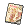

#  河馬．弗蘭克

|體質|力量|敏捷|智力|幫派|戰鬥等級|勒索難度|持有天賦|取得天賦|
|:--:|:--:|:--:|:--:|:--:|:--:|:--:|:--:|:--:|
|12|11|4|6|大腳幫幹部|強|難|[歹徒](技能.md#歹徒)、[工人](技能.md#工人)|[監工](技能.md#監工)|

## 故事

傳奇殺手“黑道之牙”老弗蘭克的兒子，長相雖與父親相似，但命運卻有所不同。生在黑幫家庭的他，半生都活在父親的陰影之下。有著老派黑幫份子的行事風格。對父親去世前參與編劇的那部電影十分抵觸。

小弗蘭克出生在一個傳統的河馬家庭，家中有兩個姐姐，一個妹妹。在他的童年記憶裡，家庭並不富裕，母親身體虛弱，生活的重擔全都壓在了父親的身上。父親退伍之後做過建築工人、卡車司機、酒吧保鏢。他們沒錢負擔帶有泳池的房子，夏天常常全家擠在一個小小的浴缸裡避暑。不過這樣的苦日子在某天之後戛然而止了。那是一個深夜，父親悄悄的從後門回家，身上還帶著可怕的傷痕與血跡。那正是“黑道之牙”傳說的開始。

“黑道之牙”一生犯下過無數的案件，但卻因為從未留下過證據而逍遙法外。直到他垂暮之年才主動向警方自首，或許是良心的不安，也或許是因為其他不為人知的原因。

幾年之後，正當小弗蘭克因為涉嫌黑幫活動而接受警方調查時，老弗蘭克突然答應參與一部黑幫題材紀錄片的拍攝。他向編劇提供了大量的黑幫秘辛，包括自己犯下的一些不為人知的案件。其中就包括了影片中最為令人唏噓的“教堂血案”。那本是一次尋常的內部清除行動，老弗蘭克的任務是干掉躲在教堂裡的幫派叛徒，可他卻在行動中失手，同時打死了站在叛徒身後的無辜少女。這是老弗蘭克殺手生涯裡，唯一一次傷害到黑幫份子之外的無辜平民，也是他決定金盆洗手的原因。

可小弗蘭克卻告訴你，那件案子根本就不是他父親所為，“黑道之牙”絕不會犯下如此的失誤。那件案子的真正兇手是一個愚蠢的、業餘的、急於證明自己的殺手學徒。而他的父親只是為了幫助那個家伙掩蓋真相，才把這個恥辱攬在了自己的身上…

## 結識對話

- 你該不會是…`河馬·弗蘭克`？那個“黑道之牙”？
- 我看過關於你的紀錄片，不過你看起來…要比電視上年輕。
- **你別搞錯了，電影裡是我父親`老弗蘭克`，我是他兒子。**
- **還有，別再提那個蠢電影了，我已經受夠了…**
- {question1}
- **那裡面的故事，有一半都是在胡說八道。**
- **也不知道他為什麼要接受那些蠢到家的采訪…**
- **估計是那個老家伙年紀太大，腦子糊塗了。**
- *看樣子…這故事的背後還有故事。*
- 那老弗蘭克現在怎麼樣了？
- **`死了`，就在前兩年。**
- {exclamation1}
- :point_right:是仇家的報復嗎？
- :point_right:難道是他說了太多…
- **呵\~那要讓你失望了，他的死可不像犯罪生涯那麼傳奇。**
- **他只是在夜裡上廁所的時候，滑到摔破了頭…**
- **什麼“黑道之牙”老了之後不過只是個站不穩的老頭而已。**
- *看來“時間”才是最強的殺手…*

## 深入了解對話

- 弗蘭克\~我想再和你聊聊。
- **嗯哼？關於什麼的？**
- 當然是你父親“黑道之牙”的故事…
- 上次你說那部紀錄片裡很多內容都是在胡說。
- 我想知道`真相`究竟是怎樣的？

#### 我的`聲望`應該夠格吧？

> 在弗蘭克的講述下，你知道了很多不為人知的故事。

- **好吧\~既然是你感興趣，我想那老頭應該也不會拒絕。**
- **那就讓我多說一點電影之外的“故事”吧。**
- *原來這才是真實的“黑道之牙”…*
- 你是怎麼確定那件案子絕不是你父親干的？
- 只是你的猜測？還是你有什麼確鑿的證據？
- **呵呵\~我就是知道…**
- 為什麼…？
- **因為那個愚蠢的、業餘的、急於證明自己的殺手學徒…**
- **就是我…**

#### 取消

- **呵呵\~這可是我們家的私事。**
- **我可不會輕易告訴你這個無名小卒。**
- **除非…你的聲望能像“黑道之牙”一般`聲名顯赫`。**
- *看來想讓他開口，我得先提高一下`聲望`了…*

## 特殊對話

### 打招呼（關係極好）

- **你想打發時間嗎？**

### 打招呼（關係好）

- **是你啊，這次又想打聽什麼？**

### 打招呼（關係一般）

- **嗯哼？有事嗎？**

### 打招呼（關係差）

- **說吧，小子，我聽著呢。**

### 打招呼（關係極差）

- **有什麼廢話，快點說。**

### 進行毆打

- **你找錯挑釁的對象了，小子！**
- **愚蠢的小子，你甚至都不夠我塞牙縫的。**
- **小子，挑釁我可是要付出代價的，很嚴重的代價！**

### 回禮

- **那麼，小子，我也給你個回禮好了。**

### 勒索成功

- **小子，這`{x1}`塊你拿好，但我提醒你，你絕對干了件蠢事…**
- **{upset1}**

### 勒索失敗

- **愚蠢的小子，想在我面前裝狠？你怕是還不夠格。**

### 一起吃飯被拒

- **坐遠點兒，別壞了我的胃口。**

### 分享食物

- **{smile1}**
- **當然，我可從不挑食。**

### 加藥被發現

- **小子，你手裡攥的是什麼？**

### 加藥辯解失敗

- **你最好給我小心點，我可不好騙！**

## 聊天

- 傳奇殺手摔死在了廁所？你不覺得這件事有點蹊蹺嗎？
- **說實話，老弗蘭克能活到這個歲數已經算是個奇跡了…**
- **那個老家伙的仇家能從街頭排到巷尾。**
- **呵\~在我看來，他被馬桶干掉這件事，那些仇家肯定比我要生氣的多。**

## 初始物品

||||||
|:--:|:--:|:--:|:--:|:--:|
||||||
|[拖鞋](17-拖鞋.md)|[棒球帽](21-棒球帽.md)|[鐵管](164-鐵管.md)|[扳手](142-扳手.md)|[薄荷葉卷](41-薄荷葉卷.md)*3|
||||||
|[布條](84-布條.md)*3|[肥皂](88-肥皂.md)|[火柴](120-火柴.md)*6|[鞋帶](124-鞋帶.md)*3||

## 送禮

|圖片|物品名稱|好感|回應|
|:--:|--|:--:|--|
||[DEMO限定紙鶴](209-DEMO限定紙鶴.md)|50|呵呵\~小子，沒想到你會搞這種“偷襲”…|
||[扳手](142-扳手.md)|24|能搞到這個，你小子也算有點本事！|
||[釘錘](151-釘錘.md)|24|能搞到這個，你小子也算有點本事！|
||[金龜子](202-金龜子.md)|20|哈\~金色傳說！|
||[手錶](27-手錶.md)|18|這讓我想起曾經的“工作服”。|
||[拖鞋](17-拖鞋.md)|16|哈\~小子\~你還算有點眼力。|
||[香皂](89-香皂.md)|16|哈\~這種高級貨，我平時可舍不得用。|
||[墨鏡](18-墨鏡.md)|15|這讓我想起曾經的“工作服”。|
||[運動鞋](14-運動鞋.md)|12|呵呵呵\~這個還算不錯\~|
||[棒球帽](21-棒球帽.md)|12|呵呵呵\~這個還算不錯\~|
||[毛線帽](22-毛線帽.md)|12|這讓我想起曾經的“工作服”。|
||[牙齒項鏈](30-牙齒項鏈.md)|12|呵呵呵\~這個還算不錯\~|
||[自製口罩](32-自製口罩.md)|12|這讓我想起曾經的“工作服”。|
||[薄荷葉卷](41-薄荷葉卷.md)|12|呼\~我正需要這個呢！謝了\~小子。|
||[奶油華夫餅](68-奶油華夫餅.md)|12|像我這種體型，總得多吃點。|
||[土豆披薩](75-土豆披薩.md)|12|像我這種體型，總得多吃點。|
||[馬女郎海報](105-馬女郎海報.md)|12|呵呵呵\~這個還算不錯\~|
||[釘棒(+)](163-釘棒(+).md)|12|還是這玩意兒用著順手。|
||[皮鞋](15-皮鞋.md)|10|呵呵呵\~這個還算不錯\~|
||[眼鏡](19-眼鏡.md)|10|呵呵呵\~這個還算不錯\~|
||[頭帶](20-頭帶.md)|10|呵呵呵\~這個還算不錯\~|
||[護身符](29-護身符.md)|10|呵呵呵\~這個還算不錯\~|
||[酒葫蘆](37-酒葫蘆.md)|10|呵呵呵\~這個還算不錯\~|
||[水果刀](158-水果刀.md)|10|呵呵呵\~這個還算不錯\~|
||[雙節棍(+)](161-雙節棍(+).md)|10|呵呵呵\~這個還算不錯\~|
||[橡膠手套](25-橡膠手套.md)|9|這讓我想起曾經的“工作服”。|
||[超辣泡麵](78-超辣泡麵.md)|9|像我這種體型，總得多吃點。|
||[釘棒](162-釘棒.md)|9|還是這玩意兒用著順手。|
||[鐵管](164-鐵管.md)|9|還是這玩意兒用著順手。|
||[帆布鞋](16-帆布鞋.md)|8|呵呵呵\~這個還算不錯\~|
||[紅頭巾](23-紅頭巾.md)|8|呵呵呵\~這個還算不錯\~|
||[綠頭巾](24-綠頭巾.md)|8|呵呵呵\~這個還算不錯\~|
||[黑手](26-黑手.md)|8|呵呵呵\~這個還算不錯\~|
||[酒精燈](52-酒精燈.md)|8|呵呵呵\~這個還算不錯\~|
||[精釀蘋果酒](56-精釀蘋果酒.md)|8|呵呵呵\~這個還算不錯\~|
||[計算機](101-計算機.md)|8|呵呵呵\~這個還算不錯\~|
||[咖啡磨](109-咖啡磨.md)|8|呵呵呵\~這個還算不錯\~|
||[精美的畫作](130-精美的畫作.md)|8|呵呵呵\~這個還算不錯\~|
||[圓珠筆](133-圓珠筆.md)|8|呵呵呵\~這個還算不錯\~|
||[圓珠筆](134-圓珠筆.md)|8|呵呵呵\~這個還算不錯\~|
||[剪刀](152-剪刀.md)|8|呵呵呵\~這個還算不錯\~|
||[雙節棍](160-雙節棍.md)|8|呵呵呵\~這個還算不錯\~|
||[皮帶](166-皮帶.md)|8|呵呵呵\~這個還算不錯\~|
||[皮帶](167-皮帶.md)|8|呵呵呵\~這個還算不錯\~|
||[《森之音》](203-《森之音》.md)|8|呵呵呵\~這個還算不錯\~|
||[薄荷葉](40-薄荷葉.md)|6|聽說嚼這個會變國字臉？那都是胡扯。|
||[瀉藥](44-瀉藥.md)|6|呵呵呵\~這個還算不錯\~|
||[興奮劑](50-興奮劑.md)|6|呵呵呵\~這個還算不錯\~|
||[鎮靜劑](53-鎮靜劑.md)|6|呵呵呵\~這個還算不錯\~|
||[啤酒](54-啤酒.md)|6|呵呵呵\~這個還算不錯\~|
||[蘋果酒](55-蘋果酒.md)|6|呵呵呵\~這個還算不錯\~|
||[蘋果](64-蘋果.md)|6|像我這種體型，總得多吃點。|
||[華夫餅](67-華夫餅.md)|6|呵呵呵\~這個還算不錯\~|
||[蛋白粉](79-蛋白粉.md)|6|呵呵呵\~這個還算不錯\~|
||[肥皂](88-肥皂.md)|6|缺了這個，我的日子可過不下去。|
||[牙刷](115-牙刷.md)|6|謝了\~小子，牙齒可是我最重要的東西。|
||[牙膏](116-牙膏.md)|6|謝了\~小子，牙齒可是我最重要的東西。|
||[長螺絲](136-長螺絲.md)|6|呵呵呵\~這個還算不錯\~|
||[玻璃匕首(+)](155-玻璃匕首(+).md)|6|呵呵呵\~這個還算不錯\~|
||[牙刷匕首(+)](157-牙刷匕首(+).md)|6|呵呵呵\~這個還算不錯\~|
||[黑桃A](39-黑桃A.md)|4|呵呵呵\~這個還算不錯\~|
||[蘑菇](42-蘑菇.md)|4|呵呵呵\~這個還算不錯\~|
||[蘑菇粉](43-蘑菇粉.md)|4|呵呵呵\~這個還算不錯\~|
||[花瓣粉](46-花瓣粉.md)|4|呵呵呵\~這個還算不錯\~|
||[安眠藥](47-安眠藥.md)|4|呵呵呵\~這個還算不錯\~|
||[止疼片](49-止疼片.md)|4|呵呵呵\~這個還算不錯\~|
||[醫用酒精](51-醫用酒精.md)|4|呵呵呵\~這個還算不錯\~|
||[一把咖啡豆](69-一把咖啡豆.md)|4|呵呵呵\~這個還算不錯\~|
||[焦糖棒](72-焦糖棒.md)|4|呵呵呵\~這個還算不錯\~|
||[汽水](73-汽水.md)|4|呵呵呵\~這個還算不錯\~|
||[酸奶](74-酸奶.md)|4|呵呵呵\~這個還算不錯\~|
||[咖啡粉](76-咖啡粉.md)|4|呵呵呵\~這個還算不錯\~|
||[茶包](77-茶包.md)|4|呵呵呵\~這個還算不錯\~|
||[開鎖器](87-開鎖器.md)|4|呵呵呵\~這個還算不錯\~|
||[開鎖器(P)](38-開鎖器(P).md)|4|呵呵呵\~這個還算不錯\~|
||[鉛筆](131-鉛筆.md)|4|呵呵呵\~這個還算不錯\~|
||[鉛筆](132-鉛筆.md)|4|呵呵呵\~這個還算不錯\~|
||[湯匙](143-湯匙.md)|4|呵呵呵\~這個還算不錯\~|
||[湯匙](144-湯匙.md)|4|呵呵呵\~這個還算不錯\~|
||[玻璃匕首](154-玻璃匕首.md)|4|呵呵呵\~這個還算不錯\~|
||[牙刷匕首](156-牙刷匕首.md)|4|呵呵呵\~這個還算不錯\~|
||[曲奇餅乾](71-曲奇餅乾.md)|3|像我這種體型，總得多吃點。|
||[口香糖](70-口香糖.md)|2|呵呵呵\~這個還算不錯\~|
||[布條](84-布條.md)|2|呵呵呵\~這個還算不錯\~|
||[迴紋針](86-迴紋針.md)|2|呵呵呵\~這個還算不錯\~|
||[火柴](120-火柴.md)|2|呵呵呵\~這個還算不錯\~|
||[鞋帶](124-鞋帶.md)|2|呵呵呵\~這個還算不錯\~|
||[折斷的木條](159-折斷的木條.md)|2|呵呵呵\~這個還算不錯\~|
||[電池](114-電池.md)|-2|我用不著這個，而且它會膈著我的屁股。|
||[消毒液](118-消毒液.md)|-2|喂\~小子，我要這玩意兒幹嘛？|
||[除銹劑](119-除銹劑.md)|-2|喂\~小子，我要這玩意兒幹嘛？|
||[膠帶](121-膠帶.md)|-2|喂\~小子，我要這玩意兒幹嘛？|
||[顏料](122-顏料.md)|-2|小子，我對畫畫可沒多少興趣…|
||[釘子](123-釘子.md)|-2|喂\~小子，我要這玩意兒幹嘛？|
||[白紙](125-白紙.md)|-2|喂\~小子，我要這玩意兒幹嘛？|
||[碎玻璃](153-碎玻璃.md)|-2|喂\~我可不想被這玩意兒劃傷手！|
||[《花花世界》（翻爛）](104-《花花世界》（翻爛）.md)|-4|我早過了喜歡這種東西的年紀了…|
||[硬幣](135-硬幣.md)|-4|我看起來是缺這一塊錢的樣子嗎？！|
||[《花花世界》（看過）](103-《花花世界》（看過）.md)|-6|我早過了喜歡這種東西的年紀了…|
||[簡單的漫畫](129-簡單的漫畫.md)|-6|小子，我對畫畫可沒多少興趣…|
||[《花花世界》（全新）](102-《花花世界》（全新）.md)|-8|我早過了喜歡這種東西的年紀了…|
||[《死靈之書》](31-《死靈之書》.md)|-12|無聊的東西，看這種地攤文學簡直浪費時間。|
||[隨身聽（開機）](34-隨身聽（開機）.md)|-12|這玩意兒太吵了…|
||[隨身聽（關機）](35-隨身聽（關機）.md)|-12|這玩意兒太吵了…|
||[隨身聽（沒電）](36-隨身聽（沒電）.md)|-12|這玩意兒太吵了…|
||[貓女郎海報](106-貓女郎海報.md)|-12|這些細胳膊細腿，毫無美感可言。|
||[狐女郎海報](107-狐女郎海報.md)|-12|這些細胳膊細腿，毫無美感可言。|
||[兔女郎海報](108-兔女郎海報.md)|-12|這些細胳膊細腿，毫無美感可言。|
||[掌上遊戲機](110-掌上遊戲機.md)|-12|有比這玩意兒更無聊的東西嗎？|
||[掌上遊戲機（沒電）](111-掌上遊戲機（沒電）.md)|-12|有比這玩意兒更無聊的東西嗎？|
||[空的牙膏管](117-空的牙膏管.md)|-20|小子，這種垃圾你最好自己留著！|
||[紫鳶花](45-紫鳶花.md)|-40|喂\~！你在想什麼？我對你可沒興趣！|
||[胡亂的塗鴉](128-胡亂的塗鴉.md)|-40|小子，這種垃圾你最好自己留著！|
||[發霉的麵包](200-發霉的麵包.md)|-40|小子，這種垃圾你最好自己留著！|
||[紙鶴](126-紙鶴.md)|-60|你想用這蠢東西逗我嗎？|
||[花束](127-花束.md)|-80|喂\~！你在想什麼？我對你可沒興趣！|

