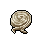
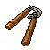

##  浣熊．面條

|體質|力量|敏捷|智力|
|:--:|:--:|:--:|:--:|
|5|5|7|7|

### 簡介

一只手法高超的浣熊，他在你面前表演了一招如同魔術般的換牌秀。據他所說這招是從他的室友魔術師兔子·懷特那里學來的。并且從他的意思來看，他練這招可不是為了泡妞那么簡單，而是準備在監獄的牌局里出老千。看他自信滿滿的樣子，一定是個賭桌老手了。

### 故事

面條是他的外號，他也不知道自己的真名是什么。因為這家伙是個被遺棄在賭場里的孤兒，當他被清潔工在女廁所里發現時，身邊只有半碗吃剩的泡面。

面條的童年是伴隨著籌碼的碰撞聲度過的。他看慣了賭徒們的喜怒哀樂，也看清了賭桌下的狡詐黑暗。所以他從小就明白一個道理：十賭九詐，只憑運氣的家伙最終都會輸的傾家蕩產，想要立于不敗之地還得依靠手上的“技術”。

平時的耳目濡染，讓面條在少年時便擁有了精湛的賭技。無論是偷梁換柱，還是魚目混珠，對他來說都是手到擒來。終于在某一天，他通過這些年在賭場打零工湊夠的兩千塊，購買了一張下城區地下牌局的入場券。結果僅僅用了一晚，他便將自己的積蓄翻了五倍。

接下來的幾年里，從下城區到河灣地，再從河灣地到北角區。面條贏遍了城中各處的地下賭局，并用贏來的錢買了一套高級公寓，從此結束了自己長達二十幾年的賭場蝸居的生活。

可還沒等面條把新家的家具買齊，一個不速之客便登門拜訪了。國際刑警貉貍·布萊恩，他聲稱已經跟蹤了面條一段時間，手中握有他參與地下非法賭博的罪證。不過他此次前來并非抓捕，而只是想要做個交易…

布萊恩聲稱，他的行動小組正在調查一樁龐大的跨境洗錢案件。而犯罪組織的首領棕熊·安德烈是個酷愛賭博的家伙，他常常在自己的私人酒店中組織牌局。布萊恩需要一個賭博高手混入其中，并贏走安德烈手里的現金，逼迫安德烈用未洗白的黑錢充當賭資。

面條深知這蹚渾水的兇險，但無奈把柄被握，只得乖乖照辦。好在行動還算順利，面條在關鍵的幾手牌中有驚無險的使用“技術”擊敗了安德烈，并成功的拿到了能當做證據的黑錢。離開酒店之后，面條打公用電話向布萊恩復命，對方要求他把裝有證據的錢箱帶往黑水船廠。

黑水船廠是北角區的一個廢棄船廠，過去常被黑幫用來進行秘密交易，布萊恩把地點選在那里的確可以掩人耳目。但當面條到達地點時卻只見到布萊恩一個，行動小組的其他成員都沒有露面。面條按照指令把錢箱交給了布萊恩，可那家伙居然掏出手槍對準了面條！

原來這一切都是布萊恩的計劃，他想在退休前好好的撈上一筆，而這次的賭局行動剛好給了他機會。如果面條就此消失，他就能偽造成面條攜款潛逃的假象，如此一來這箱錢就全都歸他所有了。

不過，牌局中AA也有輸給27的時候，自負的布萊恩小看了他的對手。在賭場長大的面條，不但手上功夫了得，察言觀色也是他的專長。早在布萊恩登門的那天，面條就看出這家伙的臉上有著賭徒們無法掩飾的一種表情，那就是貪婪！于是當布萊恩把接頭地點選在黑水船廠的時候，警惕的面條便留了個心眼。他事先通知了本地警方，這里會有一場非法交易。如果是自己錯怪了布萊恩，那么對方也能用國際刑警的身份解釋清楚。但若自己的懷疑沒有錯，那這無疑將會救自己一命…

顯然，這一次面條又“賭”對了。當布萊恩將要開槍的時候，埋伏在草叢的本地警察沖出來逮捕了他。只不過可惜的是，因為布萊恩的被捕，他和面條之間的“交易”也作廢了。于是面條還是得為之前的非法賭博在牢里待上一陣子，不過這可比腦袋上挨一槍要強多了。

### 結識對話

- **你看上去好像眼力還不錯？**
- {question1}
- **耽誤你幾分鐘，免費給你看場表演如何？**
- *表演…？*
- **（他拿出一張紙牌握在手中）**
- **現在猜猜看，牌在哪只手里？**
- {think1}
- 剛剛握牌的那只手。
- 一定換到了另一只…
- **當當當！可惜，不在這里哦\~（他打開了你猜的那只手）**
- **不過…另一只…其實也沒有！（他又打開了另一只手）**
- **因為紙牌…它進了你的口袋！**
- {exclamation1}
- （你望向口袋，果然在里面）
- 哦\~精彩的魔術！這一定能在酒桌上迷倒不少姑娘。
- **哈\~這招的確是個魔術師教我的，那就是我的室友懷特。**
- **但光會手法可不夠，你得知道變走什么牌，把它變去哪兒？**
- **這需要隨機應變\~手腦并用。**
- **而且，我可不會把這招浪費在酒桌上，它該用在…牌桌上。**
- 牌桌？你的意思是…出老千？
- **哈\~被抓到的才叫“老千”，沒被發現的叫做“高手”。**
- {think1}
- **這句話，我賭你會明白的\~**

### 深入了解對話

- **嘿\~伙計，見到你可真高興…**
- {question1}
- 這次…又要我看什么絕招嗎？
- **哈\~不不不，這次你不用再當觀眾了…**
- **我的意思是，我想邀請你一起“上臺做演員”。**
- **{smile1}**
- 難道？你想我配合你…`出千`？
- **哈！我就知道我沒看走眼。你不但眼力不錯，腦子也靈活。**
- **是的，我想到了一個絕妙的計劃，能讓換牌術成功率大增！**
- **怎么樣，伙計？想不想和我在`廚房賭局`里大殺四方？**

#### 我參加過`廚房賭局`。

> 他和你說了他的賭桌風光史，還順手展示了幾個換牌術的變招。

- 那里的確是個賺錢的好地方…
- 不過你得把底細全告訴我，我可不放心和一個陌生的家伙搭檔。
- **沒問題，我就讓你了解一下我是個多“靠譜”的搭檔吧…**
- *沒想到賭錢最后變成了賭命…*
- 之前賭博差點連命都丟了，你難道就沒想過收手嗎？
- **嘿\~你仔細想想，你從小到大做個的每個決定哪個不是在“賭”？**
- **無論是在監獄里，還是在監獄外，其實都是一場躲不開的賭局。**
- **既然如此，不如做好計劃，全力以赴的去“賭”。**
- {think1}
- **這些話，我賭你會明白的\~**

#### 取消

- {think1}
- 雖然你的確手法高超，但我還沒試過那個`廚房賭局`。
- 那里的水深不深，我還是想先親眼見識一下。
- 畢竟出千可不是鬧著玩的…
- **好的\~伙計，不過可別讓我等太久哦\~**
### 初始物品

|物品名稱|物品名稱|物品名稱|物品名稱|物品名稱|
|:--:|:--:|:--:|:--:|:--:|
|  |  |  |  |  |
| [橡膠手套](道具.md#橡膠手套)*2 | [棒球帽](道具.md#棒球帽) | [牙刷匕首](道具.md#牙刷匕首)*2 | [黑桃A](道具.md#黑桃A)*2 | [焦糖棒](道具.md#焦糖棒)*3 |
|  |  |  |  |  |
| [超辣泡面](道具.md#超辣泡面)*3 | [消毒液](道具.md#消毒液)*4 | [除銹劑](道具.md#除銹劑)*5 | [鞋帶](道具.md#鞋帶)*4 |  |
### 送禮

|圖片|物品名稱|好感|回應|
|:--:|--|:--:|--|
||[運動鞋](道具.md#運動鞋)|0|這件禮物就是今天的“賭注”嗎？|
||[皮鞋](道具.md#皮鞋)|0|這件禮物就是今天的“賭注”嗎？|
||[帆布鞋](道具.md#帆布鞋)|0|這件禮物就是今天的“賭注”嗎？|
||[拖鞋](道具.md#拖鞋)|-1|哦\~很遺憾，我想這次你下錯了籌碼。|
||[墨鏡](道具.md#墨鏡)|2|嘿\~玩牌的時候怎能缺少一副唬人的墨鏡呢？|
||[眼鏡](道具.md#眼鏡)|1|這是件不錯的禮物，你的觀察力還不賴。|
||[頭帶](道具.md#頭帶)|-1|哦\~很遺憾，我想這次你下錯了籌碼。|
||[棒球帽](道具.md#棒球帽)|2|嘿\~你知道嗎？牌局的勝率是和牌手帽檐的高度成反比的。|
||[毛線帽](道具.md#毛線帽)|0|這件禮物就是今天的“賭注”嗎？|
||[紅頭巾](道具.md#紅頭巾)|-1|哦\~很遺憾，我想這次你下錯了籌碼。|
||[綠頭巾](道具.md#綠頭巾)|-1|哦\~很遺憾，我想這次你下錯了籌碼。|
||[橡膠手套](道具.md#橡膠手套)|1|這是件不錯的禮物，你的觀察力還不賴。|
||[黑手](道具.md#黑手)|0|這件禮物就是今天的“賭注”嗎？|
||[手表](道具.md#手表)|1|這是件不錯的禮物，你的觀察力還不賴。|
||[護身符](道具.md#護身符)|0|這件禮物就是今天的“賭注”嗎？|
||[牙齒項鏈](道具.md#牙齒項鏈)|0|這件禮物就是今天的“賭注”嗎？|
||[《死靈之書》](道具.md#《死靈之書》)|0|這件禮物就是今天的“賭注”嗎？|
||[自制口罩](道具.md#自制口罩)|0|這件禮物就是今天的“賭注”嗎？|
||[隨身聽（開機）](道具.md#隨身聽（開機）)|1|我喜歡在玩牌時聽點音樂，這能幫我屏蔽對手們的廢話。|
||[隨身聽（關機）](道具.md#隨身聽（關機）)|1|我喜歡在玩牌時聽點音樂，這能幫我屏蔽對手們的廢話。|
||[隨身聽（沒電）](道具.md#隨身聽（沒電）)|1|我喜歡在玩牌時聽點音樂，這能幫我屏蔽對手們的廢話。|
||[酒葫蘆](道具.md#酒葫蘆)|0|這件禮物就是今天的“賭注”嗎？|
||[黑桃A](道具.md#黑桃A)|2|如果不被發現就不算作弊，不是嗎？|
||[薄荷葉](道具.md#薄荷葉)|0|這件禮物就是今天的“賭注”嗎？|
||[薄荷葉卷](道具.md#薄荷葉卷)|0|這件禮物就是今天的“賭注”嗎？|
||[蘑菇](道具.md#蘑菇)|-1|牌手最需要的就是冷靜…上頭的代價可是很大的。|
||[蘑菇粉](道具.md#蘑菇粉)|-1|牌手最需要的就是冷靜…上頭的代價可是很大的。|
||[瀉藥](道具.md#瀉藥)|0|這件禮物就是今天的“賭注”嗎？|
||[紫鳶花](道具.md#紫鳶花)|0|這件禮物就是今天的“賭注”嗎？|
||[花瓣粉](道具.md#花瓣粉)|0|這件禮物就是今天的“賭注”嗎？|
||[安眠藥](道具.md#安眠藥)|0|這件禮物就是今天的“賭注”嗎？|
||[止疼片](道具.md#止疼片)|0|這件禮物就是今天的“賭注”嗎？|
||[興奮劑](道具.md#興奮劑)|-1|牌手最需要的就是冷靜…上頭的代價可是很大的。|
||[醫用酒精](道具.md#醫用酒精)|0|這件禮物就是今天的“賭注”嗎？|
||[酒精燈](道具.md#酒精燈)|0|這件禮物就是今天的“賭注”嗎？|
||[鎮靜劑](道具.md#鎮靜劑)|0|這件禮物就是今天的“賭注”嗎？|
||[啤酒](道具.md#啤酒)|0|這件禮物就是今天的“賭注”嗎？|
||[蘋果酒](道具.md#蘋果酒)|0|這件禮物就是今天的“賭注”嗎？|
||[精釀蘋果酒](道具.md#精釀蘋果酒)|0|這件禮物就是今天的“賭注”嗎？|
||[蘋果](道具.md#蘋果)|0|這件禮物就是今天的“賭注”嗎？|
||[華夫餅](道具.md#華夫餅)|0|這件禮物就是今天的“賭注”嗎？|
||[奶油華夫餅](道具.md#奶油華夫餅)|0|這件禮物就是今天的“賭注”嗎？|
||[一把咖啡豆](道具.md#一把咖啡豆)|0|這件禮物就是今天的“賭注”嗎？|
||[口香糖](道具.md#口香糖)|0|這件禮物就是今天的“賭注”嗎？|
||[曲奇餅干](道具.md#曲奇餅干)|1|我喜歡這味道，哪只浣熊能抵擋餅干的誘惑呢？|
||[焦糖棒](道具.md#焦糖棒)|2|雖然比不上巧克力，在牌桌上吃這個應該也挺唬人的。|
||[汽水](道具.md#汽水)|0|這件禮物就是今天的“賭注”嗎？|
||[酸奶](道具.md#酸奶)|0|這件禮物就是今天的“賭注”嗎？|
||[土豆披薩](道具.md#土豆披薩)|0|這件禮物就是今天的“賭注”嗎？|
||[咖啡粉](道具.md#咖啡粉)|0|這件禮物就是今天的“賭注”嗎？|
||[茶包](道具.md#茶包)|0|這件禮物就是今天的“賭注”嗎？|
||[超辣泡面](道具.md#超辣泡面)|2|我小從就喜歡吃泡面，不過當時泡面里可是會送玩具的。|
||[蛋白粉](道具.md#蛋白粉)|0|這件禮物就是今天的“賭注”嗎？|
||[布條](道具.md#布條)|-1|如果這就是你的底牌的話，那可太糟糕了…|
||[回形針](道具.md#回形針)|0|這件禮物就是今天的“賭注”嗎？|
||[開鎖器](道具.md#開鎖器)|1|開鎖的原理就和玩牌一樣，手法…再加運氣。|
||[開鎖器(P)](道具.md#開鎖器(P))|1|開鎖的原理就和玩牌一樣，手法…再加運氣。|
||[肥皂](道具.md#肥皂)|0|這件禮物就是今天的“賭注”嗎？|
||[香皂](道具.md#香皂)|1|這是件不錯的禮物，你的觀察力還不賴。|
||[計算器](道具.md#計算器)|0|這件禮物就是今天的“賭注”嗎？|
||[《花花世界》（全新）](道具.md#《花花世界》（全新）)|1|這是件不錯的禮物，你的觀察力還不賴。|
||[《花花世界》（看過）](道具.md#《花花世界》（看過）)|0|這件禮物就是今天的“賭注”嗎？|
||[《花花世界》（翻爛）](道具.md#《花花世界》（翻爛）)|0|這件禮物就是今天的“賭注”嗎？|
||[馬女郎海報](道具.md#馬女郎海報)|0|這件禮物就是今天的“賭注”嗎？|
||[貓女郎海報](道具.md#貓女郎海報)|1|嘿\~她是我喜歡的類型，性感又神秘，就像猜不透的底牌。|
||[狐女郎海報](道具.md#狐女郎海報)|1|她的長相讓我想起了我的初戀，那是我曾經待過的賭場里的一個荷官…|
||[兔女郎海報](道具.md#兔女郎海報)|0|這件禮物就是今天的“賭注”嗎？|
||[咖啡磨](道具.md#咖啡磨)|0|這件禮物就是今天的“賭注”嗎？|
||[掌上游戲機](道具.md#掌上游戲機)|1|這是件不錯的禮物，你的觀察力還不賴。|
||[掌上游戲機（沒電）](道具.md#掌上游戲機（沒電）)|1|這是件不錯的禮物，你的觀察力還不賴。|
||[電池](道具.md#電池)|0|這件禮物就是今天的“賭注”嗎？|
||[牙刷](道具.md#牙刷)|0|這件禮物就是今天的“賭注”嗎？|
||[牙膏](道具.md#牙膏)|0|這件禮物就是今天的“賭注”嗎？|
||[空的牙膏管](道具.md#空的牙膏管)|-2|…你是在賭送我垃圾會不會惹惱我嗎？|
||[消毒液](道具.md#消毒液)|-1|如果這就是你的底牌的話，那可太糟糕了…|
||[除銹劑](道具.md#除銹劑)|0|這件禮物就是今天的“賭注”嗎？|
||[火柴](道具.md#火柴)|-1|如果這就是你的底牌的話，那可太糟糕了…|
||[膠帶](道具.md#膠帶)|-1|如果這就是你的底牌的話，那可太糟糕了…|
||[顏料](道具.md#顏料)|0|這件禮物就是今天的“賭注”嗎？|
||[釘子](道具.md#釘子)|-1|如果這就是你的底牌的話，那可太糟糕了…|
||[鞋帶](道具.md#鞋帶)|-1|如果這就是你的底牌的話，那可太糟糕了…|
||[白紙](道具.md#白紙)|-1|如果這就是你的底牌的話，那可太糟糕了…|
||[紙鶴](道具.md#紙鶴)|1|嘿\~這是你折的嗎？看來你有練賭術的天賦吶。|
||[花束](道具.md#花束)|-1|哦\~很遺憾，我想這次你下錯了籌碼。|
||[胡亂的涂鴉](道具.md#胡亂的涂鴉)|-1|如果這就是你的底牌的話，那可太糟糕了…|
||[簡單的漫畫](道具.md#簡單的漫畫)|0|這件禮物就是今天的“賭注”嗎？|
||[精美的畫作](道具.md#精美的畫作)|1|嘿\~要得到這幅畫，我賭你應該做了不小的努力吧。|
||[鉛筆](道具.md#鉛筆)|0|這件禮物就是今天的“賭注”嗎？|
||[鉛筆](道具.md#鉛筆)|0|這件禮物就是今天的“賭注”嗎？|
||[圓珠筆](道具.md#圓珠筆)|0|這件禮物就是今天的“賭注”嗎？|
||[圓珠筆](道具.md#圓珠筆)|0|這件禮物就是今天的“賭注”嗎？|
||[硬幣](道具.md#硬幣)|1|每一塊都是翻本的籌碼…我們要做的就是\~用好它。|
||[長螺絲](道具.md#長螺絲)|0|這件禮物就是今天的“賭注”嗎？|
||[扳手](道具.md#扳手)|0|這件禮物就是今天的“賭注”嗎？|
||[湯匙](道具.md#湯匙)|0|這件禮物就是今天的“賭注”嗎？|
||[湯匙](道具.md#湯匙)|0|這件禮物就是今天的“賭注”嗎？|
||[釘錘](道具.md#釘錘)|0|這件禮物就是今天的“賭注”嗎？|
||[剪刀](道具.md#剪刀)|0|這件禮物就是今天的“賭注”嗎？|
||[碎玻璃](道具.md#碎玻璃)|-1|如果這就是你的底牌的話，那可太糟糕了…|
||[玻璃匕首](道具.md#玻璃匕首)|0|這件禮物就是今天的“賭注”嗎？|
||[玻璃匕首(+)](道具.md#玻璃匕首(+))|0|這件禮物就是今天的“賭注”嗎？|
||[牙刷匕首](道具.md#牙刷匕首)|0|這件禮物就是今天的“賭注”嗎？|
||[牙刷匕首(+)](道具.md#牙刷匕首(+))|0|這件禮物就是今天的“賭注”嗎？|
||[水果刀](道具.md#水果刀)|0|這件禮物就是今天的“賭注”嗎？|
||[折斷的木條](道具.md#折斷的木條)|-1|如果這就是你的底牌的話，那可太糟糕了…|
||[雙節棍](道具.md#雙節棍)|0|這件禮物就是今天的“賭注”嗎？|
||[雙節棍(+)](道具.md#雙節棍(+))|0|這件禮物就是今天的“賭注”嗎？|
||[釘棒](道具.md#釘棒)|0|這件禮物就是今天的“賭注”嗎？|
||[釘棒(+)](道具.md#釘棒(+))|0|這件禮物就是今天的“賭注”嗎？|
||[鐵管](道具.md#鐵管)|0|這件禮物就是今天的“賭注”嗎？|
||[皮帶](道具.md#皮帶)|0|這件禮物就是今天的“賭注”嗎？|
||[皮帶](道具.md#皮帶)|0|這件禮物就是今天的“賭注”嗎？|
||[發霉的面包](道具.md#發霉的面包)|-2|…你是在賭送我垃圾會不會惹惱我嗎？|
||[金龜子](道具.md#金龜子)|2|哈\~金色傳說！|
||[《森之音》](道具.md#《森之音》)|0|這件禮物就是今天的“賭注”嗎？|
||[DEMO限定紙鶴](道具.md#DEMO限定紙鶴)|2|你這可是在“出老千”吶…|

