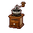
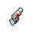

#  浣熊．面條

|體質|力量|敏捷|智力|幫派|戰鬥等級|勒索難度|持有天賦|取得天賦|
|:--:|:--:|:--:|:--:|:--:|:--:|:--:|:--:|:--:|
|5|5|7|7|黑爪幫成員|弱|中|[扒手](技能.md#扒手)、[鎖匠](技能.md#鎖匠)|[隱秘專家](技能.md#隱秘專家)|

## 故事

一只手法高超的浣熊，他在你面前表演了一招如同魔術般的換牌秀。據他所說這招是從他的室友魔術師兔子·懷特那裡學來的。並且從他的意思來看，他練這招可不是為了泡妞那麼簡單，而是準備在監獄的牌局裡出老千。看他自信滿滿的樣子，一定是個賭桌老手了。

面條是他的外號，他也不知道自己的真名是什麼。因為這家伙是個被遺棄在賭場裡的孤兒，當他被清潔工在女廁所裡發現時，身邊只有半碗吃剩的泡麵。

面條的童年是伴隨著籌碼的碰撞聲度過的。他看慣了賭徒們的喜怒哀樂，也看清了賭桌下的狡詐黑暗。所以他從小就明白一個道理：十賭九詐，只憑運氣的家伙最終都會輸的傾家蕩產，想要立於不敗之地還得依靠手上的“技術”。

平時的耳目濡染，讓面條在少年時便擁有了精湛的賭技。無論是偷梁換柱，還是魚目混珠，對他來說都是手到擒來。終於在某一天，他通過這些年在賭場打零工湊夠的兩千塊，購買了一張下城區地下牌局的入場券。結果僅僅用了一晚，他便將自己的積蓄翻了五倍。

接下來的幾年裡，從下城區到河灣地，再從河灣地到北角區。面條贏遍了城中各處的地下賭局，並用贏來的錢買了一套高級公寓，從此結束了自己長達二十幾年的賭場蝸居的生活。

可還沒等面條把新家的家具買齊，一個不速之客便登門拜訪了。國際刑警貉貍·布萊恩，他聲稱已經跟蹤了面條一段時間，手中握有他參與地下非法賭博的罪證。不過他此次前來並非抓捕，而只是想要做個交易…

布萊恩聲稱，他的行動小組正在調查一樁龐大的跨境洗錢案件。而犯罪組織的首領棕熊·安德烈是個酷愛賭博的家伙，他常常在自己的私人酒店中組織牌局。布萊恩需要一個賭博高手混入其中，並贏走安德烈手裡的現金，逼迫安德烈用未洗白的黑錢充當賭資。

面條深知這蹚渾水的兇險，但無奈把柄被握，只得乖乖照辦。好在行動還算順利，面條在關鍵的幾手牌中有驚無險的使用“技術”擊敗了安德烈，並成功的拿到了能當做證據的黑錢。離開酒店之後，面條打公用電話向布萊恩復命，對方要求他把裝有證據的錢箱帶往黑水船廠。

黑水船廠是北角區的一個廢棄船廠，過去常被黑幫用來進行秘密交易，布萊恩把地點選在那裡的確可以掩人耳目。但當面條到達地點時卻只見到布萊恩一個，行動小組的其他成員都沒有露面。面條按照指令把錢箱交給了布萊恩，可那家伙居然掏出手槍對準了面條！

原來這一切都是布萊恩的計劃，他想在退休前好好的撈上一筆，而這次的賭局行動剛好給了他機會。如果面條就此消失，他就能偽造成面條攜款潛逃的假象，如此一來這箱錢就全都歸他所有了。

不過，牌局中AA也有輸給27的時候，自負的布萊恩小看了他的對手。在賭場長大的面條，不但手上功夫了得，察言觀色也是他的專長。早在布萊恩登門的那天，面條就看出這家伙的臉上有著賭徒們無法掩飾的一種表情，那就是貪婪！於是當布萊恩把接頭地點選在黑水船廠的時候，警惕的面條便留了個心眼。他事先通知了本地警方，這裡會有一場非法交易。如果是自己錯怪了布萊恩，那麼對方也能用國際刑警的身份解釋清楚。但若自己的懷疑沒有錯，那這無疑將會救自己一命…

顯然，這一次面條又“賭”對了。當布萊恩將要開槍的時候，埋伏在草叢的本地警察沖出來逮捕了他。只不過可惜的是，因為布萊恩的被捕，他和面條之間的“交易”也作廢了。於是面條還是得為之前的非法賭博在牢裡待上一陣子，不過這可比腦袋上挨一槍要強多了。

## 結識對話

- **你看上去好像眼力還不錯？**
- {question1}
- **耽誤你幾分鐘，免費給你看場表演如何？**
- *表演…？*
- **（他拿出一張紙牌握在手中）**
- **現在猜猜看，牌在哪只手裡？**
- {think1}
- :point_right:剛剛握牌的那只手。
- :point_right:一定換到了另一只…
- **當當當！可惜，不在這裡哦\~（他打開了你猜的那只手）**
- **不過…另一只…其實也沒有！（他又打開了另一只手）**
- **因為紙牌…它進了你的口袋！**
- {exclamation1}
- （你望向口袋，果然在裡面）
- 哦\~精彩的魔術！這一定能在酒桌上迷倒不少姑娘。
- **哈\~這招的確是個魔術師教我的，那就是我的室友懷特。**
- **但光會手法可不夠，你得知道變走什麼牌，把它變去哪兒？**
- **這需要隨機應變\~手腦並用。**
- **而且，我可不會把這招浪費在酒桌上，它該用在…牌桌上。**
- 牌桌？你的意思是…出老千？
- **哈\~被抓到的才叫“老千”，沒被發現的叫做“高手”。**
- {think1}
- **這句話，我賭你會明白的\~**

## 深入了解對話

- **嘿\~伙計，見到你可真高興…**
- {question1}
- 這次…又要我看什麼絕招嗎？
- **哈\~不不不，這次你不用再當觀眾了…**
- **我的意思是，我想邀請你一起“上臺做演員”。**
- **{smile1}**
- 難道？你想我配合你…`出千`？
- **哈！我就知道我沒看走眼。你不但眼力不錯，腦子也靈活。**
- **是的，我想到了一個絕妙的計劃，能讓換牌術成功率大增！**
- **怎麼樣，伙計？想不想和我在`廚房賭局`裡大殺四方？**

#### 我參加過`廚房賭局`。

> 他和你說了他的賭桌風光史，還順手展示了幾個換牌術的變招。

- 那裡的確是個賺錢的好地方…
- 不過你得把底細全告訴我，我可不放心和一個陌生的家伙搭檔。
- **沒問題，我就讓你了解一下我是個多“靠譜”的搭檔吧…**
- *沒想到賭錢最後變成了賭命…*
- 之前賭博差點連命都丟了，你難道就沒想過收手嗎？
- **嘿\~你仔細想想，你從小到大做個的每個決定哪個不是在“賭”？**
- **無論是在監獄裡，還是在監獄外，其實都是一場躲不開的賭局。**
- **既然如此，不如做好計劃，全力以赴的去“賭”。**
- {think1}
- **這些話，我賭你會明白的\~**

#### 取消

- {think1}
- 雖然你的確手法高超，但我還沒試過那個`廚房賭局`。
- 那裡的水深不深，我還是想先親眼見識一下。
- 畢竟出千可不是鬧著玩的…
- **好的\~伙計，不過可別讓我等太久哦\~**

## 特殊對話

### 打招呼（關係極好）

- **我在你身上下注了，伙計。**

### 打招呼（關係好）

- **想玩猜牌遊戲嗎？**

### 打招呼（關係一般）

- **我說…有什麼事嗎？**

### 打招呼（關係差）

- **說吧，我聽著呢。**

### 打招呼（關係極差）

- **我賭你是來講和的，對嗎？**

### 進行毆打

- **這場戰鬥，我賭你會輸！**
- **既然你想找麻煩，那我就把麻煩給你好了。**
- **想打架？說實話，你的底牌太爛了。**

### 回禮

- **呃…我想我也該送你點什麼作為回禮。**

### 勒索成功

- **哦\~這次算你贏了，但這筆帳我會找機會討回來的，我保證。**
- **{upset1}**

### 勒索失敗

- **我想這下你該明白了吧，我可不是好惹的。**

### 一起吃飯被拒

- **如果你能閃開的話，我會感激不盡的。**

### 分享食物

- **{smile1}**
- **嘿\~從你坐下我就預感會有好事發生…**

### 加藥被發現

- **你手拿著的是什麼？想騙過我的眼睛可沒那麼容易。**

### 加藥辯解失敗

- **在我面前，最好收起你那些蹩腳的小伎倆。**

## 聊天

- **賭博靠的是99%的技術，再加上1%的運氣。**
- **但是賭徒們，往往想靠著那1%的運氣去戰勝99%的技術。**
- **你覺得這有可能嗎？**
- {think1}

## 初始物品

||||||
|:--:|:--:|:--:|:--:|:--:|
||||||
|[橡膠手套](25-橡膠手套.md)*2|[棒球帽](21-棒球帽.md)|[牙刷匕首](156-牙刷匕首.md)*2|[黑桃A](39-黑桃A.md)*2|[焦糖棒](72-焦糖棒.md)*3|
||||||
|[超辣泡麵](78-超辣泡麵.md)*3|[消毒液](118-消毒液.md)*4|[除銹劑](119-除銹劑.md)*5|[鞋帶](124-鞋帶.md)*4||

## 送禮

|圖片|物品名稱|好感|回應|
|:--:|--|:--:|--|
||[DEMO限定紙鶴](209-DEMO限定紙鶴.md)|50|你這可是在“出老千”吶…|
||[棒球帽](21-棒球帽.md)|24|嘿\~你知道嗎？牌局的勝率是和牌手帽檐的高度成反比的。|
||[墨鏡](18-墨鏡.md)|20|嘿\~玩牌的時候怎能缺少一副唬人的墨鏡呢？|
||[金龜子](202-金龜子.md)|20|哈\~金色傳說！|
||[手錶](27-手錶.md)|18|這是件不錯的禮物，你的觀察力還不賴。|
||[隨身聽（開機）](34-隨身聽（開機）.md)|18|我喜歡在玩牌時聽點音樂，這能幫我屏蔽對手們的廢話。|
||[隨身聽（關機）](35-隨身聽（關機）.md)|18|我喜歡在玩牌時聽點音樂，這能幫我屏蔽對手們的廢話。|
||[隨身聽（沒電）](36-隨身聽（沒電）.md)|18|我喜歡在玩牌時聽點音樂，這能幫我屏蔽對手們的廢話。|
||[貓女郎海報](106-貓女郎海報.md)|18|嘿\~她是我喜歡的類型，性感又神秘，就像猜不透的底牌。|
||[狐女郎海報](107-狐女郎海報.md)|18|她的長相讓我想起了我的初戀，那是我曾經待過的賭場裡的一個荷官…|
||[掌上遊戲機](110-掌上遊戲機.md)|18|這是件不錯的禮物，你的觀察力還不賴。|
||[掌上遊戲機（沒電）](111-掌上遊戲機（沒電）.md)|18|這是件不錯的禮物，你的觀察力還不賴。|
||[眼鏡](19-眼鏡.md)|15|這是件不錯的禮物，你的觀察力還不賴。|
||[運動鞋](14-運動鞋.md)|12|這件禮物就是今天的“賭注”嗎？|
||[牙齒項鏈](30-牙齒項鏈.md)|12|這件禮物就是今天的“賭注”嗎？|
||[《死靈之書》](31-《死靈之書》.md)|12|這件禮物就是今天的“賭注”嗎？|
||[超辣泡麵](78-超辣泡麵.md)|12|我小從就喜歡吃泡麵，不過當時泡麵裡可是會送玩具的。|
||[香皂](89-香皂.md)|12|這是件不錯的禮物，你的觀察力還不賴。|
||[《花花世界》（全新）](102-《花花世界》（全新）.md)|12|這是件不錯的禮物，你的觀察力還不賴。|
||[馬女郎海報](105-馬女郎海報.md)|12|這件禮物就是今天的“賭注”嗎？|
||[兔女郎海報](108-兔女郎海報.md)|12|這件禮物就是今天的“賭注”嗎？|
||[精美的畫作](130-精美的畫作.md)|12|嘿\~要得到這幅畫，我賭你應該做了不小的努力吧。|
||[扳手](142-扳手.md)|12|這件禮物就是今天的“賭注”嗎？|
||[釘錘](151-釘錘.md)|12|這件禮物就是今天的“賭注”嗎？|
||[皮鞋](15-皮鞋.md)|10|這件禮物就是今天的“賭注”嗎？|
||[護身符](29-護身符.md)|10|這件禮物就是今天的“賭注”嗎？|
||[酒葫蘆](37-酒葫蘆.md)|10|這件禮物就是今天的“賭注”嗎？|
||[水果刀](158-水果刀.md)|10|這件禮物就是今天的“賭注”嗎？|
||[雙節棍(+)](161-雙節棍(+).md)|10|這件禮物就是今天的“賭注”嗎？|
||[橡膠手套](25-橡膠手套.md)|9|這是件不錯的禮物，你的觀察力還不賴。|
||[紙鶴](126-紙鶴.md)|9|嘿\~這是你折的嗎？看來你有練賭術的天賦吶。|
||[帆布鞋](16-帆布鞋.md)|8|這件禮物就是今天的“賭注”嗎？|
||[毛線帽](22-毛線帽.md)|8|這件禮物就是今天的“賭注”嗎？|
||[黑手](26-黑手.md)|8|這件禮物就是今天的“賭注”嗎？|
||[自製口罩](32-自製口罩.md)|8|這件禮物就是今天的“賭注”嗎？|
||[黑桃A](39-黑桃A.md)|8|如果不被發現就不算作弊，不是嗎？|
||[酒精燈](52-酒精燈.md)|8|這件禮物就是今天的“賭注”嗎？|
||[精釀蘋果酒](56-精釀蘋果酒.md)|8|這件禮物就是今天的“賭注”嗎？|
||[奶油華夫餅](68-奶油華夫餅.md)|8|這件禮物就是今天的“賭注”嗎？|
||[焦糖棒](72-焦糖棒.md)|8|雖然比不上巧克力，在牌桌上吃這個應該也挺唬人的。|
||[土豆披薩](75-土豆披薩.md)|8|這件禮物就是今天的“賭注”嗎？|
||[計算機](101-計算機.md)|8|這件禮物就是今天的“賭注”嗎？|
||[咖啡磨](109-咖啡磨.md)|8|這件禮物就是今天的“賭注”嗎？|
||[圓珠筆](133-圓珠筆.md)|8|這件禮物就是今天的“賭注”嗎？|
||[圓珠筆](134-圓珠筆.md)|8|這件禮物就是今天的“賭注”嗎？|
||[剪刀](152-剪刀.md)|8|這件禮物就是今天的“賭注”嗎？|
||[雙節棍](160-雙節棍.md)|8|這件禮物就是今天的“賭注”嗎？|
||[釘棒(+)](163-釘棒(+).md)|8|這件禮物就是今天的“賭注”嗎？|
||[皮帶](166-皮帶.md)|8|這件禮物就是今天的“賭注”嗎？|
||[皮帶](167-皮帶.md)|8|這件禮物就是今天的“賭注”嗎？|
||[《森之音》](203-《森之音》.md)|8|這件禮物就是今天的“賭注”嗎？|
||[薄荷葉卷](41-薄荷葉卷.md)|6|這件禮物就是今天的“賭注”嗎？|
||[瀉藥](44-瀉藥.md)|6|這件禮物就是今天的“賭注”嗎？|
||[鎮靜劑](53-鎮靜劑.md)|6|這件禮物就是今天的“賭注”嗎？|
||[啤酒](54-啤酒.md)|6|這件禮物就是今天的“賭注”嗎？|
||[蘋果酒](55-蘋果酒.md)|6|這件禮物就是今天的“賭注”嗎？|
||[華夫餅](67-華夫餅.md)|6|這件禮物就是今天的“賭注”嗎？|
||[蛋白粉](79-蛋白粉.md)|6|這件禮物就是今天的“賭注”嗎？|
||[開鎖器](87-開鎖器.md)|6|開鎖的原理就和玩牌一樣，手法…再加運氣。|
||[開鎖器(P)](38-開鎖器(P).md)|6|開鎖的原理就和玩牌一樣，手法…再加運氣。|
||[《花花世界》（看過）](103-《花花世界》（看過）.md)|6|這件禮物就是今天的“賭注”嗎？|
||[簡單的漫畫](129-簡單的漫畫.md)|6|這件禮物就是今天的“賭注”嗎？|
||[硬幣](135-硬幣.md)|6|每一塊都是翻本的籌碼…我們要做的就是\~用好它。|
||[長螺絲](136-長螺絲.md)|6|這件禮物就是今天的“賭注”嗎？|
||[玻璃匕首(+)](155-玻璃匕首(+).md)|6|這件禮物就是今天的“賭注”嗎？|
||[牙刷匕首(+)](157-牙刷匕首(+).md)|6|這件禮物就是今天的“賭注”嗎？|
||[釘棒](162-釘棒.md)|6|這件禮物就是今天的“賭注”嗎？|
||[鐵管](164-鐵管.md)|6|這件禮物就是今天的“賭注”嗎？|
||[薄荷葉](40-薄荷葉.md)|4|這件禮物就是今天的“賭注”嗎？|
||[紫鳶花](45-紫鳶花.md)|4|這件禮物就是今天的“賭注”嗎？|
||[花瓣粉](46-花瓣粉.md)|4|這件禮物就是今天的“賭注”嗎？|
||[安眠藥](47-安眠藥.md)|4|這件禮物就是今天的“賭注”嗎？|
||[止疼片](49-止疼片.md)|4|這件禮物就是今天的“賭注”嗎？|
||[醫用酒精](51-醫用酒精.md)|4|這件禮物就是今天的“賭注”嗎？|
||[蘋果](64-蘋果.md)|4|這件禮物就是今天的“賭注”嗎？|
||[一把咖啡豆](69-一把咖啡豆.md)|4|這件禮物就是今天的“賭注”嗎？|
||[汽水](73-汽水.md)|4|這件禮物就是今天的“賭注”嗎？|
||[酸奶](74-酸奶.md)|4|這件禮物就是今天的“賭注”嗎？|
||[咖啡粉](76-咖啡粉.md)|4|這件禮物就是今天的“賭注”嗎？|
||[茶包](77-茶包.md)|4|這件禮物就是今天的“賭注”嗎？|
||[肥皂](88-肥皂.md)|4|這件禮物就是今天的“賭注”嗎？|
||[《花花世界》（翻爛）](104-《花花世界》（翻爛）.md)|4|這件禮物就是今天的“賭注”嗎？|
||[牙刷](115-牙刷.md)|4|這件禮物就是今天的“賭注”嗎？|
||[牙膏](116-牙膏.md)|4|這件禮物就是今天的“賭注”嗎？|
||[鉛筆](131-鉛筆.md)|4|這件禮物就是今天的“賭注”嗎？|
||[鉛筆](132-鉛筆.md)|4|這件禮物就是今天的“賭注”嗎？|
||[湯匙](143-湯匙.md)|4|這件禮物就是今天的“賭注”嗎？|
||[湯匙](144-湯匙.md)|4|這件禮物就是今天的“賭注”嗎？|
||[玻璃匕首](154-玻璃匕首.md)|4|這件禮物就是今天的“賭注”嗎？|
||[牙刷匕首](156-牙刷匕首.md)|4|這件禮物就是今天的“賭注”嗎？|
||[曲奇餅乾](71-曲奇餅乾.md)|3|我喜歡這味道，哪只浣熊能抵擋餅乾的誘惑呢？|
||[口香糖](70-口香糖.md)|2|這件禮物就是今天的“賭注”嗎？|
||[迴紋針](86-迴紋針.md)|2|這件禮物就是今天的“賭注”嗎？|
||[電池](114-電池.md)|2|這件禮物就是今天的“賭注”嗎？|
||[除銹劑](119-除銹劑.md)|2|這件禮物就是今天的“賭注”嗎？|
||[顏料](122-顏料.md)|2|這件禮物就是今天的“賭注”嗎？|
||[布條](84-布條.md)|-2|如果這就是你的底牌的話，那可太糟糕了…|
||[消毒液](118-消毒液.md)|-2|如果這就是你的底牌的話，那可太糟糕了…|
||[火柴](120-火柴.md)|-2|如果這就是你的底牌的話，那可太糟糕了…|
||[膠帶](121-膠帶.md)|-2|如果這就是你的底牌的話，那可太糟糕了…|
||[釘子](123-釘子.md)|-2|如果這就是你的底牌的話，那可太糟糕了…|
||[鞋帶](124-鞋帶.md)|-2|如果這就是你的底牌的話，那可太糟糕了…|
||[白紙](125-白紙.md)|-2|如果這就是你的底牌的話，那可太糟糕了…|
||[碎玻璃](153-碎玻璃.md)|-2|如果這就是你的底牌的話，那可太糟糕了…|
||[折斷的木條](159-折斷的木條.md)|-2|如果這就是你的底牌的話，那可太糟糕了…|
||[蘑菇](42-蘑菇.md)|-4|牌手最需要的就是冷靜…上頭的代價可是很大的。|
||[蘑菇粉](43-蘑菇粉.md)|-4|牌手最需要的就是冷靜…上頭的代價可是很大的。|
||[胡亂的塗鴉](128-胡亂的塗鴉.md)|-4|如果這就是你的底牌的話，那可太糟糕了…|
||[興奮劑](50-興奮劑.md)|-6|牌手最需要的就是冷靜…上頭的代價可是很大的。|
||[拖鞋](17-拖鞋.md)|-8|哦\~很遺憾，我想這次你下錯了籌碼。|
||[紅頭巾](23-紅頭巾.md)|-8|哦\~很遺憾，我想這次你下錯了籌碼。|
||[綠頭巾](24-綠頭巾.md)|-8|哦\~很遺憾，我想這次你下錯了籌碼。|
||[花束](127-花束.md)|-8|哦\~很遺憾，我想這次你下錯了籌碼。|
||[頭帶](20-頭帶.md)|-10|哦\~很遺憾，我想這次你下錯了籌碼。|
||[空的牙膏管](117-空的牙膏管.md)|-20|…你是在賭送我垃圾會不會惹惱我嗎？|
||[發霉的麵包](200-發霉的麵包.md)|-40|…你是在賭送我垃圾會不會惹惱我嗎？|

