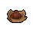

#  海獺．菲爾

|體質|力量|敏捷|智力|幫派|戰鬥等級|勒索難度|持有天賦|取得天賦|
|:--:|:--:|:--:|:--:|:--:|:--:|:--:|:--:|:--:|
|5|5|5|6|黑爪幫成員|弱|易|[鎖匠](技能.md#鎖匠)|[巧手](技能.md#巧手)|

## 故事

一只外表呆萌的年輕海獺，看起來和他幫派成員的身份格格不入。沉迷於購買彩票“大樂透”，對於自己能中大獎堅信不疑。從他口中得知，這個“大樂透”彩票推出了電話服務，只要撥打號碼51888即可在線投注。既然中大獎的機會就擺在眼前，你為何不去試試呢？

菲爾從前的工作是一名門衛。他曾在著名音樂家海豚·奧斯卡的家中工作，那棟房子即使在河灣地的富人社區也是一等一的好地段。不過雖身處豪宅，可菲爾自己卻沒什麼錢。巨大的落差感讓他對成為富人有著極強的執念，而彩票在他眼裡就成了實現夢想的“最佳捷徑”。但結果可想而知，所謂越窮越賭，越賭越窮。

或許是財富之神聽到了菲爾的祈禱，一個選擇題很快擺在了他的面前…

某天夜裡，奧斯卡的獨子卡利多開著新買的跑車慌張的回到家中。今晚是他參加學校舞會的日子，作為學校裡著名的公子哥，這輛跑車是他秒殺其他“窮鬼們”的利器。他叫嚷著讓菲爾為他打開院門，從這小子的嘴裡能夠聞到濃重的酒氣。很顯然這家伙闖禍了！

果然第二天新聞報道，在河灣大道上一輛飛馳的跑車連續闖過數個紅燈，並將一對正在過街的情侶撞飛。事故導致男方不治身亡，女方仍在搶救中，而肇事者直接逃離了現場。

看到東窗事發，卡利多向奧斯卡坦白了昨晚酒駕逃逸的罪行。奧斯卡狠狠的揍了這小子一頓，但是他心裡也明白警察很快就會找上門，自己的兒子將難逃牢獄之災。可就算卡利多再混帳，那也是他的獨子，作為父親的奧斯卡也無法眼睜睜的看著他被抓走。

於是奧斯卡找到了菲爾。他用誠懇的語氣告訴菲爾，自己管教無方，讓卡利多闖下如此大禍。但卡利多的媽媽患有心臟病，如果兒子被警察抓走，或許她會承受不了如此的打擊。所以他請求菲爾可以幫助卡利多頂罪，而自己將會給予百萬現金作為酬勞，並且會請最好的律師幫菲爾爭取最短的刑期。

聽到這個提議的菲爾腦袋嗡嗡作響，他感到的不是氣憤，而是喜悅。百萬現金可彩票裡的大獎！是他一輩子可能都賺不來的錢。而自己現在每天從早到晚都窩在小小的門衛室內，這又和坐牢有什麼區別？！想到這裡，菲爾答應了奧斯卡的請求。

菲爾自首之後，警察上門將他羈押。原本事情都在按奧斯卡的計劃進行，可蠢貨就是蠢貨，無藥可救。卡利多以為躲過了一劫，幾天後就回到了他平時的狀態，繼續泡妞、喝酒、狂歡。在一次醉酒之後，他把自己的老爹是如何的厲害，如何花錢買通了菲爾和警察幫自己脫罪的壯舉告訴了他的“好哥們”。而其中一個早就看不慣他的“好哥們”把這段對話錄了下來，寄給了電視臺…

真相大白，卡利多因酒駕肇事逃逸被抓，而奧斯卡和菲爾也犯了包庇罪。可憐的菲爾沒能成功幫卡利多頂罪，雖然這事完全不賴他，但奧斯卡還是拒絕支付先前答應的報酬。“有錢人都是自私自利的混蛋！”說到這裡菲爾破口大罵到。

## 結識對話

- **（自言自語）哎\~最後的數字到底選什麼好呢？**
- **{think1}**
- 你嘀嘀咕咕的在說些什麼呢？
- **我正在想，下一期“大樂透”該買什麼號碼…**
- 大樂透…？你說的是`彩票`嗎？
- **沒錯，這次的獎池有幾百萬，一定會有我一份的！**
- 可你在監獄裡，該怎麼買呢？
- **你不知道嗎？彩票公司早就推出`電話服務`了。**
- **只要打號碼`51888`，一切操作都能在電話裡面搞定。**
- **我每周都會買，而且我預感，大獎離我越來越近了…**
- :point_right:那就祝你好運吧… `好感+10`
- :point_right:或許我也可以試試。

## 深入了解對話

- **（自言自語）怎麼辦\~還是有點不放心啊…**
- {question1}
- 你怎麼又在犯嘀咕？還是在想彩票的事嗎？
- **當然了，這次我可是準備下重注的！**
- **但我冥冥中又感覺最後一位的數字選的不太好。**
- **哎\~太糾結了，好想找個運氣好的家伙幫我拿主意…**

#### 我可是傳說中的`幸運兒`。

> 你說彩票號碼要根據主人的經歷來選，他就一股腦說出了自己的故事。

- 我挑的數字保證中獎率99%。
- **{exclamation1}**
- **是嗎！你真有這麼厲害？那你快幫我看看吧。**
- **這次我的大獎就全靠你了！**
- *倒霉蛋加上傻瓜等於一場災難…*
- 錢沒撈到，自己還蹲了監獄，這下你該知道不勞而獲的代價了吧。
- **我開始也覺得自己倒霉透了，但現在我想明白了。**
- **這都是冥冥中注定的事情，你聽過“運氣守恒”嗎？**
  - 運氣守恒…？
  - 我能猜到你要說什麼了。
- **沒錯！所謂否極泰來，這些遭遇都是在為我的大獎做鋪墊！**
- **很快！我就能堂堂正正的做個百萬\~哦不\~是千萬富翁了！**
- *我發現無藥可救的傻瓜除了卡利多還有一個…*
- {sweat1}

#### 取消

- 像我們這種關在牢裡的家伙，哪會有什麼`幸運`可言。
- 一個個的臉上恨不得直接寫上個“衰”字…

## 特殊對話

### 打招呼（關係極好）

- **我有預感，今天準能交好運。**

### 打招呼（關係好）

- **嗨\~你好\~**

### 打招呼（關係一般）

- **（自言自語）擲骰子算了…**

### 打招呼（關係差）

- **咱倆的八字不合…**

### 打招呼（關係極差）

- **和你說話，我準走霉運。**

### 進行毆打

- **想找麻煩？等著被敲碎腦殼吧！**
- **別以為我好欺負，我可不會讓你輕鬆取勝！**
- **喂\~你在小看我嗎？那你可要吃苦頭了！**

### 回禮

- **這個就當我的回禮吧…我可不是個吝嗇鬼。**

### 勒索成功

- **拿上這`{x1}`塊離我遠點，這次就當我倒霉了…**
- **{upset1}**

### 勒索失敗

- **別在纏著我了！你這個討人厭的家伙。**
- **{upset1}**

### 一起吃飯被拒

- **走開…你坐這兒會招來霉運的。**

### 分享食物

- **{smile1}**
- **那我就不客氣了，畢竟我總比別的家伙餓的更快。**

### 加藥被發現

- **呃…你想往我的盤子裡丟什麼？**

### 加藥辯解失敗

- **我可不需要你的什麼“調料”。**

## 聊天

- 我有個疑問…你為什麼總覺得自己能中大獎？
- **我小時候做過一次占卜，說我30歲前一定能大富大貴。**
- **再過幾天就是我30歲生日了，絕對不會有錯的。**
- 呃\~是什麼通靈大師給你做的占卜嗎？
- **不…我是照著“星象你我他”的規則給自己算的。**
- 哦\~拜托！那只是一檔電視節目而已。
- {sweat1}

## 初始物品

||||||
|:--:|:--:|:--:|:--:|:--:|
||||||
|[拖鞋](17-拖鞋.md)|[毛線帽](22-毛線帽.md)|[牙刷匕首](156-牙刷匕首.md)*2|[華夫餅](67-華夫餅.md)*2|[曲奇餅乾](71-曲奇餅乾.md)*4|
||||||
|[白紙](125-白紙.md)*3|[布條](84-布條.md)*2|[肥皂](88-肥皂.md)*2|[除銹劑](119-除銹劑.md)*4||

## 送禮

|圖片|物品名稱|好感|回應|
|:--:|--|:--:|--|
||[DEMO限定紙鶴](209-DEMO限定紙鶴.md)|50|我喜歡限定的東西，因為大獎也是限定的！|
||[護身符](29-護身符.md)|20|你說像我這麼虔誠的信徒，森林之父會忍心不讓我交好運嗎？|
||[金龜子](202-金龜子.md)|20|哈\~這個小家伙可是好運的象徵！|
||[棒球帽](21-棒球帽.md)|18|嘿\~我喜歡帽子…這是件好禮物。|
||[手錶](27-手錶.md)|18|嘿\~這下我就不會錯過開獎時間了。|
||[隨身聽（開機）](34-隨身聽（開機）.md)|18|音樂能給我靈感，我能從中聽出…幸運的數字。|
||[隨身聽（關機）](35-隨身聽（關機）.md)|18|音樂能給我靈感，我能從中聽出…幸運的數字。|
||[隨身聽（沒電）](36-隨身聽（沒電）.md)|18|音樂能給我靈感，我能從中聽出…幸運的數字。|
||[拖鞋](17-拖鞋.md)|16|沒有一雙好的拖鞋，洗澡的時候可放不開手腳。|
||[香皂](89-香皂.md)|16|你聽過肥皂泡占卜嗎？我最近正在研究這個…|
||[精美的畫作](130-精美的畫作.md)|16|這畫的可真不錯，應該能值不少錢吧\~|
||[《森之音》](203-《森之音》.md)|16|你說像我這麼虔誠的信徒，森林之父會忍心不讓我交好運嗎？|
||[皮鞋](15-皮鞋.md)|15|嘿\~這鞋看上去不錯。|
||[眼鏡](19-眼鏡.md)|15|你說我總中不了獎，是不是和我的視力有關…|
||[運動鞋](14-運動鞋.md)|12|禮物\~我就知道今天會有好事。|
||[毛線帽](22-毛線帽.md)|12|嘿\~我喜歡帽子…這是件好禮物。|
||[牙齒項鏈](30-牙齒項鏈.md)|12|禮物\~我就知道今天會有好事。|
||[奶油華夫餅](68-奶油華夫餅.md)|12|嘿\~你來的正好，我剛巧肚子餓了。|
||[土豆披薩](75-土豆披薩.md)|12|嘿\~你來的正好，我剛巧肚子餓了。|
||[計算機](101-計算機.md)|12|每種彩票都有一個中獎公式，只是我還沒有算出而已。|
||[馬女郎海報](105-馬女郎海報.md)|12|禮物\~我就知道今天會有好事。|
||[貓女郎海報](106-貓女郎海報.md)|12|禮物\~我就知道今天會有好事。|
||[狐女郎海報](107-狐女郎海報.md)|12|禮物\~我就知道今天會有好事。|
||[兔女郎海報](108-兔女郎海報.md)|12|禮物\~我就知道今天會有好事。|
||[掌上遊戲機](110-掌上遊戲機.md)|12|禮物\~我就知道今天會有好事。|
||[掌上遊戲機（沒電）](111-掌上遊戲機（沒電）.md)|12|禮物\~我就知道今天會有好事。|
||[扳手](142-扳手.md)|12|禮物\~我就知道今天會有好事。|
||[釘錘](151-釘錘.md)|12|禮物\~我就知道今天會有好事。|
||[墨鏡](18-墨鏡.md)|10|禮物\~我就知道今天會有好事。|
||[頭帶](20-頭帶.md)|10|禮物\~我就知道今天會有好事。|
||[水果刀](158-水果刀.md)|10|禮物\~我就知道今天會有好事。|
||[雙節棍(+)](161-雙節棍(+).md)|10|禮物\~我就知道今天會有好事。|
||[華夫餅](67-華夫餅.md)|9|嘿\~你來的正好，我剛巧肚子餓了。|
||[帆布鞋](16-帆布鞋.md)|8|禮物\~我就知道今天會有好事。|
||[紅頭巾](23-紅頭巾.md)|8|禮物\~我就知道今天會有好事。|
||[綠頭巾](24-綠頭巾.md)|8|禮物\~我就知道今天會有好事。|
||[黑手](26-黑手.md)|8|禮物\~我就知道今天會有好事。|
||[自製口罩](32-自製口罩.md)|8|禮物\~我就知道今天會有好事。|
||[酸奶](74-酸奶.md)|8|嘿\~我的朋友，真希望你每天都能來。|
||[肥皂](88-肥皂.md)|8|你聽過肥皂泡占卜嗎？我最近正在研究這個…|
||[《花花世界》（全新）](102-《花花世界》（全新）.md)|8|禮物\~我就知道今天會有好事。|
||[咖啡磨](109-咖啡磨.md)|8|禮物\~我就知道今天會有好事。|
||[圓珠筆](133-圓珠筆.md)|8|禮物\~我就知道今天會有好事。|
||[圓珠筆](134-圓珠筆.md)|8|禮物\~我就知道今天會有好事。|
||[剪刀](152-剪刀.md)|8|禮物\~我就知道今天會有好事。|
||[雙節棍](160-雙節棍.md)|8|禮物\~我就知道今天會有好事。|
||[釘棒(+)](163-釘棒(+).md)|8|禮物\~我就知道今天會有好事。|
||[皮帶](166-皮帶.md)|8|禮物\~我就知道今天會有好事。|
||[皮帶](167-皮帶.md)|8|禮物\~我就知道今天會有好事。|
||[橡膠手套](25-橡膠手套.md)|6|禮物\~我就知道今天會有好事。|
||[黑桃A](39-黑桃A.md)|6|我想我終於能抓住“好運”了。|
||[薄荷葉卷](41-薄荷葉卷.md)|6|禮物\~我就知道今天會有好事。|
||[興奮劑](50-興奮劑.md)|6|禮物\~我就知道今天會有好事。|
||[超辣泡麵](78-超辣泡麵.md)|6|禮物\~我就知道今天會有好事。|
||[蛋白粉](79-蛋白粉.md)|6|禮物\~我就知道今天會有好事。|
||[開鎖器](87-開鎖器.md)|6|嘿\~我要這個只是為了…不時之需而已。|
||[開鎖器(P)](38-開鎖器(P).md)|6|嘿\~我要這個只是為了…不時之需而已。|
||[《花花世界》（看過）](103-《花花世界》（看過）.md)|6|禮物\~我就知道今天會有好事。|
||[紙鶴](126-紙鶴.md)|6|禮物\~我就知道今天會有好事。|
||[胡亂的塗鴉](128-胡亂的塗鴉.md)|6|我好像從裡面看到了某些…數字。|
||[簡單的漫畫](129-簡單的漫畫.md)|6|禮物\~我就知道今天會有好事。|
||[硬幣](135-硬幣.md)|6|硬幣只有被拋在空中的時候，才能體現真正的價值。|
||[長螺絲](136-長螺絲.md)|6|禮物\~我就知道今天會有好事。|
||[玻璃匕首(+)](155-玻璃匕首(+).md)|6|禮物\~我就知道今天會有好事。|
||[牙刷匕首(+)](157-牙刷匕首(+).md)|6|禮物\~我就知道今天會有好事。|
||[釘棒](162-釘棒.md)|6|禮物\~我就知道今天會有好事。|
||[鐵管](164-鐵管.md)|6|禮物\~我就知道今天會有好事。|
||[薄荷葉](40-薄荷葉.md)|4|禮物\~我就知道今天會有好事。|
||[蘑菇](42-蘑菇.md)|4|禮物\~我就知道今天會有好事。|
||[蘑菇粉](43-蘑菇粉.md)|4|禮物\~我就知道今天會有好事。|
||[紫鳶花](45-紫鳶花.md)|4|禮物\~我就知道今天會有好事。|
||[花瓣粉](46-花瓣粉.md)|4|禮物\~我就知道今天會有好事。|
||[安眠藥](47-安眠藥.md)|4|禮物\~我就知道今天會有好事。|
||[止疼片](49-止疼片.md)|4|禮物\~我就知道今天會有好事。|
||[蘋果](64-蘋果.md)|4|禮物\~我就知道今天會有好事。|
||[一把咖啡豆](69-一把咖啡豆.md)|4|禮物\~我就知道今天會有好事。|
||[曲奇餅乾](71-曲奇餅乾.md)|4|哈\~這餅乾的味道讓我想起了我的奶奶…|
||[焦糖棒](72-焦糖棒.md)|4|禮物\~我就知道今天會有好事。|
||[汽水](73-汽水.md)|4|禮物\~我就知道今天會有好事。|
||[咖啡粉](76-咖啡粉.md)|4|禮物\~我就知道今天會有好事。|
||[茶包](77-茶包.md)|4|禮物\~我就知道今天會有好事。|
||[《花花世界》（翻爛）](104-《花花世界》（翻爛）.md)|4|禮物\~我就知道今天會有好事。|
||[牙刷](115-牙刷.md)|4|禮物\~我就知道今天會有好事。|
||[牙膏](116-牙膏.md)|4|禮物\~我就知道今天會有好事。|
||[鉛筆](131-鉛筆.md)|4|禮物\~我就知道今天會有好事。|
||[鉛筆](132-鉛筆.md)|4|禮物\~我就知道今天會有好事。|
||[湯匙](143-湯匙.md)|4|禮物\~我就知道今天會有好事。|
||[湯匙](144-湯匙.md)|4|禮物\~我就知道今天會有好事。|
||[玻璃匕首](154-玻璃匕首.md)|4|禮物\~我就知道今天會有好事。|
||[牙刷匕首](156-牙刷匕首.md)|4|禮物\~我就知道今天會有好事。|
||[口香糖](70-口香糖.md)|2|禮物\~我就知道今天會有好事。|
||[迴紋針](86-迴紋針.md)|2|禮物\~我就知道今天會有好事。|
||[電池](114-電池.md)|2|禮物\~我就知道今天會有好事。|
||[除銹劑](119-除銹劑.md)|2|禮物\~我就知道今天會有好事。|
||[顏料](122-顏料.md)|2|禮物\~我就知道今天會有好事。|
||[白紙](125-白紙.md)|2|禮物\~我就知道今天會有好事。|
||[布條](84-布條.md)|-2|呃…我沒明白你的意思。|
||[空的牙膏管](117-空的牙膏管.md)|-2|我很好奇，你是怎麼想到把這個當做“禮物”的。|
||[消毒液](118-消毒液.md)|-2|呃…我沒明白你的意思。|
||[火柴](120-火柴.md)|-2|呃…我沒明白你的意思。|
||[膠帶](121-膠帶.md)|-2|呃…我沒明白你的意思。|
||[釘子](123-釘子.md)|-2|呃…我沒明白你的意思。|
||[鞋帶](124-鞋帶.md)|-2|呃…我沒明白你的意思。|
||[碎玻璃](153-碎玻璃.md)|-2|我很好奇，你是怎麼想到把這個當做“禮物”的。|
||[折斷的木條](159-折斷的木條.md)|-2|我很好奇，你是怎麼想到把這個當做“禮物”的。|
||[醫用酒精](51-醫用酒精.md)|-4|這味道讓我頭疼…|
||[瀉藥](44-瀉藥.md)|-6|你便秘嗎…？反正我沒有。|
||[鎮靜劑](53-鎮靜劑.md)|-6|這味道讓我頭疼…|
||[酒精燈](52-酒精燈.md)|-8|這味道讓我頭疼…|
||[花束](127-花束.md)|-8|呃…我沒明白你的意思。|
||[發霉的麵包](200-發霉的麵包.md)|-40|哦\~不！這東西會給我帶來霉運的！|
||[啤酒](54-啤酒.md)|-60|我討厭酒精…我會在這兒都是它害的。|
||[蘋果酒](55-蘋果酒.md)|-60|我討厭酒精…我會在這兒都是它害的。|
||[精釀蘋果酒](56-精釀蘋果酒.md)|-80|我討厭酒精…我會在這兒都是它害的。|
||[酒葫蘆](37-酒葫蘆.md)|-100|我討厭酒精…我會在這兒都是它害的。|
||[《死靈之書》](31-《死靈之書》.md)|-120|呃…這本書看上去就有種不祥之兆。|

