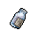
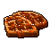
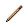
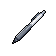

##  海象．溫斯頓

|體質|力量|敏捷|智力|幫派|
|:--:|:--:|:--:|:--:|:--:|
|9|8|3|8|大腳幫成員|

### 故事

一只身材臃腫的海象，因為被關在了陸地上而感到悶悶不樂。據他所說，他曾經是一名船長，擁有一艘以自己名字命名的漁船。他懷念在大海上闖蕩的生活，對于陸地上的一切都感到厭煩。他每天唯一盼望的事情就是下雨，這種心情或許只有海洋動物才能體會吧…

溫斯頓的家鄉在一座海邊小鎮，他們家世代以捕魚為業，那艘老舊的“溫斯頓號”就是從他的父親老溫斯頓手中繼承下來的。育有兩兒三女的溫斯頓本以為他波瀾不驚的一生就將如此平靜的度過，可是一封驅逐信卻打破了他的美夢。

“遠洋石油公司”的勘探員發現了小鎮的漁港下方蘊藏石油，于是他們想將漁港改造為油田，當然他們答應給予附近的漁民們一筆可觀的安置費。可溫斯頓和鄰居們世代生活在這里，他們無法為了金錢而背叛養育了他們多年的漁港。于是以溫斯頓為首的漁民們拒絕了“遠洋石油公司”的收購提議。

可是豐厚的利潤就擺在面前，“遠洋石油公司”怎會甘心作罷。負責這個項目的公司代表動用了大量的資金，打點上下，疏通關系，最終成功繞過漁民們弄到了漁港的所有權。一夜醒來，強盜公司成為了漁港土地的合法擁有者，而無辜的漁民們卻成了侵占土地的違法者。

于是溫斯頓前去找“遠洋石油公司”的代表理論，但換來的卻是冷嘲熱諷：“之前給你們這些蠢漁夫錢，你們不要！現在就算跪下來求我，我也不會拿出一個子兒了。”憤怒、厭惡、絕望、不甘，強烈的情感如同海浪一般向溫斯頓襲來，這股力量太強了，強到他無法抵抗……等他回過神來的時候，那個卑鄙的公司代表已經口吐鮮血的躺倒在了地板上…

因為鬧出了暴力事件，警察和新聞媒體將小鎮圍的水泄不通。最終“遠洋石油公司”對漁港的收購行為被裁定為非法。雖然溫斯頓靠自己的拳頭保住了漁民們的家園，但自己卻要因故意傷害罪而承受牢獄之災。不過相比之下，這一點代價又算的了什么呢。

### 結識對話

- 你是`海象`？這可真是少見…
- **是的，我是一只倒霉的，被關在陸地上的海象…**
- **這簡直可以評上“年度最慘”笑話了！**
- 看起來，你的心情有點糟糕…
- **沒錯！那是因為我眼前的一切都那么的糟糕…**
- **陸地上的房子、花草、泥土，甚至連空氣都是糟糕的！**
- **在陸地上待的越久，我就越是懷念大海…**
- {think1}
- **我以前可是個船長，有一艘屬于自己的`溫斯頓號`捕漁船！**
- **每天都能枕著海浪，聞著帶有魚腥味的海風入眠…**
- **可是現在，你看看我的皮膚，都已經干到開裂了！**
- 這聽上去是挺慘的。
- 我簡直想為你默哀。
- **在這里我每天只盼望一件事，那就是下雨！**
- **可真到下雨的時候，我又開始擔心雨會停…該死的！**
- **你現在知道，為什么我的心情會變糟了吧！**

### 深入了解對話

- 嗨\~老伙計，我記得你說過，你有一艘捕魚船對嗎？
- **沒錯，那是我去世的老爹造的，不過我現在留給我兒子了。**
- **畢竟待在這種鬼地方也沒法打漁，不是嗎？**
- 我很好奇…你作為漁夫，究竟是怎么落到這里的？
- **你是想找我嘮家常嗎…？**

#### 今天`下雨`\~你該心情不錯吧。

> 他一邊擦拭著自己的長牙，一邊慢慢講述了他的故事。

- **是還不錯\~那既然你有興趣，我就說說吧。**
- **你可別聽睡著了…**
- *看來漁夫的生活也沒那么簡單吶…*
- 不管怎么樣，你還是保住了漁港，不是嗎？
- **至少現在是保住了，但誰知道以后呢？**
- **現在的年輕海象已經不想捕魚了，他們都想去城市里打工。**
- **再這么下去，石油公司不來搶，漁港自己也會荒廢掉…**
- **那我做的這一切，又有什么意義呢？**

#### 取消

- **就今天這種鬼天氣，我可沒什么心情。**
- *哎\~看來得等到`下雨天`再來找他了…*
### 初始物品

|物品名稱|物品名稱|物品名稱|物品名稱|物品名稱|
|:--:|:--:|:--:|:--:|:--:|
|  |  |  |  |  |
| [毛線帽](道具.md#毛線帽) | [橡膠手套](道具.md#橡膠手套) | [玻璃匕首](道具.md#玻璃匕首) | [水果刀](道具.md#水果刀)*2 | [蘋果酒](道具.md#蘋果酒) |
|  |  |  |  |  |
| [蘋果](道具.md#蘋果)*2 | [茶包](道具.md#茶包)*3 | [肥皂](道具.md#肥皂)*2 | [湯匙](道具.md#湯匙) |  |
### 送禮

|圖片|物品名稱|好感|回應|
|:--:|--|:--:|--|
||[運動鞋](道具.md#運動鞋)|-1|我可不想穿這個…它會把我的鰭腳磨破的。|
||[皮鞋](道具.md#皮鞋)|-1|我可不想穿這個…它會把我的鰭腳磨破的。|
||[帆布鞋](道具.md#帆布鞋)|-1|我可不想穿這個…它會把我的鰭腳磨破的。|
||[拖鞋](道具.md#拖鞋)|0|既然你拿出來了，那我就收下好了…|
||[墨鏡](道具.md#墨鏡)|0|既然你拿出來了，那我就收下好了…|
||[眼鏡](道具.md#眼鏡)|0|既然你拿出來了，那我就收下好了…|
||[頭帶](道具.md#頭帶)|0|既然你拿出來了，那我就收下好了…|
||[棒球帽](道具.md#棒球帽)|0|既然你拿出來了，那我就收下好了…|
||[毛線帽](道具.md#毛線帽)|0|既然你拿出來了，那我就收下好了…|
||[紅頭巾](道具.md#紅頭巾)|0|既然你拿出來了，那我就收下好了…|
||[綠頭巾](道具.md#綠頭巾)|0|既然你拿出來了，那我就收下好了…|
||[橡膠手套](道具.md#橡膠手套)|0|既然你拿出來了，那我就收下好了…|
||[黑手](道具.md#黑手)|-2|我討厭卑鄙的伎倆！|
||[手表](道具.md#手表)|0|既然你拿出來了，那我就收下好了…|
||[護身符](道具.md#護身符)|1|希望這東西能讓祈禱更靈驗…|
||[牙齒項鏈](道具.md#牙齒項鏈)|0|既然你拿出來了，那我就收下好了…|
||[《死靈之書》](道具.md#《死靈之書》)|0|既然你拿出來了，那我就收下好了…|
||[自制口罩](道具.md#自制口罩)|0|既然你拿出來了，那我就收下好了…|
||[隨身聽（開機）](道具.md#隨身聽（開機）)|-2|這玩意兒太吵了，我已經夠煩的了…！|
||[隨身聽（關機）](道具.md#隨身聽（關機）)|-2|這玩意兒太吵了，我已經夠煩的了…！|
||[隨身聽（沒電）](道具.md#隨身聽（沒電）)|-2|這玩意兒太吵了，我已經夠煩的了…！|
||[酒葫蘆](道具.md#酒葫蘆)|2|或許借酒消愁會是個不錯的選擇。|
||[黑桃A](道具.md#黑桃A)|-2|我討厭卑鄙的伎倆！|
||[薄荷葉](道具.md#薄荷葉)|0|既然你拿出來了，那我就收下好了…|
||[薄荷葉卷](道具.md#薄荷葉卷)|1|呼\~我的確需要來上一根…|
||[蘑菇](道具.md#蘑菇)|-1|（嗅\~嗅）難聞的土腥味…|
||[蘑菇粉](道具.md#蘑菇粉)|-1|哼\~我對這玩意兒可沒興趣。|
||[瀉藥](道具.md#瀉藥)|-1|哼\~我對這玩意兒可沒興趣。|
||[紫鳶花](道具.md#紫鳶花)|-1|我對花可沒興趣\~上面全是泥巴的臭味。|
||[花瓣粉](道具.md#花瓣粉)|-1|哼\~我對這個可沒興趣。|
||[安眠藥](道具.md#安眠藥)|0|既然你拿出來了，那我就收下好了…|
||[止疼片](道具.md#止疼片)|0|既然你拿出來了，那我就收下好了…|
||[興奮劑](道具.md#興奮劑)|-1|哼\~我對這玩意兒可沒興趣。|
||[醫用酒精](道具.md#醫用酒精)|0|既然你拿出來了，那我就收下好了…|
||[酒精燈](道具.md#酒精燈)|0|既然你拿出來了，那我就收下好了…|
||[鎮靜劑](道具.md#鎮靜劑)|0|既然你拿出來了，那我就收下好了…|
||[啤酒](道具.md#啤酒)|1|這可不夠給勁，就當解渴好了…|
||[蘋果酒](道具.md#蘋果酒)|2|或許借酒消愁會是個不錯的選擇。|
||[精釀蘋果酒](道具.md#精釀蘋果酒)|2|或許借酒消愁會是個不錯的選擇。|
||[蘋果](道具.md#蘋果)|0|既然你拿出來了，那我就收下好了…|
||[華夫餅](道具.md#華夫餅)|0|既然你拿出來了，那我就收下好了…|
||[奶油華夫餅](道具.md#奶油華夫餅)|0|既然你拿出來了，那我就收下好了…|
||[一把咖啡豆](道具.md#一把咖啡豆)|-1|我可不想太精神，失眠會要了我的命\~|
||[口香糖](道具.md#口香糖)|0|既然你拿出來了，那我就收下好了…|
||[曲奇餅干](道具.md#曲奇餅干)|0|既然你拿出來了，那我就收下好了…|
||[焦糖棒](道具.md#焦糖棒)|0|既然你拿出來了，那我就收下好了…|
||[汽水](道具.md#汽水)|0|既然你拿出來了，那我就收下好了…|
||[酸奶](道具.md#酸奶)|0|既然你拿出來了，那我就收下好了…|
||[土豆披薩](道具.md#土豆披薩)|0|既然你拿出來了，那我就收下好了…|
||[咖啡粉](道具.md#咖啡粉)|-1|我可不想太精神，失眠會要了我的命\~|
||[茶包](道具.md#茶包)|2|我的確需要平靜下來…|
||[超辣泡面](道具.md#超辣泡面)|0|既然你拿出來了，那我就收下好了…|
||[蛋白粉](道具.md#蛋白粉)|0|既然你拿出來了，那我就收下好了…|
||[布條](道具.md#布條)|-1|哎……沒東西送就別送\~|
||[回形針](道具.md#回形針)|-1|哎……沒東西送就別送\~|
||[開鎖器](道具.md#開鎖器)|-1|哎……沒東西送就別送\~|
||[開鎖器(P)](道具.md#開鎖器(P))|-1|哎……沒東西送就別送\~|
||[肥皂](道具.md#肥皂)|1|哎\~如果這是香皂的話就更好了…|
||[香皂](道具.md#香皂)|2|對我來說，沒有比這更好的禮物了。|
||[計算器](道具.md#計算器)|0|既然你拿出來了，那我就收下好了…|
||[《花花世界》（全新）](道具.md#《花花世界》（全新）)|-1|我早過了喜歡這種東西的年紀了…|
||[《花花世界》（看過）](道具.md#《花花世界》（看過）)|-1|我早過了喜歡這種東西的年紀了…|
||[《花花世界》（翻爛）](道具.md#《花花世界》（翻爛）)|-1|我早過了喜歡這種東西的年紀了…|
||[馬女郎海報](道具.md#馬女郎海報)|-1|我早過了喜歡這種東西的年紀了…|
||[貓女郎海報](道具.md#貓女郎海報)|-1|我早過了喜歡這種東西的年紀了…|
||[狐女郎海報](道具.md#狐女郎海報)|-1|我早過了喜歡這種東西的年紀了…|
||[兔女郎海報](道具.md#兔女郎海報)|-1|我早過了喜歡這種東西的年紀了…|
||[咖啡磨](道具.md#咖啡磨)|-1|你想讓我磨什么？磨時間嗎？|
||[掌上游戲機](道具.md#掌上游戲機)|-2|我兒子曾經有過一臺，那是他偷我錢買的…這東西簡直就是電子毒品。|
||[掌上游戲機（沒電）](道具.md#掌上游戲機（沒電）)|-2|我兒子曾經有過一臺，那是他偷我錢買的…這東西簡直就是電子毒品。|
||[電池](道具.md#電池)|-1|哎……沒東西送就別送\~|
||[牙刷](道具.md#牙刷)|1|我正需要這個…我的牙刷兩天就得換一根。|
||[牙膏](道具.md#牙膏)|1|再多的牙膏都不夠我用的，我想你知道原因…|
||[空的牙膏管](道具.md#空的牙膏管)|-2|你沒看見這已經空了嗎？真是夠無聊的…|
||[消毒液](道具.md#消毒液)|-1|哎……沒東西送就別送\~|
||[除銹劑](道具.md#除銹劑)|-1|哎……沒東西送就別送\~|
||[火柴](道具.md#火柴)|0|既然你拿出來了，那我就收下好了…|
||[膠帶](道具.md#膠帶)|-1|哎……沒東西送就別送\~|
||[顏料](道具.md#顏料)|-1|哎……沒東西送就別送\~|
||[釘子](道具.md#釘子)|-1|哎……沒東西送就別送\~|
||[鞋帶](道具.md#鞋帶)|-1|哎……沒東西送就別送\~|
||[白紙](道具.md#白紙)|-1|哎……沒東西送就別送\~|
||[紙鶴](道具.md#紙鶴)|-2|我可沒心情陪你玩疊紙游戲…|
||[花束](道具.md#花束)|-1|我對花可沒興趣\~上面全是泥巴的臭味。|
||[胡亂的涂鴉](道具.md#胡亂的涂鴉)|-1|哎……沒東西送就別送\~|
||[簡單的漫畫](道具.md#簡單的漫畫)|-1|說實話，這畫的可真夠糟的…|
||[精美的畫作](道具.md#精美的畫作)|0|既然你拿出來了，那我就收下好了…|
||[鉛筆](道具.md#鉛筆)|0|既然你拿出來了，那我就收下好了…|
||[鉛筆](道具.md#鉛筆)|0|既然你拿出來了，那我就收下好了…|
||[圓珠筆](道具.md#圓珠筆)|0|既然你拿出來了，那我就收下好了…|
||[圓珠筆](道具.md#圓珠筆)|0|既然你拿出來了，那我就收下好了…|
||[硬幣](道具.md#硬幣)|0|既然你拿出來了，那我就收下好了…|
||[長螺絲](道具.md#長螺絲)|0|既然你拿出來了，那我就收下好了…|
||[扳手](道具.md#扳手)|0|既然你拿出來了，那我就收下好了…|
||[湯匙](道具.md#湯匙)|0|既然你拿出來了，那我就收下好了…|
||[湯匙](道具.md#湯匙)|0|既然你拿出來了，那我就收下好了…|
||[釘錘](道具.md#釘錘)|0|既然你拿出來了，那我就收下好了…|
||[剪刀](道具.md#剪刀)|1|這讓我懷念起我的魚叉了…|
||[碎玻璃](道具.md#碎玻璃)|-1|喂\~誰教你把垃圾當做禮物的？！|
||[玻璃匕首](道具.md#玻璃匕首)|0|既然你拿出來了，那我就收下好了…|
||[玻璃匕首(+)](道具.md#玻璃匕首(+))|0|既然你拿出來了，那我就收下好了…|
||[牙刷匕首](道具.md#牙刷匕首)|0|既然你拿出來了，那我就收下好了…|
||[牙刷匕首(+)](道具.md#牙刷匕首(+))|0|既然你拿出來了，那我就收下好了…|
||[水果刀](道具.md#水果刀)|1|這讓我懷念起我的魚叉了…|
||[折斷的木條](道具.md#折斷的木條)|-1|喂\~誰教你把垃圾當做禮物的？！|
||[雙節棍](道具.md#雙節棍)|-1|我可不會雜技…|
||[雙節棍(+)](道具.md#雙節棍(+))|-1|我可不會雜技…|
||[釘棒](道具.md#釘棒)|0|既然你拿出來了，那我就收下好了…|
||[釘棒(+)](道具.md#釘棒(+))|0|既然你拿出來了，那我就收下好了…|
||[鐵管](道具.md#鐵管)|0|既然你拿出來了，那我就收下好了…|
||[皮帶](道具.md#皮帶)|0|既然你拿出來了，那我就收下好了…|
||[皮帶](道具.md#皮帶)|0|既然你拿出來了，那我就收下好了…|
||[發霉的面包](道具.md#發霉的面包)|-2|你是故意來惡心我的嗎？|
||[金龜子](道具.md#金龜子)|-1|我可不喜歡蟲子…|
||[《森之音》](道具.md#《森之音》)|1|希望這東西能讓祈禱更靈驗…|
||[DEMO限定紙鶴](道具.md#DEMO限定紙鶴)|2|（嗅\~嗅）我聞到了海水的味道！|

