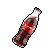
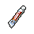
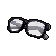

#  犀牛．伊萬

|體質|力量|敏捷|智力|幫派|戰鬥等級|勒索難度|持有天賦|取得天賦|
|:--:|:--:|:--:|:--:|:--:|:--:|:--:|:--:|:--:|
|12|10|6|4|大腳幫幹部|強|難|[鬥士](技能.md#鬥士)、[強健](技能.md#強健)|[防御架勢](技能.md#防御架勢)|

## 故事

身材如石雕般健壯的犀牛，即使在監獄這種猛男環伺的地方，依然足以傲視群雄。三句不離肌肉和健美，在他眼裡所有瘦弱的家伙都是“娘娘腔”。身上常備蛋白粉，最愛的休閒活動就是在操場上盡情“擼鐵”。

出生在北部小鎮的伊萬，從小就對健美充滿了興趣。加上他作為犀牛的天然優勢，很快就成為了當地的健美冠軍。於是他將目光投向了更大的城市，但卻在一場高規格的比賽中被查出了服用禁藥。雖然他聲稱，這完全是對手的陷害，但依然遭到了嚴厲的禁賽處罰。他的健美之路就此草草收場了。

失去運動員身份的他，迫於生活的壓力，找了一份保鏢兼司機的工作。雇傭他的老板是個從事灰色行業的投機分子，而他的工作內容則是負責保護那家伙的眾多情人之一。

那是個漂亮但憂郁的金絲雀，雖然不算年輕，但卻充滿了成熟的魅力。她很少露出笑容，特別是老板來看她的時候。經過一段時間的相處，她終於告訴伊萬，她之所以待在老板的身邊，完全是迫於威脅。由於年輕時的一次投資失敗，她的把柄被老板牢牢的攥在了手裡，從此就成為了他籠中的玩物。這一晃就是十年，時間久了自然也就麻木了。

不知是處於同情，還是擁有悲慘遭遇者的同命相憐，又或者是一廂情願的朦朧愛意，伊萬決定幫助她。他綁架了他的老板，逼迫他毀掉了那份“把柄”的文件，隨後還狠狠的教訓了那個無恥混蛋一頓。

後面的故事就和伊萬事先想過的一樣。沒有“把柄”文件束縛的她，終於獲得了久違的自由，但是伊萬自己卻付出了牢獄的代價。不過他並不後悔，因為若他已注定無法登臺展示自己的肌肉之美，那麼至少用這身肌肉的力量幫助其他美麗的東西掙脫牢籠。

## 結識對話

- *這家伙看上去結實的就像塊石頭…*
- *要是挨上他一拳，說不定腦袋都會被打飛。*
- **{question1}**
- **喲\~小子，你在看什麼？是不是想偷摸我完美的肌肉？**
- ……
- 不，我想你誤會了。
- **難道說…？你是想挑戰我這副監獄最強肉體？！**
- ……
- 呃…我也沒這個意思。
- **哈\~我明白了！你準是想和我學習健身吧！**
- …… `好感+10`
- 好吧\~好吧\~你說對了。
- **{happy1}**
- **不過，我可不是潑你冷水。**
- **像你這種娘娘腔的身材，想練成我`伊萬`一樣強壯的肌肉。**
- **起碼再過一百年吧！哈哈哈！**
- **{happy1}**

## 深入了解對話

- 伊萬\~像你這種身材，進來前是做什麼的？
- 是摔跤手？或是橄欖球隊員？
- **哈\~你在談論我的肌肉嗎？**

#### 沒錯，我也是個`健身高手`。

> 他一邊評論著你的肌肉，一邊說了點自己過去的事情。

- **我看到了！你的肱二頭肌正在和我打招呼！**
- **那咱們就來一場健身愛好者之間的交流吧！**
- *沒想到這個大塊頭，居然會有這樣的一面…*
- 那她現在怎麼樣了？平時會來看你嗎？
- 還是說，不辭而別了…？
- **不\~她雖然沒答應我的追求，但也沒有躲著我…**
- **我們之間現在還是朋友。**
- **對了，她的名字是…伊麗莎。**

#### 取消

- **我可不想和你這種“小竹簽”聊這個。**
- **如果你想交朋友的話，就先流點汗水來`健身`吧！**
- {sweat1}
- *看來他只看得上像自己一樣的健身狂…*

## 特殊對話

### 打招呼（關係極好）

- **你好\~肌肉小子！**

### 打招呼（關係好）

- **你想和伊萬聊聊嗎？**

### 打招呼（關係一般）

- **是你在叫我嗎？**

### 打招呼（關係差）

- **哼\~找伊萬有何貴干吶？**

### 打招呼（關係極差）

- **看見你，我的肌肉都軟了。**

### 進行毆打

- **三招之內，我會讓你跪地求饒！**
- **來吧！待會兒用點力，別光給我撓癢癢！**
- **想挨揍的話，我很樂意幫幫你！**

### 回禮

- **伊萬喜歡你的禮物，所以決定給你一份回禮！**

### 勒索成功

- **喂！這次算你有種，我伊萬記下這筆帳了！**
- **{hate1}**

### 勒索失敗

- **喂\~你！趁我發火之前，最好從我眼前消失！**
- **{hate1}**

### 一起吃飯被拒

- **喂！這個兩個位置都被我包了！**

### 分享食物

- **{happy1}**
- **那我可就不客氣了，為了肌肉！**

### 加藥被發現

- **喂！你手裡拿的什麼？**

### 加藥辯解失敗

- **調料？我的飯裡不需要調料！**

## 聊天

- **想和我取經嗎？好吧\~小子！我就告訴你一個訣竅吧！**
- **鍛煉之前泡杯蛋白粉，你的肌肉會像點燃引線的炸藥一樣！砰\~砰\~砰！**
- **{happy1}**

## 初始物品

||||||
|:--:|:--:|:--:|:--:|:--:|
||||||
|[運動鞋](14-運動鞋.md)|[頭帶](20-頭帶.md)|[鐵管](164-鐵管.md)|[釘錘](151-釘錘.md)|[止疼片](49-止疼片.md)|
||||||
|[蘋果](64-蘋果.md)|[蛋白粉](79-蛋白粉.md)*2|[汽水](73-汽水.md)|[釘子](123-釘子.md)*4||

## 送禮

|圖片|物品名稱|好感|回應|
|:--:|--|:--:|--|
||[DEMO限定紙鶴](209-DEMO限定紙鶴.md)|50|奇怪？我明明應該對這個不感興趣才對…|
||[隨身聽（開機）](34-隨身聽（開機）.md)|24|你知道舉鐵時該聽什麼音樂嗎？自然該是\~重！金！屬！|
||[隨身聽（關機）](35-隨身聽（關機）.md)|24|你知道舉鐵時該聽什麼音樂嗎？自然該是\~重！金！屬！|
||[隨身聽（沒電）](36-隨身聽（沒電）.md)|24|你知道舉鐵時該聽什麼音樂嗎？自然該是\~重！金！屬！|
||[金龜子](202-金龜子.md)|20|哈\~金色傳說！|
||[運動鞋](14-運動鞋.md)|18|嗯\~這東西或許能幫助我鍛煉。|
||[棒球帽](21-棒球帽.md)|18|嘿\~你是這支隊伍的粉絲嗎…？|
||[手錶](27-手錶.md)|18|嗯\~這東西或許能幫助我鍛煉。|
||[牙齒項鏈](30-牙齒項鏈.md)|18|嗯哼\~一件有趣的小玩具。|
||[馬女郎海報](105-馬女郎海報.md)|18|你看吶\~她的大腿就像鉗子一樣！多美的肌肉！|
||[扳手](142-扳手.md)|18|夠沉\~！夠給勁\~！|
||[釘錘](151-釘錘.md)|18|夠沉\~！夠給勁\~！|
||[紅頭巾](23-紅頭巾.md)|16|哈\~我的肌肉說\~它喜歡這個！|
||[頭帶](20-頭帶.md)|15|嗯\~這東西或許能幫助我鍛煉。|
||[蛋白粉](79-蛋白粉.md)|12|哈\~我的肌肉已經興奮起來了！|
||[貓女郎海報](106-貓女郎海報.md)|12|嗯\~這東西或許能幫助我鍛煉。|
||[狐女郎海報](107-狐女郎海報.md)|12|嗯\~這東西或許能幫助我鍛煉。|
||[兔女郎海報](108-兔女郎海報.md)|12|嗯\~這東西或許能幫助我鍛煉。|
||[釘棒(+)](163-釘棒(+).md)|12|夠沉\~！夠給勁\~！|
||[墨鏡](18-墨鏡.md)|10|嗯\~這東西或許能幫助我鍛煉。|
||[護身符](29-護身符.md)|10|嗯\~這東西或許能幫助我鍛煉。|
||[酒葫蘆](37-酒葫蘆.md)|10|嗯\~這東西或許能幫助我鍛煉。|
||[水果刀](158-水果刀.md)|10|嗯\~這東西或許能幫助我鍛煉。|
||[雙節棍(+)](161-雙節棍(+).md)|10|嗯\~這東西或許能幫助我鍛煉。|
||[釘棒](162-釘棒.md)|9|夠沉\~！夠給勁\~！|
||[鐵管](164-鐵管.md)|9|夠沉\~！夠給勁\~！|
||[帆布鞋](16-帆布鞋.md)|8|禮物嗎？\~那伊萬就不客氣了。|
||[毛線帽](22-毛線帽.md)|8|嗯\~這東西或許能幫助我鍛煉。|
||[綠頭巾](24-綠頭巾.md)|8|嗯\~這東西或許能幫助我鍛煉。|
||[酒精燈](52-酒精燈.md)|8|嗯\~這東西或許能幫助我鍛煉。|
||[精釀蘋果酒](56-精釀蘋果酒.md)|8|嗯\~這東西或許能幫助我鍛煉。|
||[蘋果](64-蘋果.md)|8|哈\~高纖維，低熱量，零脂肪！|
||[汽水](73-汽水.md)|8|哈\~沒什麼能比深蹲之後來瓶這個更爽的了！|
||[《花花世界》（全新）](102-《花花世界》（全新）.md)|8|嗯\~這東西或許能幫助我鍛煉。|
||[精美的畫作](130-精美的畫作.md)|8|嗯\~這東西或許能幫助我鍛煉。|
||[圓珠筆](133-圓珠筆.md)|8|嗯\~這東西或許能幫助我鍛煉。|
||[圓珠筆](134-圓珠筆.md)|8|嗯\~這東西或許能幫助我鍛煉。|
||[剪刀](152-剪刀.md)|8|嗯\~這東西或許能幫助我鍛煉。|
||[雙節棍](160-雙節棍.md)|8|嗯\~這東西或許能幫助我鍛煉。|
||[皮帶](166-皮帶.md)|8|嗯\~這東西或許能幫助我鍛煉。|
||[皮帶](167-皮帶.md)|8|嗯\~這東西或許能幫助我鍛煉。|
||[《森之音》](203-《森之音》.md)|8|嗯\~這東西或許能幫助我鍛煉。|
||[橡膠手套](25-橡膠手套.md)|6|嗯\~這東西或許能幫助我鍛煉。|
||[啤酒](54-啤酒.md)|6|嗯\~這東西或許能幫助我鍛煉。|
||[蘋果酒](55-蘋果酒.md)|6|嗯\~這東西或許能幫助我鍛煉。|
||[華夫餅](67-華夫餅.md)|6|嗯\~這東西或許能幫助我鍛煉。|
||[酸奶](74-酸奶.md)|6|充足的鈣質\~我的犀角正需要這個！|
||[超辣泡麵](78-超辣泡麵.md)|6|嗯\~這東西或許能幫助我鍛煉。|
||[《花花世界》（看過）](103-《花花世界》（看過）.md)|6|嗯\~這東西或許能幫助我鍛煉。|
||[簡單的漫畫](129-簡單的漫畫.md)|6|嗯\~這東西或許能幫助我鍛煉。|
||[長螺絲](136-長螺絲.md)|6|嗯\~這東西或許能幫助我鍛煉。|
||[玻璃匕首(+)](155-玻璃匕首(+).md)|6|嗯\~這東西或許能幫助我鍛煉。|
||[牙刷匕首(+)](157-牙刷匕首(+).md)|6|嗯\~這東西或許能幫助我鍛煉。|
||[止疼片](49-止疼片.md)|4|嗯\~這東西或許能幫助我鍛煉。|
||[醫用酒精](51-醫用酒精.md)|4|嗯\~這東西或許能幫助我鍛煉。|
||[一把咖啡豆](69-一把咖啡豆.md)|4|嗯\~這東西或許能幫助我鍛煉。|
||[咖啡粉](76-咖啡粉.md)|4|嗯\~這東西或許能幫助我鍛煉。|
||[茶包](77-茶包.md)|4|嗯\~這東西或許能幫助我鍛煉。|
||[肥皂](88-肥皂.md)|4|嗯\~這東西或許能幫助我鍛煉。|
||[《花花世界》（翻爛）](104-《花花世界》（翻爛）.md)|4|嗯\~這東西或許能幫助我鍛煉。|
||[牙刷](115-牙刷.md)|4|嗯\~這東西或許能幫助我鍛煉。|
||[牙膏](116-牙膏.md)|4|嗯\~這東西或許能幫助我鍛煉。|
||[胡亂的塗鴉](128-胡亂的塗鴉.md)|4|嗯\~這東西或許能幫助我鍛煉。|
||[鉛筆](131-鉛筆.md)|4|嗯\~這東西或許能幫助我鍛煉。|
||[鉛筆](132-鉛筆.md)|4|嗯\~這東西或許能幫助我鍛煉。|
||[硬幣](135-硬幣.md)|4|嗯\~這東西或許能幫助我鍛煉。|
||[湯匙](143-湯匙.md)|4|嗯\~這東西或許能幫助我鍛煉。|
||[湯匙](144-湯匙.md)|4|嗯\~這東西或許能幫助我鍛煉。|
||[玻璃匕首](154-玻璃匕首.md)|4|嗯\~這東西或許能幫助我鍛煉。|
||[牙刷匕首](156-牙刷匕首.md)|4|嗯\~這東西或許能幫助我鍛煉。|
||[口香糖](70-口香糖.md)|3|嗯\~這能幫我練出健美的面部肌肉。|
||[曲奇餅乾](71-曲奇餅乾.md)|2|嗯\~這東西或許能幫助我鍛煉。|
||[電池](114-電池.md)|2|嗯\~這東西或許能幫助我鍛煉。|
||[釘子](123-釘子.md)|2|嗯\~這東西或許能幫助我鍛煉。|
||[折斷的木條](159-折斷的木條.md)|2|嗯\~這東西或許能幫助我鍛煉。|
||[布條](84-布條.md)|-2|喂…你給我這東西幹嘛？|
||[迴紋針](86-迴紋針.md)|-2|喂…你給我這東西幹嘛？|
||[消毒液](118-消毒液.md)|-2|喂…你給我這東西幹嘛？|
||[除銹劑](119-除銹劑.md)|-2|喂…你給我這東西幹嘛？|
||[火柴](120-火柴.md)|-2|喂…你給我這東西幹嘛？|
||[膠帶](121-膠帶.md)|-2|喂…你給我這東西幹嘛？|
||[顏料](122-顏料.md)|-2|喂…你給我這東西幹嘛？|
||[鞋帶](124-鞋帶.md)|-2|喂…你給我這東西幹嘛？|
||[白紙](125-白紙.md)|-2|喂…你給我這東西幹嘛？|
||[黑桃A](39-黑桃A.md)|-4|喂…你給我這東西幹嘛？|
||[薄荷葉](40-薄荷葉.md)|-4|這東西對我的肌肉可沒好處。|
||[安眠藥](47-安眠藥.md)|-4|這東西對我的肌肉可沒好處。|
||[焦糖棒](72-焦糖棒.md)|-4|太多糖分！太多脂肪！|
||[開鎖器](87-開鎖器.md)|-4|哼\~這東西對我來說簡直多此一舉。|
||[開鎖器(P)](38-開鎖器(P).md)|-4|哼\~這東西對我來說簡直多此一舉。|
||[薄荷葉卷](41-薄荷葉卷.md)|-6|這東西對我的肌肉可沒好處。|
||[瀉藥](44-瀉藥.md)|-6|喂…你給我這東西幹嘛？|
||[拖鞋](17-拖鞋.md)|-8|穿著這東西可不好鍛煉…|
||[自製口罩](32-自製口罩.md)|-8|戴上這東西可不好鍛煉…|
||[奶油華夫餅](68-奶油華夫餅.md)|-8|太多糖分！太多脂肪！|
||[土豆披薩](75-土豆披薩.md)|-8|太多糖分！太多脂肪！|
||[香皂](89-香皂.md)|-8|這玩意兒會蓋住我的“男人味”！|
||[計算機](101-計算機.md)|-8|喂…你給我這東西幹嘛？|
||[咖啡磨](109-咖啡磨.md)|-8|喂…你給我這東西幹嘛？|
||[皮鞋](15-皮鞋.md)|-10|穿著這東西可不好鍛煉…|
||[眼鏡](19-眼鏡.md)|-10|戴上這東西可不好鍛煉…|
||[《死靈之書》](31-《死靈之書》.md)|-12|喂\~你覺得我能讀得懂這東西嗎？|
||[掌上遊戲機](110-掌上遊戲機.md)|-12|喂…你給我這東西幹嘛？|
||[掌上遊戲機（沒電）](111-掌上遊戲機（沒電）.md)|-12|喂…你給我這東西幹嘛？|
||[空的牙膏管](117-空的牙膏管.md)|-20|喂！別把你的垃圾塞給我！|
||[碎玻璃](153-碎玻璃.md)|-20|喂！別把你的垃圾塞給我！|
||[蘑菇](42-蘑菇.md)|-40|該死的！我可不需要這種東西！從來就不需要！|
||[蘑菇粉](43-蘑菇粉.md)|-40|該死的！我可不需要這種東西！從來就不需要！|
||[紫鳶花](45-紫鳶花.md)|-40|喂！你覺得我會是喜歡這個的“娘娘腔”嗎？|
||[花瓣粉](46-花瓣粉.md)|-40|喂！這玩意兒會讓我的肌肉萎縮！|
||[發霉的麵包](200-發霉的麵包.md)|-40|喂！別把你的垃圾塞給我！|
||[興奮劑](50-興奮劑.md)|-60|該死的！我可不需要這種東西！從來就不需要！|
||[鎮靜劑](53-鎮靜劑.md)|-60|喂！這玩意兒會讓我的肌肉萎縮！|
||[紙鶴](126-紙鶴.md)|-60|喂！你覺得我會是喜歡這個的“娘娘腔”嗎？|
||[黑手](26-黑手.md)|-80|記住！我討厭這種卑鄙的手段！|
||[花束](127-花束.md)|-80|喂！你覺得我會是喜歡這個的“娘娘腔”嗎？|

