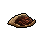

##  猩猩．凱撒

|體質|力量|敏捷|智力|幫派|
|:--:|:--:|:--:|:--:|:--:|
|8|7|8|12|黑爪幫老大|

### 故事

名為凱撒的黑猩猩。作為黑爪幫老大的他，掌控著整座監獄的地下財政。相比於爭強斗狠，他更喜歡利用精巧的計算將對手玩弄於股掌之間。或許，他才是整座監獄里你最需要提防家伙…

凱撒當然不是他的真名，查爾斯、史蒂文、莫里斯、科巴…等等，這些都是他曾經用過的名字，以至於到了現在他早已忘了當年父母給他起的那個名字。童年時代的凱撒就展現出了文字方面的過人天賦，他在六歲的時候就能夠模仿父親的筆跡為自己在學校請假。有時候他也會模仿老師的筆跡向家里索要一些“教材費”。

在他高中畢業那年，父親的公司遭遇了資金方面的問題，出於“好意”他模仿區議員的筆跡向銀行寫了一封擔保信，隨後一筆可觀的貸款拯救了瀕臨破產的公司，而這件事直到今天也沒被發現。嘗到甜頭的凱撒仿佛挖到了一座金礦，隨後他便開始了偽造支票的犯罪生涯。

出神入化的筆記偽造技術，讓他通過兌換空頭支票獲利數百萬。不過作為擁有超高智商的凱撒并沒有沉溺於如此淺薄的“成功”。隨後他有計劃的將錢款投入到了城市的黑幫產業中。幾年之後，他就成為了北角區大小黑幫組織的幕後黑手。

黑道的保護加上白道的收買，凱撒的犯罪帝國仿佛堅不可摧，直到聯邦探員獵犬·強尼的出現。他是著名的鐵面警探，無親無故的他即無法被金錢收買，也不懼黑幫的威脅。就這樣，一場曠日持久的警察捉賊遊戲拉開了帷幕。凱撒有時能利用眼線的消息將強尼耍的團團轉，但有時也會因一著不慎而被逼的更名改姓。兩個對手就這樣纏斗了幾年，不分勝負。突然在一天夜里凱撒接到了一個電話：“咳咳\~晚上好，我是強尼。”

看來該來的終究躲不過，隨著凱撒真實身份的暴露，他再也不能靠假名字來金蟬脫了。不過強尼倒是給了他一個選擇，要麼像個失敗者一樣夾著尾巴逃去國外，要麼來和他做個真正的了斷。

或許是不想承認自己的失敗，又或許是太想當面戰勝這個老對手。凱撒做出了一個不像他會做出的決定，他接受了強尼的邀請。決戰發生在一座舊機場，雙方都如約的獨自前來。幾聲槍響之後，凱撒被銬上了手銬，而強尼也身受重傷。這就是故事的結局，雙方都是輸家，但也都是贏家。

### 結識對話

- **你終於來了，和我算好的時間差不多。**
- {question1}
- 你怎麼知道我會來找你？
- **如果連這點事都料不到的話，我怎麼能掌管的了`黑爪幫`？**
- **你雖然進來沒多久，但做過的“事情”可不少…**
- **像你這種角色，應該不只是個普普通通的“小囚犯”吧？**
- ……
- **如果你在謀劃些什麼的話，那一定繞不開這里的幫派。**
- **所以\~你現在會來找我，自然是情理之中的事了…**
- {think1}
- *他的腦子聰明的可怕…我最好提防著點。*

### 深入了解對話

- **你又來了\~我猜這次你是想打聽我的故事，對嗎？**
- 看來又被你算到了。
- 不過我很好奇，既然你什麼都能未卜先知…
- 那又是怎麼被抓到的呢？
- **誰都會遇到自己的對手，即便是我也不例外。**
- 你的對手…？

#### 我是`黑爪幫`的一員。

> 他講述了自己過去的故事，以及他提到的那個對手。

- 你的對手，就是我的對手。
- **那都是過去的事情了，不過既然你對此感興趣…**
- *我看不出誰才是最後的贏家…*
- 我有個疑問，強尼為什麼要打那通電話？
- 他已經知道了你的真實身份。
- 只要再花不久的時間，就一定能查出和你有關的直接罪證…
- **……**
- **是`癌癥`…我也是事後才知道，他當時只剩一個月能活了。**
- **如果不做個了結的話，案子就會轉給別的警探。**
- **那麼就存在被我收買的可能，他也是被逼到絕路了。**
- **不過\~最後還是他贏了，只靠一副將死之軀…**

#### 取消

- **我說的已經夠多了。**
- **剩下的內容就不是`黑爪幫`以外的你該知道了。**
### 初始物品

|物品名稱|物品名稱|物品名稱|物品名稱|物品名稱|
|:--:|:--:|:--:|:--:|:--:|
|  |  |  |  |  |
| [皮鞋](道具.md#皮鞋) | [手錶](道具.md#手錶) | [扳手](道具.md#扳手) | [黑桃A](道具.md#黑桃A) | [咖啡粉](道具.md#咖啡粉)*2 |
|  |  |  |  |  |
| [顏料](道具.md#顏料)*3 | [白紙](道具.md#白紙)*3 | [精美的畫作](道具.md#精美的畫作) | [圓珠筆](道具.md#圓珠筆) |  |
### 送禮

|圖片|物品名稱|好感|回應|
|:--:|--|:--:|--|
||[運動鞋](道具.md#運動鞋)|0|嗯\~一件禮物嗎？|
||[皮鞋](道具.md#皮鞋)|2|哦\~一個聰明的選擇。|
||[帆布鞋](道具.md#帆布鞋)|-1|你浪費了一件物品，而我損失了寶貴的時間。|
||[拖鞋](道具.md#拖鞋)|-2|錯誤的選擇…大錯特錯。|
||[墨鏡](道具.md#墨鏡)|1|很好，我看到了你的尊重。|
||[眼鏡](道具.md#眼鏡)|1|很好，我看到了你的尊重。|
||[頭帶](道具.md#頭帶)|-1|你浪費了一件物品，而我損失了寶貴的時間。|
||[棒球帽](道具.md#棒球帽)|0|嗯\~一件禮物嗎？|
||[毛線帽](道具.md#毛線帽)|-1|你浪費了一件物品，而我損失了寶貴的時間。|
||[紅頭巾](道具.md#紅頭巾)|-2|錯誤的選擇…大錯特錯。|
||[綠頭巾](道具.md#綠頭巾)|-2|錯誤的選擇…大錯特錯。|
||[橡膠手套](道具.md#橡膠手套)|0|嗯\~一件禮物嗎？|
||[黑手](道具.md#黑手)|0|嗯\~一件禮物嗎？|
||[手錶](道具.md#手錶)|2|哦\~一個聰明的選擇。|
||[護身符](道具.md#護身符)|-1|“森林之父”只會教你服從，自欺欺人罷了…|
||[牙齒項鏈](道具.md#牙齒項鏈)|-1|高風險，低效率，這就是暴力愚蠢之處。|
||[《死靈之書》](道具.md#《死靈之書》)|1|有趣的知識，混亂中隱藏著秩序。|
||[自制口罩](道具.md#自制口罩)|0|嗯\~一件禮物嗎？|
||[隨身聽（開機）](道具.md#隨身聽（開機）)|1|很好，我看到了你的尊重。|
||[隨身聽（關機）](道具.md#隨身聽（關機）)|1|很好，我看到了你的尊重。|
||[隨身聽（沒電）](道具.md#隨身聽（沒電）)|1|很好，我看到了你的尊重。|
||[酒葫蘆](道具.md#酒葫蘆)|-1|你浪費了一件物品，而我損失了寶貴的時間。|
||[黑桃A](道具.md#黑桃A)|1|命運會背叛你，而智慧則不會。|
||[薄荷葉](道具.md#薄荷葉)|-1|你浪費了一件物品，而我損失了寶貴的時間。|
||[薄荷葉卷](道具.md#薄荷葉卷)|-1|你浪費了一件物品，而我損失了寶貴的時間。|
||[蘑菇](道具.md#蘑菇)|-1|你浪費了一件物品，而我損失了寶貴的時間。|
||[蘑菇粉](道具.md#蘑菇粉)|-1|你浪費了一件物品，而我損失了寶貴的時間。|
||[瀉藥](道具.md#瀉藥)|-2|錯誤的選擇…大錯特錯。|
||[紫鳶花](道具.md#紫鳶花)|-1|無論你想表達什麼，都不是明智的選擇。|
||[花瓣粉](道具.md#花瓣粉)|-1|你浪費了一件物品，而我損失了寶貴的時間。|
||[安眠藥](道具.md#安眠藥)|0|嗯\~一件禮物嗎？|
||[止疼片](道具.md#止疼片)|-1|你浪費了一件物品，而我損失了寶貴的時間。|
||[興奮劑](道具.md#興奮劑)|-1|你浪費了一件物品，而我損失了寶貴的時間。|
||[醫用酒精](道具.md#醫用酒精)|-1|你浪費了一件物品，而我損失了寶貴的時間。|
||[酒精燈](道具.md#酒精燈)|0|嗯\~一件禮物嗎？|
||[鎮靜劑](道具.md#鎮靜劑)|-1|你浪費了一件物品，而我損失了寶貴的時間。|
||[啤酒](道具.md#啤酒)|-1|你浪費了一件物品，而我損失了寶貴的時間。|
||[蘋果酒](道具.md#蘋果酒)|-1|你浪費了一件物品，而我損失了寶貴的時間。|
||[精釀蘋果酒](道具.md#精釀蘋果酒)|0|嗯\~一件禮物嗎？|
||[蘋果](道具.md#蘋果)|1|你知道我要什麼，這很值得夸獎。|
||[華夫餅](道具.md#華夫餅)|0|嗯\~一件禮物嗎？|
||[奶油華夫餅](道具.md#奶油華夫餅)|0|嗯\~一件禮物嗎？|
||[一把咖啡豆](道具.md#一把咖啡豆)|1|你知道我要什麼，這很值得夸獎。|
||[口香糖](道具.md#口香糖)|0|嗯\~一件禮物嗎？|
||[曲奇餅乾](道具.md#曲奇餅乾)|0|嗯\~一件禮物嗎？|
||[焦糖棒](道具.md#焦糖棒)|1|你知道我要什麼，這很值得夸獎。|
||[汽水](道具.md#汽水)|0|嗯\~一件禮物嗎？|
||[酸奶](道具.md#酸奶)|0|嗯\~一件禮物嗎？|
||[土豆披薩](道具.md#土豆披薩)|0|嗯\~一件禮物嗎？|
||[咖啡粉](道具.md#咖啡粉)|2|哦\~一個聰明的選擇。|
||[茶包](道具.md#茶包)|1|你知道我要什麼，這很值得夸獎。|
||[超辣泡麵](道具.md#超辣泡麵)|0|嗯\~一件禮物嗎？|
||[蛋白粉](道具.md#蛋白粉)|0|嗯\~一件禮物嗎？|
||[布條](道具.md#布條)|-1|你又在浪費我的時間了。|
||[迴紋針](道具.md#迴紋針)|-1|你又在浪費我的時間了。|
||[開鎖器](道具.md#開鎖器)|-1|你浪費了一件物品，而我損失了寶貴的時間。|
||[開鎖器(P)](道具.md#開鎖器(P))|-1|你浪費了一件物品，而我損失了寶貴的時間。|
||[肥皂](道具.md#肥皂)|0|嗯\~一件禮物嗎？|
||[香皂](道具.md#香皂)|1|邋遢的家伙可做不成大事。|
||[計算機](道具.md#計算機)|1|很好，我看到了你的尊重。|
||[《花花世界》（全新）](道具.md#《花花世界》（全新）)|0|嗯\~一件禮物嗎？|
||[《花花世界》（看過）](道具.md#《花花世界》（看過）)|0|嗯\~一件禮物嗎？|
||[《花花世界》（翻爛）](道具.md#《花花世界》（翻爛）)|-1|你浪費了一件物品，而我損失了寶貴的時間。|
||[馬女郎海報](道具.md#馬女郎海報)|0|嗯\~一件禮物嗎？|
||[貓女郎海報](道具.md#貓女郎海報)|0|嗯\~一件禮物嗎？|
||[狐女郎海報](道具.md#狐女郎海報)|0|嗯\~一件禮物嗎？|
||[兔女郎海報](道具.md#兔女郎海報)|0|嗯\~一件禮物嗎？|
||[咖啡磨](道具.md#咖啡磨)|1|很好，我看到了你的尊重。|
||[掌上遊戲機](道具.md#掌上遊戲機)|0|嗯\~一件禮物嗎？|
||[掌上遊戲機（沒電）](道具.md#掌上遊戲機（沒電）)|0|嗯\~一件禮物嗎？|
||[電池](道具.md#電池)|0|嗯\~一件禮物嗎？|
||[牙刷](道具.md#牙刷)|-1|你浪費了一件物品，而我損失了寶貴的時間。|
||[牙膏](道具.md#牙膏)|-1|你浪費了一件物品，而我損失了寶貴的時間。|
||[空的牙膏管](道具.md#空的牙膏管)|-2|錯誤的選擇…大錯特錯。|
||[消毒液](道具.md#消毒液)|-1|你又在浪費我的時間了。|
||[除銹劑](道具.md#除銹劑)|-1|你又在浪費我的時間了。|
||[火柴](道具.md#火柴)|-1|你又在浪費我的時間了。|
||[膠帶](道具.md#膠帶)|-1|你又在浪費我的時間了。|
||[顏料](道具.md#顏料)|1|你知道我要什麼，這很值得夸獎。|
||[釘子](道具.md#釘子)|-1|你又在浪費我的時間了。|
||[鞋帶](道具.md#鞋帶)|-1|你又在浪費我的時間了。|
||[白紙](道具.md#白紙)|0|嗯\~一件禮物嗎？|
||[紙鶴](道具.md#紙鶴)|0|嗯\~一件禮物嗎？|
||[花束](道具.md#花束)|-1|無論你想表達什麼，都不是明智的選擇。|
||[胡亂的涂鴉](道具.md#胡亂的涂鴉)|-2|錯誤的選擇…大錯特錯。|
||[簡單的漫畫](道具.md#簡單的漫畫)|0|嗯\~一件禮物嗎？|
||[精美的畫作](道具.md#精美的畫作)|2|哦\~一個聰明的選擇。|
||[鉛筆](道具.md#鉛筆)|0|嗯\~一件禮物嗎？|
||[鉛筆](道具.md#鉛筆)|0|嗯\~一件禮物嗎？|
||[圓珠筆](道具.md#圓珠筆)|1|你知道我要什麼，這很值得夸獎。|
||[圓珠筆](道具.md#圓珠筆)|1|你知道我要什麼，這很值得夸獎。|
||[硬幣](道具.md#硬幣)|0|嗯\~一件禮物嗎？|
||[長螺絲](道具.md#長螺絲)|0|嗯\~一件禮物嗎？|
||[扳手](道具.md#扳手)|0|嗯\~一件禮物嗎？|
||[湯匙](道具.md#湯匙)|-1|你浪費了一件物品，而我損失了寶貴的時間。|
||[湯匙](道具.md#湯匙)|-1|你浪費了一件物品，而我損失了寶貴的時間。|
||[釘錘](道具.md#釘錘)|0|嗯\~一件禮物嗎？|
||[剪刀](道具.md#剪刀)|0|嗯\~一件禮物嗎？|
||[碎玻璃](道具.md#碎玻璃)|-2|錯誤的選擇…大錯特錯。|
||[玻璃匕首](道具.md#玻璃匕首)|0|嗯\~一件禮物嗎？|
||[玻璃匕首(+)](道具.md#玻璃匕首(+))|0|嗯\~一件禮物嗎？|
||[牙刷匕首](道具.md#牙刷匕首)|0|嗯\~一件禮物嗎？|
||[牙刷匕首(+)](道具.md#牙刷匕首(+))|0|嗯\~一件禮物嗎？|
||[水果刀](道具.md#水果刀)|0|嗯\~一件禮物嗎？|
||[折斷的木條](道具.md#折斷的木條)|-2|錯誤的選擇…大錯特錯。|
||[雙節棍](道具.md#雙節棍)|0|嗯\~一件禮物嗎？|
||[雙節棍(+)](道具.md#雙節棍(+))|0|嗯\~一件禮物嗎？|
||[釘棒](道具.md#釘棒)|0|嗯\~一件禮物嗎？|
||[釘棒(+)](道具.md#釘棒(+))|0|嗯\~一件禮物嗎？|
||[鐵管](道具.md#鐵管)|0|嗯\~一件禮物嗎？|
||[皮帶](道具.md#皮帶)|0|嗯\~一件禮物嗎？|
||[皮帶](道具.md#皮帶)|0|嗯\~一件禮物嗎？|
||[發霉的麵包](道具.md#發霉的麵包)|-2|錯誤的選擇…大錯特錯。|
||[金龜子](道具.md#金龜子)|2|哦\~一個聰明的選擇。|
||[《森之音》](道具.md#《森之音》)|-1|“森林之父”只會教你服從，自欺欺人罷了…|
||[DEMO限定紙鶴](道具.md#DEMO限定紙鶴)|2|想和我做朋友嗎？一個明智的選擇。|

