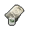

#  猩猩．凱撒

|體質|力量|敏捷|智力|幫派|戰鬥等級|勒索難度|持有天賦|取得天賦|
|:--:|:--:|:--:|:--:|:--:|:--:|:--:|:--:|:--:|
|8|7|8|12|黑爪幫老大|強|難|[機智](技能.md#機智)、[製作能手](技能.md#製作能手)、[理財](技能.md#理財)|[真聰明！](技能.md#真聰明！)|

## 故事

名為凱撒的黑猩猩。作為黑爪幫老大的他，掌控著整座監獄的地下財政。相比於爭強斗狠，他更喜歡利用精巧的計算將對手玩弄於股掌之間。或許，他才是整座監獄裡你最需要提防家伙…

凱撒當然不是他的真名，查爾斯、史蒂文、莫裡斯、科巴…等等，這些都是他曾經用過的名字，以至於到了現在他早已忘了當年父母給他起的那個名字。童年時代的凱撒就展現出了文字方面的過人天賦，他在六歲的時候就能夠模仿父親的筆跡為自己在學校請假。有時候他也會模仿老師的筆跡向家裡索要一些“教材費”。

在他高中畢業那年，父親的公司遭遇了資金方面的問題，出於“好意”他模仿區議員的筆跡向銀行寫了一封擔保信，隨後一筆可觀的貸款拯救了瀕臨破產的公司，而這件事直到今天也沒被發現。嘗到甜頭的凱撒仿佛挖到了一座金礦，隨後他便開始了偽造支票的犯罪生涯。

出神入化的筆記偽造技術，讓他通過兌換空頭支票獲利數百萬。不過作為擁有超高智商的凱撒並沒有沉溺於如此淺薄的“成功”。隨後他有計劃的將錢款投入到了城市的黑幫產業中。幾年之後，他就成為了北角區大小黑幫組織的幕後黑手。

黑道的保護加上白道的收買，凱撒的犯罪帝國仿佛堅不可摧，直到聯邦探員獵犬·強尼的出現。他是著名的鐵面警探，無親無故的他即無法被金錢收買，也不懼黑幫的威脅。就這樣，一場曠日持久的警察捉賊遊戲拉開了帷幕。凱撒有時能利用眼線的消息將強尼耍的團團轉，但有時也會因一著不慎而被逼的更名改姓。兩個對手就這樣纏斗了幾年，不分勝負。突然在一天夜裡凱撒接到了一個電話：“咳咳\~晚上好，我是強尼。”

看來該來的終究躲不過，隨著凱撒真實身份的暴露，他再也不能靠假名字來金蟬脫了。不過強尼倒是給了他一個選擇，要麼像個失敗者一樣夾著尾巴逃去國外，要麼來和他做個真正的了斷。

或許是不想承認自己的失敗，又或許是太想當面戰勝這個老對手。凱撒做出了一個不像他會做出的決定，他接受了強尼的邀請。決戰發生在一座舊機場，雙方都如約的獨自前來。幾聲槍響之後，凱撒被銬上了手銬，而強尼也身受重傷。這就是故事的結局，雙方都是輸家，但也都是贏家。

## 結識對話

- **你終於來了，和我算好的時間差不多。**
- {question1}
- 你怎麼知道我會來找你？
- **如果連這點事都料不到的話，我怎麼能掌管的了`黑爪幫`？**
- **你雖然進來沒多久，但做過的“事情”可不少…**
- **像你這種角色，應該不只是個普普通通的“小囚犯”吧？**
- ……
- **如果你在謀劃些什麼的話，那一定繞不開這裡的幫派。**
- **所以\~你現在會來找我，自然是情理之中的事了…**
- {think1}
- *他的腦子聰明的可怕…我最好提防著點。*

## 深入了解對話

- **你又來了\~我猜這次你是想打聽我的故事，對嗎？**
- 看來又被你算到了。
- 不過我很好奇，既然你什麼都能未卜先知…
- 那又是怎麼被抓到的呢？
- **誰都會遇到自己的對手，即便是我也不例外。**
- 你的對手…？

#### 我是`黑爪幫`的一員。

> 他講述了自己過去的故事，以及他提到的那個對手。

- 你的對手，就是我的對手。
- **那都是過去的事情了，不過既然你對此感興趣…**
- *我看不出誰才是最後的贏家…*
- 我有個疑問，強尼為什麼要打那通電話？
- 他已經知道了你的真實身份。
- 只要再花不久的時間，就一定能查出和你有關的直接罪證…
- **……**
- **是`癌症`…我也是事後才知道，他當時只剩一個月能活了。**
- **如果不做個了結的話，案子就會轉給別的警探。**
- **那麼就存在被我收買的可能，他也是被逼到絕路了。**
- **不過\~最後還是他贏了，只靠一副將死之軀…**

#### 取消

- **我說的已經夠多了。**
- **剩下的內容就不是`黑爪幫`以外的你該知道了。**

## 特殊對話

### 打招呼（關係極好）

- **讓我們來交換秘密吧…**

### 打招呼（關係好）

- **說吧，我給你點時間…**

### 打招呼（關係一般）

- **別耽誤我的時間…**

### 打招呼（關係差）

- **提醒你，別浪費我時間。**

### 打招呼（關係極差）

- **你要是聰明，就別說廢話。**

### 進行毆打

- **愚蠢會害你丟掉性命。**
- **愚蠢是會受到懲罰的。**
- **我是凱撒，而你，只是個將被碾死的可憐蟲而已。**

### 回禮

- **收下這件回禮吧，凱撒從不吝嗇。**

### 勒索成功

- **這`{x1}`塊我可以給你，但記住，黑爪幫可不會善罷甘休。**
- **{hate1}**

### 勒索失敗

- **你剛剛犯了一個錯誤，一個愚蠢的錯誤。**

### 一起吃飯被拒

- **愚蠢的家伙才會找錯自己的位置，你是嗎？**

### 分享食物

- **天底下沒有免費的午餐…你說對嗎？**

### 加藥被發現

- **能告訴我，你手裡捏著的是什麼嗎？…嗯？！**

### 加藥辯解失敗

- **最好是這樣…最好…**

## 聊天

- **我不在意你的目的，我只關心我的利益。**
- **希望你是一個聰明的朋友，而不是自作聰明的敵人…**

## 初始物品

||||||
|:--:|:--:|:--:|:--:|:--:|
||||||
|[皮鞋](15-皮鞋.md)|[手錶](27-手錶.md)|[扳手](142-扳手.md)|[黑桃A](39-黑桃A.md)|[咖啡粉](76-咖啡粉.md)*2|
||||||
|[顏料](122-顏料.md)*3|[白紙](125-白紙.md)*3|[精美的畫作](130-精美的畫作.md)|[圓珠筆](133-圓珠筆.md)||

## 送禮

|圖片|物品名稱|好感|回應|
|:--:|--|:--:|--|
||[DEMO限定紙鶴](209-DEMO限定紙鶴.md)|50|想和我做朋友嗎？一個明智的選擇。|
||[手錶](27-手錶.md)|24|哦\~一個聰明的選擇。|
||[皮鞋](15-皮鞋.md)|20|哦\~一個聰明的選擇。|
||[金龜子](202-金龜子.md)|20|哦\~一個聰明的選擇。|
||[《死靈之書》](31-《死靈之書》.md)|18|有趣的知識，混亂中隱藏著秩序。|
||[隨身聽（開機）](34-隨身聽（開機）.md)|18|很好，我看到了你的尊重。|
||[隨身聽（關機）](35-隨身聽（關機）.md)|18|很好，我看到了你的尊重。|
||[隨身聽（沒電）](36-隨身聽（沒電）.md)|18|很好，我看到了你的尊重。|
||[精美的畫作](130-精美的畫作.md)|16|哦\~一個聰明的選擇。|
||[墨鏡](18-墨鏡.md)|15|很好，我看到了你的尊重。|
||[眼鏡](19-眼鏡.md)|15|很好，我看到了你的尊重。|
||[運動鞋](14-運動鞋.md)|12|嗯\~一件禮物嗎？|
||[棒球帽](21-棒球帽.md)|12|嗯\~一件禮物嗎？|
||[香皂](89-香皂.md)|12|邋遢的家伙可做不成大事。|
||[計算機](101-計算機.md)|12|很好，我看到了你的尊重。|
||[馬女郎海報](105-馬女郎海報.md)|12|嗯\~一件禮物嗎？|
||[貓女郎海報](106-貓女郎海報.md)|12|嗯\~一件禮物嗎？|
||[狐女郎海報](107-狐女郎海報.md)|12|嗯\~一件禮物嗎？|
||[兔女郎海報](108-兔女郎海報.md)|12|嗯\~一件禮物嗎？|
||[咖啡磨](109-咖啡磨.md)|12|很好，我看到了你的尊重。|
||[掌上遊戲機](110-掌上遊戲機.md)|12|嗯\~一件禮物嗎？|
||[掌上遊戲機（沒電）](111-掌上遊戲機（沒電）.md)|12|嗯\~一件禮物嗎？|
||[圓珠筆](133-圓珠筆.md)|12|你知道我要什麼，這很值得誇獎。|
||[圓珠筆](134-圓珠筆.md)|12|你知道我要什麼，這很值得誇獎。|
||[扳手](142-扳手.md)|12|嗯\~一件禮物嗎？|
||[釘錘](151-釘錘.md)|12|嗯\~一件禮物嗎？|
||[水果刀](158-水果刀.md)|10|嗯\~一件禮物嗎？|
||[雙節棍(+)](161-雙節棍(+).md)|10|嗯\~一件禮物嗎？|
||[黑手](26-黑手.md)|8|嗯\~一件禮物嗎？|
||[自製口罩](32-自製口罩.md)|8|嗯\~一件禮物嗎？|
||[酒精燈](52-酒精燈.md)|8|嗯\~一件禮物嗎？|
||[精釀蘋果酒](56-精釀蘋果酒.md)|8|嗯\~一件禮物嗎？|
||[奶油華夫餅](68-奶油華夫餅.md)|8|嗯\~一件禮物嗎？|
||[土豆披薩](75-土豆披薩.md)|8|嗯\~一件禮物嗎？|
||[咖啡粉](76-咖啡粉.md)|8|哦\~一個聰明的選擇。|
||[《花花世界》（全新）](102-《花花世界》（全新）.md)|8|嗯\~一件禮物嗎？|
||[剪刀](152-剪刀.md)|8|嗯\~一件禮物嗎？|
||[雙節棍](160-雙節棍.md)|8|嗯\~一件禮物嗎？|
||[釘棒(+)](163-釘棒(+).md)|8|嗯\~一件禮物嗎？|
||[皮帶](166-皮帶.md)|8|嗯\~一件禮物嗎？|
||[皮帶](167-皮帶.md)|8|嗯\~一件禮物嗎？|
||[橡膠手套](25-橡膠手套.md)|6|嗯\~一件禮物嗎？|
||[黑桃A](39-黑桃A.md)|6|命運會背叛你，而智慧則不會。|
||[蘋果](64-蘋果.md)|6|你知道我要什麼，這很值得誇獎。|
||[華夫餅](67-華夫餅.md)|6|嗯\~一件禮物嗎？|
||[一把咖啡豆](69-一把咖啡豆.md)|6|你知道我要什麼，這很值得誇獎。|
||[焦糖棒](72-焦糖棒.md)|6|你知道我要什麼，這很值得誇獎。|
||[茶包](77-茶包.md)|6|你知道我要什麼，這很值得誇獎。|
||[超辣泡麵](78-超辣泡麵.md)|6|嗯\~一件禮物嗎？|
||[蛋白粉](79-蛋白粉.md)|6|嗯\~一件禮物嗎？|
||[《花花世界》（看過）](103-《花花世界》（看過）.md)|6|嗯\~一件禮物嗎？|
||[紙鶴](126-紙鶴.md)|6|嗯\~一件禮物嗎？|
||[簡單的漫畫](129-簡單的漫畫.md)|6|嗯\~一件禮物嗎？|
||[長螺絲](136-長螺絲.md)|6|嗯\~一件禮物嗎？|
||[玻璃匕首(+)](155-玻璃匕首(+).md)|6|嗯\~一件禮物嗎？|
||[牙刷匕首(+)](157-牙刷匕首(+).md)|6|嗯\~一件禮物嗎？|
||[釘棒](162-釘棒.md)|6|嗯\~一件禮物嗎？|
||[鐵管](164-鐵管.md)|6|嗯\~一件禮物嗎？|
||[安眠藥](47-安眠藥.md)|4|嗯\~一件禮物嗎？|
||[汽水](73-汽水.md)|4|嗯\~一件禮物嗎？|
||[酸奶](74-酸奶.md)|4|嗯\~一件禮物嗎？|
||[肥皂](88-肥皂.md)|4|嗯\~一件禮物嗎？|
||[鉛筆](131-鉛筆.md)|4|嗯\~一件禮物嗎？|
||[鉛筆](132-鉛筆.md)|4|嗯\~一件禮物嗎？|
||[硬幣](135-硬幣.md)|4|嗯\~一件禮物嗎？|
||[玻璃匕首](154-玻璃匕首.md)|4|嗯\~一件禮物嗎？|
||[牙刷匕首](156-牙刷匕首.md)|4|嗯\~一件禮物嗎？|
||[顏料](122-顏料.md)|3|你知道我要什麼，這很值得誇獎。|
||[口香糖](70-口香糖.md)|2|嗯\~一件禮物嗎？|
||[曲奇餅乾](71-曲奇餅乾.md)|2|嗯\~一件禮物嗎？|
||[電池](114-電池.md)|2|嗯\~一件禮物嗎？|
||[白紙](125-白紙.md)|2|嗯\~一件禮物嗎？|
||[布條](84-布條.md)|-2|你又在浪費我的時間了。|
||[迴紋針](86-迴紋針.md)|-2|你又在浪費我的時間了。|
||[消毒液](118-消毒液.md)|-2|你又在浪費我的時間了。|
||[除銹劑](119-除銹劑.md)|-2|你又在浪費我的時間了。|
||[火柴](120-火柴.md)|-2|你又在浪費我的時間了。|
||[膠帶](121-膠帶.md)|-2|你又在浪費我的時間了。|
||[釘子](123-釘子.md)|-2|你又在浪費我的時間了。|
||[鞋帶](124-鞋帶.md)|-2|你又在浪費我的時間了。|
||[薄荷葉](40-薄荷葉.md)|-4|你浪費了一件物品，而我損失了寶貴的時間。|
||[蘑菇](42-蘑菇.md)|-4|你浪費了一件物品，而我損失了寶貴的時間。|
||[蘑菇粉](43-蘑菇粉.md)|-4|你浪費了一件物品，而我損失了寶貴的時間。|
||[紫鳶花](45-紫鳶花.md)|-4|無論你想表達什麼，都不是明智的選擇。|
||[花瓣粉](46-花瓣粉.md)|-4|你浪費了一件物品，而我損失了寶貴的時間。|
||[止疼片](49-止疼片.md)|-4|你浪費了一件物品，而我損失了寶貴的時間。|
||[醫用酒精](51-醫用酒精.md)|-4|你浪費了一件物品，而我損失了寶貴的時間。|
||[開鎖器](87-開鎖器.md)|-4|你浪費了一件物品，而我損失了寶貴的時間。|
||[開鎖器(P)](38-開鎖器(P).md)|-4|你浪費了一件物品，而我損失了寶貴的時間。|
||[《花花世界》（翻爛）](104-《花花世界》（翻爛）.md)|-4|你浪費了一件物品，而我損失了寶貴的時間。|
||[牙刷](115-牙刷.md)|-4|你浪費了一件物品，而我損失了寶貴的時間。|
||[牙膏](116-牙膏.md)|-4|你浪費了一件物品，而我損失了寶貴的時間。|
||[湯匙](143-湯匙.md)|-4|你浪費了一件物品，而我損失了寶貴的時間。|
||[湯匙](144-湯匙.md)|-4|你浪費了一件物品，而我損失了寶貴的時間。|
||[薄荷葉卷](41-薄荷葉卷.md)|-6|你浪費了一件物品，而我損失了寶貴的時間。|
||[興奮劑](50-興奮劑.md)|-6|你浪費了一件物品，而我損失了寶貴的時間。|
||[鎮靜劑](53-鎮靜劑.md)|-6|你浪費了一件物品，而我損失了寶貴的時間。|
||[啤酒](54-啤酒.md)|-6|你浪費了一件物品，而我損失了寶貴的時間。|
||[蘋果酒](55-蘋果酒.md)|-6|你浪費了一件物品，而我損失了寶貴的時間。|
||[帆布鞋](16-帆布鞋.md)|-8|你浪費了一件物品，而我損失了寶貴的時間。|
||[毛線帽](22-毛線帽.md)|-8|你浪費了一件物品，而我損失了寶貴的時間。|
||[花束](127-花束.md)|-8|無論你想表達什麼，都不是明智的選擇。|
||[《森之音》](203-《森之音》.md)|-8|“森林之父”只會教你服從，自欺欺人罷了…|
||[頭帶](20-頭帶.md)|-10|你浪費了一件物品，而我損失了寶貴的時間。|
||[護身符](29-護身符.md)|-10|“森林之父”只會教你服從，自欺欺人罷了…|
||[酒葫蘆](37-酒葫蘆.md)|-10|你浪費了一件物品，而我損失了寶貴的時間。|
||[牙齒項鏈](30-牙齒項鏈.md)|-12|高風險，低效率，這就是暴力愚蠢之處。|
||[空的牙膏管](117-空的牙膏管.md)|-20|錯誤的選擇…大錯特錯。|
||[碎玻璃](153-碎玻璃.md)|-20|錯誤的選擇…大錯特錯。|
||[折斷的木條](159-折斷的木條.md)|-20|錯誤的選擇…大錯特錯。|
||[胡亂的塗鴉](128-胡亂的塗鴉.md)|-40|錯誤的選擇…大錯特錯。|
||[發霉的麵包](200-發霉的麵包.md)|-40|錯誤的選擇…大錯特錯。|
||[瀉藥](44-瀉藥.md)|-60|錯誤的選擇…大錯特錯。|
||[拖鞋](17-拖鞋.md)|-80|錯誤的選擇…大錯特錯。|
||[紅頭巾](23-紅頭巾.md)|-80|錯誤的選擇…大錯特錯。|
||[綠頭巾](24-綠頭巾.md)|-80|錯誤的選擇…大錯特錯。|

