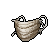
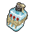

##  疣豬．哈庫拉

|體質|力量|敏捷|智力|
|:--:|:--:|:--:|:--:|
|7|7|7|4|

### 簡介

一只長相丑陋，但卻自信滿滿的疣豬。在他看來，在監獄這種弱肉強食的地方，擁有一張兇惡的臉孔完全是一種天然的優勢。況且他還聲稱，你覺得他丑只是不懂欣賞而已。在他們疣豬家族里，他這種長相可是百年不遇的大帥哥。對此，你不免流露出了一絲的難以置信…

### 故事

哈庫拉在進監獄前受雇于城市拆遷隊，工作就是按照上頭的規劃把那些“擋路的貧民窟”給鏟平。這可不是一份討喜的工作，但是為了掙錢他也沒余力去心疼別人。

哈庫拉在工作之余有兩大愛好，那就是泡妞和賭博。不過有的時候賭博也是為了泡妞，畢竟憑他的那點微薄薪水可鉆不進姑娘們的被窩。在一個倒霉的晚上，他又一次在酒吧牌局輸光了口袋里的錢，這可不是個好消息。他最近正和一個快餐店的女服務生打得火熱，本指望靠贏來的錢給姑娘買件禮物，然后趁熱打鐵…結果，現在計劃全泡湯了。

正當哈庫拉站在酒吧后巷咒罵操蛋的生活時，一個瘦小的身影追上了他，前來的家伙是狐獴·泰迪（現在也被關在這座監獄）。泰迪也是那家酒吧的常客，雖然他從不賭錢，但也算在吧臺和哈庫拉喝上過幾杯。在看到哈庫拉輸光家當之后，泰迪向他提出了一個“翻大本”的主意。

泰迪是個前地鐵工程師，之所以加上“前”字，是因為他剛剛在最近弄丟了工作。至于具體原因，那就是另一個的故事了。總是，他提議借助他們兩個“倒霉蛋”的特長來干一筆大買賣，從而解決各自的棘手問題。而這筆大買賣就是：盜竊城市中心銀行的地下金庫！

由于泰迪之前在地鐵局工作，所以他有幸看到過一份不對外公布的地鐵設計圖廢案，其中有一條逃生通道在建成后就從未投入使用，而它的位置就在城市中心銀行地下金庫的下方，兩者之間的距離僅有不足十米。如果哈庫拉可以從拆遷隊里“借”來炸藥和切割器，那么金庫里的巨額現金就都是他兩的了。

“睡在沒有姑娘的被窩里和蹲監獄有什么區別！”想到自己現在的處境，哈庫拉沒做猶豫便答應了…

行動的時間挑在了新年的午夜，這是泰迪的主意。街上狂歡的人群和空中爆裂的禮花，成了他們打洞破墻的最好掩護。第二天早上，宿醉的銀行保安才發現金庫里的百萬現金早已“到站下車”。

至于他們是怎么落網的，據哈庫拉告訴你“這得全賴泰迪！”因為泰迪的亢奮癥復發，導致他在睡覺時嘴也不停，他貪財的老婆從夢話里聽出了一二，之后伙同她的情人想把泰迪藏的錢據為己有。沒想到事情鬧大，他老婆和情人意外身亡，導致金庫盜竊案的事情敗露，哈庫拉也就跟著“倒了大霉”。

### 結識對話

- *呃\~這家伙的長相…*
- **喂！你干嘛一直盯著我看？！**
- **是不是在想，這家伙怎么長的這么丑？！**
- 糟糕，被發現了…
- 不\~我可沒這么想。
- **哈哈\~沒關系，我可不在意！**
- **因為在這種地方，長相兇狠可是“一種優勢”。**
- **這能讓混蛋們不敢來招惹我，也能讓菜鳥們更怕我！**
- **{happy1}**
- **而且，你覺得我丑，那是你不懂欣賞\~**
- **實話告訴你，就憑我這兩根獠牙，還有眼睛旁邊的大疣子。**
- **嘿嘿\~在我們==疣豬==里面，可是百年一遇的帥哥！**
- 這審美可真獨特\~
- 你說是，就是吧…
- **怎么\~不相信？要不要我把收到的情書都拿給你瞧瞧？！**

### 深入了解對話

- **嘿\~伙計，你知道在咱們監獄里哪個妞最正嗎？**
- 醫院的貝絲醫生？
- 你覺得雷伊…怎么樣？
- **哦\~你的審美可真夠爛的！讓我來告訴你吧。**
- **咱們這兒最正的妞是蘇珊！**
- 呃\~難道你指的是醫院里的那個==奶牛護士==蘇珊？
- **沒錯！你難道沒看過她性感的·大·屁·股嗎？**
- **哦\~我一想到就激動的發抖，實在是情難自已。**
- {sweat1}
- **再和你說個秘密，我已經決定要追求她了！**
- **只是還沒找到打開話題的敲門磚…你知道她==喜歡什么==嗎？**

#### 我聽說==她喜歡詩歌==。

> 他把自己的故事說了一遍，你敷衍的告訴他或許蘇珊會喜歡。

- **哦\~哥們，你可幫上大忙了！我待會兒就回去寫詩！**
- **還有，她有沒有說過喜歡什么樣的男人？我這種如何？**
- *他的故事真夠“單純”的…*
- 進了監獄，你有記恨泰迪嗎？
- **不，我可沒那么小心眼。**
- **再說，要不是進了監獄，我也不會遇見我的蘇珊。**
- **這得叫因禍得福！**
- {sweat1}

#### 取消

- 呃\~抱歉，我還真沒和她說過什么話…
- **也難怪，哪個美女不高冷呢？**
### 初始物品

|物品名稱|物品名稱|物品名稱|物品名稱|物品名稱|
|:--:|:--:|:--:|:--:|:--:|
|  |  |  |  |  |
| 頭帶 | 綠頭巾 | 折斷的木條*2 | 釘棒 | 薄荷葉*3 |
|  |  |  |  |  |
| 曲奇餅干*4 | 焦糖棒*3 | 釘子*3 | 湯匙 |  |
### 送禮

|圖片|物品名稱|好感|回應|
|:--:|--|:--:|--|
||運動鞋|0|嘿\~嘿\~這是給我的嗎？|
||皮鞋|0|嘿\~嘿\~這是給我的嗎？|
||帆布鞋|0|嘿\~嘿\~這是給我的嗎？|
||拖鞋|0|嘿\~嘿\~這是給我的嗎？|
||墨鏡|0|嘿\~嘿\~這是給我的嗎？|
||眼鏡|0|嘿\~嘿\~這是給我的嗎？|
||頭帶|0|嘿\~嘿\~這是給我的嗎？|
||棒球帽|0|嘿\~嘿\~這是給我的嗎？|
||毛線帽|0|嘿\~嘿\~這是給我的嗎？|
||紅頭巾|0|嘿\~嘿\~這是給我的嗎？|
||綠頭巾|0|嘿\~嘿\~這是給我的嗎？|
||橡膠手套|0|嘿\~嘿\~這是給我的嗎？|
||黑手|0|嘿\~嘿\~這是給我的嗎？|
||手表|0|嘿\~嘿\~這是給我的嗎？|
||護身符|0|嘿\~嘿\~這是給我的嗎？|
||牙齒項鏈|2|哈\~這玩意兒看起來和我的帥臉很配！|
||《死靈之書》|-2|這是什么鬼東西？上面的句子我一個字都看不懂！|
||自制口罩|0|嘿\~嘿\~這是給我的嗎？|
||隨身聽（開機）|0|嘿\~嘿\~這是給我的嗎？|
||隨身聽（關機）|0|嘿\~嘿\~這是給我的嗎？|
||隨身聽（沒電）|0|嘿\~嘿\~這是給我的嗎？|
||酒葫蘆|1|嘿\~不知道用這個喝啤酒是什么味道\~|
||黑桃A|-1|喂\~我可用不來這玩意兒。|
||薄荷葉|1|嘿\~我正需要這個來打發無聊呢。|
||薄荷葉卷|1|嘿\~我正需要這個來打發無聊呢。|
||蘑菇|1|嘿\~我正需要這個來打發無聊呢。|
||蘑菇粉|0|嘿\~嘿\~這是給我的嗎？|
||瀉藥|-1|這是什么鬼東西？是吃的嗎…聞著可真惡心！|
||紫鳶花|-2|啊\~啊嚏！真該死\~我對花\~花粉過敏\~！|
||花瓣粉|-2|啊\~啊嚏！真該死\~我對花\~花粉過敏\~！|
||安眠藥|0|嘿\~嘿\~這是給我的嗎？|
||止疼片|0|嘿\~嘿\~這是給我的嗎？|
||興奮劑|2|嘿\~伙計\~這可是好東西！|
||醫用酒精|1|你知道嗎？這玩意兒其實味道還不錯\~|
||酒精燈|0|嘿\~嘿\~這是給我的嗎？|
||鎮靜劑|0|嘿\~嘿\~這是給我的嗎？|
||啤酒|2|啤酒這玩意兒\~喝再多都不覺得夠啊！|
||蘋果酒|1|嘿\~雖然味道比不上啤酒，但是起碼后勁夠足！|
||精釀蘋果酒|1|嘿\~雖然味道比不上啤酒，但是起碼后勁夠足！|
||蘋果|1|沒什么能比填飽肚子更讓我開心了\~|
||華夫餅|0|嘿\~嘿\~這是給我的嗎？|
||奶油華夫餅|2|喲！美味佳肴！謝啦\~伙計\~|
||一把咖啡豆|0|嘿\~嘿\~這是給我的嗎？|
||口香糖|0|嘿\~嘿\~這是給我的嗎？|
||曲奇餅干|1|沒什么能比填飽肚子更讓我開心了\~|
||焦糖棒|1|沒什么能比填飽肚子更讓我開心了\~|
||汽水|1|嘿\~這瓶看起來氣還挺足的\~|
||酸奶|0|嘿\~嘿\~這是給我的嗎？|
||土豆披薩|2|喲！美味佳肴！謝啦\~伙計\~|
||咖啡粉|0|嘿\~嘿\~這是給我的嗎？|
||茶包|-1|唉\~這日子已經夠沒滋味了…你還要我喝這個？|
||泡面|2|喲！美味佳肴！謝啦\~伙計\~|
||蛋白粉|0|嘿\~嘿\~這是給我的嗎？|
||布條|-1|（打哈欠）無聊的東西…|
||回形針|-1|（打哈欠）無聊的東西…|
||開鎖器|-1|喂\~我可用不來這玩意兒。|
||開鎖器(P)|-1|喂\~我可用不來這玩意兒。|
||肥皂|-1|哼\~我可不用這個\~身上沒有泥巴我會失眠的！|
||香皂|-1|哼\~我可不用這個\~身上沒有泥巴我會失眠的！|
||計算器|-2|坐牢已經夠慘了！我可不想在牢里算算數！|
||《花花世界》（全新）|2|嘿\~伙計\~這可是好東西！|
||《花花世界》（看過）|2|嘿\~伙計\~這可是好東西！|
||《花花世界》（翻爛）|1|嘿\~我正需要這個來打發無聊呢。|
||馬女郎海報|2|你看看\~果然妞還是越豐滿才越有魅力！|
||貓女郎海報|1|嘿\~我正需要這個來打發無聊呢。|
||狐女郎海報|1|嘿\~我正需要這個來打發無聊呢。|
||兔女郎海報|1|嘿\~我正需要這個來打發無聊呢。|
||咖啡磨|0|嘿\~嘿\~這是給我的嗎？|
||掌上游戲機|0|嘿\~嘿\~這是給我的嗎？|
||掌上游戲機（沒電）|0|嘿\~嘿\~這是給我的嗎？|
||電池|0|嘿\~嘿\~這是給我的嗎？|
||牙刷|1|我的獠牙可得好好保養，我一半的帥氣都靠它們了\~|
||牙膏|1|我的獠牙可得好好保養，我一半的帥氣都靠它們了\~|
||空的牙膏管|-2|…給我這些垃圾干嘛？|
||消毒液|-1|（打哈欠）無聊的東西…|
||除銹劑|-1|（打哈欠）無聊的東西…|
||火柴|0|嘿\~嘿\~這是給我的嗎？|
||膠帶|-1|（打哈欠）無聊的東西…|
||顏料|-1|（打哈欠）無聊的東西…|
||釘子|0|嘿\~嘿\~這是給我的嗎？|
||鞋帶|-1|（打哈欠）無聊的東西…|
||白紙|-1|（打哈欠）無聊的東西…|
||紙鶴|-1|（打哈欠）無聊的東西…|
||花束|-2|啊\~啊嚏！真該死\~我對花\~花粉過敏\~！|
||胡亂的涂鴉|-1|（打哈欠）無聊的東西…|
||簡單的漫畫|-1|（打哈欠）無聊的東西…|
||精美的畫作|-1|（打哈欠）無聊的東西…|
||鉛筆|-1|（打哈欠）無聊的東西…|
||鉛筆|-1|（打哈欠）無聊的東西…|
||圓珠筆|-1|（打哈欠）無聊的東西…|
||圓珠筆|-1|（打哈欠）無聊的東西…|
||硬幣|1|我媽媽說過一句至理名言：別拿零錢不當錢！|
||長螺絲|0|嘿\~嘿\~這是給我的嗎？|
||扳手|1|這玩意兒用起來應該挺順手的。|
||湯匙|0|嘿\~嘿\~這是給我的嗎？|
||湯匙|0|嘿\~嘿\~這是給我的嗎？|
||釘錘|2|嘿\~伙計\~這可是好東西！|
||剪刀|0|嘿\~嘿\~這是給我的嗎？|
||碎玻璃|-1|（打哈欠）無聊的東西…|
||玻璃匕首|0|嘿\~嘿\~這是給我的嗎？|
||玻璃匕首(+)|0|嘿\~嘿\~這是給我的嗎？|
||牙刷匕首|0|嘿\~嘿\~這是給我的嗎？|
||牙刷匕首(+)|0|嘿\~嘿\~這是給我的嗎？|
||水果刀|0|嘿\~嘿\~這是給我的嗎？|
||折斷的木條|0|嘿\~嘿\~這是給我的嗎？|
||雙節棍|1|嘿\~我在電影里見過這個！|
||雙節棍(+)|1|嘿\~我在電影里見過這個！|
||釘棒|1|這玩意兒用起來應該挺順手的。|
||釘棒(+)|1|這玩意兒用起來應該挺順手的。|
||鐵管|1|這玩意兒用起來應該挺順手的。|
||皮帶|0|嘿\~嘿\~這是給我的嗎？|
||皮帶|0|嘿\~嘿\~這是給我的嗎？|
||發霉的面包|-2|…給我這些垃圾干嘛？|
||金龜子|2|哈\~金色傳說！|
||《森之音》|0|嘿\~嘿\~這是給我的嗎？|
||DEMO限定紙鶴|2|哦豁！稱兄道弟的時間到了\~伙計！|

