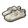
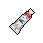

##  穿山甲．林

|體質|力量|敏捷|智力|幫派|
|:--:|:--:|:--:|:--:|:--:|
|6|5|6|4|無幫派|

### 故事

仿佛患有被迫害妄想症一般的穿山甲，毫無依據的懷疑你想要偷走他身上的鱗片。交談之後得知他因為某些關於鱗片的謠言差點在監獄里被割了尾巴，愚蠢和貪婪就像兩把利劍一般高高懸在他的頭頂上，讓他一刻也不敢放鬆警惕。

林是一名礦工，這是穿山甲最常從事的職業之一。他雖然年紀不大，但已在礦山生活了超過十年，無聊枯燥的挖礦工作早已讓他厭倦。他的夢想是成為一名動作影星，就像他的偶像穿山甲·唐一樣。可他也知道這個夢想需要很多錢來支撐，他那微薄的薪水可謂是杯水車薪。

林待的最後一座礦山是位於北方國境線上的雙峰嶺，山的南峰歸自由動物聯邦，而山的北峰則在阿茲卡托共和國境內。阿茲卡托共和國相對於動物聯邦較為貧窮，所以這座雙峰嶺在當年曾是偷渡頻發的地區，直到自由動物聯邦斥巨資在山脊修建了圍墻。

在某個再平常不過的休息日，林像往常一樣去往山下小鎮的酒吧消遣。酒保告訴他，包廂里有個家伙要請林喝上一杯，自覺不會被騙財騙色的林爽快的答應了。包廂里燈光昏暗，一只帶著墨鏡的眼鏡蛇向林說明了來意。他自稱是阿茲卡托商人，因為關稅提升導致生意虧損。他從某些渠道打聽到林缺一筆錢，所以想和林做筆交易。那就是幫他在礦山里挖一條秘密通道，讓他進行貨物走私。“嘶\~阿茲卡托需要廉價的食物和藥品，你這樣也算是在做好事喲。”眼鏡蛇輕聲勸說到。

“礦山中的隧道如同交錯的迷宮，如果不是礦工根本查不到出入口。”林在心中盤算，這活的風險并不高。再加上自己實在是想早日離開礦山，去到霓虹閃爍的大都市。於是幾天之後，他點頭接下了這件“好人好事”。

林的速度很快，不出一個月他就利用一條廢棄的礦道為基礎，打通了南峰與北峰。就和之前商量好的一樣，林在拿到錢之後，把“迷宮”的地圖交給了那條眼鏡蛇。

巨款的到帳讓林興奮不已，遙不可及的演員夢現在仿佛觸手可及。他向主管提交了辭呈，在一個月之後他就將永遠告別砂石和泥土了。在等待交班的期間，林常常會去那條隧道的附近張望。開始就如同眼鏡蛇說的那樣，會有一幫家伙把一箱箱的貨物從南峰運往北峰。但隨著時間的推移，林漸漸發現了變化：有時也會有另一幫家伙帶著特殊的“貨物”從北峰來到南峰。而那些“貨物”都是些年輕的女孩，她們有的手腳被困住，渾身都是傷…

林不是傻瓜，他明白這是什麼。那個混蛋說的走私貨物只是這條隧道的副業而已，他的主要生意其實是從阿茲卡托販賣女孩到動物聯邦，而這些女孩之後的命運也可想而知。林前去質問眼鏡蛇為何欺騙自己，但得到的回答只有嘲諷和威脅。

深知自己因為貪婪，成為了惡魔的幫兇，林自責的夜不能寐。每當盯著帳上的那筆錢，他眼前總會閃過女孩們無助的眼神。“我想成為像唐那樣的英雄，但結果卻…真該死！”林一邊搖頭一邊說道。無法忍受罪惡感折磨的他最終選擇了向警方自首，并供出了那條地獄通道。

警方很快封鎖了那條隧道，并且順藤摸瓜解救了一批被拐賣的女孩。可林也因為曾經的違法行為而付出了自由的代價，但起碼他現在能睡個好覺了（也許吧）。

### 結識對話

- **喂\~你在看什麼？是在打我的主意嗎？**
- 打你的主意…？
- :point_right:我想你誤會了…
- :point_right:你想太多了吧。
- **別再裝傻了，我說的是`鱗片`！你想趁機掰走幾片對吧？**
- :point_right:你有被迫害妄想症嗎？
- :point_right:別亂猜，我可沒興趣…
- **你覺得我有毛病？呵呵\~那是你不知道那些白癡做過什麼！**
- {question1}
- **不知道什麼時候開始，外面有傳言說`穿山甲`鱗片可以做藥…**
- **之後就總有家伙偷摸接近我，就為了掰走幾片拿去賣錢。**
- **有一次我在囚室睡覺，整條尾巴都差點被切下來！**
- :point_right:鱗片真的能治病嗎？
- :point_right:那幫家伙都瘋了嗎？ `好感+10`
- **鬼知道！有的說泡水能催奶，還有的說可以壯陽。**
- **真是可笑！我鱗片的構成就和他們的指甲一樣！**
- **這幫家伙真該在治療自己下半身之前，先治治腦子！**
- *果然，世上大多的悲劇都源於無知…*

### 深入了解對話

- **瘋了\~那幫混蛋徹底瘋了！**
- **{hate1}**
- 喂\~你這又是怎麼了？
- **我怎麼了？你該問問這個世界怎麼了！**
- **我聽說外面有傳言，我的鱗片已經從15塊一片漲價到50塊一片了！**
- **該死的，我現在做夢都能聽到磨刀的聲音！**
- **我必須得弄件武器防身才行！不然我就死定了…**

#### 我有一根`[釘棒]`。

> 他從你的手上接過釘棒，隨後和你說了他進來這里的原因。

- **對！這個可以！看著夠嚇人！**
- 你在這里的日子可真不好過…
- **哼\~雖然我進來是自己活該，但我也不想交代在這兒。**
- **我還有愿望沒實現呢…**
- *看來他不是個壞家伙…*
- 你的自首換來了女孩們的自由，也算是將功補過了。
- **可惜讓團伙的頭目跑了，就是那條該死的眼鏡蛇。**
- **他知道是我向警察告的密，所以我懷疑…**
- **現在關於穿山甲鱗片值大錢的謠言都是那個混蛋傳出來的。**
- **他的目的就是報復我…可惡！**
- **希望警察快點抓到那個混蛋，到時就輪到我說蛇膽值錢了！**

#### 取消

- 防身武器？你想要什麼？
- **最好是有威懾力的東西！讓那幫混蛋看了就害怕的狠角色！**
- **對…比如說一根`[釘棒]`！**

### 打招呼

#### 關係極好

- **怎麼？你聽說什麼消息了嗎？**

#### 關係好

- **聽著，威脅無處不在…**

#### 關係一般

- **靠這麼近，你想干嘛？**

#### 關係不好

- **干嘛？有話就快說。**

#### 關係極差

- **少跟我套近乎，我可不吃這套。**

## 聊天

- **你知道嗎？我在進來之前的夢想是做個電影明星，活在聚光燈下。**
- **呵呵\~現在我恨不得變成一個隱形人…最好誰都別看見我。**
- **哎\~想起小的時候，爺爺曾和我講過一個傳說，叫做隱身的紫葫蘆。**
- **哎\~要是真有那種寶貝就好了…**

### 初始物品

||||||
|:--:|:--:|:--:|:--:|:--:|
|  |  |  |  |  |
| [頭帶](道具.md#頭帶) | [護身符](道具.md#護身符) | [雙節棍](道具.md#雙節棍) | [酸奶](道具.md#酸奶) | [茶包](道具.md#茶包)*2 |
|  |  |  |  |  |
| [超辣泡麵](道具.md#超辣泡麵) | [釘子](道具.md#釘子)*4 | [硬幣](道具.md#硬幣) | [湯匙](道具.md#湯匙) |  |

### 送禮

|圖片|物品名稱|好感|回應|
|:--:|--|:--:|--|
||[運動鞋](道具.md#運動鞋)|12|但愿這鞋能讓我跑快點吧…|
||[皮鞋](道具.md#皮鞋)|0|但愿你送我禮物不是另有所圖。|
||[帆布鞋](道具.md#帆布鞋)|0|但愿你送我禮物不是另有所圖。|
||[拖鞋](道具.md#拖鞋)|0|但愿你送我禮物不是另有所圖。|
||[墨鏡](道具.md#墨鏡)|0|但愿你送我禮物不是另有所圖。|
||[眼鏡](道具.md#眼鏡)|0|但愿你送我禮物不是另有所圖。|
||[頭帶](道具.md#頭帶)|20|待在這種鬼地方，時刻都得全副武裝。|
||[棒球帽](道具.md#棒球帽)|0|但愿你送我禮物不是另有所圖。|
||[毛線帽](道具.md#毛線帽)|8|謝了…這里的冷風總是吹得我頭疼。|
||[紅頭巾](道具.md#紅頭巾)|8|打扮的像個幫派份子，也不知道是好是壞…|
||[綠頭巾](道具.md#綠頭巾)|8|打扮的像個幫派份子，也不知道是好是壞…|
||[橡膠手套](道具.md#橡膠手套)|0|但愿你送我禮物不是另有所圖。|
||[黑手](道具.md#黑手)|0|但愿你送我禮物不是另有所圖。|
||[手錶](道具.md#手錶)|0|但愿你送我禮物不是另有所圖。|
||[護身符](道具.md#護身符)|20|希望各路神仙都能保我渡劫吧…|
||[牙齒項鏈](道具.md#牙齒項鏈)|12|這玩意兒看起來還挺唬人的…|
||[《死靈之書》](道具.md#《死靈之書》)|-24|哦！這是什麼鬼東西…！我晚上肯定得做噩夢了！|
||[自制口罩](道具.md#自制口罩)|0|但愿你送我禮物不是另有所圖。|
||[隨身聽（開機）](道具.md#隨身聽（開機）)|0|但愿你送我禮物不是另有所圖。|
||[隨身聽（關機）](道具.md#隨身聽（關機）)|0|但愿你送我禮物不是另有所圖。|
||[隨身聽（沒電）](道具.md#隨身聽（沒電）)|0|但愿你送我禮物不是另有所圖。|
||[酒葫蘆](道具.md#酒葫蘆)|0|但愿你送我禮物不是另有所圖。|
||[黑桃A](道具.md#黑桃A)|0|但愿你送我禮物不是另有所圖。|
||[薄荷葉](道具.md#薄荷葉)|-4|你知道嗎？有一味藥就是拿這個和我的鱗片燉湯喝，真他媽可笑！|
||[薄荷葉卷](道具.md#薄荷葉卷)|0|但愿你送我禮物不是另有所圖。|
||[蘑菇](道具.md#蘑菇)|-4|你知道嗎？有一味藥就是拿這個和我的鱗片燉湯喝，真他媽可笑！|
||[蘑菇粉](道具.md#蘑菇粉)|0|但愿你送我禮物不是另有所圖。|
||[瀉藥](道具.md#瀉藥)|0|但愿你送我禮物不是另有所圖。|
||[紫鳶花](道具.md#紫鳶花)|-4|喂！在這里只有軟蛋才會喜歡花！|
||[花瓣粉](道具.md#花瓣粉)|0|但愿你送我禮物不是另有所圖。|
||[安眠藥](道具.md#安眠藥)|0|但愿你送我禮物不是另有所圖。|
||[止疼片](道具.md#止疼片)|0|但愿你送我禮物不是另有所圖。|
||[興奮劑](道具.md#興奮劑)|0|但愿你送我禮物不是另有所圖。|
||[醫用酒精](道具.md#醫用酒精)|0|但愿你送我禮物不是另有所圖。|
||[酒精燈](道具.md#酒精燈)|0|但愿你送我禮物不是另有所圖。|
||[鎮靜劑](道具.md#鎮靜劑)|0|但愿你送我禮物不是另有所圖。|
||[啤酒](道具.md#啤酒)|0|但愿你送我禮物不是另有所圖。|
||[蘋果酒](道具.md#蘋果酒)|0|但愿你送我禮物不是另有所圖。|
||[精釀蘋果酒](道具.md#精釀蘋果酒)|0|但愿你送我禮物不是另有所圖。|
||[蘋果](道具.md#蘋果)|-4|你覺得我的嘴能吃的了這個嗎？！|
||[華夫餅](道具.md#華夫餅)|-6|你覺得我的嘴能吃的了這個嗎？！|
||[奶油華夫餅](道具.md#奶油華夫餅)|-8|你覺得我的嘴能吃的了這個嗎？！|
||[一把咖啡豆](道具.md#一把咖啡豆)|-4|你覺得我的嘴能吃的了這個嗎？！|
||[口香糖](道具.md#口香糖)|-2|你覺得我的嘴能吃的了這個嗎？！|
||[曲奇餅乾](道具.md#曲奇餅乾)|-2|你覺得我的嘴能吃的了這個嗎？！|
||[焦糖棒](道具.md#焦糖棒)|-4|你覺得我的嘴能吃的了這個嗎？！|
||[汽水](道具.md#汽水)|4|它就像我一樣…憋了一肚子氣。|
||[酸奶](道具.md#酸奶)|4|謝了…這應該味道不錯。|
||[土豆披薩](道具.md#土豆披薩)|-8|你覺得我的嘴能吃的了這個嗎？！|
||[咖啡粉](道具.md#咖啡粉)|4|是得打起精神來了…畢竟危險無處不在。|
||[茶包](道具.md#茶包)|8|茶葉的味道總能讓我放鬆下來…|
||[超辣泡麵](道具.md#超辣泡麵)|12|呼\~這下可算能飽餐一頓了。|
||[蛋白粉](道具.md#蛋白粉)|6|我現在開始練肌肉是不是有點太遲了…|
||[布條](道具.md#布條)|-2|喂\~你能告訴我，我要它有什麼用嗎？|
||[迴紋針](道具.md#迴紋針)|0|但愿你送我禮物不是另有所圖。|
||[開鎖器](道具.md#開鎖器)|0|但愿你送我禮物不是另有所圖。|
||[開鎖器(P)](道具.md#開鎖器(P))|0|但愿你送我禮物不是另有所圖。|
||[肥皂](道具.md#肥皂)|-4|只要你不帶肥皂…就沒有丟肥皂的風險。|
||[香皂](道具.md#香皂)|-8|只要你不帶肥皂…就沒有丟肥皂的風險。|
||[計算機](道具.md#計算機)|0|但愿你送我禮物不是另有所圖。|
||[《花花世界》（全新）](道具.md#《花花世界》（全新）)|8|謝了\~我正愁沒東西消磨時間呢。|
||[《花花世界》（看過）](道具.md#《花花世界》（看過）)|6|謝了\~我正愁沒東西消磨時間呢。|
||[《花花世界》（翻爛）](道具.md#《花花世界》（翻爛）)|0|但愿你送我禮物不是另有所圖。|
||[馬女郎海報](道具.md#馬女郎海報)|0|但愿你送我禮物不是另有所圖。|
||[貓女郎海報](道具.md#貓女郎海報)|12|真想和她演上一段對手戲…|
||[狐女郎海報](道具.md#狐女郎海報)|12|真想和她演上一段對手戲…|
||[兔女郎海報](道具.md#兔女郎海報)|12|真想和她演上一段對手戲…|
||[咖啡磨](道具.md#咖啡磨)|0|但愿你送我禮物不是另有所圖。|
||[掌上遊戲機](道具.md#掌上遊戲機)|0|但愿你送我禮物不是另有所圖。|
||[掌上遊戲機（沒電）](道具.md#掌上遊戲機（沒電）)|0|但愿你送我禮物不是另有所圖。|
||[電池](道具.md#電池)|0|但愿你送我禮物不是另有所圖。|
||[牙刷](道具.md#牙刷)|-4|穿山甲是沒有牙齒的…這是常識。|
||[牙膏](道具.md#牙膏)|-4|穿山甲是沒有牙齒的…這是常識。|
||[空的牙膏管](道具.md#空的牙膏管)|-4|我可沒地方放這些垃圾！|
||[消毒液](道具.md#消毒液)|-2|喂\~你能告訴我，我要它有什麼用嗎？|
||[除銹劑](道具.md#除銹劑)|-2|喂\~你能告訴我，我要它有什麼用嗎？|
||[火柴](道具.md#火柴)|-2|喂\~你能告訴我，我要它有什麼用嗎？|
||[膠帶](道具.md#膠帶)|-2|喂\~你能告訴我，我要它有什麼用嗎？|
||[顏料](道具.md#顏料)|-2|喂\~你能告訴我，我要它有什麼用嗎？|
||[釘子](道具.md#釘子)|0|但愿你送我禮物不是另有所圖。|
||[鞋帶](道具.md#鞋帶)|-2|喂\~你能告訴我，我要它有什麼用嗎？|
||[白紙](道具.md#白紙)|-2|喂\~你能告訴我，我要它有什麼用嗎？|
||[紙鶴](道具.md#紙鶴)|-6|我可沒心情擺弄這些小玩具。|
||[花束](道具.md#花束)|-8|喂！在這里只有軟蛋才會喜歡花！|
||[胡亂的涂鴉](道具.md#胡亂的涂鴉)|-8|我可沒地方放這些垃圾！|
||[簡單的漫畫](道具.md#簡單的漫畫)|-6|我可沒興趣做什麼監獄收藏家。|
||[精美的畫作](道具.md#精美的畫作)|0|但愿你送我禮物不是另有所圖。|
||[鉛筆](道具.md#鉛筆)|0|但愿你送我禮物不是另有所圖。|
||[鉛筆](道具.md#鉛筆)|0|但愿你送我禮物不是另有所圖。|
||[圓珠筆](道具.md#圓珠筆)|0|但愿你送我禮物不是另有所圖。|
||[圓珠筆](道具.md#圓珠筆)|0|但愿你送我禮物不是另有所圖。|
||[硬幣](道具.md#硬幣)|4|經驗告訴我，多存點錢總沒壞處。|
||[長螺絲](道具.md#長螺絲)|0|但愿你送我禮物不是另有所圖。|
||[扳手](道具.md#扳手)|12|這玩意兒看起來還挺唬人的…|
||[湯匙](道具.md#湯匙)|0|但愿你送我禮物不是另有所圖。|
||[湯匙](道具.md#湯匙)|0|但愿你送我禮物不是另有所圖。|
||[釘錘](道具.md#釘錘)|12|這玩意兒看起來還挺唬人的…|
||[剪刀](道具.md#剪刀)|8|這玩意兒看起來還挺唬人的…|
||[碎玻璃](道具.md#碎玻璃)|0|但愿你送我禮物不是另有所圖。|
||[玻璃匕首](道具.md#玻璃匕首)|4|自制武器嗎？看上去勉強能拿來防身。|
||[玻璃匕首(+)](道具.md#玻璃匕首(+))|6|自制武器嗎？看上去勉強能拿來防身。|
||[牙刷匕首](道具.md#牙刷匕首)|4|自制武器嗎？看上去勉強能拿來防身。|
||[牙刷匕首(+)](道具.md#牙刷匕首(+))|6|自制武器嗎？看上去勉強能拿來防身。|
||[水果刀](道具.md#水果刀)|10|這玩意兒看起來還挺唬人的…|
||[折斷的木條](道具.md#折斷的木條)|0|但愿你送我禮物不是另有所圖。|
||[雙節棍](道具.md#雙節棍)|16|嘿！這不是唐在電影里用的武器嗎！|
||[雙節棍(+)](道具.md#雙節棍(+))|20|嘿！這不是唐在電影里用的武器嗎！|
||[釘棒](道具.md#釘棒)|6|自制武器嗎？看上去勉強能拿來防身。|
||[釘棒(+)](道具.md#釘棒(+))|8|自制武器嗎？看上去勉強能拿來防身。|
||[鐵管](道具.md#鐵管)|6|這玩意兒看起來還挺唬人的…|
||[皮帶](道具.md#皮帶)|0|但愿你送我禮物不是另有所圖。|
||[皮帶](道具.md#皮帶)|0|但愿你送我禮物不是另有所圖。|
||[發霉的麵包](道具.md#發霉的麵包)|-8|我可沒地方放這些垃圾！|
||[金龜子](道具.md#金龜子)|20|但愿這金色的小蟲能幫我驅災避難吧…|
||[《森之音》](道具.md#《森之音》)|16|希望各路神仙都能保我渡劫吧…|
||[DEMO限定紙鶴](道具.md#DEMO限定紙鶴)|50|我只想在這次的DEOM里保持低調…這都不行嗎？|

