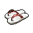
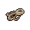
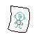

##  羊駝．迪亞哥

|體質|力量|敏捷|智力|幫派|初始金錢|
|:--:|:--:|:--:|:--:|:--:|:--:|
|7|6|8|4|大腳幫成員|120|

### 故事

嘴角整天掛著口水的羊駝，重度的藥物依賴讓他的大腦神志不清。大白天看見幻覺也是家常便飯，最常出現的“好朋友”是裸體的小精靈和龍蝦騎士團。入獄前做過廚師學徒，但只有在清醒時才能做到不把自己的蹄子放進湯鍋裡…

迪亞哥這家伙從小就是個倒霉蛋。他的爸爸是個沒什麼本事的醉鬼，所以他的媽媽在他還沒斷奶的時候，就拿著家裡的錢和別的男人跑了。在迪亞哥四歲的時候，他的爸爸不出意外的，在酒吧的蹲坑裡溺死了自己。到迪亞哥十四歲的時候，他已經在孤兒院待了整整十個年頭。因為年紀和飯量都太大了，於是他被趕出了孤兒院。臨走時園長給了他一封介紹信，讓他去一家名為“好日子“的餐廳做學徒，那兒的老板是園長的遠房親戚。

餐廳學徒的工作辛苦，而且薪水低的可憐，但是迪亞哥卻很喜歡這裡。因為他覺得，他該死的生活終於變得有些希望了。可悲劇的車輪仿佛有著慣性一般，將再次從他的身上無情的碾過。因為不明原因，“好日子“餐廳的廚房發生了嚴重火災，倒霉鬼迪亞哥的整個屁股都被烤熟了。嚴重的燒傷讓他痛苦不堪，可該死的老板卻以他是非法學徒為由，拒絕幫他墊付醫藥費。可憐的迪亞哥，只能靠著廉價的止疼藥，和頑強的生命力與傷痛做著抗爭。幾個月之後他挺了過來，但也患上了嚴重的藥物依賴。

他嘗試過戒掉藥物，但很快就放棄了。為了籌錢的他開始學著小偷小摸，不久後就加入了某個街頭幫派。因為藥物的原原因，他總是神志不清。所以即使在幫派混了多年，也只能干些最底層的工作。不過就算是最簡單的活，他也可能搞砸。像這次被關，就是因為他在一個夾帶違禁品的任務裡露了馬腳。但是具體細節是怎麼樣的，這家伙已經完全忘記了。

還有他嘴裡口口聲聲說的女友凱瑟琳，其實只是他眾多幻覺角色中的一個。像這樣的"朋友"，在他腦子裡至少還有十幾個…

### 結識對話

- 嗨…你好？
- **噓\~噓\~！安靜一點，你會嚇著它們的…**
- 嚇著誰…？這裡有別人嗎？
- **當然是這些小精靈呀\~你沒看到它們正在我的鼻尖跳舞嗎？**
- **還有這些龍蝦騎士，正在順著我的腿毛往上爬…**
- {think1}
- 我明白了，你看來是`嗑藥`嗑多產生幻覺了…
- **嗑藥？不，我是個魔法廚師，這些都是我的通靈術。**
- 那你一定是在你的“料理”裡面加了不少佐料對嗎？
- **沒錯\~沒錯，我放了些蘑菇根和止疼片，味道棒極了\~**
- *他的藥勁還沒過，先讓他待在自己的世界吧…*
- **哦\~小龍蝦爬呀爬，精靈小妞笑哈哈\~**
- **{smile1}**

### 深入了解對話

- **（自言自語）哦\~我的凱瑟琳…你為什麼離開我？**
- **{weep1}**
- *這家伙又怎麼了？*
- 喂\~你看起來不太好的樣子…
- **不是不太好，是很不好！我的凱瑟琳她\~離開我了\~**
- 凱瑟琳是誰…？
- **她是我的心肝，我的天使！**
- **但她卻突然不辭而別，我想我可能永遠失去她了\~**
- **{weep1}**
- *看樣子他是失戀了，可憐的家伙。*

#### 給他`《花花世界》`。

> 他一邊翻著手裡的《花花世界》，一邊打開了話匣子。

- 打起精神來，看看這個吧…
- 相信我，看了這些姑娘，你很快就會忘了你的凱瑟琳的。
- *我早該猜道是這樣…*
- 你這家伙得少嗑點藥了，這樣下去腦子遲早徹底壞掉。
- **做個傻瓜有什麼不好？不去思考，就沒有煩惱…**
- **還有…謝謝你的書，這些大腿\~超棒哦\~**
- **{smile1}**

#### 取消

- *我得找個東西幫他排解`單身的寂寞`，不然他會一直消沉下去的…*

### 打招呼

#### 關係極好

- **嘿\~想來點“魔法料理”嗎？**

#### 關係好

- **嗨\~我可清醒得很\~**

#### 關係一般

- **你在跟我說話嗎…？**

#### 關係不好

- **你在跟我說話嗎…？**

#### 關係極差

- **喂！你吵醒我的小精靈了！**

## 聊天

- **喂\~喂\~我說…你為什麼總是晃來晃去的。**
- **咱們難道是在船上嗎…？還是說整座監獄都飛起來了？**
- 依然…無法溝通。
- {sweat1}

### 初始物品

||||||
|:--:|:--:|:--:|:--:|:--:|
|  |  |  |  |  |
| [紅頭巾](道具.md#紅頭巾) | [橡膠手套](道具.md#橡膠手套) | [剪刀](道具.md#剪刀) | [蘑菇](道具.md#蘑菇)*4 | [止疼片](道具.md#止疼片) |
|  |  |  |  |  |
| [興奮劑](道具.md#興奮劑) | [華夫餅](道具.md#華夫餅) | [奶油華夫餅](道具.md#奶油華夫餅) | [消毒液](道具.md#消毒液)*3 |  |

### 送禮

|圖片|物品名稱|好感|回應|
|:--:|--|:--:|--|
||[運動鞋](道具.md#運動鞋)|12|嘿嘿\~又有好東西了…|
||[皮鞋](道具.md#皮鞋)|10|嘿嘿\~又有好東西了…|
||[帆布鞋](道具.md#帆布鞋)|8|嘿嘿\~又有好東西了…|
||[拖鞋](道具.md#拖鞋)|8|嘿嘿\~又有好東西了…|
||[墨鏡](道具.md#墨鏡)|10|嘿嘿\~又有好東西了…|
||[眼鏡](道具.md#眼鏡)|-100|書呆子才會用這個，我可不是呆子\~！|
||[頭帶](道具.md#頭帶)|10|嘿嘿\~又有好東西了…|
||[棒球帽](道具.md#棒球帽)|12|嘿嘿\~又有好東西了…|
||[毛線帽](道具.md#毛線帽)|8|嘿嘿\~又有好東西了…|
||[紅頭巾](道具.md#紅頭巾)|8|嘿嘿\~又有好東西了…|
||[綠頭巾](道具.md#綠頭巾)|8|嘿嘿\~又有好東西了…|
||[橡膠手套](道具.md#橡膠手套)|9|嘟嘟嘟\~我會用得著這個的\~|
||[黑手](道具.md#黑手)|8|嘿嘿\~又有好東西了…|
||[手錶](道具.md#手錶)|-12|這東西太現實了\~我討厭現實\~|
||[護身符](道具.md#護身符)|-100|噓\~！你有沒有聽見放屁的聲音\~哈？|
||[牙齒項鏈](道具.md#牙齒項鏈)|12|嘿嘿\~又有好東西了…|
||[《死靈之書》](道具.md#《死靈之書》)|-120|我討厭書，書的臭味讓我無法呼吸！|
||[自製口罩](道具.md#自製口罩)|8|嘿嘿\~又有好東西了…|
||[隨身聽（開機）](道具.md#隨身聽（開機）)|12|嘿嘿\~又有好東西了…|
||[隨身聽（關機）](道具.md#隨身聽（關機）)|12|嘿嘿\~又有好東西了…|
||[隨身聽（沒電）](道具.md#隨身聽（沒電）)|12|嘿嘿\~又有好東西了…|
||[酒葫蘆](道具.md#酒葫蘆)|15|嘿\~我有了一個新尿壺！|
||[黑桃A](道具.md#黑桃A)|4|嘿嘿\~又有好東西了…|
||[薄荷葉](道具.md#薄荷葉)|6|我只是一只愛吃草的羊駝而已…哈！|
||[薄荷葉卷](道具.md#薄荷葉卷)|9|我只是一只愛吃草的羊駝而已…哈！|
||[蘑菇](道具.md#蘑菇)|8|嘿嘿\~我的“朋友們”又在叫要我了…|
||[蘑菇粉](道具.md#蘑菇粉)|6|噓噓噓\~！可別讓別的家伙看見了。|
||[瀉藥](道具.md#瀉藥)|6|嘿嘿\~又有好東西了…|
||[紫鳶花](道具.md#紫鳶花)|4|嘿嘿\~又有好東西了…|
||[花瓣粉](道具.md#花瓣粉)|4|嘿嘿\~又有好東西了…|
||[安眠藥](道具.md#安眠藥)|4|嘿嘿\~又有好東西了…|
||[止疼片](道具.md#止疼片)|8|嘿嘿\~我的“朋友們”又在叫要我了…|
||[興奮劑](道具.md#興奮劑)|12|嘿嘿\~我的“朋友們”又在叫要我了…|
||[醫用酒精](道具.md#醫用酒精)|6|嘟嘟嘟\~我會用得著這個的\~|
||[酒精燈](道具.md#酒精燈)|12|嘟嘟嘟\~我會用得著這個的\~|
||[鎮靜劑](道具.md#鎮靜劑)|6|嘿嘿\~又有好東西了…|
||[啤酒](道具.md#啤酒)|9|嘿\~看來我得準備點下酒菜了。|
||[蘋果酒](道具.md#蘋果酒)|9|嘿\~看來我得準備點下酒菜了。|
||[精釀蘋果酒](道具.md#精釀蘋果酒)|12|嘿\~看來我得準備點下酒菜了。|
||[蘋果](道具.md#蘋果)|4|嘿嘿\~又有好東西了…|
||[華夫餅](道具.md#華夫餅)|6|嘿嘿\~又有好東西了…|
||[奶油華夫餅](道具.md#奶油華夫餅)|8|嘿嘿\~又有好東西了…|
||[一把咖啡豆](道具.md#一把咖啡豆)|-4|我可不想24小時都瞪大眼\~|
||[口香糖](道具.md#口香糖)|2|嘿嘿\~又有好東西了…|
||[曲奇餅乾](道具.md#曲奇餅乾)|2|嘿嘿\~又有好東西了…|
||[焦糖棒](道具.md#焦糖棒)|4|嘿嘿\~又有好東西了…|
||[汽水](道具.md#汽水)|4|嘿嘿\~又有好東西了…|
||[酸奶](道具.md#酸奶)|4|嘿嘿\~又有好東西了…|
||[土豆披薩](道具.md#土豆披薩)|8|嘿嘿\~又有好東西了…|
||[咖啡粉](道具.md#咖啡粉)|-4|我可不想24小時都瞪大眼\~|
||[茶包](道具.md#茶包)|-40|嘔\~我討厭茶葉的味道…|
||[超辣泡麵](道具.md#超辣泡麵)|6|嘿嘿\~又有好東西了…|
||[蛋白粉](道具.md#蛋白粉)|6|嘿嘿\~又有好東西了…|
||[布條](道具.md#布條)|-2|喂\~你就不能給我點有用的東西嗎？|
||[迴紋針](道具.md#迴紋針)|2|嘿嘿\~又有好東西了…|
||[開鎖器](道具.md#開鎖器)|6|嘟嘟嘟\~我會用得著這個的\~|
||[開鎖器(P)](道具.md#開鎖器(P))|6|嘟嘟嘟\~我會用得著這個的\~|
||[肥皂](道具.md#肥皂)|4|嘿嘿\~又有好東西了…|
||[香皂](道具.md#香皂)|8|嘿嘿\~又有好東西了…|
||[計算機](道具.md#計算機)|-80|我討厭它發出的\~嘀嘀嘀\~的聲音\~嘀嘀嘀！|
||[《花花世界》（全新）](道具.md#《花花世界》（全新）)|16|嘿嘿嘿\~你瞧瞧這些大腿…|
||[《花花世界》（看過）](道具.md#《花花世界》（看過）)|9|嘿\~好東西就該分享，你說對嗎\~伙計？|
||[《花花世界》（翻爛）](道具.md#《花花世界》（翻爛）)|4|嘿嘿\~又有好東西了…|
||[馬女郎海報](道具.md#馬女郎海報)|18|我喜歡這姑娘\~我猜她也會喜歡我的\~|
||[貓女郎海報](道具.md#貓女郎海報)|18|我喜歡這姑娘\~我猜她也會喜歡我的\~|
||[狐女郎海報](道具.md#狐女郎海報)|18|我喜歡這姑娘\~我猜她也會喜歡我的\~|
||[兔女郎海報](道具.md#兔女郎海報)|18|我喜歡這姑娘\~我猜她也會喜歡我的\~|
||[咖啡磨](道具.md#咖啡磨)|8|嘿嘿\~又有好東西了…|
||[掌上遊戲機](道具.md#掌上遊戲機)|12|嘿嘿\~又有好東西了…|
||[掌上遊戲機（沒電）](道具.md#掌上遊戲機（沒電）)|12|嘿嘿\~又有好東西了…|
||[電池](道具.md#電池)|2|嘿嘿\~又有好東西了…|
||[牙刷](道具.md#牙刷)|4|嘿嘿\~又有好東西了…|
||[牙膏](道具.md#牙膏)|4|嘿嘿\~又有好東西了…|
||[空的牙膏管](道具.md#空的牙膏管)|-20|你當我是傻子嗎？不\~你才是傻子！|
||[消毒液](道具.md#消毒液)|2|嘿嘿\~又有好東西了…|
||[除銹劑](道具.md#除銹劑)|-2|喂\~你就不能給我點有用的東西嗎？|
||[火柴](道具.md#火柴)|2|嘿嘿\~又有好東西了…|
||[膠帶](道具.md#膠帶)|-2|喂\~你就不能給我點有用的東西嗎？|
||[顏料](道具.md#顏料)|-2|喂\~你就不能給我點有用的東西嗎？|
||[釘子](道具.md#釘子)|-2|喂\~你就不能給我點有用的東西嗎？|
||[鞋帶](道具.md#鞋帶)|-2|喂\~你就不能給我點有用的東西嗎？|
||[白紙](道具.md#白紙)|-2|喂\~你就不能給我點有用的東西嗎？|
||[紙鶴](道具.md#紙鶴)|6|嘿嘿\~又有好東西了…|
||[花束](道具.md#花束)|-8|喂\~你就不能給我點有用的東西嗎？|
||[胡亂的塗鴉](道具.md#胡亂的塗鴉)|6|我見過！我在夢裡見過這個！|
||[簡單的漫畫](道具.md#簡單的漫畫)|6|嘿嘿\~又有好東西了…|
||[精美的畫作](道具.md#精美的畫作)|-8|循規蹈矩…這簡直太無聊了。|
||[鉛筆](道具.md#鉛筆)|4|要玩筆尖轉到誰，誰就是蠢蛋的遊戲嗎？|
||[鉛筆](道具.md#鉛筆)|4|要玩筆尖轉到誰，誰就是蠢蛋的遊戲嗎？|
||[圓珠筆](道具.md#圓珠筆)|8|要玩筆尖轉到誰，誰就是蠢蛋的遊戲嗎？|
||[圓珠筆](道具.md#圓珠筆)|8|要玩筆尖轉到誰，誰就是蠢蛋的遊戲嗎？|
||[硬幣](道具.md#硬幣)|4|嘿嘿\~又有好東西了…|
||[長螺絲](道具.md#長螺絲)|6|嘿嘿\~又有好東西了…|
||[扳手](道具.md#扳手)|12|嘿嘿\~又有好東西了…|
||[湯匙](道具.md#湯匙)|4|嘿嘿\~又有好東西了…|
||[湯匙](道具.md#湯匙)|4|嘿嘿\~又有好東西了…|
||[釘錘](道具.md#釘錘)|12|嘿嘿\~又有好東西了…|
||[剪刀](道具.md#剪刀)|8|嘿嘿\~又有好東西了…|
||[碎玻璃](道具.md#碎玻璃)|2|嘿嘿\~又有好東西了…|
||[玻璃匕首](道具.md#玻璃匕首)|4|嘿嘿\~又有好東西了…|
||[玻璃匕首(+)](道具.md#玻璃匕首(+))|6|嘿嘿\~又有好東西了…|
||[牙刷匕首](道具.md#牙刷匕首)|4|嘿嘿\~又有好東西了…|
||[牙刷匕首(+)](道具.md#牙刷匕首(+))|6|嘿嘿\~又有好東西了…|
||[水果刀](道具.md#水果刀)|10|嘿嘿\~又有好東西了…|
||[折斷的木條](道具.md#折斷的木條)|2|嘿嘿\~又有好東西了…|
||[雙節棍](道具.md#雙節棍)|8|嘿嘿\~又有好東西了…|
||[雙節棍(+)](道具.md#雙節棍(+))|10|嘿嘿\~又有好東西了…|
||[釘棒](道具.md#釘棒)|6|嘿嘿\~又有好東西了…|
||[釘棒(+)](道具.md#釘棒(+))|8|嘿嘿\~又有好東西了…|
||[鐵管](道具.md#鐵管)|6|嘿嘿\~又有好東西了…|
||[皮帶](道具.md#皮帶)|8|嘿嘿\~又有好東西了…|
||[皮帶](道具.md#皮帶)|8|嘿嘿\~又有好東西了…|
||[發霉的麵包](道具.md#發霉的麵包)|-40|這東西讓我覺得…惡心\~呸！|
||[金龜子](道具.md#金龜子)|20|哈\~金色傳說！|
||[《森之音》](道具.md#《森之音》)|-80|我討厭書，書的臭味讓我無法呼吸！|
||[DEMO限定紙鶴](道具.md#DEMO限定紙鶴)|50|D-E-M-O！啊哈！我明白你的意思了！|

