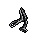

#  羊駝．迪亞哥

|體質|力量|敏捷|智力|幫派|戰鬥等級|勒索難度|持有天賦|取得天賦|
|:--:|:--:|:--:|:--:|:--:|:--:|:--:|:--:|:--:|
|7|6|8|4|大腳幫成員|中|中|[扒手](技能.md#扒手)|[順手牽羊](技能.md#順手牽羊)|

## 故事

嘴角整天掛著口水的羊駝，重度的藥物依賴讓他的大腦神志不清。大白天看見幻覺也是家常便飯，最常出現的“好朋友”是裸體的小精靈和龍蝦騎士團。入獄前做過廚師學徒，但只有在清醒時才能做到不把自己的蹄子放進湯鍋裡…

迪亞哥這家伙從小就是個倒霉蛋。他的爸爸是個沒什麼本事的醉鬼，所以他的媽媽在他還沒斷奶的時候，就拿著家裡的錢和別的男人跑了。在迪亞哥四歲的時候，他的爸爸不出意外的，在酒吧的蹲坑裡溺死了自己。到迪亞哥十四歲的時候，他已經在孤兒院待了整整十個年頭。因為年紀和飯量都太大了，於是他被趕出了孤兒院。臨走時園長給了他一封介紹信，讓他去一家名為“好日子“的餐廳做學徒，那兒的老板是園長的遠房親戚。

餐廳學徒的工作辛苦，而且薪水低的可憐，但是迪亞哥卻很喜歡這裡。因為他覺得，他該死的生活終於變得有些希望了。可悲劇的車輪仿佛有著慣性一般，將再次從他的身上無情的碾過。因為不明原因，“好日子“餐廳的廚房發生了嚴重火災，倒霉鬼迪亞哥的整個屁股都被烤熟了。嚴重的燒傷讓他痛苦不堪，可該死的老板卻以他是非法學徒為由，拒絕幫他墊付醫藥費。可憐的迪亞哥，只能靠著廉價的止疼藥，和頑強的生命力與傷痛做著抗爭。幾個月之後他挺了過來，但也患上了嚴重的藥物依賴。

他嘗試過戒掉藥物，但很快就放棄了。為了籌錢的他開始學著小偷小摸，不久後就加入了某個街頭幫派。因為藥物的原原因，他總是神志不清。所以即使在幫派混了多年，也只能干些最底層的工作。不過就算是最簡單的活，他也可能搞砸。像這次被關，就是因為他在一個夾帶違禁品的任務裡露了馬腳。但是具體細節是怎麼樣的，這家伙已經完全忘記了。

還有他嘴裡口口聲聲說的女友凱瑟琳，其實只是他眾多幻覺角色中的一個。像這樣的"朋友"，在他腦子裡至少還有十幾個…

## 結識對話

- 嗨…你好？
- **噓\~噓\~！安靜一點，你會嚇著它們的…**
- 嚇著誰…？這裡有別人嗎？
- **當然是這些小精靈呀\~你沒看到它們正在我的鼻尖跳舞嗎？**
- **還有這些龍蝦騎士，正在順著我的腿毛往上爬…**
- {think1}
- 我明白了，你看來是`嗑藥`嗑多產生幻覺了…
- **嗑藥？不，我是個魔法廚師，這些都是我的通靈術。**
- 那你一定是在你的“料理”裡面加了不少佐料對嗎？
- **沒錯\~沒錯，我放了些蘑菇根和止疼片，味道棒極了\~**
- *他的藥勁還沒過，先讓他待在自己的世界吧…*
- **哦\~小龍蝦爬呀爬，精靈小妞笑哈哈\~**
- **{smile1}**

## 深入了解對話

- **（自言自語）哦\~我的凱瑟琳…你為什麼離開我？**
- **{weep1}**
- *這家伙又怎麼了？*
- 喂\~你看起來不太好的樣子…
- **不是不太好，是很不好！我的凱瑟琳她\~離開我了\~**
- 凱瑟琳是誰…？
- **她是我的心肝，我的天使！**
- **但她卻突然不辭而別，我想我可能永遠失去她了\~**
- **{weep1}**
- *看樣子他是失戀了，可憐的家伙。*

#### 給他`《花花世界》`。

> 他一邊翻著手裡的《花花世界》，一邊打開了話匣子。

- 打起精神來，看看這個吧…
- 相信我，看了這些姑娘，你很快就會忘了你的凱瑟琳的。
- *我早該猜道是這樣…*
- 你這家伙得少嗑點藥了，這樣下去腦子遲早徹底壞掉。
- **做個傻瓜有什麼不好？不去思考，就沒有煩惱…**
- **還有…謝謝你的書，這些大腿\~超棒哦\~**
- **{smile1}**

#### 取消

- *我得找個東西幫他排解`單身的寂寞`，不然他會一直消沉下去的…*

## 特殊對話

### 打招呼（關係極好）

- **嘿\~想來點“魔法料理”嗎？**

### 打招呼（關係好）

- **嗨\~我可清醒得很\~**

### 打招呼（關係一般）

- **你在跟我說話嗎…？**

### 打招呼（關係差）

- **你在跟我說話嗎…？**

### 打招呼（關係極差）

- **喂！你吵醒我的小精靈了！**

### 進行毆打

- **我會把你揍成白癡的！你這個白癡！**
- **呸\~等著被我揍到哭鼻子吧！**
- **你很快就會後悔的！很快！我保證！**

### 回禮

- **現在…我的“伙伴們”讓我也送你個禮物。**

### 勒索成功

- **你是在勒索我嗎？呸\~真該死，我剛剛才意識到…**
- **{upset1}**

### 勒索失敗

- **呸\~！想勒索我？你怕是找錯對象了！**
- **{upset1}**

### 一起吃飯被拒

- **走開\~走開\~別礙著我吃飯。**

### 分享食物

- **{smile1}**
- **嘿\~那還等什麼呢，伙計？**

### 加藥被發現

- **喂！你手裡拿的什麼？**

### 加藥辯解失敗

- **調料？你當我是傻瓜嗎？**

## 聊天

- **喂\~喂\~我說…你為什麼總是晃來晃去的。**
- **咱們難道是在船上嗎…？還是說整座監獄都飛起來了？**
- 依然…無法溝通。
- {sweat1}

## 初始物品

||||||
|:--:|:--:|:--:|:--:|:--:|
||||||
|[紅頭巾](23-紅頭巾.md)|[橡膠手套](25-橡膠手套.md)|[剪刀](152-剪刀.md)|[蘑菇](42-蘑菇.md)*4|[止疼片](49-止疼片.md)|
||||||
|[興奮劑](50-興奮劑.md)|[華夫餅](67-華夫餅.md)|[奶油華夫餅](68-奶油華夫餅.md)|[消毒液](118-消毒液.md)*3||

## 送禮

|圖片|物品名稱|好感|回應|
|:--:|--|:--:|--|
||[DEMO限定紙鶴](209-DEMO限定紙鶴.md)|50|D-E-M-O！啊哈！我明白你的意思了！|
||[金龜子](202-金龜子.md)|20|哈\~金色傳說！|
||[馬女郎海報](105-馬女郎海報.md)|18|我喜歡這姑娘\~我猜她也會喜歡我的\~|
||[貓女郎海報](106-貓女郎海報.md)|18|我喜歡這姑娘\~我猜她也會喜歡我的\~|
||[狐女郎海報](107-狐女郎海報.md)|18|我喜歡這姑娘\~我猜她也會喜歡我的\~|
||[兔女郎海報](108-兔女郎海報.md)|18|我喜歡這姑娘\~我猜她也會喜歡我的\~|
||[《花花世界》（全新）](102-《花花世界》（全新）.md)|16|嘿嘿嘿\~你瞧瞧這些大腿…|
||[酒葫蘆](37-酒葫蘆.md)|15|嘿\~我有了一個新尿壺！|
||[運動鞋](14-運動鞋.md)|12|嘿嘿\~又有好東西了…|
||[棒球帽](21-棒球帽.md)|12|嘿嘿\~又有好東西了…|
||[牙齒項鏈](30-牙齒項鏈.md)|12|嘿嘿\~又有好東西了…|
||[隨身聽（開機）](34-隨身聽（開機）.md)|12|嘿嘿\~又有好東西了…|
||[隨身聽（關機）](35-隨身聽（關機）.md)|12|嘿嘿\~又有好東西了…|
||[隨身聽（沒電）](36-隨身聽（沒電）.md)|12|嘿嘿\~又有好東西了…|
||[興奮劑](50-興奮劑.md)|12|嘿嘿\~我的“朋友們”又在叫要我了…|
||[酒精燈](52-酒精燈.md)|12|嘟嘟嘟\~我會用得著這個的\~|
||[精釀蘋果酒](56-精釀蘋果酒.md)|12|嘿\~看來我得準備點下酒菜了。|
||[掌上遊戲機](110-掌上遊戲機.md)|12|嘿嘿\~又有好東西了…|
||[掌上遊戲機（沒電）](111-掌上遊戲機（沒電）.md)|12|嘿嘿\~又有好東西了…|
||[扳手](142-扳手.md)|12|嘿嘿\~又有好東西了…|
||[釘錘](151-釘錘.md)|12|嘿嘿\~又有好東西了…|
||[皮鞋](15-皮鞋.md)|10|嘿嘿\~又有好東西了…|
||[墨鏡](18-墨鏡.md)|10|嘿嘿\~又有好東西了…|
||[頭帶](20-頭帶.md)|10|嘿嘿\~又有好東西了…|
||[水果刀](158-水果刀.md)|10|嘿嘿\~又有好東西了…|
||[雙節棍(+)](161-雙節棍(+).md)|10|嘿嘿\~又有好東西了…|
||[橡膠手套](25-橡膠手套.md)|9|嘟嘟嘟\~我會用得著這個的\~|
||[薄荷葉卷](41-薄荷葉卷.md)|9|我只是一只愛吃草的羊駝而已…哈！|
||[啤酒](54-啤酒.md)|9|嘿\~看來我得準備點下酒菜了。|
||[蘋果酒](55-蘋果酒.md)|9|嘿\~看來我得準備點下酒菜了。|
||[《花花世界》（看過）](103-《花花世界》（看過）.md)|9|嘿\~好東西就該分享，你說對嗎\~伙計？|
||[帆布鞋](16-帆布鞋.md)|8|嘿嘿\~又有好東西了…|
||[拖鞋](17-拖鞋.md)|8|嘿嘿\~又有好東西了…|
||[毛線帽](22-毛線帽.md)|8|嘿嘿\~又有好東西了…|
||[紅頭巾](23-紅頭巾.md)|8|嘿嘿\~又有好東西了…|
||[綠頭巾](24-綠頭巾.md)|8|嘿嘿\~又有好東西了…|
||[黑手](26-黑手.md)|8|嘿嘿\~又有好東西了…|
||[自製口罩](32-自製口罩.md)|8|嘿嘿\~又有好東西了…|
||[蘑菇](42-蘑菇.md)|8|嘿嘿\~我的“朋友們”又在叫要我了…|
||[止疼片](49-止疼片.md)|8|嘿嘿\~我的“朋友們”又在叫要我了…|
||[奶油華夫餅](68-奶油華夫餅.md)|8|嘿嘿\~又有好東西了…|
||[土豆披薩](75-土豆披薩.md)|8|嘿嘿\~又有好東西了…|
||[香皂](89-香皂.md)|8|嘿嘿\~又有好東西了…|
||[咖啡磨](109-咖啡磨.md)|8|嘿嘿\~又有好東西了…|
||[圓珠筆](133-圓珠筆.md)|8|要玩筆尖轉到誰，誰就是蠢蛋的遊戲嗎？|
||[圓珠筆](134-圓珠筆.md)|8|要玩筆尖轉到誰，誰就是蠢蛋的遊戲嗎？|
||[剪刀](152-剪刀.md)|8|嘿嘿\~又有好東西了…|
||[雙節棍](160-雙節棍.md)|8|嘿嘿\~又有好東西了…|
||[釘棒(+)](163-釘棒(+).md)|8|嘿嘿\~又有好東西了…|
||[皮帶](166-皮帶.md)|8|嘿嘿\~又有好東西了…|
||[皮帶](167-皮帶.md)|8|嘿嘿\~又有好東西了…|
||[薄荷葉](40-薄荷葉.md)|6|我只是一只愛吃草的羊駝而已…哈！|
||[蘑菇粉](43-蘑菇粉.md)|6|噓噓噓\~！可別讓別的家伙看見了。|
||[瀉藥](44-瀉藥.md)|6|嘿嘿\~又有好東西了…|
||[醫用酒精](51-醫用酒精.md)|6|嘟嘟嘟\~我會用得著這個的\~|
||[鎮靜劑](53-鎮靜劑.md)|6|嘿嘿\~又有好東西了…|
||[華夫餅](67-華夫餅.md)|6|嘿嘿\~又有好東西了…|
||[超辣泡麵](78-超辣泡麵.md)|6|嘿嘿\~又有好東西了…|
||[蛋白粉](79-蛋白粉.md)|6|嘿嘿\~又有好東西了…|
||[開鎖器](87-開鎖器.md)|6|嘟嘟嘟\~我會用得著這個的\~|
||[開鎖器(P)](38-開鎖器(P).md)|6|嘟嘟嘟\~我會用得著這個的\~|
||[紙鶴](126-紙鶴.md)|6|嘿嘿\~又有好東西了…|
||[胡亂的塗鴉](128-胡亂的塗鴉.md)|6|我見過！我在夢裡見過這個！|
||[簡單的漫畫](129-簡單的漫畫.md)|6|嘿嘿\~又有好東西了…|
||[長螺絲](136-長螺絲.md)|6|嘿嘿\~又有好東西了…|
||[玻璃匕首(+)](155-玻璃匕首(+).md)|6|嘿嘿\~又有好東西了…|
||[牙刷匕首(+)](157-牙刷匕首(+).md)|6|嘿嘿\~又有好東西了…|
||[釘棒](162-釘棒.md)|6|嘿嘿\~又有好東西了…|
||[鐵管](164-鐵管.md)|6|嘿嘿\~又有好東西了…|
||[黑桃A](39-黑桃A.md)|4|嘿嘿\~又有好東西了…|
||[紫鳶花](45-紫鳶花.md)|4|嘿嘿\~又有好東西了…|
||[花瓣粉](46-花瓣粉.md)|4|嘿嘿\~又有好東西了…|
||[安眠藥](47-安眠藥.md)|4|嘿嘿\~又有好東西了…|
||[蘋果](64-蘋果.md)|4|嘿嘿\~又有好東西了…|
||[焦糖棒](72-焦糖棒.md)|4|嘿嘿\~又有好東西了…|
||[汽水](73-汽水.md)|4|嘿嘿\~又有好東西了…|
||[酸奶](74-酸奶.md)|4|嘿嘿\~又有好東西了…|
||[肥皂](88-肥皂.md)|4|嘿嘿\~又有好東西了…|
||[《花花世界》（翻爛）](104-《花花世界》（翻爛）.md)|4|嘿嘿\~又有好東西了…|
||[牙刷](115-牙刷.md)|4|嘿嘿\~又有好東西了…|
||[牙膏](116-牙膏.md)|4|嘿嘿\~又有好東西了…|
||[鉛筆](131-鉛筆.md)|4|要玩筆尖轉到誰，誰就是蠢蛋的遊戲嗎？|
||[鉛筆](132-鉛筆.md)|4|要玩筆尖轉到誰，誰就是蠢蛋的遊戲嗎？|
||[硬幣](135-硬幣.md)|4|嘿嘿\~又有好東西了…|
||[湯匙](143-湯匙.md)|4|嘿嘿\~又有好東西了…|
||[湯匙](144-湯匙.md)|4|嘿嘿\~又有好東西了…|
||[玻璃匕首](154-玻璃匕首.md)|4|嘿嘿\~又有好東西了…|
||[牙刷匕首](156-牙刷匕首.md)|4|嘿嘿\~又有好東西了…|
||[口香糖](70-口香糖.md)|2|嘿嘿\~又有好東西了…|
||[曲奇餅乾](71-曲奇餅乾.md)|2|嘿嘿\~又有好東西了…|
||[迴紋針](86-迴紋針.md)|2|嘿嘿\~又有好東西了…|
||[電池](114-電池.md)|2|嘿嘿\~又有好東西了…|
||[消毒液](118-消毒液.md)|2|嘿嘿\~又有好東西了…|
||[火柴](120-火柴.md)|2|嘿嘿\~又有好東西了…|
||[碎玻璃](153-碎玻璃.md)|2|嘿嘿\~又有好東西了…|
||[折斷的木條](159-折斷的木條.md)|2|嘿嘿\~又有好東西了…|
||[布條](84-布條.md)|-2|喂\~你就不能給我點有用的東西嗎？|
||[除銹劑](119-除銹劑.md)|-2|喂\~你就不能給我點有用的東西嗎？|
||[膠帶](121-膠帶.md)|-2|喂\~你就不能給我點有用的東西嗎？|
||[顏料](122-顏料.md)|-2|喂\~你就不能給我點有用的東西嗎？|
||[釘子](123-釘子.md)|-2|喂\~你就不能給我點有用的東西嗎？|
||[鞋帶](124-鞋帶.md)|-2|喂\~你就不能給我點有用的東西嗎？|
||[白紙](125-白紙.md)|-2|喂\~你就不能給我點有用的東西嗎？|
||[一把咖啡豆](69-一把咖啡豆.md)|-4|我可不想24小時都瞪大眼\~|
||[咖啡粉](76-咖啡粉.md)|-4|我可不想24小時都瞪大眼\~|
||[花束](127-花束.md)|-8|喂\~你就不能給我點有用的東西嗎？|
||[精美的畫作](130-精美的畫作.md)|-8|循規蹈矩…這簡直太無聊了。|
||[手錶](27-手錶.md)|-12|這東西太現實了\~我討厭現實\~|
||[空的牙膏管](117-空的牙膏管.md)|-20|你當我是傻子嗎？不\~你才是傻子！|
||[茶包](77-茶包.md)|-40|嘔\~我討厭茶葉的味道…|
||[發霉的麵包](200-發霉的麵包.md)|-40|這東西讓我覺得…噁心\~呸！|
||[計算機](101-計算機.md)|-80|我討厭它發出的\~嘀嘀嘀\~的聲音\~嘀嘀嘀！|
||[《森之音》](203-《森之音》.md)|-80|我討厭書，書的臭味讓我無法呼吸！|
||[眼鏡](19-眼鏡.md)|-100|書呆子才會用這個，我可不是呆子\~！|
||[護身符](29-護身符.md)|-100|噓\~！你有沒有聽見放屁的聲音\~哈？|
||[《死靈之書》](31-《死靈之書》.md)|-120|我討厭書，書的臭味讓我無法呼吸！|

