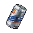
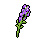

#  老虎．約翰

|體質|力量|敏捷|智力|幫派|戰鬥等級|勒索難度|持有天賦|取得天賦|
|:--:|:--:|:--:|:--:|:--:|:--:|:--:|:--:|:--:|
|10|10|10|8|無幫派|強|難|[鬥士](技能.md#鬥士)、[歹徒](技能.md#歹徒)、[製作能手](技能.md#製作能手)|[獨行俠](技能.md#獨行俠)|

## 故事

獨來獨往，沉默寡言，散發著讓人無法靠近的巨大壓迫感。據說實際戰鬥力更為可怕，以至於三大幫派都不敢惹他分毫。唯一的愛好是在放風的時候獨自抽煙。像這樣的“強者”一定有著某些不為人知的過去。

約翰是一名孤兒，從小在戰亂不斷的邊陲小國長大。青年時期就和其他的小伙子一樣，為了生計加入了軍隊。在戰火的洗禮之下，他變得強壯、專業、冷血無情。雖然他在戰場上未遇敵手，但總統軍的腐敗還是讓他們輸掉了戰爭。後來他化名“煙蒂”，輾轉去到很多國家，成了一個職業傭兵。他賺了很多錢，也殺了很多無辜的人，槍林彈雨早已把他的心變成了一塊堅冰。直到有一天他遇到了“鹿子”…

在執行一次平常的刺殺任務時，作為目標的軍閥和他手下的十幾個保鏢全都成了約翰的槍下亡魂，可正當他向雇主匯報任務時，衣櫃裡卻傳來了哭聲。約翰打開衣櫃，發現了還在襁褓裡的小梅花鹿，她或許是軍閥的女兒。知道這個消息的雇主立刻命令約翰斬草除根，並承諾給予雙倍的報酬。可一向鐵石心腸的他卻在此刻猶豫了，他看著眼前這個因他變為孤兒的孩子，仿佛看到了自己悲慘的童年。他違背了命令，帶著鹿子逃到了這個國家，從此隱姓埋名。

可是對於約翰這樣的“惡人”來說，安寧永遠是最遙不可及的奢望。在逃亡了的三年後，鹿子被查出患有罕見的血液病，如不進行治療便會危及生命。正當約翰絕望之際，政府特工找到了他。他們想和約翰達成一筆交易，用一個幾乎是自殺般難度的“髒活”，來換取鹿子的長期治療。

這個“髒活”讓約翰中了五槍，但是他還是活了下來。之後只要他能老實的待在監獄服刑，特工部門就會履行之前對他的承諾。

鹿子今年九歲了，收養她的家庭十分愛她，那個血病也已經三年沒有復發了。政府每年都會給約翰寄來幾張鹿子的照片。對他來說，這就夠了…

## 結識對話

- *他是頭`老虎`嗎？我的腿有點發軟了…*
- （吞咽口水）嗨\~你好…
- **……**
- 我剛來這裡沒多久…
- **……**
- …你在聽我說嗎？
- **在聽\~**
- 哦\~好的，我看你自己待著，好像沒什麼朋友…
- 所以，我就想來打個招呼…
- **說完了嗎？**
- 說…說完了…
- **說完就走開。**
- {sweat1}
- *他真是比看起來還嚇人…*

## 深入了解對話

- 我總見你一個人待著，你在這裡沒朋友嗎？
- **我不需要。**
- 像你這麼厲害的家伙，日子卻過的像個隱士。
- 我猜你的故事一定不簡單吧？
- **這不關你的事。**
- *雖然看起來兇神惡煞，但他好像沒那麼壞…*
- *我說不定能試著和他交個朋友。*

#### `說服`他談論自己。

> 在你的不斷追問下，他終於說了點自己的故事。

- **…看來你是不會罷休了。**
- **別失望，我的故事很無聊\~**
- *他和我簡直就像來自兩個世界…*
- …你說鹿子現在還記得你嗎？
- **……**
- **…這並不重要。**

#### 取消

- **走開吧。我什麼都不想說。**
- {down1}

## 特殊對話

### 打招呼（關係極好）

- **你能讓我自己待著嗎？**

### 打招呼（關係好）

- **……少來煩我。**

### 打招呼（關係一般）

- **……走開。**

### 打招呼（關係差）

- **……別煩我。**

### 打招呼（關係極差）

- **……別煩我。**

### 進行毆打

- **找死。**
- **……麻煩。**
- **蠢貨。**

### 回禮

- **還有，小子…這個幫我丟了吧。**

### 勒索成功

- **喂…拿上錢給我閃開，我的耐心快到頭了。**

### 勒索失敗

- **快滾……趁我發火之前。**

### 一起吃飯被拒

- **……滾開。**

### 分享食物

- **吃飯的時候別多話…**

### 加藥被發現

- **手裡是什麼？**

### 加藥辯解失敗

- **離我遠點…**

## 聊天

- 嗨\~我又來了\~
- **……**
- 呃……
- **……**
- 抱\~抱歉，打擾了…
- {sweat1}

## 初始物品

||||||
|:--:|:--:|:--:|:--:|:--:|
|  |  |  |  |  |
| [皮鞋](道具.md#皮鞋) | [護身符](道具.md#護身符) | [薄荷葉卷](道具.md#薄荷葉卷)*2 | [啤酒](道具.md#啤酒) | [一把咖啡豆](道具.md#一把咖啡豆)*3 |
|  |  |  |  |  |
| [曲奇餅乾](道具.md#曲奇餅乾)*5 | [焦糖棒](道具.md#焦糖棒)*2 | [酸奶](道具.md#酸奶)*2 | [火柴](道具.md#火柴)*4 |  |

## 送禮

|圖片|物品名稱|好感|回應|
|:--:|--|:--:|--|
||[運動鞋](道具.md#運動鞋)|12|多此一舉……|
||[皮鞋](道具.md#皮鞋)|10|多此一舉……|
||[帆布鞋](道具.md#帆布鞋)|8|多此一舉……|
||[拖鞋](道具.md#拖鞋)|8|多此一舉……|
||[墨鏡](道具.md#墨鏡)|10|多此一舉……|
||[眼鏡](道具.md#眼鏡)|10|多此一舉……|
||[頭帶](道具.md#頭帶)|10|多此一舉……|
||[棒球帽](道具.md#棒球帽)|12|多此一舉……|
||[毛線帽](道具.md#毛線帽)|8|多此一舉……|
||[紅頭巾](道具.md#紅頭巾)|-8|我不需要這個，別來煩我了。|
||[綠頭巾](道具.md#綠頭巾)|-8|我不需要這個，別來煩我了。|
||[橡膠手套](道具.md#橡膠手套)|-6|我不需要這個，別來煩我了。|
||[黑手](道具.md#黑手)|-80|……走開。|
||[手錶](道具.md#手錶)|12|多此一舉……|
||[護身符](道具.md#護身符)|15|…有些罪是洗不掉的。|
||[牙齒項鏈](道具.md#牙齒項鏈)|-12|我不需要這個，別來煩我了。|
||[《死靈之書》](道具.md#《死靈之書》)|-12|我不需要這個，別來煩我了。|
||[自製口罩](道具.md#自製口罩)|8|多此一舉……|
||[隨身聽（開機）](道具.md#隨身聽（開機）)|12|多此一舉……|
||[隨身聽（關機）](道具.md#隨身聽（關機）)|12|多此一舉……|
||[隨身聽（沒電）](道具.md#隨身聽（沒電）)|12|多此一舉……|
||[酒葫蘆](道具.md#酒葫蘆)|15|提醒你一句，從我這兒可得不到什麼好處…|
||[黑桃A](道具.md#黑桃A)|-4|我不需要這個，別來煩我了。|
||[薄荷葉](道具.md#薄荷葉)|4|多此一舉……|
||[薄荷葉卷](道具.md#薄荷葉卷)|12|喂\~謝了。|
||[蘑菇](道具.md#蘑菇)|-4|我不需要這個，別來煩我了。|
||[蘑菇粉](道具.md#蘑菇粉)|-4|我不需要這個，別來煩我了。|
||[瀉藥](道具.md#瀉藥)|-60|……走開。|
||[紫鳶花](道具.md#紫鳶花)|-4|我不需要這個，別來煩我了。|
||[花瓣粉](道具.md#花瓣粉)|-4|我不需要這個，別來煩我了。|
||[安眠藥](道具.md#安眠藥)|-4|我不需要這個，別來煩我了。|
||[止疼片](道具.md#止疼片)|-4|我不需要這個，別來煩我了。|
||[興奮劑](道具.md#興奮劑)|-6|我不需要這個，別來煩我了。|
||[醫用酒精](道具.md#醫用酒精)|-4|我不需要這個，別來煩我了。|
||[酒精燈](道具.md#酒精燈)|-8|我不需要這個，別來煩我了。|
||[鎮靜劑](道具.md#鎮靜劑)|-6|我不需要這個，別來煩我了。|
||[啤酒](道具.md#啤酒)|9|提醒你一句，從我這兒可得不到什麼好處…|
||[蘋果酒](道具.md#蘋果酒)|9|提醒你一句，從我這兒可得不到什麼好處…|
||[精釀蘋果酒](道具.md#精釀蘋果酒)|12|提醒你一句，從我這兒可得不到什麼好處…|
||[蘋果](道具.md#蘋果)|-4|我不需要這個，別來煩我了。|
||[華夫餅](道具.md#華夫餅)|6|多此一舉……|
||[奶油華夫餅](道具.md#奶油華夫餅)|8|多此一舉……|
||[一把咖啡豆](道具.md#一把咖啡豆)|4|多此一舉……|
||[口香糖](道具.md#口香糖)|2|多此一舉……|
||[曲奇餅乾](道具.md#曲奇餅乾)|2|多此一舉……|
||[焦糖棒](道具.md#焦糖棒)|4|多此一舉……|
||[汽水](道具.md#汽水)|4|多此一舉……|
||[酸奶](道具.md#酸奶)|4|多此一舉……|
||[土豆披薩](道具.md#土豆披薩)|8|多此一舉……|
||[咖啡粉](道具.md#咖啡粉)|4|多此一舉……|
||[茶包](道具.md#茶包)|4|多此一舉……|
||[超辣泡麵](道具.md#超辣泡麵)|6|多此一舉……|
||[蛋白粉](道具.md#蛋白粉)|6|多此一舉……|
||[布條](道具.md#布條)|-2|我不需要這個，別來煩我了。|
||[迴紋針](道具.md#迴紋針)|-2|我不需要這個，別來煩我了。|
||[開鎖器](道具.md#開鎖器)|-4|我不需要這個，別來煩我了。|
||[開鎖器(P)](道具.md#開鎖器(P))|-4|我不需要這個，別來煩我了。|
||[肥皂](道具.md#肥皂)|-4|我不需要這個，別來煩我了。|
||[香皂](道具.md#香皂)|8|多此一舉……|
||[計算機](道具.md#計算機)|8|多此一舉……|
||[《花花世界》（全新）](道具.md#《花花世界》（全新）)|-8|我不需要這個，別來煩我了。|
||[《花花世界》（看過）](道具.md#《花花世界》（看過）)|-6|我不需要這個，別來煩我了。|
||[《花花世界》（翻爛）](道具.md#《花花世界》（翻爛）)|-4|我不需要這個，別來煩我了。|
||[馬女郎海報](道具.md#馬女郎海報)|-12|我不需要這個，別來煩我了。|
||[貓女郎海報](道具.md#貓女郎海報)|12|多此一舉……|
||[狐女郎海報](道具.md#狐女郎海報)|-12|我不需要這個，別來煩我了。|
||[兔女郎海報](道具.md#兔女郎海報)|-12|我不需要這個，別來煩我了。|
||[咖啡磨](道具.md#咖啡磨)|-8|我不需要這個，別來煩我了。|
||[掌上遊戲機](道具.md#掌上遊戲機)|-12|我不需要這個，別來煩我了。|
||[掌上遊戲機（沒電）](道具.md#掌上遊戲機（沒電）)|-12|我不需要這個，別來煩我了。|
||[電池](道具.md#電池)|-2|我不需要這個，別來煩我了。|
||[牙刷](道具.md#牙刷)|-4|我不需要這個，別來煩我了。|
||[牙膏](道具.md#牙膏)|-4|我不需要這個，別來煩我了。|
||[空的牙膏管](道具.md#空的牙膏管)|-2|我不需要這個，別來煩我了。|
||[消毒液](道具.md#消毒液)|-2|我不需要這個，別來煩我了。|
||[除銹劑](道具.md#除銹劑)|-2|我不需要這個，別來煩我了。|
||[火柴](道具.md#火柴)|2|多此一舉……|
||[膠帶](道具.md#膠帶)|-2|我不需要這個，別來煩我了。|
||[顏料](道具.md#顏料)|-2|我不需要這個，別來煩我了。|
||[釘子](道具.md#釘子)|-2|我不需要這個，別來煩我了。|
||[鞋帶](道具.md#鞋帶)|-2|我不需要這個，別來煩我了。|
||[白紙](道具.md#白紙)|-2|我不需要這個，別來煩我了。|
||[紙鶴](道具.md#紙鶴)|-6|我不需要這個，別來煩我了。|
||[花束](道具.md#花束)|-8|我不需要這個，別來煩我了。|
||[胡亂的塗鴉](道具.md#胡亂的塗鴉)|-4|我不需要這個，別來煩我了。|
||[簡單的漫畫](道具.md#簡單的漫畫)|-6|我不需要這個，別來煩我了。|
||[精美的畫作](道具.md#精美的畫作)|-8|我不需要這個，別來煩我了。|
||[鉛筆](道具.md#鉛筆)|-4|我不需要這個，別來煩我了。|
||[鉛筆](道具.md#鉛筆)|-4|我不需要這個，別來煩我了。|
||[圓珠筆](道具.md#圓珠筆)|-8|我不需要這個，別來煩我了。|
||[圓珠筆](道具.md#圓珠筆)|-8|我不需要這個，別來煩我了。|
||[硬幣](道具.md#硬幣)|-4|我不需要這個，別來煩我了。|
||[長螺絲](道具.md#長螺絲)|-60|……走開。|
||[扳手](道具.md#扳手)|-120|……走開。|
||[湯匙](道具.md#湯匙)|-4|我不需要這個，別來煩我了。|
||[湯匙](道具.md#湯匙)|-4|我不需要這個，別來煩我了。|
||[釘錘](道具.md#釘錘)|-120|……走開。|
||[剪刀](道具.md#剪刀)|-80|……走開。|
||[碎玻璃](道具.md#碎玻璃)|-20|……走開。|
||[玻璃匕首](道具.md#玻璃匕首)|-40|……走開。|
||[玻璃匕首(+)](道具.md#玻璃匕首(+))|-60|……走開。|
||[牙刷匕首](道具.md#牙刷匕首)|-40|……走開。|
||[牙刷匕首(+)](道具.md#牙刷匕首(+))|-60|……走開。|
||[水果刀](道具.md#水果刀)|-100|……走開。|
||[折斷的木條](道具.md#折斷的木條)|-20|……走開。|
||[雙節棍](道具.md#雙節棍)|8|多此一舉……|
||[雙節棍(+)](道具.md#雙節棍(+))|10|多此一舉……|
||[釘棒](道具.md#釘棒)|-60|……走開。|
||[釘棒(+)](道具.md#釘棒(+))|-80|……走開。|
||[鐵管](道具.md#鐵管)|-60|……走開。|
||[皮帶](道具.md#皮帶)|8|多此一舉……|
||[皮帶](道具.md#皮帶)|8|多此一舉……|
||[發霉的麵包](道具.md#發霉的麵包)|-40|……走開。|
||[金龜子](道具.md#金龜子)|10|多此一舉……|
||[《森之音》](道具.md#《森之音》)|12|…有些罪是洗不掉的。|
||[DEMO限定紙鶴](道具.md#DEMO限定紙鶴)|50|……那幫無聊的家伙，居然特意做了這個。|

