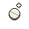
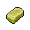

##  考拉．凱文

|體質|力量|敏捷|智力|
|:--:|:--:|:--:|:--:|
|4|4|4|5|

### 簡介

個子矮小的考拉，剛一照面就將你當成了上門催債的打手。原來這個家伙為了吃喝玩樂在監獄里東挪西借的欠了屁股債，是個十足的“老賴”。在被你識破嘴臉之后居然還能開口向你借錢，他這種拿人當傻子行為把你氣到無話可說。

### 故事

別看他現在這個窘迫的樣子，在當年考拉·凱文可是各大高檔消費場所的常客，豪車、名表、美女一樣不缺。因為他的職業是一名房產經紀人，并且還是公司里的銷售明星。每交易一筆房產，他都能收獲豐厚的傭金。

而他擁有如此高的成交量，不但因為他卓越的口才，還要歸功于另一個小秘密，那就是他口中的“善意的謊言”。他會幫助那些沒有貸款資質的客戶作假收入信息，從銀行騙取貸款。當然這部分操作的“手續費”需要另算…

如同破解了財富的密碼一般，凱文為自己和公司賺得盆滿缽滿。直到有一天，毫無預兆的“泡泡破了”。

曾經的明星凱文被公司當作替罪羊丟了出來，巨額的罰款把他的積蓄一掃而空。從腰纏萬貫到身無分文，巨大的落差讓凱文惱怒不已。當初是公司的縱容，才讓他落到此般田地。為何現在東窗事發，倒霉的只有自己？他必須讓“那群混蛋”也付出代價。

一天夜里，他利用偷配的鑰匙潛入公司大樓，偷走了大量的客戶資料，隨后將這些資料通過黑市賣了出去。一周之后，爛醉如泥的凱文被警察在高檔酒店的客房中抓獲，此時他賺到的那筆贓款已被揮霍一空。

“你覺得我輸了嗎？不，我贏了。”的確，凱文說的沒錯。因為客戶資料的泄露，公司遭遇了嚴重的公關危機，再加上之前違規貸款的嫌疑。沒過多久，這家原本市值高昂的公司就悄然破產了…

“欠債還錢，天經地義。他們該明白的，不是嗎？”

### 結識對話

- 嗨…
- **{exclamation1}**
- **哦\~該死！我說了，錢我會還的，再給我點時間…**
- **這里是監獄，還怕我跑了嗎？**
- {question1}
- 呃…什么錢？
- 你是不是誤會了…
- **怎么…？你不是來==催債==的嗎？**
- **{sweat1}**
- **剛剛嚇我一跳，我還以為又要挨揍了呢\~**
- 看來你一定欠了不少錢…
- **主要是黑爪幫的貸款…不過我為了補上利息，又向比爾借了幾十塊。**
- **然后…前兩天為了買止疼片，又向山姆借了點。**
- **還有新一期的《花花世界》，本來我不想看的，但封面實在太誘人了…**
- **所以就又賒賬從托尼那買了一本，他又說配上啤酒有折扣…**
- …我想我懂了，你根本就是個==老賴==吧。
- **老賴？不不，我可沒想賴賬，只是恰巧資金周轉不靈而已。**
- **嘿\~不如這樣，你借我點錢，幫我度過這場難關…**
- **等我資金回籠之后，再翻倍還你，怎么樣？**
- …你當我是傻瓜嗎？

### 深入了解對話

- **喂\~怎么又是你？我現在可沒空和你閑聊。**
- **討債的很快就要來了，我得想法子躲過去…**
- 或許你可以和我聊聊，沒準我能幫你出出主意。

#### 我也向黑爪幫==借了錢==。

> 他一邊發著牢騷，一邊把自己為何會落到這般田地的原因告訴了你。

- 所以，你的心情我多少也能明白一點。
- **看來咱們都是天涯淪落人吶！這操蛋的監獄！操蛋的生活！**
- *真是可憐之人必有可恨之處…*
- **聽我說了這么多，有想到什么幫我躲債的法子嗎？**
- 你還是老實還錢吧。
- 別再大手大腳了！
- **喂\~這能算哪門子的辦法？**

#### 取消

- **算了吧！你哪里懂我這種“資金周轉困難者”的煩惱。**
- **和你說這些純屬浪費口舌…**
- {think1}
- *看來想讓他放下戒心，我也得“欠點債”了…*
### 初始物品

|物品名稱|物品名稱|物品名稱|物品名稱|物品名稱|
|:--:|:--:|:--:|:--:|:--:|
|  |  |  |  |  |
| 帆布鞋 | 橡膠手套 | 紫鳶花*2 | 安眠藥 | 醫用酒精 |
|  |  |  |  |  |
| 蘋果 | 《花花世界》（全新） | 消毒液*4 | 硬幣*2 |  |
### 送禮

|圖片|物品名稱|好感|回應|
|:--:|--|:--:|--|
||運動鞋|1|嘿\~伙計，你可太夠意思了！|
||皮鞋|1|嘿\~伙計，你可太夠意思了！|
||帆布鞋|0|謝了\~這應該能值點錢…|
||拖鞋|0|謝了\~這應該能值點錢…|
||墨鏡|1|嘿\~伙計，你可太夠意思了！|
||眼鏡|1|嘿\~伙計，你可太夠意思了！|
||頭帶|0|謝了\~這應該能值點錢…|
||棒球帽|1|嘿\~伙計，你可太夠意思了！|
||毛線帽|0|謝了\~這應該能值點錢…|
||紅頭巾|0|謝了\~這應該能值點錢…|
||綠頭巾|0|謝了\~這應該能值點錢…|
||橡膠手套|1|來的正好\~我正需要這玩意兒呢\~|
||黑手|1|來的正好\~我正需要這玩意兒呢\~|
||手表|2|哈！伙計\~這看起來可不便宜。|
||護身符|0|謝了\~這應該能值點錢…|
||牙齒項鏈|0|謝了\~這應該能值點錢…|
||《死靈之書》|0|謝了\~這應該能值點錢…|
||自制口罩|0|謝了\~這應該能值點錢…|
||隨身聽（開機）|2|哈！伙計\~這看起來可不便宜。|
||隨身聽（關機）|2|哈！伙計\~這看起來可不便宜。|
||隨身聽（沒電）|2|哈！伙計\~這看起來可不便宜。|
||酒葫蘆|1|嘿\~伙計，你可太夠意思了！|
||黑桃A|2|嘿\~有了這個，又能大賺一筆了！|
||薄荷葉|1|雖然比不上桉樹葉，但味道也算湊合了\~|
||薄荷葉卷|0|謝了\~這應該能值點錢…|
||蘑菇|0|謝了\~這應該能值點錢…|
||蘑菇粉|0|謝了\~這應該能值點錢…|
||瀉藥|1|來的正好\~我正需要這玩意兒呢\~|
||紫鳶花|0|謝了\~這應該能值點錢…|
||花瓣粉|0|謝了\~這應該能值點錢…|
||安眠藥|0|謝了\~這應該能值點錢…|
||止疼片|0|謝了\~這應該能值點錢…|
||興奮劑|0|謝了\~這應該能值點錢…|
||醫用酒精|0|謝了\~這應該能值點錢…|
||酒精燈|0|謝了\~這應該能值點錢…|
||鎮靜劑|0|謝了\~這應該能值點錢…|
||啤酒|2|哈！我正需要這個來忘記煩心事呢。|
||蘋果酒|1|烈酒容易上頭，我得慢慢喝…|
||精釀蘋果酒|1|烈酒容易上頭，我得慢慢喝…|
||蘋果|0|謝了\~這應該能值點錢…|
||華夫餅|0|謝了\~這應該能值點錢…|
||奶油華夫餅|0|謝了\~這應該能值點錢…|
||一把咖啡豆|0|謝了\~這應該能值點錢…|
||口香糖|0|謝了\~這應該能值點錢…|
||曲奇餅干|0|謝了\~這應該能值點錢…|
||焦糖棒|0|謝了\~這應該能值點錢…|
||汽水|0|謝了\~這應該能值點錢…|
||酸奶|0|謝了\~這應該能值點錢…|
||土豆披薩|0|謝了\~這應該能值點錢…|
||咖啡粉|0|謝了\~這應該能值點錢…|
||茶包|0|謝了\~這應該能值點錢…|
||泡面|0|謝了\~這應該能值點錢…|
||蛋白粉|0|謝了\~這應該能值點錢…|
||布條|-1|這東西即沒屁用，也不值錢…|
||回形針|0|謝了\~這應該能值點錢…|
||開鎖器|1|來的正好\~我正需要這玩意兒呢\~|
||開鎖器(P)|1|來的正好\~我正需要這玩意兒呢\~|
||肥皂|0|謝了\~這應該能值點錢…|
||香皂|0|謝了\~這應該能值點錢…|
||計算器|2|這里可比外面純粹…有錢就能搞定一切！|
||《花花世界》（全新）|2|嘿\~伙計！你真要把這種“好東西”給我嗎？|
||《花花世界》（看過）|1|嘿\~伙計，你可太夠意思了！|
||《花花世界》（翻爛）|0|謝了\~這應該能值點錢…|
||馬女郎海報|1|嘿\~伙計，你可太夠意思了！|
||貓女郎海報|1|嘿\~伙計，你可太夠意思了！|
||狐女郎海報|1|嘿\~伙計，你可太夠意思了！|
||兔女郎海報|1|嘿\~伙計，你可太夠意思了！|
||咖啡磨|0|謝了\~這應該能值點錢…|
||掌上游戲機|2|哈！伙計\~這看起來可不便宜。|
||掌上游戲機（沒電）|2|哈！伙計\~這看起來可不便宜。|
||電池|0|謝了\~這應該能值點錢…|
||牙刷|0|謝了\~這應該能值點錢…|
||牙膏|0|謝了\~這應該能值點錢…|
||空的牙膏管|-2|喂！你當我是收破爛的嗎？|
||消毒液|-1|這東西即沒屁用，也不值錢…|
||除銹劑|-1|這東西即沒屁用，也不值錢…|
||火柴|0|謝了\~這應該能值點錢…|
||膠帶|-1|這東西即沒屁用，也不值錢…|
||顏料|0|謝了\~這應該能值點錢…|
||釘子|-1|這東西即沒屁用，也不值錢…|
||鞋帶|-1|這東西即沒屁用，也不值錢…|
||白紙|-1|這東西即沒屁用，也不值錢…|
||紙鶴|-1|這東西即沒屁用，也不值錢…|
||花束|-1|這東西即沒屁用，也不值錢…|
||胡亂的涂鴉|-1|這東西即沒屁用，也不值錢…|
||簡單的漫畫|0|謝了\~這應該能值點錢…|
||精美的畫作|1|嘿\~雖然我不懂畫，但是這看起來…應該能值幾個錢。|
||鉛筆|0|謝了\~這應該能值點錢…|
||鉛筆|0|謝了\~這應該能值點錢…|
||圓珠筆|0|謝了\~這應該能值點錢…|
||圓珠筆|0|謝了\~這應該能值點錢…|
||硬幣|2|嘿\~永遠都別小看每一分錢！|
||長螺絲|-1|吶\~我可不想因為這個被關禁閉。|
||扳手|-1|吶\~我可不想因為這個被關禁閉。|
||湯匙|0|謝了\~這應該能值點錢…|
||湯匙|0|謝了\~這應該能值點錢…|
||釘錘|-1|吶\~我可不想因為這個被關禁閉。|
||剪刀|-1|吶\~我可不想因為這個被關禁閉。|
||碎玻璃|-2|喂！你當我是收破爛的嗎？|
||玻璃匕首|-1|吶\~我可不想因為這個被關禁閉。|
||玻璃匕首(+)|-1|吶\~我可不想因為這個被關禁閉。|
||牙刷匕首|-1|吶\~我可不想因為這個被關禁閉。|
||牙刷匕首(+)|-1|吶\~我可不想因為這個被關禁閉。|
||水果刀|-1|吶\~我可不想因為這個被關禁閉。|
||折斷的木條|-2|喂！你當我是收破爛的嗎？|
||雙節棍|-1|吶\~我可不想因為這個被關禁閉。|
||雙節棍(+)|-1|吶\~我可不想因為這個被關禁閉。|
||釘棒|-1|吶\~我可不想因為這個被關禁閉。|
||釘棒(+)|-1|吶\~我可不想因為這個被關禁閉。|
||鐵管|-1|吶\~我可不想因為這個被關禁閉。|
||皮帶|0|謝了\~這應該能值點錢…|
||皮帶|0|謝了\~這應該能值點錢…|
||發霉的面包|-2|喂！你當我是收破爛的嗎？|
||金龜子|2|哈\~金色傳說！|
||《森之音》|0|謝了\~這應該能值點錢…|
||DEMO限定紙鶴|2|DEMO限定？這玩意兒一定很值錢吧！|

