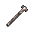

#  考拉．凱文

|體質|力量|敏捷|智力|幫派|戰鬥等級|勒索難度|持有天賦|取得天賦|
|:--:|:--:|:--:|:--:|:--:|:--:|:--:|:--:|:--:|
|4|4|4|5|無幫派|弱|易|[扒手](技能.md#扒手)|[贓物袋](技能.md#贓物袋)|

## 故事

個子矮小的考拉，剛一照面就將你當成了上門催債的打手。原來這個家伙為了吃喝玩樂在監獄裡東挪西借的欠了屁股債，是個十足的“老賴”。在被你識破嘴臉之後居然還能開口向你借錢，他這種拿人當傻子行為把你氣到無話可說。

別看他現在這個窘迫的樣子，在當年考拉·凱文可是各大高檔消費場所的常客，豪車、名表、美女一樣不缺。因為他的職業是一名房產經紀人，並且還是公司裡的銷售明星。每交易一筆房產，他都能收獲豐厚的傭金。

而他擁有如此高的成交量，不但因為他卓越的口才，還要歸功於另一個小秘密，那就是他口中的“善意的謊言”。他會幫助那些沒有貸款資質的客戶作假收入信息，從銀行騙取貸款。當然這部分操作的“手續費”需要另算…

如同破解了財富的密碼一般，凱文為自己和公司賺得盆滿缽滿。直到有一天，毫無預兆的“泡泡破了”。

曾經的明星凱文被公司當作替罪羊丟了出來，巨額的罰款把他的積蓄一掃而空。從腰纏萬貫到身無分文，巨大的落差讓凱文惱怒不已。當初是公司的縱容，才讓他落到此般田地。為何現在東窗事發，倒霉的只有自己？他必須讓“那群混蛋”也付出代價。

一天夜裡，他利用偷配的鑰匙潛入公司大樓，偷走了大量的客戶資料，隨後將這些資料通過黑市賣了出去。一周之後，爛醉如泥的凱文被警察在高檔酒店的客房中抓獲，此時他賺到的那筆贓款已被揮霍一空。

“你覺得我輸了嗎？不，我贏了。”的確，凱文說的沒錯。因為客戶資料的泄露，公司遭遇了嚴重的公關危機，再加上之前違規貸款的嫌疑。沒過多久，這家原本市值高昂的公司就悄然破產了…

“欠債還錢，天經地義。他們該明白的，不是嗎？”

## 結識對話

- 嗨…
- **{exclamation1}**
- **哦\~該死！我說了，錢我會還的，再給我點時間…**
- **這裡是監獄，還怕我跑了嗎？**
- {question1}
- :point_right:呃…什麼錢？
- :point_right:你是不是誤會了…
- **怎麼…？你不是來`催債`的嗎？**
- **{sweat1}**
- **剛剛嚇我一跳，我還以為又要挨揍了呢\~**
- 看來你一定欠了不少錢…
- **主要是黑爪幫的貸款…不過我為了補上利息，又向比爾借了幾十塊。**
- **然後…前兩天為了買止疼片，又向山姆借了點。**
- **還有新一期的《花花世界》，本來我不想看的，但封面實在太誘人了…**
- **所以就又賒帳從托尼那買了一本，他又說配上啤酒有折扣…**
- …我想我懂了，你根本就是個`老賴`吧。
- **老賴？不不，我可沒想賴帳，只是恰巧資金周轉不靈而已。**
- **嘿\~不如這樣，你借我點錢，幫我度過這場難關…**
- **等我資金回籠之後，再翻倍還你，怎麼樣？**
- …你當我是傻瓜嗎？

## 深入了解對話

- **喂\~怎麼又是你？我現在可沒空和你閒聊。**
- **討債的很快就要來了，我得想法子躲過去…**
- 或許你可以和我聊聊，沒準我能幫你出出主意。

#### 我也向黑爪幫`借了錢`。

> 他一邊發著牢騷，一邊把自己為何會落到這般田地的原因告訴了你。

- 所以，你的心情我多少也能明白一點。
- **看來咱們都是天涯淪落人吶！這操蛋的監獄！操蛋的生活！**
- *真是可憐之人必有可恨之處…*
- **聽我說了這麼多，有想到什麼幫我躲債的法子嗎？**
  - 你還是老實還錢吧。
  - 別再大手大腳了！
- **喂\~這能算哪門子的辦法？**

#### 取消

- **算了吧！你哪裡懂我這種“資金周轉困難者”的煩惱。**
- **和你說這些純屬浪費口舌…**
- {think1}
- *看來想讓他放下戒心，我也得“欠點債”了…*

## 特殊對話

### 打招呼（關係極好）

- **咱們應該互相幫助。**

### 打招呼（關係好）

- **我說伙計\~來點江湖救急吧。**

### 打招呼（關係一般）

- **（自言自語）這下糟了…**

### 打招呼（關係差）

- **哎\~說吧，我聽著呢。**

### 打招呼（關係極差）

- **拜托，能別來煩我嗎？**

### 進行毆打

- **你以為我好欺負嗎？那你就大錯特錯了！**
- **可惡\~我警告你！我也是會還手的！**
- **哼！想干掉我？那你也得掉層皮！**

### 回禮

- **這是我的回禮，你看，我也沒那麼小氣…**

### 勒索成功

- **該死的！這兒是`{x1}`塊，剩下的我一個子兒都不會掏了！**
- **{upset1}**

### 勒索失敗

- **閉嘴吧！你一分錢都別想從我這兒拿走！**
- **{upset1}**

### 一起吃飯被拒

- **那兒\~那兒\~那兒\~都是位置！幹嘛非擠我旁邊？**
- **{upset1}**

### 分享食物

- **{happy1}**
- **免費的東西傻子才會不要\~**

### 加藥被發現

- **喂！你的手裡有東西！我看見了！**

### 加藥辯解失敗

- **切\~別當我是白癡，我知道你想幹嘛！**

## 聊天

- **哎\~沒救了，這次看來要被扒層皮了。**
- **新來的，聽我一句勸，不到萬不得已別去找黑爪幫借錢。**
- **他們都是些披著羊皮的狼！吃肉不吐骨頭…**
- **{upset1}**

## 初始物品

||||||
|:--:|:--:|:--:|:--:|:--:|
||||||
|[帆布鞋](16-帆布鞋.md)|[橡膠手套](25-橡膠手套.md)|[紫鳶花](45-紫鳶花.md)*2|[安眠藥](47-安眠藥.md)|[醫用酒精](51-醫用酒精.md)|
||||||
|[蘋果](64-蘋果.md)|[《花花世界》（全新）](102-《花花世界》（全新）.md)|[消毒液](118-消毒液.md)*4|[硬幣](135-硬幣.md)*2||

## 送禮

|圖片|物品名稱|好感|回應|
|:--:|--|:--:|--|
||[DEMO限定紙鶴](209-DEMO限定紙鶴.md)|50|DEMO限定？這玩意兒一定很值錢吧！|
||[手錶](27-手錶.md)|24|哈！伙計\~這看起來可不便宜。|
||[隨身聽（開機）](34-隨身聽（開機）.md)|24|哈！伙計\~這看起來可不便宜。|
||[隨身聽（關機）](35-隨身聽（關機）.md)|24|哈！伙計\~這看起來可不便宜。|
||[隨身聽（沒電）](36-隨身聽（沒電）.md)|24|哈！伙計\~這看起來可不便宜。|
||[掌上遊戲機](110-掌上遊戲機.md)|24|哈！伙計\~這看起來可不便宜。|
||[掌上遊戲機（沒電）](111-掌上遊戲機（沒電）.md)|24|哈！伙計\~這看起來可不便宜。|
||[金龜子](202-金龜子.md)|20|哈\~金色傳說！|
||[運動鞋](14-運動鞋.md)|18|嘿\~伙計，你可太夠意思了！|
||[棒球帽](21-棒球帽.md)|18|嘿\~伙計，你可太夠意思了！|
||[馬女郎海報](105-馬女郎海報.md)|18|嘿\~伙計，你可太夠意思了！|
||[貓女郎海報](106-貓女郎海報.md)|18|嘿\~伙計，你可太夠意思了！|
||[狐女郎海報](107-狐女郎海報.md)|18|嘿\~伙計，你可太夠意思了！|
||[兔女郎海報](108-兔女郎海報.md)|18|嘿\~伙計，你可太夠意思了！|
||[計算機](101-計算機.md)|16|這裡可比外面純粹…有錢就能搞定一切！|
||[《花花世界》（全新）](102-《花花世界》（全新）.md)|16|嘿\~伙計！你真要把這種“好東西”給我嗎？|
||[皮鞋](15-皮鞋.md)|15|嘿\~伙計，你可太夠意思了！|
||[墨鏡](18-墨鏡.md)|15|嘿\~伙計，你可太夠意思了！|
||[眼鏡](19-眼鏡.md)|15|嘿\~伙計，你可太夠意思了！|
||[酒葫蘆](37-酒葫蘆.md)|15|嘿\~伙計，你可太夠意思了！|
||[黑手](26-黑手.md)|12|來的正好\~我正需要這玩意兒呢\~|
||[牙齒項鏈](30-牙齒項鏈.md)|12|謝了\~這應該能值點錢…|
||[《死靈之書》](31-《死靈之書》.md)|12|謝了\~這應該能值點錢…|
||[啤酒](54-啤酒.md)|12|哈！我正需要這個來忘記煩心事呢。|
||[精釀蘋果酒](56-精釀蘋果酒.md)|12|烈酒容易上頭，我得慢慢喝…|
||[精美的畫作](130-精美的畫作.md)|12|嘿\~雖然我不懂畫，但是這看起來…應該能值幾個錢。|
||[頭帶](20-頭帶.md)|10|謝了\~這應該能值點錢…|
||[護身符](29-護身符.md)|10|謝了\~這應該能值點錢…|
||[橡膠手套](25-橡膠手套.md)|9|來的正好\~我正需要這玩意兒呢\~|
||[瀉藥](44-瀉藥.md)|9|來的正好\~我正需要這玩意兒呢\~|
||[蘋果酒](55-蘋果酒.md)|9|烈酒容易上頭，我得慢慢喝…|
||[《花花世界》（看過）](103-《花花世界》（看過）.md)|9|嘿\~伙計，你可太夠意思了！|
||[帆布鞋](16-帆布鞋.md)|8|謝了\~這應該能值點錢…|
||[拖鞋](17-拖鞋.md)|8|謝了\~這應該能值點錢…|
||[毛線帽](22-毛線帽.md)|8|謝了\~這應該能值點錢…|
||[紅頭巾](23-紅頭巾.md)|8|謝了\~這應該能值點錢…|
||[綠頭巾](24-綠頭巾.md)|8|謝了\~這應該能值點錢…|
||[自製口罩](32-自製口罩.md)|8|謝了\~這應該能值點錢…|
||[黑桃A](39-黑桃A.md)|8|嘿\~有了這個，又能大賺一筆了！|
||[酒精燈](52-酒精燈.md)|8|謝了\~這應該能值點錢…|
||[奶油華夫餅](68-奶油華夫餅.md)|8|謝了\~這應該能值點錢…|
||[土豆披薩](75-土豆披薩.md)|8|謝了\~這應該能值點錢…|
||[香皂](89-香皂.md)|8|謝了\~這應該能值點錢…|
||[咖啡磨](109-咖啡磨.md)|8|謝了\~這應該能值點錢…|
||[圓珠筆](133-圓珠筆.md)|8|謝了\~這應該能值點錢…|
||[圓珠筆](134-圓珠筆.md)|8|謝了\~這應該能值點錢…|
||[硬幣](135-硬幣.md)|8|嘿\~永遠都別小看每一分錢！|
||[皮帶](166-皮帶.md)|8|謝了\~這應該能值點錢…|
||[皮帶](167-皮帶.md)|8|謝了\~這應該能值點錢…|
||[《森之音》](203-《森之音》.md)|8|謝了\~這應該能值點錢…|
||[薄荷葉](40-薄荷葉.md)|6|雖然比不上桉樹葉，但味道也算湊合了\~|
||[薄荷葉卷](41-薄荷葉卷.md)|6|謝了\~這應該能值點錢…|
||[興奮劑](50-興奮劑.md)|6|謝了\~這應該能值點錢…|
||[鎮靜劑](53-鎮靜劑.md)|6|謝了\~這應該能值點錢…|
||[華夫餅](67-華夫餅.md)|6|謝了\~這應該能值點錢…|
||[超辣泡麵](78-超辣泡麵.md)|6|謝了\~這應該能值點錢…|
||[蛋白粉](79-蛋白粉.md)|6|謝了\~這應該能值點錢…|
||[開鎖器](87-開鎖器.md)|6|來的正好\~我正需要這玩意兒呢\~|
||[開鎖器(P)](38-開鎖器(P).md)|6|來的正好\~我正需要這玩意兒呢\~|
||[簡單的漫畫](129-簡單的漫畫.md)|6|謝了\~這應該能值點錢…|
||[蘑菇](42-蘑菇.md)|4|謝了\~這應該能值點錢…|
||[蘑菇粉](43-蘑菇粉.md)|4|謝了\~這應該能值點錢…|
||[紫鳶花](45-紫鳶花.md)|4|謝了\~這應該能值點錢…|
||[花瓣粉](46-花瓣粉.md)|4|謝了\~這應該能值點錢…|
||[安眠藥](47-安眠藥.md)|4|謝了\~這應該能值點錢…|
||[止疼片](49-止疼片.md)|4|謝了\~這應該能值點錢…|
||[醫用酒精](51-醫用酒精.md)|4|謝了\~這應該能值點錢…|
||[蘋果](64-蘋果.md)|4|謝了\~這應該能值點錢…|
||[一把咖啡豆](69-一把咖啡豆.md)|4|謝了\~這應該能值點錢…|
||[焦糖棒](72-焦糖棒.md)|4|謝了\~這應該能值點錢…|
||[汽水](73-汽水.md)|4|謝了\~這應該能值點錢…|
||[酸奶](74-酸奶.md)|4|謝了\~這應該能值點錢…|
||[咖啡粉](76-咖啡粉.md)|4|謝了\~這應該能值點錢…|
||[茶包](77-茶包.md)|4|謝了\~這應該能值點錢…|
||[肥皂](88-肥皂.md)|4|謝了\~這應該能值點錢…|
||[《花花世界》（翻爛）](104-《花花世界》（翻爛）.md)|4|謝了\~這應該能值點錢…|
||[牙刷](115-牙刷.md)|4|謝了\~這應該能值點錢…|
||[牙膏](116-牙膏.md)|4|謝了\~這應該能值點錢…|
||[鉛筆](131-鉛筆.md)|4|謝了\~這應該能值點錢…|
||[鉛筆](132-鉛筆.md)|4|謝了\~這應該能值點錢…|
||[湯匙](143-湯匙.md)|4|謝了\~這應該能值點錢…|
||[湯匙](144-湯匙.md)|4|謝了\~這應該能值點錢…|
||[口香糖](70-口香糖.md)|2|謝了\~這應該能值點錢…|
||[曲奇餅乾](71-曲奇餅乾.md)|2|謝了\~這應該能值點錢…|
||[迴紋針](86-迴紋針.md)|2|謝了\~這應該能值點錢…|
||[電池](114-電池.md)|2|謝了\~這應該能值點錢…|
||[火柴](120-火柴.md)|2|謝了\~這應該能值點錢…|
||[顏料](122-顏料.md)|2|謝了\~這應該能值點錢…|
||[布條](84-布條.md)|-2|這東西即沒屁用，也不值錢…|
||[消毒液](118-消毒液.md)|-2|這東西即沒屁用，也不值錢…|
||[除銹劑](119-除銹劑.md)|-2|這東西即沒屁用，也不值錢…|
||[膠帶](121-膠帶.md)|-2|這東西即沒屁用，也不值錢…|
||[釘子](123-釘子.md)|-2|這東西即沒屁用，也不值錢…|
||[鞋帶](124-鞋帶.md)|-2|這東西即沒屁用，也不值錢…|
||[白紙](125-白紙.md)|-2|這東西即沒屁用，也不值錢…|
||[胡亂的塗鴉](128-胡亂的塗鴉.md)|-4|這東西即沒屁用，也不值錢…|
||[玻璃匕首](154-玻璃匕首.md)|-4|吶\~我可不想因為這個被關禁閉。|
||[牙刷匕首](156-牙刷匕首.md)|-4|吶\~我可不想因為這個被關禁閉。|
||[紙鶴](126-紙鶴.md)|-6|這東西即沒屁用，也不值錢…|
||[長螺絲](136-長螺絲.md)|-6|吶\~我可不想因為這個被關禁閉。|
||[玻璃匕首(+)](155-玻璃匕首(+).md)|-6|吶\~我可不想因為這個被關禁閉。|
||[牙刷匕首(+)](157-牙刷匕首(+).md)|-6|吶\~我可不想因為這個被關禁閉。|
||[釘棒](162-釘棒.md)|-6|吶\~我可不想因為這個被關禁閉。|
||[鐵管](164-鐵管.md)|-6|吶\~我可不想因為這個被關禁閉。|
||[花束](127-花束.md)|-8|這東西即沒屁用，也不值錢…|
||[剪刀](152-剪刀.md)|-8|吶\~我可不想因為這個被關禁閉。|
||[雙節棍](160-雙節棍.md)|-8|吶\~我可不想因為這個被關禁閉。|
||[釘棒(+)](163-釘棒(+).md)|-8|吶\~我可不想因為這個被關禁閉。|
||[水果刀](158-水果刀.md)|-10|吶\~我可不想因為這個被關禁閉。|
||[雙節棍(+)](161-雙節棍(+).md)|-10|吶\~我可不想因為這個被關禁閉。|
||[扳手](142-扳手.md)|-12|吶\~我可不想因為這個被關禁閉。|
||[釘錘](151-釘錘.md)|-12|吶\~我可不想因為這個被關禁閉。|
||[空的牙膏管](117-空的牙膏管.md)|-20|喂！你當我是收破爛的嗎？|
||[碎玻璃](153-碎玻璃.md)|-20|喂！你當我是收破爛的嗎？|
||[折斷的木條](159-折斷的木條.md)|-20|喂！你當我是收破爛的嗎？|
||[發霉的麵包](200-發霉的麵包.md)|-40|喂！你當我是收破爛的嗎？|

