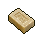
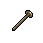

#  臭鼬．沃爾特

|體質|力量|敏捷|智力|幫派|戰鬥等級|勒索難度|持有天賦|取得天賦|
|:--:|:--:|:--:|:--:|:--:|:--:|:--:|:--:|:--:|
|4|4|5|7|無幫派|中|易|[製作能手](技能.md#製作能手)、[醫學](技能.md#醫學)|[化學教授](技能.md#化學教授)|

## 故事

一只散發著“強烈”味道的臭鼬，入獄之前的職業是一名高中化學教師，但同時也擁有著名牌大學的化學制藥博士學位。你得知他正在用自己的臭液偷偷研發一種新藥，而制藥的目的則是用來還“債”。他邀請你當他的實驗助手，正巧你對這個藥的用途也充滿了好奇…

沃爾特從學生時代就對化學充滿了興趣，而他在化學上的天賦也幫他收獲了事業和愛情。安娜是他的實驗室助手，他們在課題的研究中擦出了愛的火花，並很快擁有了家庭。

不過可能是在實驗室裡工作的時間太久，安娜患上了肺病。為了妻子的健康，他們舉家搬去了鄉下的小鎮，因為傳說那裡的空氣可治療百病。而沃爾特為了能夠照顧妻子，也辭去了城裡化學實驗室的高薪工作，改為在小鎮的高中做一名化學老師。

但傳說也只是傳說而已，雖然小鎮的空氣清新無比，但安娜的病情還是日漸加重了。去醫院深度檢查後才發現，這是一種罕見的基因疾病，只能依靠昂貴的藥物來控制病情。安娜勸說沃爾特放棄治療，她不想因為自己把家庭拖垮。但妻子越是善解人意，沃爾特越是難以割舍對她的愛…

錢！現在只要有足夠的錢就能拯救妻子！沃爾特絞盡腦汁最終想到了一個方法，那就是憑借自己的化學知識製造違禁藥品。他從學校偷來了化學藥劑，很快就在車庫裡做出了一批“好貨”。隨後他帶著藥品去到黑市兜售，一晚就賺到了妻子一個月的治療費。

但紙是包不住火的，安娜慢慢覺察到了異常，並質問沃爾特家中巨款的由來。沃爾特或許是個化學高手，但在說謊方面卻缺少天賦，沒過多久他就把自己制藥販賣的事情說了出來。安娜是個虔誠的森林教徒，她不願因為自己一個的生存而傷害到別人。於是她拒絕繼續接受治療，如果沃爾特依然賺的是這種“血錢”。

沃爾特無法改變妻子的想法，但他仍然不願放棄。“既然安娜不想傷害別人，那我就犧牲自己吧。”沃爾特隨後前往了警察局自首，並且和警方達成了一筆交易：如果他幫助警方端掉整個黑市的藥品販賣網絡，那警方就要幫他支付妻子日後的治療費用。

抓捕行動很成功，藥品黑市一夜之間不復存在。雖然沃爾特依然要為自己制藥販賣的罪行坐牢，但他的心情卻無比輕松。因為安娜告訴自己，她會積極的接受治療，等待團聚的那一天。

## 結識對話

- （一股臭味撲鼻而來）這是…
- **熏到你了嗎…？真是抱歉。**
- {pain1}
- :point_right:這究竟是什麼味道…
- :point_right:糞池…泄漏了嗎？
- **如你所見我是只`臭鼬`，而我剛從腺體裡收集了點“精華”。**
- **不過，因為裝瓶時不小心沾了點在周圍的毛上…所以聞起來有些不體面。**
- 裝瓶？你們的`臭液`不是在遇險時當做武器用的嗎？
- **通常來說是這樣，可我收集這些卻另有他用…**
- {question1}
- **自我介紹一下，我叫`沃爾特`，入獄前是一名化學老師。**
- **我最近從自己的臭液萃取物中發現了一種“特殊物質”。**
- **用它來合成新藥，或許能幫我還掉以前欠下的那些“債”。**
- 還債？你說的`新藥`該不會是…
- **別猜了…試驗完成前，我不想透露太多細節。**
- **不過如果你感興趣的話，或許可以做我的助手…**
- **我向你保證，這件工作絕對不會讓你變“臭”。**

## 深入了解對話

- 嗨\~你上次請我做助手的事，我考慮好了。
- **是嗎？那很好，不過我得先提醒你，這活可能有點危險。**
  - 什麼危險…？
  - 我可不是膽小鬼。
- **吶\~你作為實驗助手的主要工作就是“試藥”。**
- {question1}
- **因為新藥裡的一些化學反應還不明朗，所以沒準會出現中毒的症狀…**
- **如果你沒有足夠頑強的`體質`，還是打消這個念頭吧。**

#### 你別小看我的`體質`。

> 藥水惡心的味道讓你頭暈，還好他通過不斷的聊天來幫你保持清醒。

- 再毒的毒藥，都別想輕易要了我的命。
- **既然你這麼說，我就放心了。那就讓我們開始吧…**
- *無法想象這是個化學老師的故事…*
- 安娜現在的情況如何？治療還順利嗎？
- **可能是“森林之父”真的給予了庇佑…**
- **她的病情奇跡般的好轉了，我想這就是善良的力量吧。**
- 那你能告訴我，你現在做的新藥究竟是什麼嗎？
- 你不會還在偷偷做那些…
- **抱歉，我暫時還不能透露新藥的用途。**
- **不過你放心，我答應過安娜不會再做你以為的那些東西了。**
- **這可是我和她之間的約定…**

#### 取消

- *聽他說的這麼可怕，我這單薄的身子骨會不會撐不住？*
- *以防萬一，我還是把體質提升到`8點`再來吧…*

## 打招呼

### 關係極好

- **嗯\~新藥就快完成了…**

### 關係好

- **怎麼？我身上還有臭味嗎？**

### 關係一般

- **你最好堵上鼻子…**

### 關係不好

- **…找我有事嗎？**

### 關係極差

- **希望你不是來找麻煩的…**

## 聊天

- **哎\~調配新藥總是會讓我臭氣熏天…**
- **昨天中午獄警差點沒放我進餐廳吃飯。**
- **如果你能給我一些香皂的話，我會感激不盡的。**
- {think1}
- *他的確得好好洗洗了…*

## 初始物品

||||||
|:--:|:--:|:--:|:--:|:--:|
|  |  |  |  |  |
| [眼鏡](道具.md#眼鏡) | [護身符](道具.md#護身符) | [蘑菇](道具.md#蘑菇)*2 | [瀉藥](道具.md#瀉藥)*2 | [安眠藥](道具.md#安眠藥)*2 |
|  |  |  |  |  |
| [醫用酒精](道具.md#醫用酒精)*2 | [止疼片](道具.md#止疼片)*2 | [興奮劑](道具.md#興奮劑)*2 | [鎮靜劑](道具.md#鎮靜劑)*2 |  |

## 送禮

|圖片|物品名稱|好感|回應|
|:--:|--|:--:|--|
||[運動鞋](道具.md#運動鞋)|12|謝謝你的禮物，我想我會用到它的。|
||[皮鞋](道具.md#皮鞋)|10|謝謝你的禮物，我想我會用到它的。|
||[帆布鞋](道具.md#帆布鞋)|8|謝謝你的禮物，我想我會用到它的。|
||[拖鞋](道具.md#拖鞋)|8|謝謝你的禮物，我想我會用到它的。|
||[墨鏡](道具.md#墨鏡)|10|謝謝你的禮物，我想我會用到它的。|
||[眼鏡](道具.md#眼鏡)|20|這度數剛好合適，實在是太感謝了。|
||[頭帶](道具.md#頭帶)|-10|這是件好禮物…只是，不太適合我。|
||[棒球帽](道具.md#棒球帽)|12|謝謝你的禮物，我想我會用到它的。|
||[毛線帽](道具.md#毛線帽)|8|謝謝你的禮物，我想我會用到它的。|
||[紅頭巾](道具.md#紅頭巾)|-8|這是件好禮物…只是，不太適合我。|
||[綠頭巾](道具.md#綠頭巾)|-8|這是件好禮物…只是，不太適合我。|
||[橡膠手套](道具.md#橡膠手套)|9|我正需要用它來混合新的藥劑。|
||[黑手](道具.md#黑手)|-8|我知道這是干嘛用的，我想我應該用不著它…|
||[手錶](道具.md#手錶)|18|準確的時間能幫我更好的分析實驗數據。|
||[護身符](道具.md#護身符)|20|願森林之父能用晨露滌凈我們的罪責。|
||[牙齒項鏈](道具.md#牙齒項鏈)|-12|這是件好禮物…只是，不太適合我。|
||[《死靈之書》](道具.md#《死靈之書》)|-12|神秘學…往往都是沒有價值的偽科學。|
||[自製口罩](道具.md#自製口罩)|16|你猜我能不能聞到自己的臭味？答案是…會。|
||[隨身聽（開機）](道具.md#隨身聽（開機）)|12|謝謝你的禮物，我想我會用到它的。|
||[隨身聽（關機）](道具.md#隨身聽（關機）)|12|謝謝你的禮物，我想我會用到它的。|
||[隨身聽（沒電）](道具.md#隨身聽（沒電）)|12|謝謝你的禮物，我想我會用到它的。|
||[酒葫蘆](道具.md#酒葫蘆)|10|謝謝你的禮物，我想我會用到它的。|
||[黑桃A](道具.md#黑桃A)|-4|貪婪是自掘墳墓的鐵鍬…|
||[薄荷葉](道具.md#薄荷葉)|6|這正是我需要的新鮮草藥…|
||[薄荷葉卷](道具.md#薄荷葉卷)|6|謝謝你的禮物，我想我會用到它的。|
||[蘑菇](道具.md#蘑菇)|6|這正是我需要的新鮮草藥…|
||[蘑菇粉](道具.md#蘑菇粉)|6|顆粒足夠細膩…這是不錯的材料。|
||[瀉藥](道具.md#瀉藥)|6|謝謝你的禮物，我想我會用到它的。|
||[紫鳶花](道具.md#紫鳶花)|6|這正是我需要的新鮮草藥…|
||[花瓣粉](道具.md#花瓣粉)|6|顆粒足夠細膩…這是不錯的材料。|
||[安眠藥](道具.md#安眠藥)|4|謝謝你的禮物，我想我會用到它的。|
||[止疼片](道具.md#止疼片)|4|謝謝你的禮物，我想我會用到它的。|
||[興奮劑](道具.md#興奮劑)|6|謝謝你的禮物，我想我會用到它的。|
||[醫用酒精](道具.md#醫用酒精)|6|我正需要用它來混合新的藥劑。|
||[酒精燈](道具.md#酒精燈)|16|一盞酒精燈…你這可幫了我的大忙了。|
||[鎮靜劑](道具.md#鎮靜劑)|6|謝謝你的禮物，我想我會用到它的。|
||[啤酒](道具.md#啤酒)|6|謝謝你的禮物，我想我會用到它的。|
||[蘋果酒](道具.md#蘋果酒)|6|謝謝你的禮物，我想我會用到它的。|
||[精釀蘋果酒](道具.md#精釀蘋果酒)|8|謝謝你的禮物，我想我會用到它的。|
||[蘋果](道具.md#蘋果)|4|謝謝你的禮物，我想我會用到它的。|
||[華夫餅](道具.md#華夫餅)|6|謝謝你的禮物，我想我會用到它的。|
||[奶油華夫餅](道具.md#奶油華夫餅)|8|謝謝你的禮物，我想我會用到它的。|
||[一把咖啡豆](道具.md#一把咖啡豆)|4|謝謝你的禮物，我想我會用到它的。|
||[口香糖](道具.md#口香糖)|3|但願這能遮住一點臭味…|
||[曲奇餅乾](道具.md#曲奇餅乾)|2|謝謝你的禮物，我想我會用到它的。|
||[焦糖棒](道具.md#焦糖棒)|4|謝謝你的禮物，我想我會用到它的。|
||[汽水](道具.md#汽水)|4|謝謝你的禮物，我想我會用到它的。|
||[酸奶](道具.md#酸奶)|4|謝謝你的禮物，我想我會用到它的。|
||[土豆披薩](道具.md#土豆披薩)|8|謝謝你的禮物，我想我會用到它的。|
||[咖啡粉](道具.md#咖啡粉)|4|謝謝你的禮物，我想我會用到它的。|
||[茶包](道具.md#茶包)|6|我或許可以在新藥裡加上一點…茶葉？|
||[超辣泡麵](道具.md#超辣泡麵)|6|謝謝你的禮物，我想我會用到它的。|
||[蛋白粉](道具.md#蛋白粉)|6|謝謝你的禮物，我想我會用到它的。|
||[布條](道具.md#布條)|2|謝謝你的禮物，我想我會用到它的。|
||[迴紋針](道具.md#迴紋針)|2|謝謝你的禮物，我想我會用到它的。|
||[開鎖器](道具.md#開鎖器)|-4|貪婪是自掘墳墓的鐵鍬…|
||[開鎖器(P)](道具.md#開鎖器(P))|-4|貪婪是自掘墳墓的鐵鍬…|
||[肥皂](道具.md#肥皂)|6|但願這能遮住一點臭味…|
||[香皂](道具.md#香皂)|16|不得不說，這的確是我最需要的東西…|
||[計算機](道具.md#計算機)|8|謝謝你的禮物，我想我會用到它的。|
||[《花花世界》（全新）](道具.md#《花花世界》（全新）)|-8|抱歉，我對這個不太感興趣…|
||[《花花世界》（看過）](道具.md#《花花世界》（看過）)|-6|抱歉，我對這個不太感興趣…|
||[《花花世界》（翻爛）](道具.md#《花花世界》（翻爛）)|-4|抱歉，我對這個不太感興趣…|
||[馬女郎海報](道具.md#馬女郎海報)|-12|抱歉，我對這個不太感興趣…|
||[貓女郎海報](道具.md#貓女郎海報)|-12|抱歉，我對這個不太感興趣…|
||[狐女郎海報](道具.md#狐女郎海報)|-12|抱歉，我對這個不太感興趣…|
||[兔女郎海報](道具.md#兔女郎海報)|-12|抱歉，我對這個不太感興趣…|
||[咖啡磨](道具.md#咖啡磨)|12|謝謝，我正需要用它來研磨草藥。|
||[掌上遊戲機](道具.md#掌上遊戲機)|-12|抱歉，我對這個不太感興趣…|
||[掌上遊戲機（沒電）](道具.md#掌上遊戲機（沒電）)|-12|抱歉，我對這個不太感興趣…|
||[電池](道具.md#電池)|2|謝謝你的禮物，我想我會用到它的。|
||[牙刷](道具.md#牙刷)|4|謝謝你的禮物，我想我會用到它的。|
||[牙膏](道具.md#牙膏)|4|謝謝你的禮物，我想我會用到它的。|
||[空的牙膏管](道具.md#空的牙膏管)|2|謝謝你的禮物，我想我會用到它的。|
||[消毒液](道具.md#消毒液)|3|但願這能遮住一點臭味…|
||[除銹劑](道具.md#除銹劑)|-2|我想…我可能用不著這個。|
||[火柴](道具.md#火柴)|2|謝謝你的禮物，我想我會用到它的。|
||[膠帶](道具.md#膠帶)|-2|我想…我可能用不著這個。|
||[顏料](道具.md#顏料)|2|謝謝你的禮物，我想我會用到它的。|
||[釘子](道具.md#釘子)|-2|我想…我可能用不著這個。|
||[鞋帶](道具.md#鞋帶)|-2|我想…我可能用不著這個。|
||[白紙](道具.md#白紙)|2|謝謝你的禮物，我想我會用到它的。|
||[紙鶴](道具.md#紙鶴)|9|我想它應該能帶來健康。|
||[花束](道具.md#花束)|-8|我想你可能弄錯了送花的對象…|
||[胡亂的塗鴉](道具.md#胡亂的塗鴉)|-4|這畫實在是太過抽象了…|
||[簡單的漫畫](道具.md#簡單的漫畫)|6|謝謝你的禮物，我想我會用到它的。|
||[精美的畫作](道具.md#精美的畫作)|12|這真是一幅能夠愉悅心情的畫作。|
||[鉛筆](道具.md#鉛筆)|4|謝謝你的禮物，我想我會用到它的。|
||[鉛筆](道具.md#鉛筆)|4|謝謝你的禮物，我想我會用到它的。|
||[圓珠筆](道具.md#圓珠筆)|8|謝謝你的禮物，我想我會用到它的。|
||[圓珠筆](道具.md#圓珠筆)|8|謝謝你的禮物，我想我會用到它的。|
||[硬幣](道具.md#硬幣)|4|謝謝你的禮物，我想我會用到它的。|
||[長螺絲](道具.md#長螺絲)|-6|私藏這種違禁品可不是個好主意。|
||[扳手](道具.md#扳手)|-12|私藏這種違禁品可不是個好主意。|
||[湯匙](道具.md#湯匙)|4|謝謝你的禮物，我想我會用到它的。|
||[湯匙](道具.md#湯匙)|4|謝謝你的禮物，我想我會用到它的。|
||[釘錘](道具.md#釘錘)|-12|私藏這種違禁品可不是個好主意。|
||[剪刀](道具.md#剪刀)|-8|私藏這種違禁品可不是個好主意。|
||[碎玻璃](道具.md#碎玻璃)|-2|我想…我可能用不著這個。|
||[玻璃匕首](道具.md#玻璃匕首)|-40|這種危險的東西，我還是找機會丟掉好了。|
||[玻璃匕首(+)](道具.md#玻璃匕首(+))|-60|這種危險的東西，我還是找機會丟掉好了。|
||[牙刷匕首](道具.md#牙刷匕首)|-40|這種危險的東西，我還是找機會丟掉好了。|
||[牙刷匕首(+)](道具.md#牙刷匕首(+))|-60|這種危險的東西，我還是找機會丟掉好了。|
||[水果刀](道具.md#水果刀)|-10|私藏這種違禁品可不是個好主意。|
||[折斷的木條](道具.md#折斷的木條)|-2|我想…我可能用不著這個。|
||[雙節棍](道具.md#雙節棍)|-8|私藏這種違禁品可不是個好主意。|
||[雙節棍(+)](道具.md#雙節棍(+))|-10|私藏這種違禁品可不是個好主意。|
||[釘棒](道具.md#釘棒)|-60|這種危險的東西，我還是找機會丟掉好了。|
||[釘棒(+)](道具.md#釘棒(+))|-80|這種危險的東西，我還是找機會丟掉好了。|
||[鐵管](道具.md#鐵管)|-6|私藏這種違禁品可不是個好主意。|
||[皮帶](道具.md#皮帶)|8|謝謝你的禮物，我想我會用到它的。|
||[皮帶](道具.md#皮帶)|8|謝謝你的禮物，我想我會用到它的。|
||[發霉的麵包](道具.md#發霉的麵包)|-40|…這是什麼惡作劇嗎？|
||[金龜子](道具.md#金龜子)|20|這金色的小家伙或許能帶來好運。|
||[《森之音》](道具.md#《森之音》)|16|願森林之父能用晨露滌凈我們的罪責。|
||[DEMO限定紙鶴](道具.md#DEMO限定紙鶴)|50|那就加上好感度吧…正好我也需要你的幫忙。|

